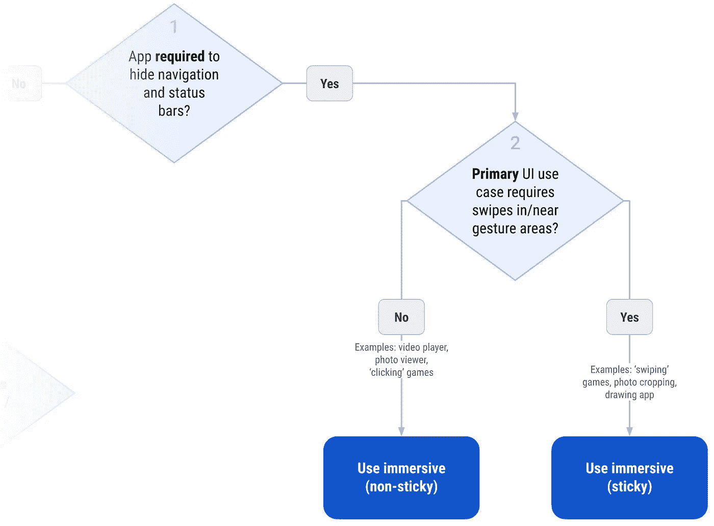
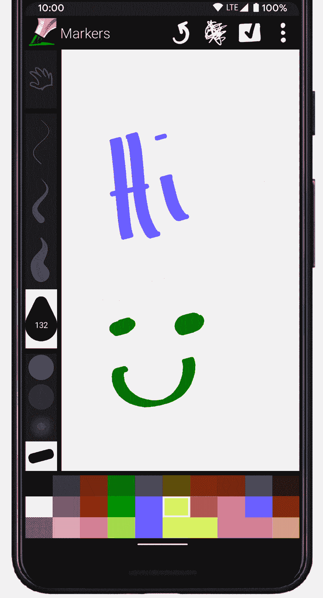
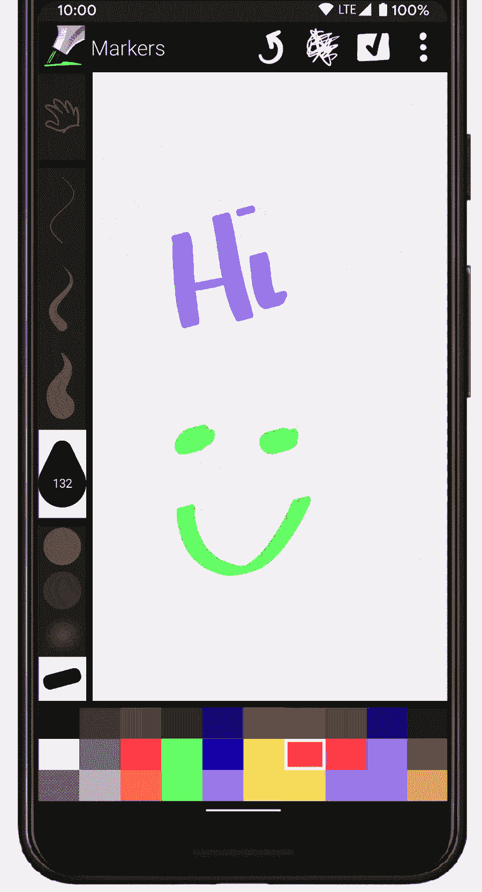
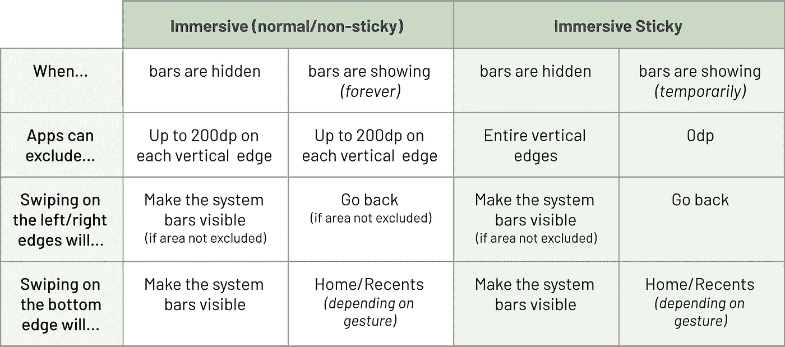

# 手势导航:沉浸式模式(四)

> 原文：<https://medium.com/androiddevelopers/gesture-navigation-immersive-modes-43f2d37a925d?source=collection_archive---------3----------------------->

Cover image by [Virginia Poltrack](/@VPoltrack)

这是我们手势导航系列的第四篇文章。如果你想跳到另一篇文章，你可以在下面找到它们:

 [## 手势导航:从边缘到边缘(一)

### Android Q 增加了一个新的系统导航模式，允许用户导航回主屏幕…

medium.com](/androiddevelopers/gesture-navigation-going-edge-to-edge-812f62e4e83e)  [## 手势导航:处理视觉重叠(二)

### 这是我的手势导航系列的第二篇文章。如果你错过了，这是目前其他的:

medium.com](/androiddevelopers/gesture-navigation-handling-visual-overlaps-4aed565c134c)  [## 手势导航:处理手势冲突(三)

### 这是我们博客系列的第三篇文章，我们讨论了如何在更新应用程序后处理视觉重叠…

medium.com](/androiddevelopers/gesture-navigation-handling-gesture-conflicts-8ee9c2665c69) 

在这第四篇文章中，我们将讨论如果你的应用程序需要在整个屏幕上绘制，隐藏系统栏，你能做什么。回头参考我们在[上一篇文章](/androiddevelopers/gesture-navigation-handling-gesture-conflicts-8ee9c2665c69)中的流程图，我们将在图表的右侧介绍剩下的两个解决方案。

You can find a printable PDF version of the complete flow chart [**here**](http://bit.ly/gesture-conflict-handling-print).

这里的解决方案是使用 Android 平台提供的沉浸式模式。但是什么是沉浸式模式呢？

# 什么是沉浸式模式？

沉浸式模式是全屏显示内容的一种方式，隐藏系统栏，这样它们就不会碍事了。此外，它还可以防止意外手势/按压导致用户离开应用程序，这对游戏特别有用。

有两种沉浸式模式:

1.  [**非粘性**](https://developer.android.com/training/system-ui/immersive#immersive) *【普通】*沉浸式模式——用户可以通过在系统栏中滑动来退出沉浸式模式。
2.  [**粘性**](https://developer.android.com/training/system-ui/immersive#sticky-immersive) 沉浸式模式——用户可以通过在系统栏中滑动*来暂时*退出沉浸式模式。短时间(几秒钟)后会自动重新进入沉浸式模式。

对于这两种模式，有两种状态:

1.  **系统栏隐藏** —在这种状态下，home 和 back 手势被禁用。用户必须首先从边缘滑动以引入系统条。
2.  **系统栏显示** —在这种状态下，home 和 back 手势正常工作。

现在我们已经了解了沉浸式模式的背景，让我们来详细了解一下这两种不同的模式。

# 沉浸式模式:非粘性

正如你可能已经从流程图中看到的，非粘性沉浸式模式非常适合需要全屏的 ui，但不需要在屏幕边缘附近进行精确的滑动手势。常见的例子包括全屏视频播放和照片浏览器。

就手势导航而言，*非粘性*沉浸式模式的工作方式与它在之前版本的 Android 上的工作方式一致。当在 Android 10+上运行时，应用程序可以使用我们在之前的[帖子](/androiddevelopers/gesture-navigation-handling-gesture-conflicts-8ee9c2665c69)中提到的手势排除 API。在这种模式下，无论系统条是否可见，每个边沿的`200dp`限制都相同。

如果你的应用程序目前正在使用沉浸式非粘性模式，我建议回头看看第三篇文章[，以防屏幕边缘附近的任何视图与系统手势冲突。](/androiddevelopers/gesture-navigation-handling-gesture-conflicts-8ee9c2665c69)

# 沉浸式模式:粘性

[粘性沉浸式模式](https://developer.android.com/training/system-ui/immersive#sticky-immersive)专为强烈要求能够使用整个屏幕和相关触摸输入的用户界面而设计。使用这种模式的应用程序的常见例子是绘图应用程序和使用任何滑动手势的游戏。

让我们来看一个在 Android 10 上运行的带有手势导航的 [Markers](https://github.com/dsandler/markers) 绘图应用的例子:

正如你在上面看到的，一旦用户开始在屏幕边缘附近滑动(画),后退手势就会触发，这会打断用户。

由于使用粘性沉浸式模式的应用程序非常具有交互性，手势排除 API 限制被移除，但只有*而系统栏被* ***隐藏*** 。这意味着应用程序可以根据用例的需要排除任何数量的左/右边缘。

然而，当系统栏可见时，系统会忽略**所有**排除的手势区域，使用户能够在没有任何应用程序干扰的情况下返回。在粘性沉浸式模式下，系统栏仅在短时间内可见，因此这不会影响您的用例。

屏幕底部的主手势区正常存在，是一个不可排除的“强制”手势区。处于粘性沉浸式模式的应用程序*可以*排除两个垂直边缘的整个长度，因此 home 手势区域可能是用户引入系统栏的唯一方式，从而退出应用程序。

让我们来看看我们的绘图应用程序的更新版本，它排除了整个垂直边缘:

您可以看到，用户现在可以在屏幕边缘自由绘制，而不会被后退手势打断。为了能够退出应用程序，用户可以从屏幕底部滑动，将系统栏带回来，使他们能够返回/回家。

在实现方面，这里使用的代码利用了我们在[第三篇文章](/androiddevelopers/gesture-navigation-handling-gesture-conflicts-8ee9c2665c69)中的“ [*使用手势排除 API*](/androiddevelopers/gesture-navigation-handling-gesture-conflicts-8ee9c2665c69#a8ad)”部分的相同思想，不同的是我们希望视图知道它是否处于沉浸式模式:

用于更新 Markers 应用程序的完整代码如下所示👇：

 [## 在 Android 10 chrisbanes/markers @ 5e 7 DC b5 上使用手势排除 API

github.com](https://github.com/chrisbanes/markers/commit/5e7dcb5ec93dae0ac30ed42b6558da2e86af26bf) 

# 总结:非粘性与粘性

唷，信息量真大🤯。作为总结，下面的表格比较了*非粘性*和*粘性*沉浸式模式之间的差异。

Summary of the immersive modes

# 必须更深入

这篇文章总结了我们关于处理手势冲突的机制的报道。希望你现在有了一个更好的想法，如何更新你的应用程序来优雅地使用手势导航。

本系列的第五篇也是最后一篇文章😌，将涵盖一些您可能在应用程序中使用的常见 UI 模式，以及您可以做些什么来支持手势导航。