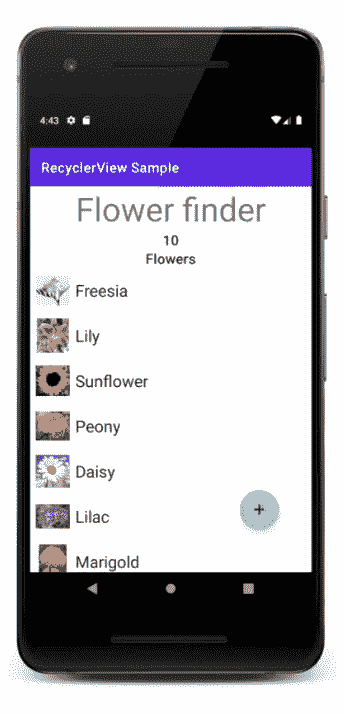

# 在 RecyclerView 中使用标题

> 原文：<https://medium.com/androiddevelopers/get-ahead-using-headers-in-recyclerview-2909a69b19?source=collection_archive---------3----------------------->

这是[系列文章](https://medium.com/androiddevelopers/tagged/recycler-view-series)的第四篇，涵盖了使用`RecyclerView`的基础知识。如果你已经对如何创建一个`RecyclerView`有了坚实的理解，那么继续吧。否则，考虑从[这个帖子](/androiddevelopers/getting-to-know-recyclerview-ea14f8514e6)开始。

您可以通过在您的`RecyclerView`中包含一个`Header`来添加关于您的应用程序数据的信息和上下文。虽然你可以通过在`LinearLayout`中的`RecyclerView`上方放置一个`TextView`来模拟一个标题，但是即使用户向`RecyclerView`的底部滚动，这个假标题仍然会留在屏幕上。通过提供一个真正的 header 元素，当用户滚动通过一个`RecyclerView`时，您允许 header 滚动到屏幕之外。

这篇博客文章介绍了如何给显示不同种类的花的`RecyclerView`添加一个`Header`。`Header`显示文本“花卉探测器”并显示列表中的花卉数量。

# 创建页眉布局

创建一个定义`Header`外观的布局文件。

# 创建 HeaderAdapter 和 HeaderViewHolder

创建一个新文件来请求并绑定`Header’s`视图。

`Header`的`Adapter`继承自`RecyclerView.Adapter<RecyclerView.ViewHolder>()`。

在`Header’s` `Adapter`内部，创建一个继承自`RecyclerView.ViewHolder`的`ViewHolder`。如果你有动态文本，创建一个 val 来表示将要更新的`TextView`。创建一个`bind()`函数，将`TextView`更新为传入的值。

在类定义中，更新`Adapter’s`参数以包含`HeaderViewHolder`。

由于`Adapter`继承了`RecyclerView.Adapter`，它必须实现`onCreateViewHolder()`、`onBindViewHolder()`和`getItemCount()`。

*   `onCreateViewHolder()`放大视图并返回一个`HeaderViewHolder`。
*   `getItemCount()`返回 1，因为只有一个`Header`项目。
*   `onBindViewHolder()`将信息绑定到`Header`。

# 在 Activity 类中使用 ConcatAdapter

在`Activity`类中，创建一个`val`来将`HeaderAdapter()`保存在`RecyclerView’s`和`Adapter`之上。

然后使用`[ConcatAdapter](https://developer.android.com/reference/androidx/recyclerview/widget/ConcatAdapter)`将两个适配器添加到`RecyclerView`中。`ConcatAdapter`按顺序显示多个适配器的内容。在`flowersAdapter`前增加`headerAdapter`。

运行代码，瞧！添加一个`Header`就是这么简单。

# 后续步骤

包括`Header`在内的完整代码示例可以在[这里](https://github.com/android/views-widgets-samples/tree/main/RecyclerViewKotlin)找到。

感谢你阅读我的`RecyclerView`系列的最后一部分，如果你错过了其他帖子，请在这里查看！

*   [了解回收查看](/androiddevelopers/getting-to-know-recyclerview-ea14f8514e6)
*   [适应列表适配器](/androiddevelopers/adapting-to-listadapter-341da4218f5b)
*   [处理 RecyclerView 中的点击事件](/androiddevelopers/for-my-next-trick-i-will-write-about-onclick-45e0a6881c8a)

编码快乐！