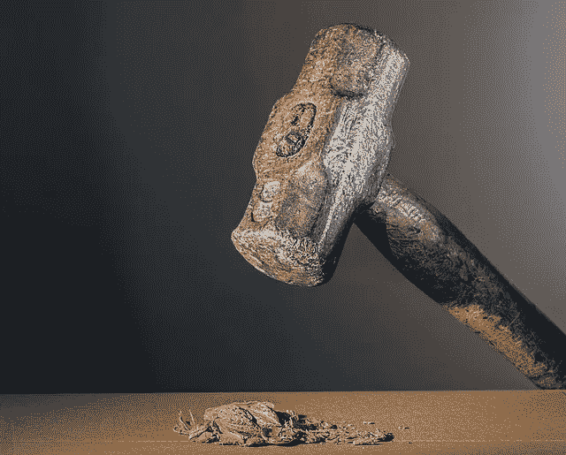

# 开始破解 NativeScript

> 原文：<https://medium.com/globant/get-cracking-with-nativescript-421b45e0d1b3?source=collection_archive---------0----------------------->

所以你是一个 Javascript 专家，或者是一个真正优秀的 Angular，Vue 开发者，现在想探索在移动设备上构建原生应用。然而，看到如此多的选择，你会感到头痛！React Native，Dart，Kotlin 我该选哪个？嗯，喝一口你最喜欢的咖啡，然后坐下来。我们抓到你了，原生脚本！

NativeScript 允许您使用 Angular 或 TypeScript 或 modern 构建本机应用程序…