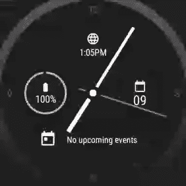
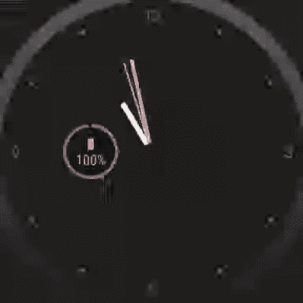

# 熟悉 Wear OS 3(没有物理设备)

> 原文：<https://medium.com/androiddevelopers/get-familiar-with-wear-os-3-without-a-physical-device-e7962c97f02b?source=collection_archive---------4----------------------->

在过去的 8 年里，Wear OS 发生了很大的变化。它更快，更有效，包括各种你可以开发的 UI 界面。

虽然将一个物理设备绑在你的手腕上几天确实是感受当今平台的最佳方式，但这不是唯一的方式。Wear OS 3 系统图像在 Android Studio 中作为预览提供，因此，在我们等待新手表交付时😉，我们还是可以快速游览一下。

在本文中，我们将简要介绍 Wear OS 上独特的 UI 表面，创建模拟器并从用户的角度探索它，然后总结。

# 特定磨损表面

在 99%的时间里，**表盘**都是可见的。它显示时间。表盘设计多种多样:数字的、模拟的、基于文本的甚至完全抽象的。

Watch faces in different configurations

**复杂功能**是表盘上除了显示时间之外的任何功能，如今天的日期、外面的天气或你今天走的步数。它们允许用户在 Wear OS 上以最快的方式获取信息和完成操作。

Tiles from 4 different apps

**磁贴**是全屏表面，呈现单个应用程序的信息，一目了然。只需在表盘上轻轻一扫，您就可以开始锻炼、跳转到一条消息或查看最新预测的详细信息，后续的每一次轻扫都可以让您查看下一个区块。这些都是非常可预测的，也是非常简单的，就像并发症一样。

Screens from the Messages app overlay

**覆盖图**类似于你可能认为的传统应用程序体验。虽然复杂和平铺非常相似(简略信息和快速操作)，但叠加提供了交互式的可滚动视图，允许用户完成对其他表面来说太复杂的任务。

# 安卓工作室海豚

在 [Android Studio Dolphin](https://developer.android.com/studio/preview) 中，Wear 模拟器有一些重要的 UI 变化。我们将在这次虚拟旅行中使用这个版本。

首先，UI 已经更新，以反映 Wear OS 设备上可用的按钮和手势。在这里，取代了以手机为中心的“后退”、“主页”和“最近”按钮，我们有了按钮 1 和 2，以及用手掌覆盖屏幕或倾斜手腕的手势。

From left to right: Back, Button 1, Button 2, Palm, Tilt

Dolphin 还包括新的运行配置，允许直接从 IDE 启动表盘、图块和复杂功能，从而加快运行和测试速度:

You can select tiles and complications directly from the run configuration dropdown to launch them directly

# 创建一个 Wear OS 3 模拟器

使用 Android Studio 中的设备管理器创建一个仿真器。

Here’s some I made earlier

选择**磨损操作系统**类别，并选择一个设备定义。在系统图像屏幕上，确保选择**API 30/Android 11/Wear OS 3**目标并完成。

一旦设备启动，你就会看到表盘。在模拟器窗格的顶部，请注意一排按钮，它们有助于一些更常见的交互。

让我们依次看看每个模拟器按钮:

*   **返回:**标准安卓系统返回按钮。您也可以从屏幕的左边缘向右滑动，以实现相同的功能。
*   **按钮 1:** 显示包括最近应用的应用启动器。
*   **按钮 2:** 导航至“观看面孔/区块”屏幕。
*   **手掌:**模拟用户用手掌覆盖屏幕，关闭屏幕(环境模式)。
*   **倾斜:**模拟用户将手表向自己倾斜，唤醒屏幕。

我建议使用键盘上的箭头键浏览列表和菜单，使用`**Enter**`进行选择。

Accessing Settings from the Quick Settings panel

你可以通过从顶部向下滑动来访问快速设置面板，然后从那里点击设置。有两个超时值值得更改为最高值:

*   显示>屏幕超时> 30 秒([相关 bug](https://issuetracker.google.com/227254824)
*   显示>转到观看面部> 5 分钟后。

# 在模拟器上探索 Wear OS

## 看脸

该屏幕有两种模式:活动和环境。使用手掌按钮将关闭屏幕，在环境模式下显示表盘。按下倾斜按钮会将屏幕切换回“打开”状态。

A watch face transitioning between active and ambient mode

在环境模式下，注意屏幕变暗和秒针消失的情况。这是一种低功耗模式，更新频率越低越好。

长按表盘，远离复杂区域和边缘，为模拟器选择新的表盘，就像在手上一样:

这也是您可以配置复杂性的地方。

## 并发症

手表脸负责渲染复杂，所以这就是为什么我们可以从手表脸配置中选择。以下是我们如何将复杂的日期显示改为电池电量显示:

Changing the complication data source

如果你的应用程序提供并发症数据，也可以从列表中选择，表盘将决定(根据并发症数据*类型*)如何显示。

## 瓷砖

通过滑动，可以从表盘上访问磁贴。长按一个单幅图块可让您对其进行编辑。

Navigating to and editing tiles

向上滑动以移除图块，使用箭头对其重新排序，或按下`+`按钮添加新的图块。

如果你的应用包括一个互动程序，你可以从此处添加它；它不会因为安装了应用程序而自动添加到转盘中。

## 通知

模拟器上的通知也可以通过从表盘上滑动来获得；从底部边缘开始向上滑动。

## 应用启动器

Wear OS 也有一个应用程序启动器。按下按钮 1 查看已安装的应用程序列表，前面是最近使用的应用程序。

## 遮掩

从上述任何一个界面都可以打开一个应用的覆盖图。虽然在移动设备上使用应用程序启动器非常普遍，但常用的应用程序可能会从复杂应用程序或磁贴中打开。

在覆盖图中，导航是预期的。点击事物，滚动列表，使用后退手势或按钮向后导航。

# 下一步是什么？

现在你已经对 Wear OS 有了大致的了解，是时候深入了解了！查看这个关于 Compose for Wear OS 的[代码实验室，了解更多关于开发 for Wear 的信息。](https://developer.android.com/codelabs/compose-for-wear-os)

虽然可以使用仿真器进行大量测试和开发，但在向用户推出应用程序之前，请确保在物理设备上测试您的应用程序，这样您也可以测量功耗、交互和现实环境中的行为等。

如果您有任何反馈、意见或问题，请在这里回复我，或者您可以在 Twitter 上找到我[,@ ataulm](http://twitter.com/ataulm)。