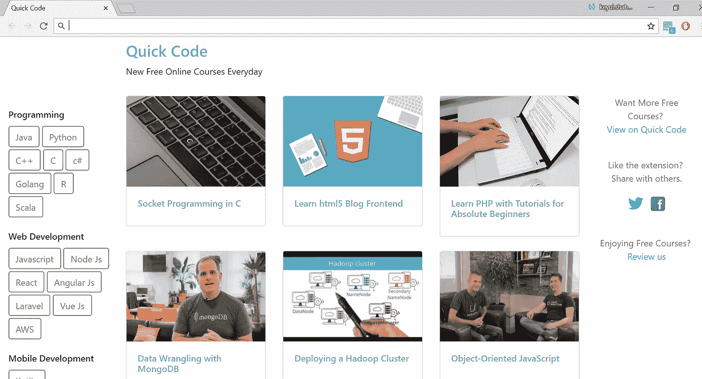
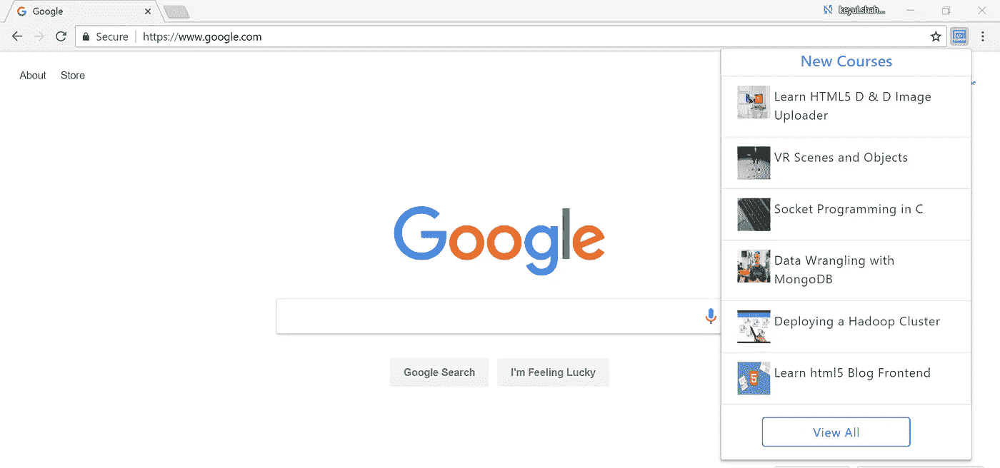

# 获得免费的在线编程课程在新的标签，每天

> 原文：<https://medium.com/quick-code/get-free-online-programming-courses-in-new-tab-everyday-d544bed066ef?source=collection_archive---------5----------------------->

## 通过快速代码介绍 Chrome 扩展

今天我们在快码上推出 [**Chrome 扩展**](https://chrome.google.com/webstore/detail/quickcode-free-online-pro/nnigpbiaggiephcndokoaongeefpbdcj?hl=en) 。快速代码是一个发现免费在线编程课程的地方。网站上每天都有新的球场出现。有时，这些课程在有限的时间内是免费的，你很有可能错过它们。

有了这个 chrome 扩展，我们可以让我们的用户在网站上发布新的课程后就能很容易地获得更新。

## **使用此扩展，您可以:**

*   在“新建”选项卡中查看新课程。
*   直接浏览不同编程语言的课程。
*   在浏览器中获得有关新课程的通知。

安装 [**这个扩展**](https://chrome.google.com/webstore/detail/quickcode-free-online-pro/nnigpbiaggiephcndokoaongeefpbdcj?hl=en) 永远不要错过免费课程！不断学习新事物。:)

*给我们展示一下* [*产品猎奇*](https://www.producthunt.com/posts/quick-code-for-chrome) *上的一些爱情。*

## 如果你对扩展有任何想法或建议，请在评论中告诉我们。