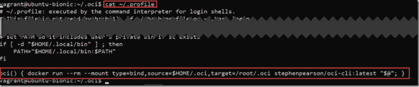

# 使用 Docker 容器快速了解 Oracle 云基础架构的命令行界面

> 原文：<https://medium.com/oracledevs/get-going-quickly-with-command-line-interface-for-oracle-cloud-infrastructure-using-docker-e677ceb87f0b?source=collection_archive---------5----------------------->


Oracle 云基础设施是 Oracle 的第二代基础设施即服务产品，支持许多组件，包括计算节点、网络、存储、Kubernetes 集群和数据库即服务。Oracle 云基础架构可以通过 GUI(基于浏览器的控制台)以及 REST API 和 OCI 命令行界面进行管理。Oracle 提供了一个 Terraform 提供商，该提供商允许自动、脚本化地供应 OCI 产品。

本文描述了一种开始使用 Oracle 云基础架构命令行界面的简单方法——使用 oci-cli Docker 映像。使用 Docker 容器映像和简单的配置文件，可以执行 oci 命令，而无需在本地安装和更新 OCI 命令行界面(以及 Python 运行时环境)本身。

以下是在包含 Docker 引擎的 Linux 或 Mac 主机上开始工作的步骤:

*   在 OCI 创建一个具有适当权限的新用户(或使用现有用户)；您需要用户的 OCID
*   还要确保您有该地区的名称和 OCI 租赁的 OCID
*   执行 docker run 命令准备 OCI CLI 配置文件
*   使用 OCI CLI 设置操作创建的公钥更新 OCI 用户
*   编辑。将 Docker 主机上的 oci 命令行指令与运行 OCI CLI Docker 映像相关联的配置文件

此时，您可以针对指定的用户和租户在本地运行任何 OCI CLI 命令，只需使用 Docker 容器，其中包含最新版本的 OCI CLI 和所需的运行时依赖项。

更详细地说，这些步骤如下所示:

# 在 OCI 创建新用户

(或使用现有用户)具有适当的权限；您需要用户的 OCID

您可以重用现有用户或创建一个新用户——我就是这么做的。我在 OCI 控制台中执行的这一步:


然后，我将这个用户添加到管理员组中。


我记下了这个用户的 OCID:


还要确保您有 OCI 租赁的地区名称和 OCID:


# 执行 docker run 命令准备 OCI CLI 配置文件

在 Docker 主机上，创建一个目录来保存 OCI CLI 配置文件。通过将目录装入 Docker 容器，这些文件将可供 CLI 工具使用。

```
mkdir ~/.oci
```

运行以下 Docker 命令:

```
docker run --rm --mount type=bind,source=$HOME/.oci,target=/root/.oci -it stephenpearson/oci-cli:latest setup config
```

这将使用~/以交互模式启动 OCI CLI 容器。oci 目录挂载到容器中的/root/oci —并在 OCI CLI 上执行 *setup config* 命令(参见[https://docs . cloud . Oracle . com/iaas/tools/OCI-CLI/latest/OCI _ CLI _ docs/cmd ref/setup/config . html](https://docs.cloud.oracle.com/iaas/tools/oci-cli/latest/oci_cli_docs/cmdref/setup/config.html))。

该命令将启动一个对话框，导致 OCI 配置文件被写入/root/。容器内的 oci 和 to ~/。Docker 主机上的 oci。该对话框还在同一目录中生成一个私钥和公钥文件。


下面是对话框在 Docker 主机上生成的配置文件的内容:


# 使用 OCI CLI 设置操作创建的公钥更新 OCI 用户

包含公钥的文件的内容— ~/。在这种情况下，oci/oci_api_key_public.pem 应在 oci 用户(在这种情况下为 kubie)上配置为 api 密钥:


# 在 Docker 主机上为 OCI CLI 创建快捷命令

我们没有在 Docker 主机上安装 OCI CLI，但是我们仍然可以像安装一样运行 CLI 命令。如果我们编辑。配置文件将 Docker 主机上的 oci 命令行指令与运行 OCI CLI Docker 映像相关联，我们在主机命令行上获得了与安装 OCI CLI 相同的体验。

编辑~/。分析并添加以下行:

```
oci() { docker run --rm --mount type=bind,source=$HOME/.oci,target=/root/.oci stephenpearson/oci-cli:latest "$@"; }
```



在 docker 主机上，我现在可以运行 oci cli 命令(这些命令将被发送到使用~/中的配置的 docker 容器。用于连接到 oci 实例的 OCI)

# 在主机上运行 OCI CLI 命令

我们现在设置运行 OCI CLI 命令——即使我们没有实际安装 OCI CLI 和 Python 运行时环境。

注意:我们运行的大多数命令将要求我们传递我们想要对其执行操作的 OCI 隔离专区的隔离专区 Id。用隔离专区 OCID 值设置一个环境变量，然后在所有 cli 命令中引用该变量是很方便的。

例如:

```
export COMPARTMENT_ID=ocid1.tenancy.oc1..aaaaaaaaot3ihdt
```

现在列出该隔离专区中的所有策略:

```
oci iam policy list --compartment-id $COMPARTMENT_ID --all
```

我需要创建一个新策略来配置 Kubernetes 集群:

```
oci iam policy create  --name oke-service --compartment-id $COMPARTMENT_ID  --statements '[ "allow service OKE to manage all-re sources in tenancy"]' --description 'policy for granting rights on OKE to manage cluster resources'
```

或者创建一个新的隔离专区:

```
oci iam compartment create --compartment-id $COMPARTMENT_ID  --name oke-compartment --description "Compartment for OCI resources created for OKE Cluster"
```

从现在开始，它只是常规的 OCI CLI 工作，就像它已经安装在本地一样。但是通过使用 Docker 容器，我们保持了系统的整洁，并且我们可以随时从最新版本的 OCI CLI 中受益。

# 资源

OCI CLI 命令参考—[https://docs . cloud . Oracle . com/iaas/tools/OCI-CLI/latest/OCI _ CLI _ docs/index . html](https://docs.cloud.oracle.com/iaas/tools/oci-cli/latest/oci_cli_docs/index.html)

https://www.terraform.io/docs/providers/oci/index.html[OCI](https://www.terraform.io/docs/providers/oci/index.html)的平台提供商

https://github.com/stephenpearson/oci-cli[OCI 客户端码头的 GitHub 回购](https://github.com/stephenpearson/oci-cli)

*原载于 2018 年 10 月 14 日*[*technology . amis . nl*](https://technology.amis.nl/2018/10/14/get-going-quickly-with-command-line-interface-for-oracle-cloud-infrastructure-using-docker-container/)*。*