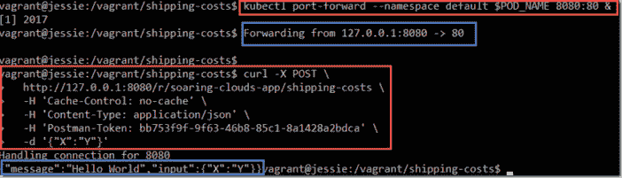

# 从 Windows 笔记本电脑的远程 Kubernetes 集群上开始使用 Project Fn——使用 vagger、VirtualBox、Docker、Helm 和 kubectl

> 原文：<https://medium.com/oracledevs/get-going-with-project-fn-on-a-remote-kubernetes-cluster-from-a-windows-laptop-using-vagrant-2fd27489a2d9?source=collection_archive---------0----------------------->


我在本文中描述的挑战非常具体。我有一台 Windows 笔记本电脑。我可以访问远程 Kubernetes 集群(在 Oracle 云基础设施上)。我想创建 Fn 函数，并将它们部署到运行在 Kubernetes(从现在开始是 k8s)环境中的 Fn 服务器上，并且希望能够从我的笔记本电脑上执行运行在 k8s 上的函数。就是这样。

在本文中，我将带您快速浏览一下我是如何实现这一点的:

*   使用 vagger 来启动一个基于 Debian Linux 镜像的 VirtualBox 虚拟机，并安装 Docker 服务器。使用 SSH 进入虚拟机并安装 Helm(一个 Kubernetes 包安装程序)——客户机(在 VM 中)和服务器(在 k8s 集群上称为 Tiller)。还要在 VM 中安装 kubectl。
*   然后在虚拟机中安装项目 Fn。还将 Fn 安装到 Kubernetes 集群，使用 Fn 的 Helm 图表(这将创建一系列组成和运行 Fn 平台的 Pods 和服务)。
*   仍然在 VM 内部，创建一个新的 Fn 函数。然后，将这个函数部署到 Kubernetes 集群上的 Fn 服务器。从 VM 内部运行该函数——使用 kubectl 为本地调用到 Kubernetes 集群的请求设置端口转发。
*   在 Windows 主机(笔记本电脑，在 VM 之外)上，我们还可以运行带有端口转发的 kubectl，并在 Kubernetes 集群上调用 Fn 函数。
*   最后，我将展示如何在外部 IP 地址上公开 Kubernetes 服务中的 fn-api 服务。注意:后者对于演示来说很好，但是在很大程度上牺牲了安全性。

总之，您将看到如何创建、部署和调用 Fn 函数——使用 Windows 笔记本电脑和远程 Kubernetes 集群作为函数的运行时环境。

起点:


一台运行 Windows 的笔记本电脑，安装了 VirtualBox 和 vagger，还有一个远程的 Kubernetes 集群(可能在某个云端，比如我正在使用的 Oracle 容器引擎云，也可能是 minikube)。

# 第一步:准备虚拟机

创建一个流浪者文件——比如这个:[https://github . com/lucasjellema/fn-on-kubernetes-from-docker-in-vagger-VM-on-windows/blob/master/vagger file](https://github.com/lucasjellema/fn-on-kubernetes-from-docker-in-vagrant-vm-on-windows/blob/master/vagrantfile):

```
Vagrant.configure("2") do |config|

config.vm.provision "docker"config.vm.define "debiandockerhostvm"
# [https://app.vagrantup.com/debian/boxes/jessie64](https://app.vagrantup.com/debian/boxes/jessie64)
config.vm.box = "debian/jessie64"
config.vm.network "private_network", ip: "192.168.188.105"config.vm.synced_folder "./", "/vagrant", id: "vagrant-root",
       owner: "vagrant",
       group: "www-data",
       mount_options: ["dmode=775,fmode=664"],
       type: ""

config.vm.provider :virtualbox do |vb|
   vb.name = "debiananddockerhostvm"
   vb.memory = 4096
   vb.cpus = 2
   vb.customize ["modifyvm", :id, "--natdnshostresolver1","on"]
   vb.customize ["modifyvm", :id, "--natdnsproxy1", "on"]
end

end
```

这个流浪文件将使用 VirtualBox 创建一个名为 *debiandockerhostvm* 的虚拟机——基于 VirtualBox 镜像 debian/jessie64。它将虚拟机暴露给 IP 地址为 192.168.188.105 的主机笔记本电脑(您可以安全地对此进行更改)。它将包含 travel file 的本地目录映射到 VM 中的/travel。这使得我们可以轻松地在 Windows 主机和 Debian Linux 虚拟机之间交换文件。指令“config . VM . provision”docker“”确保 Docker 被安装到虚拟机中。

要实际创建 VM，请打开一个命令行，并导航到包含该流浪者文件的目录。然后输入“向上流浪”。vagger 开始运行并创建虚拟机，与 VirtualBox APIs 进行交互。创建虚拟机时，它会启动。

在同一个命令行中，使用“vagger ssh ”,您现在可以在 VM 中打开一个终端窗口。

为了进一步准备 VM，我们需要安装 Helm 和 kubectl。Helm 安装在 VM(客户机)和 Kubernetes 集群(Tiller 服务器组件)中。

以下是在虚拟机内部执行的步骤(参见[步骤 1](http://https//github.com/lucasjellema/fn-on-kubernetes-from-docker-in-vagrant-vm-on-windows/blob/master/step1-prepare-VM) ):

```
######## kubectl# download and extract the kubectl binary 
curl -LO [https://storage.googleapis.com/kubernetes-release/release/$(curl](https://storage.googleapis.com/kubernetes-release/release/$(curl) -s [https://storage.googleapis.com/kubernetes-release/release/stable.txt)/bin/linux/amd64/kubectl](https://storage.googleapis.com/kubernetes-release/release/stable.txt)/bin/linux/amd64/kubectl)# set the executable flag for kubectl
chmod +x ./kubectl# move the kubectl executable to the bin directory
sudo mv ./kubectl /usr/local/bin/kubectl# assuming that the kubeconfig file with details for Kubernetes cluster is available On the Windows Host:
# Copy the kubeconfig file to the directory that contains the Vagrantfile and from which vagrant up and vagrant ssh were performed
# note: this directory is mapped into the VM to directory /vagrant#Then in VM - set the proper Kubernetes configuration context: 
export KUBECONFIG=/vagrant/kubeconfig#now inspect the succesful installation of kubectl and the correct connection to the Kubernetes cluster 
kubectl cluster-info########  HELM
#download the Helm installer
curl -LO  [https://kubernetes-helm.storage.googleapis.com/helm-v2.8.1-linux-amd64.tar.gz](https://kubernetes-helm.storage.googleapis.com/helm-v2.8.1-linux-amd64.tar.gz)#extract the Helm executable from the archive
tar -xzf helm-v2.8.1-linux-amd64.tar.gz#set the executable flag on the Helm executable
sudo chmod +x  ./linux-amd64/helm#move the Helm executable to the bin directory - as helm
sudo mv ./linux-amd64/helm /usr/local/bin/helm#test the successful installatin of helm
helm version###### Tiller#Helm has a server side companion, called Tiller, that should be installed into the Kubernetes cluster
# this is easily done by executing:
helm init# an easy test of the Helm/Tiller set up can be run (as described in the quickstart guide)
helm repo updatehelm install stable/mysqlhelm list# now inspect in the Kubernetes Dashboard the Pod that should have been created for the MySQL Helm chart# clean up after yourself:
helm delete <name of the release of MySQL>
```

完成这一步后，环境如下所示:


# 第二步:在 VM 和 Kubernetes 上安装项目 Fn

既然我们已经准备好了我们的虚拟机，我们可以继续将 Project Fn 命令行实用程序添加到虚拟机，并将 Fn 平台添加到 Kubernetes 集群。前者是简单的二进制文件的本地安装。后者是一个更简单的舵图安装。以下是您应该在虚拟机内部完成的步骤(另请参见[步骤 2](https://github.com/lucasjellema/fn-on-kubernetes-from-docker-in-vagrant-vm-on-windows/blob/master/step2-install-fn) ):

```
# 1A. download and install Fn locally inside the VM
curl -LSs [https://raw.githubusercontent.com/fnproject/cli/master/install](https://raw.githubusercontent.com/fnproject/cli/master/install) | sh#note: this previous statement failed for me; I went through the following steps as a workaround
# 1B. create install script
curl -LSs [https://raw.githubusercontent.com/fnproject/cli/master/install](https://raw.githubusercontent.com/fnproject/cli/master/install) > inst
all.sh
# make script executable
chmod u+x install.sh
# execute script - as sudo
sudo ./install.sh# 1C. and if that fails, you can manually manipulate the downloaded executable:
sudo mv /tmp/fn_linux /usr/local/bin/fn
sudo chmod +x /usr/local/bin/fn# 2\. when the installation was done through one of the  methods listed, test the success by running  
fn --version# 3\. Server side installation of Fn to the Kubernetes Cluster
# details in [https://github.com/fnproject/fn-helm](https://github.com/fnproject/fn-helm)# Clone the GitHub repo with the Helm chart for fn; sources are downloaded into the fn-helm directory
git clone [git@github.com](mailto:git@github.com):fnproject/fn-helm.git && cd fn-helm# Install chart dependencies from requirements.yaml in the fn-helm directory:
helm dep build fn#To install the Helm chart with the release name my-release into Kubernetes:
helm install --name my-release fn# to verify the cluster server side installation you could run the following statements:
export KUBECONFIG=/vagrant/kubeconfig#list all pods for app my-release-fn
kubectl get pods --namespace default -l "app=my-release-fn"
```

Fn 安装完成后，可以看到如下所示的环境:


您可以在 Kubernetes 仪表板中查看从舵图表中创建了什么:


或者在命令行上:


# 第三步:创建、部署和运行 Fn 函数

我们现在有了一个准备运行的环境—客户端 VM 和服务器端 Kubernetes 集群—用于创建 Fn 功能—并随后部署和调用它们。

现在让我们来看一下这三个步骤，首先在 Node 中创建一个名为 shipping-costs 的新函数。

```
docker loginexport FN_REGISTRY=lucasjellemamkdir shipping-costscd shipping-costsfn init --name shipping-costs --runtime  node# this creates the starting point of the Node application (package.json and func.js) as well as the Fn meta data file (func.yaml)# now edit the func.js file (and add dependencies to package.json if necessary)#The extremely simple implementation of func.js looks like this:
var fdk=require('[@fnproject/fdk](http://twitter.com/fnproject/fdk)');fdk.handle(function(input){
  var name = 'World';
  if (input.name) {
    name = input.name;
  }
  response = {'message': 'Hello ' + name, 'input':input}
  return response
})#This function receives an input parameter (from a POST request this would be the body contents, typically a JSON document)
# the function returns a result, a JSON document with the message and the input document returned in its entirety
```

在这一步之后，该函数存在于 VM 中——而不是其他任何地方。Kubernetes 上的 Fn 平台可能已经部署了其他一些功能。


这个功能 shipping-costs 现在应该部署到 K8S 集群，因为这是我们的主要目标之一。

```
export KUBECONFIG=/vagrant/kubeconfig# retrieve the name of the Pod running the Fn API
kubectl get pods --namespace default -l "app=my-release-fn,role=fn-service" -o jsonpath="{.items[0].metadata.name}"# retrieve the name of the Pod running the Fn API and assign to environment variable POD_NAME
export POD_NAME=$(kubectl get pods --namespace default -l "app=my-release-fn,role=fn-service" -o jsonpath="{.items[0].metadata.name}")
echo $POD_NAME# set up kubectl port-forwarding; this ensures that any local requests to port 8080 are forwarded by kubectl to the pod specified in this command, on port 80
# this basically creates a shortcut or highway from the VM right into the heart of the K8S cluster; we can leverage this highway for deployment of the function
kubectl port-forward --namespace default $POD_NAME 8080:80 &#now we inform Fn that deployment activities can be directed at port 8080 of the local host, effectively to the pod $POD_NAME on the K8S cluster
export FN_API_URL=[http://127.0.0.1:8080](http://127.0.0.1:8080)
export FN_REGISTRY=lucasjellema
docker login#perform the deployment of the function from the directory that contains the func.yaml file
#functions are organized in applications; here the name of the application is set to soaring-clouds-app
fn deploy --app soaring-clouds-app
```

这是部署在虚拟机终端窗口中的样子。(我省略了步骤:docker 登录、设置 FN_API_URL 和设置 FN_REGISTRY


在部署了函数 shipping-costs 之后，它现在存在于 Kubernetes 集群上——在 fn-api Pod 中(其中每个函数都运行一个 docker 容器):


要调用这些函数，有几个选项可用。可以从 VM 内部调用该函数，使用 cURL 到函数的端点——像以前一样利用 kubectrl 端口转发。我们还可以在笔记本电脑上应用 kubectl 端口转发——并使用任何可以调用 HTTP 端点的工具——比如 Postman——来调用该函数。

如果我们希望没有 kubectl 端口转发的客户机——甚至完全不了解 Kubernetes 集群——调用这个函数，也可以通过在 K8S 上为 fn-api 的服务公开一个外部 IP 来实现。


首先，让我们从 VM 中调用函数。

```
export KUBECONFIG=/vagrant/kubeconfig# retrieve the name of the Pod running the Fn API
kubectl get pods --namespace default -l "app=my-release-fn,role=fn-service" -o jsonpath="{.items[0].metadata.name}"# retrieve the name of the Pod running the Fn API and assign to environment variable POD_NAME
export POD_NAME=$(kubectl get pods --namespace default -l "app=my-release-fn,role=fn-service" -o jsonpath="{.items[0].metadata.name}")
echo $POD_NAME# set up kubectl port-forwarding; this ensures that any local requests to port 8080 are forwarded by kubectl to the pod specified in this command, on port 80
# this basically creates a shortcut or highway from the VM right into the heart of the K8S cluster; we can leverage this highway for deployment of the function
kubectl port-forward --namespace default $POD_NAME 8080:80 &curl -X POST \
  [http://127.0.0.1:8080/r/soaring-clouds-app/shipping-costs](http://127.0.0.1:8080/r/soaring-clouds-app/shipping-costs) \
  -H 'Cache-Control: no-cache' \
  -H 'Content-Type: application/json' \
  -H 'Postman-Token: bb753f9f-9f63-46b8-85c1-8a1428a2bdca' \
  -d '{"X":"Y"}'# on the Windows laptop host
set KUBECONFIG=c:\data\2018-soaring-keys\kubeconfigkubectl port-forward --namespace default <name of pod> 8080:80 &kubectl port-forward --namespace default my-release-fn-api-frsl5 8085:80 &
```



现在，尝试从笔记本电脑主机调用该函数。这假设在主机上我们有 kubectl 和 kubeconfig 文件，我们也在 VM 中使用它们。

首先，我们必须设置 KUBECONFIG 环境变量来引用 kubeconfig 文件。然后，我们像在 VM 中一样设置 kubectl 端口转发，在本例中，将端口 8085 转发到用于 Fn API 的 Kubernetes Pod。


完成后，我们可以调用本地主机上的 shipping-costs 函数，port 8085:endpoint[http://127 . 0 . 0 . 1:8085/r/sowing-clouds-app/shipping-costs](http://127.0.0.1:8085/r/soaring-clouds-app/shipping-costs)


这仍然需要客户端了解 Kubernetes:拥有 kubeconfig 文件和 kubectl 客户端。我们可以让从任何地方直接调用 Fn 函数成为可能，而不需要使用 kubectl。我们通过在 Kubernetes 上的 Fn API 服务上直接公开一个外部 IP 来做到这一点。

最简单的方法是通过 Kubernetes 仪表板。

运行仪表板:


并在本地浏览器打开: [http://127.0.0.1:8001/ui](http://127.0.0.1:8001/ui) 。

编辑 fn-api 的服务配置:


将类型 ClusterIP 更改为 LoadBalancer。这指示 Kubernetes 对外公开该服务，并为其分配一个外部 IP 地址。单击更新以使更改生效。


过一会儿，更改将被处理，我们可以为服务找到一个外部端点。


现在，我们(以及任何拥有这个 IP 地址的人)可以直接使用这个外部 IP 地址调用 Fn 函数 *shipping-costs* :


# 摘要

本文展示了如何从一台标准的 Windows 笔记本电脑开始——只有 Virtual Box 和 vagger 作为特殊组件。通过几个简单的、很大程度上自动化的步骤，我们创建了一个 VM，它允许我们创建 Fn 函数并将这些函数部署到 Kubernetes 集群，我们还在该集群上部署了 Fn 服务器平台。本文提供了所有的源代码和脚本，并演示了如何创建、部署和调用特定的函数。

# 资源

本文来源于 GitHub:[https://GitHub . com/lucasjellema/fn-on-kubernetes-from-docker-in-vagger-VM-on-windows](https://github.com/lucasjellema/fn-on-kubernetes-from-docker-in-vagrant-vm-on-windows)

流浪汉主页:[https://www.vagrantup.com/](https://www.vagrantup.com/)

VirtualBox 主页:[https://www.virtualbox.org/](https://www.virtualbox.org/)

头盔快速入门:【https://docs.helm.sh/using_helm/#quickstart-guide】T2

' Kubernetes 的 Fn 项目掌舵图—[https://medium . com/fn Project/fn-Project-Helm-Chart-for-Kubernetes-e 97 ded 6 f 4 f0c](/fnproject/fn-project-helm-chart-for-kubernetes-e97ded6f4f0c)'

kubectl 的安装说明—[https://kubernetes . io/docs/tasks/tools/install-kube CTL/# install-kube CTL-binary-via-curl](https://kubernetes.io/docs/tasks/tools/install-kubectl/#install-kubectl-binary-via-curl)

项目 Fn —快速启动—[https://github.com/fnproject/fn#quickstart](https://github.com/fnproject/fn#quickstart)

带节点的 Fn 教程:[https://github . com/Fn project/Fn/tree/master/examples/tutorial/hello/Node](https://github.com/fnproject/fn/tree/master/examples/tutorial/hello/node)

Kubernetes —公开服务的外部 IP 地址—[https://kubernetes . io/docs/tutorials/stateless-application/expose-external-IP-address/](https://kubernetes.io/docs/tutorials/stateless-application/expose-external-ip-address/)

使用端口转发访问集群中的应用程序—[https://kubernetes . io/docs/tasks/Access-application-Cluster/Port-forward-Access-application-Cluster/](https://kubernetes.io/docs/tasks/access-application-cluster/port-forward-access-application-cluster/)

AMIS 技术博客—Rapid first-steps with Fn—无服务器功能开源项目—[https://Technology . AMIS . nl/2017/10/19/Rapid-first-steps-with-Fn—无服务器功能开源项目/](https://technology.amis.nl/2017/10/19/rapid-first-few-steps-with-fn-open-source-project-for-serverless-functions/)

AMIS 技术博客—用 Docker Host 创建 Debian VM 使用 vagger—自动包含 Guest Additions—[https://Technology . AMIS . nl/2017/10/19/Create-Debian-VM-with-Docker-Host-using-vagger-automatically-include-Guest-Additions/](https://technology.amis.nl/2017/10/19/create-debian-vm-with-docker-host-using-vagrant-automatically-include-guest-additions/)

*原载于 2018 年 3 月 4 日*[*technology . amis . nl*](https://technology.amis.nl/2018/03/04/get-going-with-project-fn-on-a-remote-kubernetes-cluster-from-a-windows-laptop-using-vagrant-virtualbox-docker-helm-and-kubectl/)*。*