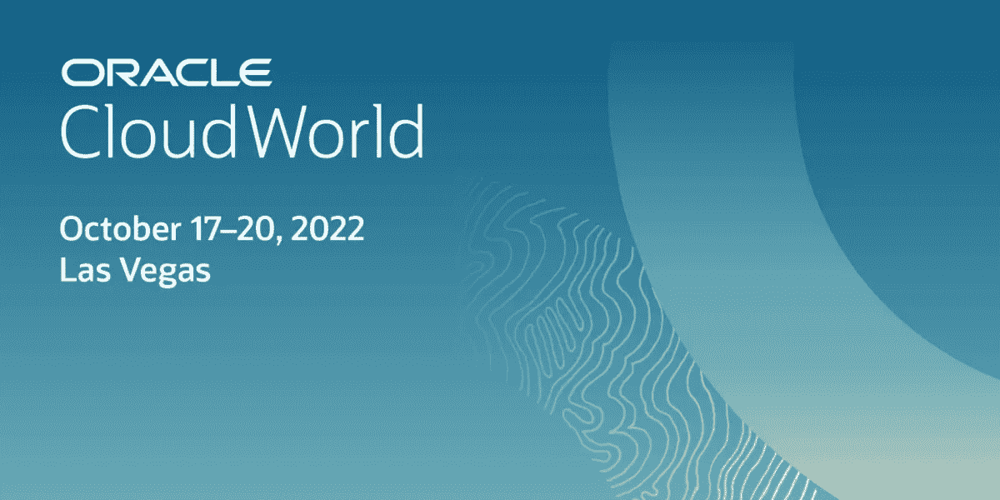

# 。NET 在 Oracle CloudWorld

> 原文：<https://medium.com/oracledevs/get-ready-for-oracle-cloudworld-b53044a40bc3?source=collection_archive---------0----------------------->

Oracle CloudWorld event

**更新 2** :为。NET 会话，我在下面提供了这些视频的链接。

**更新 1** :甲骨文 CloudWorld 已经结束。你可以[下载我的 ODP.NET 演示代码和教程](https://github.com/oracle/dotnet-db-samples/tree/master/session-demos/2022/oracle-cloudworld)。当会议视频在 11 月发布时，我会提供它们的链接。感谢所有参加我们圣谕的人。或参观我们的展位。

下周，甲骨文云世界将首次在拉斯维加斯举行。我会和我的先知同事一起去。NET 同事，包括[克里斯蒂安·谢伊](/@christian.shay)。我们将与开发人员会面并展示新的。NET、Power BI、Visual Studio 代码和针对 Oracle 数据库的 Visual Studio 特性。

我们为微软开发人员准备了一系列精彩的会议和内容。除了面对面的会议之外，其中一些甲骨文。NET 会话将在线提供。您所需要的只是 Oracle CloudWorld Digital 全通道通行证。正常情况下，这张通行证的价格是 299 美元。注册时，如果您使用促销代码“ **OCWDIGITAL** ”，您的通行证将是免费的。没错！它的价格相当于购买 Oracle 数据库快速版许可证的价格，即 0 美元。如果有兴趣，[从甲骨文 CloudWorld 网站注册数字全通道通行证](https://www.oracle.com/cloudworld/register/)。

Oracle Cloud Word Digital All-Access comp pass code

无论是现场还是虚拟的，这就是你会发现的。

# 会议

这是神谕。我的团队将现场和在线提供网络课程:

**在多云中使用 Oracle 自治数据库和 Microsoft Power BI**【lrn 1273】

*   10 月 19 日星期三上午 11:30 在凯撒论坛 211
*   也可通过数字通行证点播

Video: Using Oracle Autonomous Database with Microsoft Power BI in the Multicloud

**甲骨文的新功能。NET 和实体框架核心开发者**【lrn 1521】

*   10 月 19 日星期三下午 5 点在凯撒论坛 127

**使用 Azure 和 Oracle 数据库云进行多云开发**【lrn 3544】

*   10 月 20 日星期四上午 10:15 在凯撒论坛 127
*   也可通过数字通行证点播

Video: Multicloud Development with Azure and Oracle Database Cloud

使用 Visual Studio 代码和自治数据库进行 SQL 和 PL/SQL 开发【lrn 3471】

*   10 月 20 日星期四下午 1:15 在凯撒论坛 127

开发和部署微软的 Oracle 数据库。Kubernetes 中的网络应用程序【lrn 1299】

*   仅通过数字通行证按需提供

Video: Developing and Deploying Oracle Database Microsoft .NET Apps in Kubernetes

**使用 Visual Studio 和 Visual Studio 代码进行 PL/SQL 调试**【lrn 1278】

*   仅通过数字通行证按需提供

Video: PL/SQL Debugging with Visual Studio and Visual Studio Code

# 动手实验

如果你想弄脏你的手，试试先知。NET 动手实验室。您将使用 ODP.NET 核心、NGINX 和 Oracle 自治数据库创建一个实时的 ASP.NET 核心 web 应用程序。不需要云经验！

**。NET 开发与 Oracle 自治数据库快速启动 LiveLab**【hol 4086】

*   10 月 19 日星期三下午 1 点在凯撒论坛 129
*   也可在数据库中心的 Oracle 发现实验室现场点播
*   并且可以通过数字通行证按需获得

[。NET 开发用 Oracle 自治数据库快速入门](https://apexapps.oracle.com/pls/apex/dbpm/r/livelabs/view-workshop?wid=3359)也在会后上线。

# 演示摊位

如果你想见我或另一个先知。NET 专家，请访问我们在凯撒论坛开发者中心的信息亭(DB-102)。我们可以演示任何新的或现有的 Oracle 产品。您感兴趣的. NET、Visual Studio 或 VS 代码特性。

# 更多

对于甲骨文云基础设施和微软 Azure 用户，将有额外的多云会话，如新的甲骨文 Azure 数据库服务。

希望在那里见到你！