# 开始使用 Athena 联邦查询和 DocumentDB。

> 原文：<https://medium.com/globant/get-started-with-athena-federated-queries-and-documentdb-3ac66bef4ef?source=collection_archive---------0----------------------->

当今架构中的一个主要挑战是从多个数据源获得洞察力。在这些架构中，很容易看到不同数据库的组合:内存数据库、键值数据库、文档数据库、关系数据库、列数据库等等。Athena 是一个查询引擎，允许我们交互和分析结构化、半结构化和非结构化数据。有了 Athena 的联邦查询，我们现在可以查询所有这些数据库，并将结果存储在 S3 中。

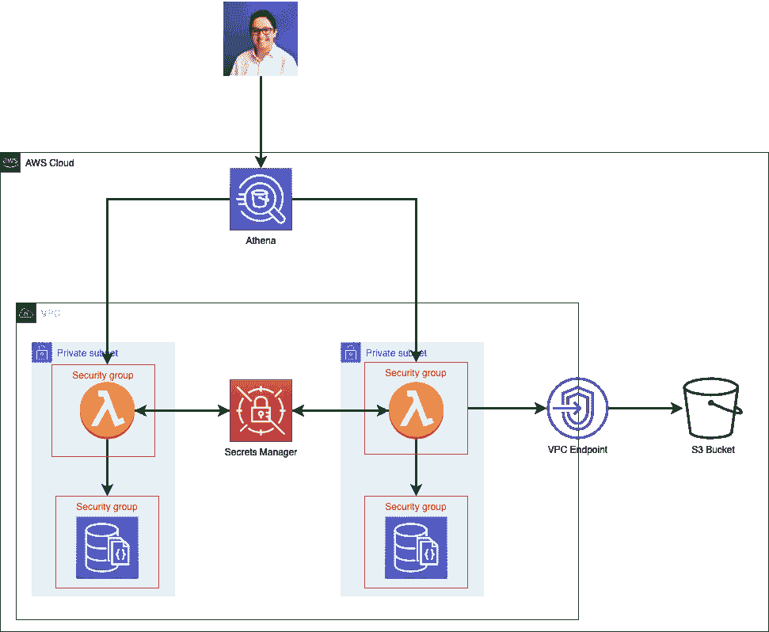

Base Architecture

# 介绍

本文将向您展示如何配置联邦 Athena 查询来与多个 DocumentDB 集群交互，并集中所有信息以进行更详细的分析。

在本文中，我们将讨论以下几点:
1-如何创建 Athena 连接器
2- Lambda 连接函数
3-Lambda 函数的部署
4-Athena 中的查询
5-吸取的教训

# 如何创建 Athena 连接器

接下来，我向您展示连接器步骤；首先，我们必须去雅典娜控制台。
1-点击数据源

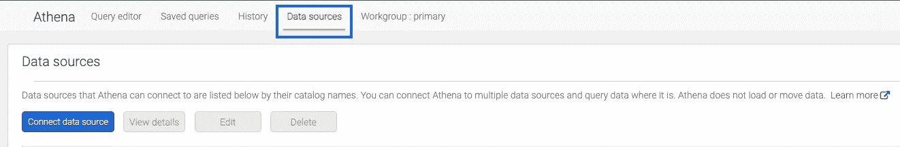

2-您应该选择查询数据源选项，并为您的用例选择源数据库；我的例子是 Amazon DocumentDB。

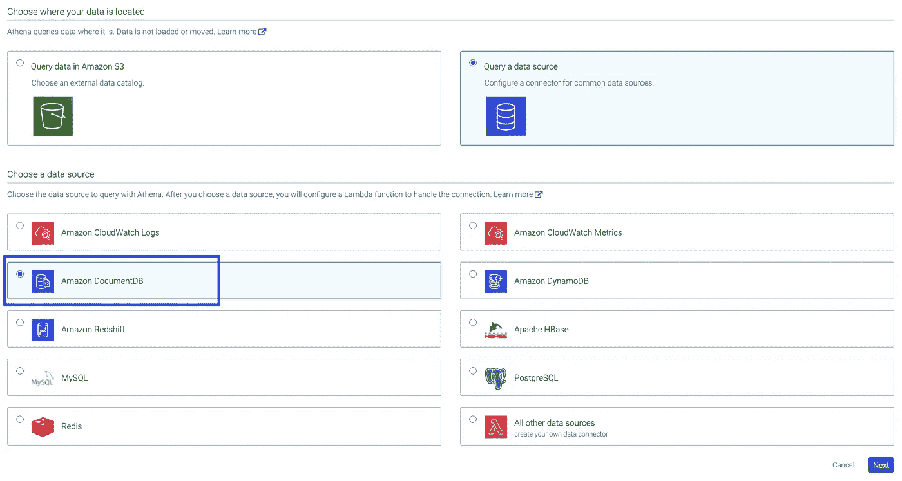

3-在这一步，我们配置新的 Lambda 函数来连接我们的数据库。我们将使用稍后指定的环境变量来配置该函数，以实现连接性。

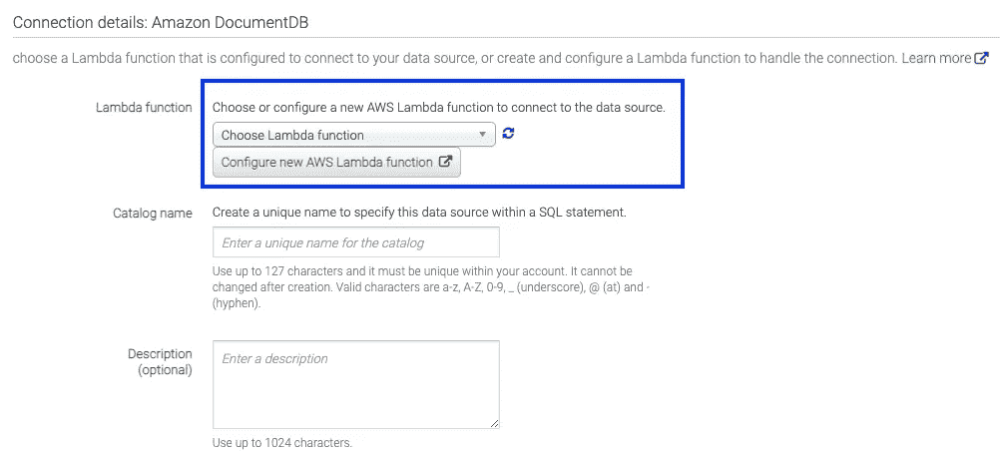

# λ连接函数

为了创建我们的 lambda 函数，我们需要填充指定的字段，我将逐一解释:

## 配置部分# 1

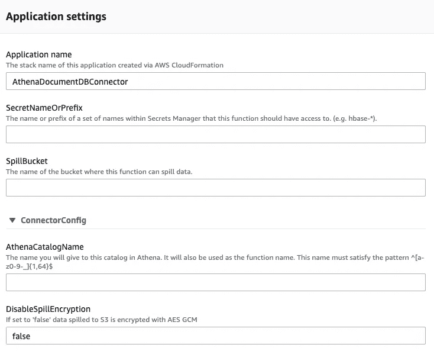

Configuration Part # 1 — Lambda

*   **应用名称**:在 SAM 中命名应用，在 Lambda >应用中可以看到。

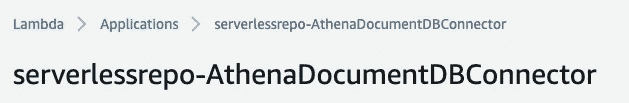

*   **SecretNameOrPrefix** :当数据库的连接字符串在 Secrets Manager 服务中时，我们可以指定秘密的前缀或名称。
*   **spill_bucket** :存储查询结果的桶；这些将保留在 CSV 中。在下图中，你可以看到一个例子。

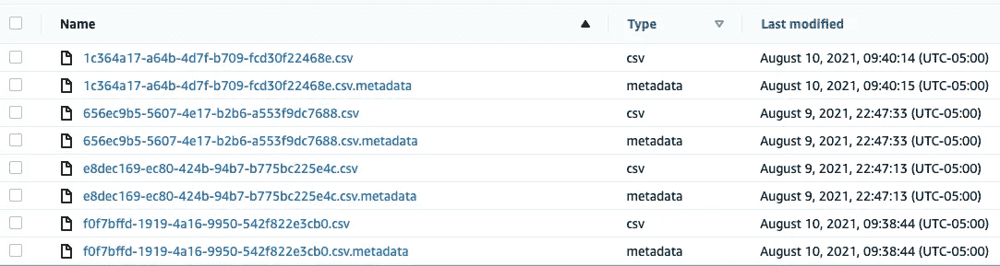

*   **AthenaCatalogName** :是 Athena 目录的名称。Lambda 函数将具有相同的名称。在下图中，你可以看到一个例子。

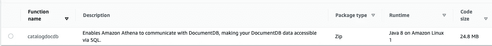

*   **disable _ spill _ encryption**:可以是真，也可以是假；它对存储在 S3 桶中的数据进行加密；请记住，您想要更好的性能。

## 配置部分# 2

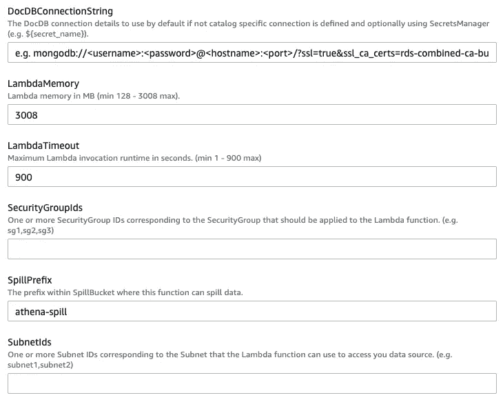

Configuration Part # 2- Lambda

*   **DocDBConnectionString** :在这个字段中，我们需要指定数据库的连接字符串或者引用连接字符串的秘密。如果你要使用一个秘密，请记住 Lambda 函数的角色必须有必要的权限来获取和解密它。
*   **lambda Memory**:lambda 函数的内存，请记住，对源数据库的许多查询可能很复杂，需要执行时间。为此，有必要回顾一下函数及其消耗，以调整记忆。
*   **LambdaTimeout:** 为该功能配置的超时。在生产中监控 Lambda 至关重要。但是，我建议从高值开始。这种情况下，我从 900 开始。当我们在 DocumentDB 中查询一个小表时，可以看到下面的日志。

```
REPORT RequestId: f94b7b28–12e4–44b9-b0ee-84aca25bbc2c Duration: 417.61 ms **Billed Duration: 418 ms Memory Size: 3008 MB Max Memory Used: 201 MB**REPORT RequestId: 00a578c2-c043–491e-8acc-cd497bac801d Duration: 9637.66 ms **Billed Duration: 9638 ms Memory Size: 3008 MB Max Memory Used: 195 MB**REPORT RequestId: 6067415d-94dc-45d4-a9ed-dc22cef1a465 Duration: 8174.79 ms **Billed Duration: 8175 ms Memory Size: 3008 MB Max Memory Used: 192 MB**
```

*   **security group pids**:您必须指定我们将与角色关联的安全组的 ID。
*   **spill_prefix** :它是存储响应的 bucket 中的子文件夹的名称。
*   **SubnetIds** :您需要指定我们将与角色关联的安全组的 ID。

# 建立工作关系网

Lambda 函数必须在 VPC 中；这很重要，因为我们必须考虑几个组件及其配置:

*   **安全组**:在这种情况下，DocumentDB 数据库的 SG 允许 Lambda 函数的 SG 的流量通过端口 27017 是至关重要的。
*   **路由表**:我们必须决定我们的 Lambda 函数将如何访问 S3 桶来存储数据。
*   **通过互联网将 Lambda 发送到 S3**:要实现这一点，Lambda 必须位于专用子网中，并且其路由表必须通过 NAT 网关将流量发送到互联网。
*   **Lambda 到 S3 而不上线**:我们需要创建一个 VPC 端点来访问 S3，并通过路由表中的这个端点将流量定向到 S3。对于这个场景，Lambda 不需要上线。

# 特征

*   **语言** : Java 8。
*   **部署**:Lambda 功能使用 SAM 部署；一旦我们填写了所有要求的信息，这个过程就是自动的。
*   **角色**:Lambda 函数的角色必须能够访问 S3 来存储查询结果。
*   **大小**:lambda 包重约 25Mb。
*   **代码**:lambda 代码自动生成。当我们试图查看代码时，我们无法做到这一点，代码来自 SAM 模板中帐户之外的一个桶。

# 我们的 Lambda 函数的部署

要对 Lambda 函数进行更改，我们可以使用 CodePipeline、CodeBuild 和 CodeDeploy 等 AWS 工具创建一个 CICD。AWS 在幕后使用 SAM 模板创建整个基础架构，如下所示:

要为无服务器应用程序创建 CICD，您可以查看以下链接。然而，这是控制台中应用程序部署的第一个版本。

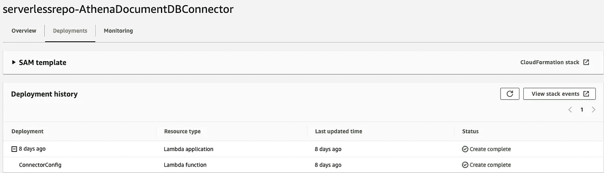

# 雅典娜中的查询

在 Athena 中完成所有必要的配置后，我们可以在 DocumentDB 中查询我们的数据库，如下所示:

```
SELECT * FROM “source_data_name”. “Data_base”. “Table” limit 10;
```

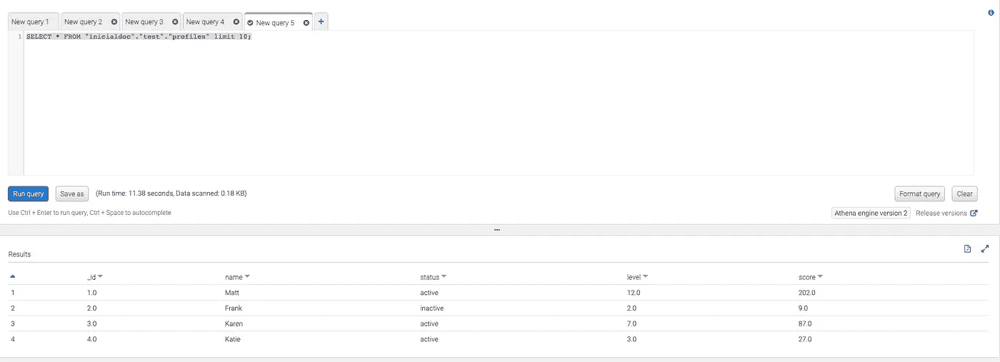

在 Athena 中，您还可以从不同的数据库引擎查询多个数据源。有关更多信息，请参见 [Athena 联邦查询文档。](https://github.com/awslabs/aws-athena-query-federation)

# 吸取的教训

*   这是一个突出的特点；但是，您必须为每个到不同 DB 的连接创建它的连接器；这将根据数据源的数量为您提供几个 Lambda 函数。
*   您可以将 Athena 与 Quicksight 集成，创建包含所需信息的可视化仪表板。
*   如图所示的体系结构的安全性至关重要；这就是为什么必须保护所有组件，保证静态加密，限制 Lambda 角色的权限，并始终使用 Secrets Manager 连接到数据源。
*   当第一次配置这个特性时，总是查看 Lambda 函数的执行日志并基于这些结果调整内存和超时值是至关重要的。

[——卡洛斯·桑布拉诺](https://www.linkedin.com/in/carlos-zambrano-aws/)