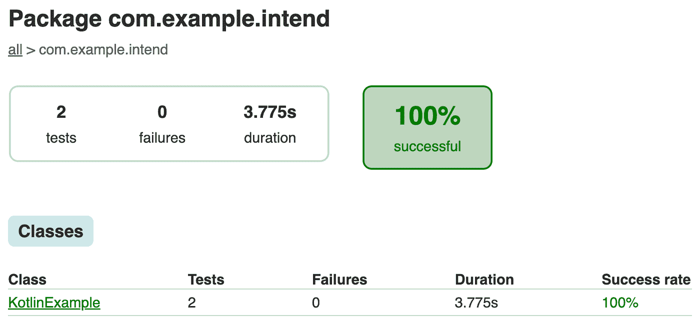

# 开始使用 Espresso & Kotlin！

> 原文：<https://medium.com/globant/get-started-with-espresso-kotlin-8aa5ca935489?source=collection_archive---------0----------------------->

使用这两个工具从头开始一个 UI 测试项目


本文提供了基于 [Kotlin](https://kotlinlang.org/) 和 [Espresso](https://developer.android.com/training/testing/espresso) 从头开始 UI 测试项目的信息。在下面的例子中，我们假设这个应用程序是用 Java 开发的，需要一个特定的配置来用 Kotlin 开发和执行测试。

Espresso 是一个用于 UI 自动化测试的本地框架。它附带了 Android SDK，并提供了许多功能，使该工具在对本机应用程序执行 UI 测试时更加可靠。

Espresso 目前支持两种语言:Java 和 Kotlin。这一次，我们将介绍在 Kotlin 配置下设置执行测试用例的基础所需的一切。

下图代表了我们在构建 Android 应用程序时通常会得到的结果:


**Folders Structure**

这个例子基于一个用 Java 创建的 Android 应用程序，使用 Kotlin 进行测试。

包`**com.example.intend (androidTest)**`将保存针对应用程序执行的 UI 测试，而`**com.example.intend (test)**` 保存单元测试。

## **编写第一个测试**

我们将在 Kotlin 中创建我们的第一个测试，并将其放在`**com.example.intend (androidTest)**` **中。**


**Kotlin Class Creation**

我们来调用类:`KotlinExample`。一旦我们创建了这个类，我们应该创建我们的第一个函数，并声明我们将要执行的执行类型。为此，我们将使用 Junit 及其装饰器`@RunWith()`，这将允许我们为这个类定义 runner。

```
@RunWith(AndroidJUnit4::class)
class KotlinExample {

    @Test
    fun modifyText() {
    }
}
```

现在，测试函数似乎已经准备好执行了。也许你不会得到任何 IDE 编译警告，但是在执行这个函数的时候，你会得到下面的错误:

```
Didn't find class "com.example.intend.KotlinExample" on path: DexPathList…….
```

这是意料之中的，因为我们还没有添加我们的 Kotlin 依赖项。首先，我们需要为 Gradle 添加一个 Kotlin 插件到我们的`build.gradle` `(Project: <Project Name>)`文件中，如下所示:

```
buildscript {
    ext.kotlinVersion = "1.7.10"
    ext.agpVersion = "7.3.1"
    repositories {
        // Insert local test repo here
        google()
        mavenCentral()
    }

    dependencies {
        classpath "com.android.tools.build:gradle:$agpVersion"
        classpath "org.jetbrains.kotlin:kotlin-gradle-plugin:$kotlinVersion"
        // NOTE: Do not place your application dependencies here;
        // they belong in the individual module build.gradle files
    }
}
```

在`build.gradle (Module: <Project name>.app)` 文件中添加以下两个插件:

```
import com.android.build.api.dsl.ManagedVirtualDevice

apply plugin: 'com.android.application'
//Plugins for handling kotlin code
apply plugin: 'kotlin-android'
apply plugin: 'kotlin-android-extensions'

task wrapper(type: Wrapper){
    gradleVersion = '7.5.1'
}

android {
    compileSdkVersion 33
    buildToolsVersion rootProject.buildToolsVersion
    defaultConfig {
        applicationId "com.example.intend.BasicSample"
        minSdkVersion 14
        targetSdkVersion 33yes.
        versionCode 1
        versionName "1.0"
        multiDexEnabled true
        testInstrumentationRunner "androidx.test.runner.AndroidJUnitRunner"
    }
```

请确保已在同一文件中添加了以下依赖项:

```
dependencies {
    androidTestImplementation 'androidx.test.ext:junit:1.1.4'
    androidTestImplementation 'androidx.test.espresso:espresso-core:3.5.0'
}
```

现在您应该能够执行您的测试函数了(右键单击函数名并单击 run)。

让我们继续编写我们的第一个场景。我们的应用程序是一个简单的应用程序，允许我们在同一页面上编写文本和更改标题，或者将其放在第二个屏幕上:


**Emulator View**

## **元素检测**

对于这个例子，我们将依赖 Android studio 的布局检查器，你可以通过`**Tools->Layout Inspector**`访问它，并选择你想要检查的应用 id。

因此，我们在检查器中有几个部分来查看组件树和组件的详细信息:


**Layout Inspector Elements Tree**


**Layout Inspector Element Details**

这是一个非常易于使用的[检查器](https://developer.android.com/studio/debug/layout-inspector)，展示了这个例子的基础。如您所见，测试应用程序第一个屏幕中的输入 id 是 editTextUserInput。因此，我们将通过测试使用它来更改输入的值。

首先，我们需要在测试中添加一个规则来启动应用程序，并在每次测试后关闭它。为此，我们需要将以下依赖项添加到我们的`**build.gradle(Module: <Project name>)**` 文件中。

```
// Testing-only dependencies
    androidTestImplementation 'androidx.test.ext:junit:' 
        + rootProject.extJUnitVersion
    androidTestImplementation 'androidx.test.ext:junit-ktx:' 
        + rootProject.extJUnitVersion
```

然后将规则添加到测试类中:

```
@RunWith(AndroidJUnit4::class)
class KotlinExample {

    @get:Rule
    var activityScenarioRule = activityScenarioRule<MainActivity>()

    @Test
    fun modifyText() {
    }
}
```

然后我们需要开始处理应用程序对象。在本例中，我们将向输入组件 editTextUserInput 添加某些文本，然后单击按钮来更改主屏幕中的文本，最后验证文本是否已更改:

```
companion object {
        val STRING_TO_BE_TYPED = "Espresso"
    }

    @Test
    fun modifyText() {

        onView(withId(R.id.editTextUserInput))
            .perform(typeText(STRING_TO_BE_TYPED), closeSoftKeyboard())
        onView(withId(R.id.changeTextBt)).perform(click())
        onView(withId(R.id.textToBeChanged))
        .check(matches(withText(STRING_TO_BE_TYPED)))
    }
```

我们在 Espresso 中有许多函数，可以应用于我们应用程序中的不同对象。您可以在以下链接中找到一个非常用户友好的列表，列出了您可以使用 Espresso 执行的操作:[https://developer . Android . com/training/testing/Espresso/cheat-sheet](https://developer.android.com/training/testing/espresso/cheat-sheet)

## **Espresso 测试中的 POM(页面对象模型)**

您还可以应用您认为适合您的项目的任何设计模式，比如 POM。我们可以创建几个页面来将这个测试迁移到 POM。让我们称它们为主屏幕和`BasePage`。`MainScreen`将控制主屏幕和基础页面中的对象和动作，以及跨屏幕的常用动作:

```
class MainScreen : BasePage() {

    private val editTextUserInput = R.id.editTextUserInput
    private val changeTextBt = R.id.changeTextBt
    val textToBeChanged = getView(R.id.textToBeChanged)

    fun enterInputValue(value: String): MainScreen {
        enterText(editTextUserInput, value)
        return this
    }

    fun clickChangeText(): MainScreen {
        clickOn(changeTextBt)
        return this
    }
}
```

```
open class BasePage {

    fun enterText(id:Int, value:String){
        onView(withId(id))
            .perform(typeText(value))
    }

    fun clickOn(id:Int){
        onView(withId(id))
            .perform(click())
    }

    fun getView(id:Int): ViewInteraction? {
        return onView(withId(id))
    }
}
```

现在，我们使用刚刚创建的 POM 创建另一个测试:

```
@Test
    fun modifyTextPO() {

        val mainScreen = MainScreen()

        mainScreen.enterInputValue(STRING_TO_BE_TYPED)
            .clickChangeText()
        mainScreen.textToBeChanged?
          .check(matches(withText(STRING_TO_BE_TYPED)))

    }
```

## **执行**

对于测试执行，我们使用 Android studio。我们可以转到我们的运行/调试配置，根据我们的应用和当前测试创建一个新的 Android 仪器测试配置:


**Run Configuration**

此外，您可以通过右键单击函数并运行测试执行来自动获得测试配置。对于命令行执行，我们可以通过 Gradle 包装器:Gradlew 来完成。

向`build.gradle (Module: <Project Name>.app)`文件添加以下任务:

```
task wrapper(type: Wrapper){
    gradleVersion = '7.5.1'
}
```

指定您正在使用的 Gradle 版本。然后，执行下面的命令来获得 Gradle 包装器:`**gradle wrapper — gradle-version 7.5.1**`。一旦我们设置了包装器，我们就可以继续执行下面的命令来执行我们的特定测试:

```
./gradlew connectedDebugAndroidTest -P android.testInstrumentationRunnerArguments.class=com.example.intend.KotlinExample#modifyTextPO;
```

或者按类名执行:

```
./gradlew connectedDebugAndroidTest -P android.testInstrumentationRunnerArguments.class=com.example.intend.KotlinExample
```

## **报道**

执行后，Gradle 会在`**app/build/reports/androidTests/connected**`目录下生成一个默认的 HTML 报告。您将找到 index.html 文件，其中包含结果摘要:


**Summary Report**



**Package Detailed Report**


**Class Detailed Report**

可以对上述报告进行自定义，如下图所示，例如，包括屏幕截图，或者您认为需要报告的任何重要数据:


Customized Test Report

如果需要，我们可以定制这份报告，或者简单地添加另一个工具来获得更详细的报告。

## **结论**

Espresso 是用于 Android UI 测试自动化的非常强大和可靠的工具。Espresso 允许用户在应用程序和测试代码之间没有代理的情况下工作，从而使执行更快、更可靠。选择正确的自动化工具取决于您。希望这对你有用，帮助你入门。