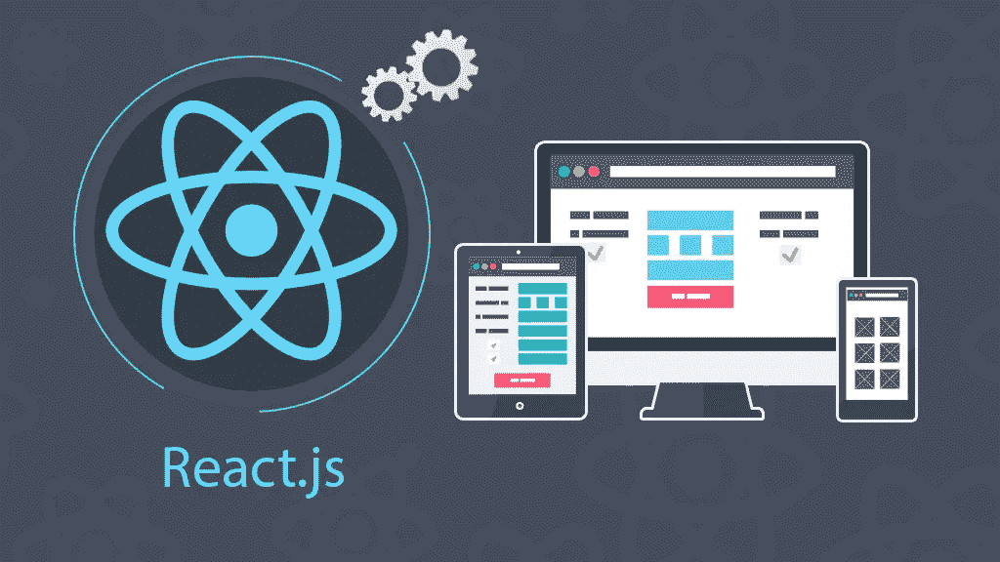

# REACT 入门—编程指南

> 原文：<https://medium.com/quick-code/get-started-with-react-programming-guide-476005be0c64?source=collection_archive---------0----------------------->

Know what topics to learn in REACT as you begin

REACT 首先由脸书开发，是一个现代的、强大的动态应用 Javascript 库。按照 REACT JS 官方网站的说法，创建交互式用户界面很容易。尤其是那些根据数据变化陈述变化的人。它基于封装的组件，遵循“一次学习，随处写”的原则。这使得重用现有代码变得非常容易。

## 工作机会

REACT JS 大量用于 web 应用程序开发。此外，随着 REACT Native JS 的出现，它正在成为 Android 和 IOS 应用程序开发中越来越受欢迎的选择。REACT JS 将归入 web 开发、Web 应用程序开发和移动应用程序开发。因此，REACT JS 作为整个 Web 和应用程序开发的核心技能，就业机会是巨大的，而且正在蓬勃发展。

现在让我们介绍一下 REACT 开发入门的学习途径。

## REACT 中涉及的初学者主题[第 1-5 天]

1.  安装 VS 代码
2.  了解 REACT 组件
3.  ？你好世界？在反应中
4.  反应 ES6 和 JS6
5.  REACT 道具、状态、开发者工具
6.  REACT 中的事件处理
7.  列表、用户输入、定制组件样式

 [## 绝对初学者 95%的折扣- Eduonix 课程优惠券

### React 专业应用开发完全指南。

www.quickcode.co](https://www.quickcode.co/free/course/learn/React-for-Absolute-Beginners/3254?utm_source=mediumPub&utm_medium=social&utm_campaign=LearningGuide&utm_term=learnReact_Panks) 

## 中级主题-我将在 REACT 中介绍[第 6-13 天]

1.  用方法处理 REACT 事件
2.  状态操作，了解 useState()挂钩
3.  无状态与有状态组件
4.  组件间引用的方法，双向绑定
5.  条件内容呈现
6.  列表和状态、列表和键、灵活列表
7.  动态设置类名
8.  镭的使用，媒体查询
9.  启用和使用 CSS 模块、伪选择器、媒体查询

 [## 95% off - React JS Web 开发-基础训练营- Udemy 优惠券

### React.js essentials 训练营。获得核心概念的坚实基础，并构建令人兴奋和有用的应用程序！

www.quickcode.co](https://www.quickcode.co/free/course/learn/React-JS-Web-Development---The-Essentials-Bootcamp/3249?utm_source=mediumPub&utm_medium=social&utm_campaign=LearningGuide&utm_term=learnReact_Panks) 

## 中级主题-将在 REACT 中涵盖的 II[第 13–17 天]

1.  React 中的调试，错误消息，使用开发工具和源代码图
2.  将应用程序分成独立的组件，无状态组件和有状态组件，基类组件和功能组件
3.  组件生命周期-创建、更新道具和状态更改
4.  理解 useEffect()行为，生命周期挂钩
5.  组件优化
6.  DOM 更新
7.  相邻 JSX 元素的渲染

 [## 100%折扣 ReactJS 简介-快速入门免费课程优惠券

### ReactJS 简介

-快速入门免费课程优惠券，介绍 ReactJSwww.quickcode.co](https://www.quickcode.co/free/course/learn/Introduction-to-ReactJS/1991?utm_source=mediumPub&utm_medium=social&utm_campaign=LearningGuide&utm_term=learnReact_Panks) 

## 中级主题-将在 REACT 中涵盖的第三部分[第 18- 25 天]

1.  高阶组件
2.  传递未知道具，设置状态，道具类型
3.  使用引用，带有 REACT 挂钩的引用
4.  道具链问题
5.  上下文 API，ContextType，useContext()
6.  REACT 中的 HTTP 请求，获取数据，将获取的数据呈现在屏幕上
7.  更新时获取数据，没有无限循环
8.  向服务器发送数据，发送删除请求
9.  错误处理
10.  全局执行和 Axios 实例的拦截器

 [## 95%折扣-从零开始-我的优惠券

### 学习 React JS——本课程涵盖了在新项目和现有项目中使用 React JS 所需的所有内容

www.quickcode.co](https://www.quickcode.co/free/course/learn/React-From-The-Ground-Up/3251?utm_source=mediumPub&utm_medium=social&utm_campaign=LearningGuide&utm_term=learnReact_Panks) 

## REACT 中涵盖的高级-I 主题[第 26–30 天]

1.  路由和 SPAs，了解单页应用程序中的多页
2.  设置链接，路由器包，react-router Vs react-router-dom
3.  为路线选择、设置和渲染准备项目
4.  页面切换，页面切换的链接，路由属性
5.  ？带路由器？特设和路线道具
6.  传递和提取路线参数
7.  嵌套路由，重定向请求，条件重定向
8.  路线懒加载，反应悬疑
9.  路由和服务器部署

 [## 95%折扣- React -完整指南(包括挂钩、React 路由器、Redux) - Eduonix 课程优惠券

### 投身其中，从头开始学习 React！学习 Reactjs、Hooks、Redux、React Routing、Animations、Next.js 等等！

www.quickcode.co](https://www.quickcode.co/free/course/learn/React---The-Complete-Guide--incl-Hooks--React-Router--Redux-/3253?utm_source=mediumPub&utm_medium=social&utm_campaign=LearningGuide&utm_term=learnReact_Panks) 

## REACT 中涵盖的高级 II 主题[第 30–35 天]

1.  理解 REDUX，管理状态流
2.  设置减压器并存储
3.  将 REACT 连接到 REDUX
4.  更新状态，数组不变
5.  外包活动类型
6.  多重减速器
7.  REDUX 开发工具
8.  将应用程序部署到 Web

 [## 95%的 off - React JS -构建真实世界的 JS 应用程序并部署在云上- Udemy 优惠券

### React JS 是一个非常棒的 JS 框架，用于构建前端应用程序！React JS 领先 Angular JS 或 Vue JS

www.quickcode.co](https://www.quickcode.co/free/course/learn/React-JS---Build-real-world-JS-apps---deploy-on-cloud/3250?utm_source=mediumPub&utm_medium=social&utm_campaign=LearningGuide&utm_term=learnReact_Panks) 

## 互补技能

像所有其他学习途径一样，这里有一些补充 REACT JS 的其他技能，适用于工业领域的工作:

1.  HTML 5
2.  半铸钢ˌ钢性铸铁(Cast Semi-Steel)
3.  结构化查询语言
4.  Jquery
5.  NoSQL

## 拥有 REACT JS 技能的热门职位

1.  REACT JS 开发者
2.  Web 应用程序开发人员
3.  全栈开发者
4.  前端工程师
5.  软件工程师

## 结论

这让我们结束了 REACT 开发的学习之路。我们希望这条学习路径对您有所帮助。如果有任何进一步的问题或反馈，请在这里告诉我们，QuickCode 团队将在这里帮助您满足学习需求。

*原载于 2019 年 3 月 22 日*[*【www.quickcode.co】*](http://www.quickcode.co/learning-guide/learn-react-guide?utm_source=mediumPub&utm_medium=social&utm_campaign=LearningGuide&utm_term=learnReact_Panks)*。*