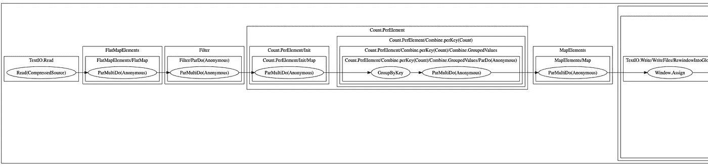

# 获得 Apache Beam 中管道的图形表示

> 原文：<https://medium.com/compendium/getting-a-graph-representation-of-a-pipeline-in-apache-beam-adeef25483a8?source=collection_archive---------4----------------------->


# 介绍

在[阿帕奇波束](https://beam.apache.org/)中建造先进的管道，或者试图用你的头脑去思考现有的管道，有时会很有挑战性。我们已经在该软件的托管云版本中看到了管道的一些漂亮的可视化表示，但是弄清楚如何获得管道的图形表示需要一点研究。下面是如何使用 Beam 的 Java SDK 通过几个步骤完成的。

# TL；DR:获取图形表示

如果您只想看到几行让您生成图的[点](https://en.wikipedia.org/wiki/DOT_(graph_description_language))表示，这里是:

现在，如果你想要一个稍微更全面的例子，请继续阅读。

# 完整的例子

这里我们将使用[字数统计示例](https://beam.apache.org/get-started/quickstart-java/#get-the-wordcount-code)，特别是`[MinimalWordCount](https://github.com/apache/beam/blob/master/examples/java/src/main/java/org/apache/beam/examples/MinimalWordCount.java)`类。

## 添加 Maven 依赖项

首先，我们需要在`<dependencies>`部分下向 Maven 文件添加一个依赖项:

## 代码

现在，我们需要添加一些导入(假设您已经添加了前面提到的 Maven 依赖)。

为了获得管道图的[点](https://en.wikipedia.org/wiki/DOT_(graph_description_language))表示，我们将把管道对象传递给`PipelineDotRenderer`类，在本例中，我们只将输出记录到控制台(因此是 log4j 导入)。

就是这样。要查看运行中的代码，请从命令行运行它:

```
$ mvn compile exec:java \
    -Dexec.mainClass=org.apache.beam.examples.MinimalWordCount \
    -Pdirect-runner
```

该代码将生成管道的点表示，并将其记录到控制台。

## 一个完整的例子

基于`[MinimalWordCount](https://github.com/apache/beam/blob/master/examples/java/src/main/java/org/apache/beam/examples/MinimalWordCount.java)`代码，可以在[我的库](https://github.com/mehmandarov/word-count-mini-beam)中找到一个完整的工作示例。在那里，除了记录到控制台，我们将把点表示存储到一个文件中。

在下一节中，我们将简要地看一下用点表示法可以做些什么。

# 现在怎么办？

现在我们有了管道图的点表示，我们可以用它来更好地理解管道。例如，您可以从数据中生成 SVG 或 PNG 图像。请注意，生成的图可能有点冗长，但是很好地概述了管道图。

这里，我还包括了为特定管道生成的[点图](https://github.com/mehmandarov/word-count-mini-beam/blob/master/pipeline_graph.dot)和 [PNG 文件](https://github.com/mehmandarov/word-count-mini-beam/blob/master/pipeline_graph.png)的例子。

假设您已经安装了 Graphviz [工具](https://www.graphviz.org/download/)，您可以使用以下命令将点文件转换为 PNG 图像:

```
$ dot -Tpng -o pipeline_graph.png pipeline_graph.dot
```

除了 [Grapgviz](https://www.graphviz.org/) (维基百科[链接](https://en.wikipedia.org/wiki/Graphviz))之外，还有将点阵图转换为图形表示的在线服务，比如 [this](https://dreampuf.github.io/GraphvizOnline) one。



A part of a graphical representation for the pipeline in the MinimalWordCount example.

*原载于 2019 年 11 月 27 日*[*https://mehmandarov.com*](https://mehmandarov.com/apache-beam-pipeline-graph/)*。*