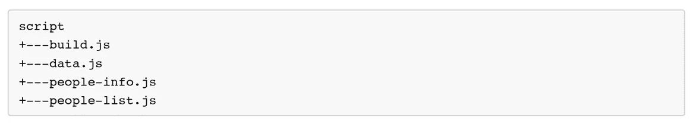
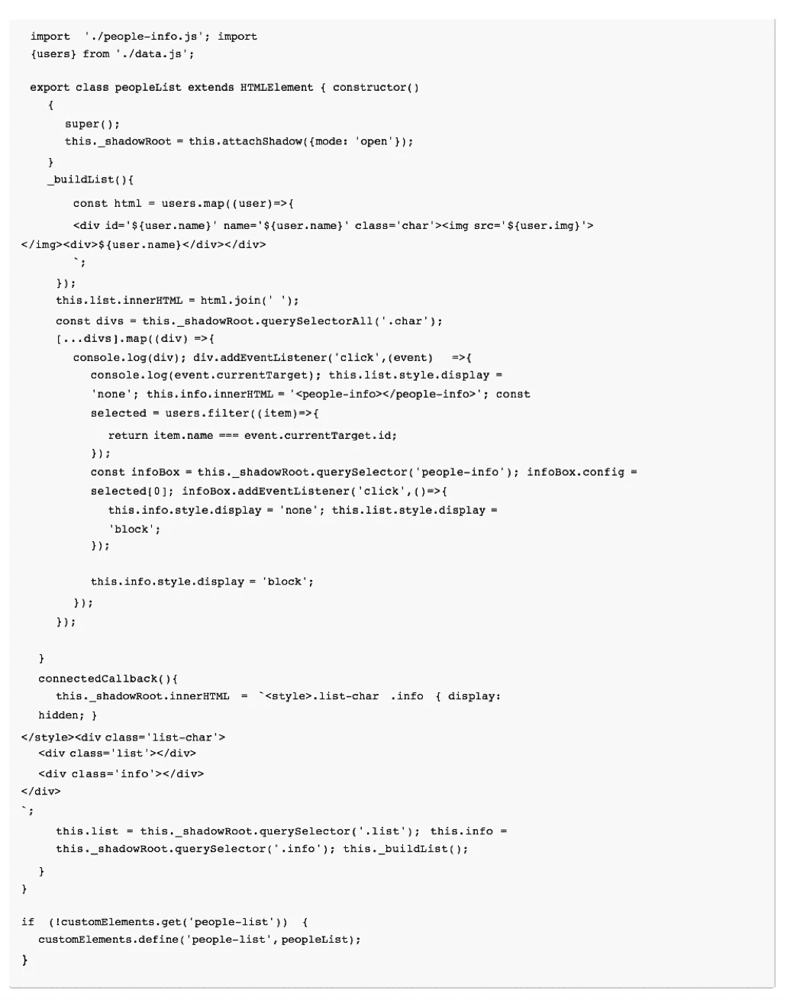
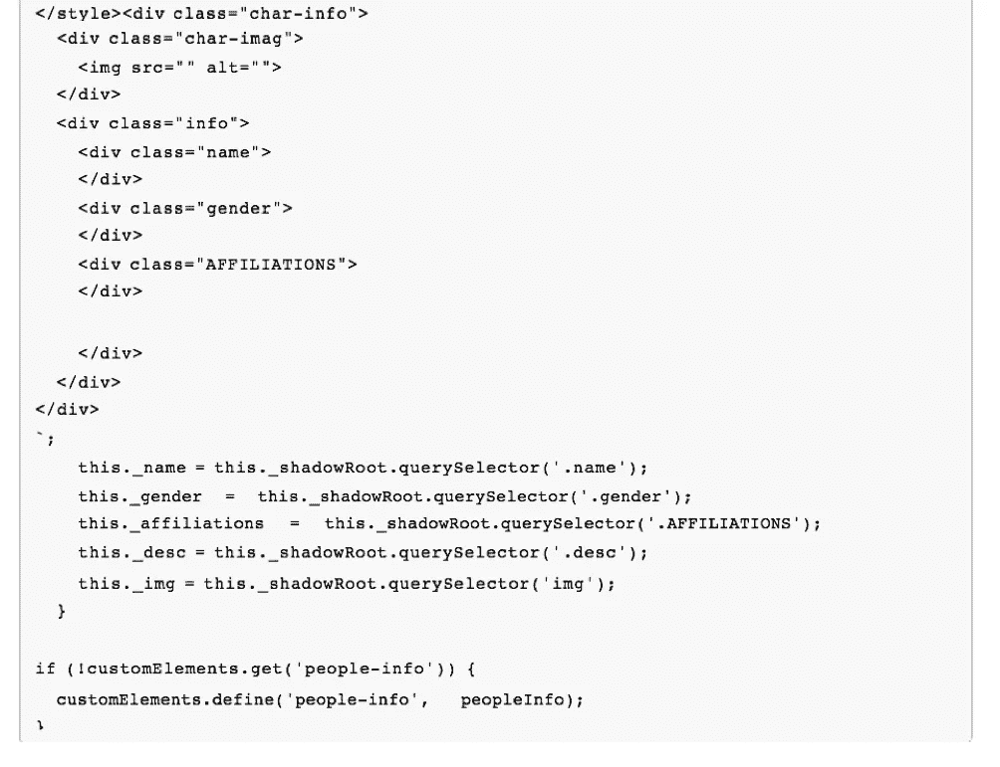
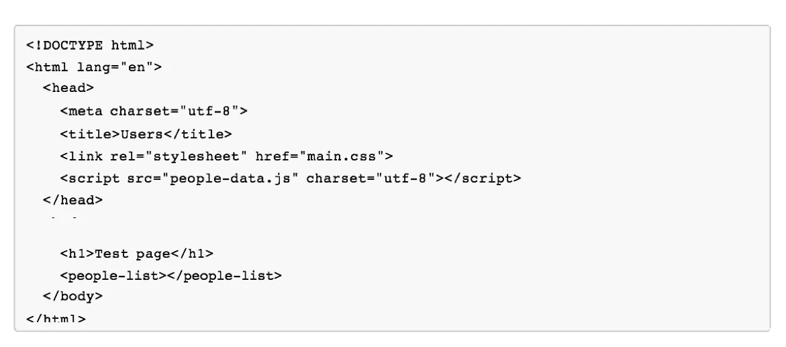
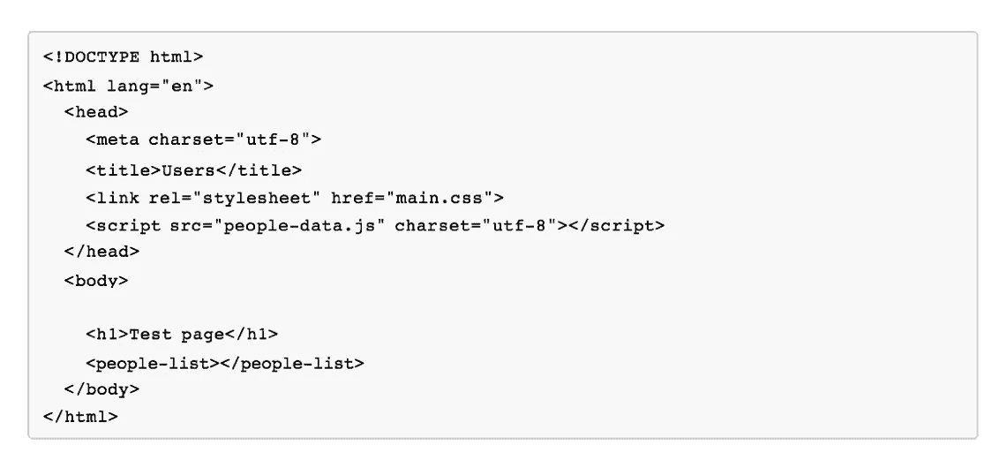
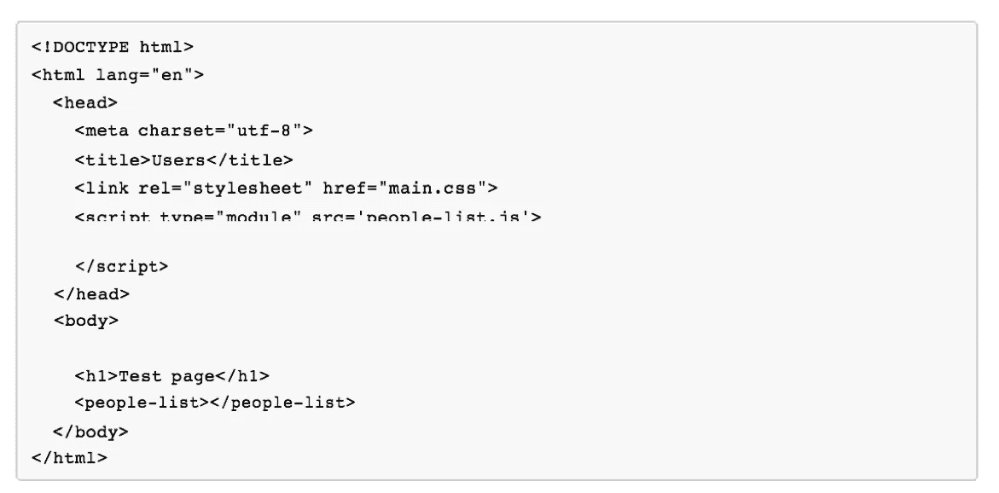

# 回到我们开始的地方

> 原文：<https://medium.com/capital-one-tech/getting-back-to-where-we-all-started-11d3994b26f4?source=collection_archive---------6----------------------->

## 今天使用 ES 模块+ JavaScript

几年前，当我开发 Java J2EE 应用程序时，我很羡慕前端开发人员可以保存一个 HTML 文件并刷新浏览器来查看他们的更改。有了 J2EE，我们编写了必须编译的 JSP 文件，然后必须启动一个服务器来提供我们的内容。更简单的开发周期是我开始喜欢做前端开发的一个原因。

但是随着时间的推移，JavaScript 开始变得更加强大和复杂。我们添加了 Babel 来编译我们的 JavaScript，WebPack 或 Browserify 来捆绑我们的应用程序，等等。这使得设置、开发和构建过程稍微复杂了一些。今天，我们用 WebPack 解决的一个主要问题是把我们所有的 JavaScript 文件打包成一个 JavaScript 文件。

前端开发曾经很容易，后来变得越来越难——让我们努力让它变得更容易。

# 紧急救援模块

在 Capital One，我们已经开始将我们的前端开发转移到使用 web 组件来构建我们的应用程序。一种方法是使用 Webpack 将多个 JavaScript 文件捆绑成一个 JavaScript 文件。但是 Webpack 能做的不止这些。Webpack 的树抖动使用静态结构的 es 模块导入/导出来缩小 JavaScript 的文件大小。ES 模块是高度解耦的，不同的功能块存储在模块中。正如您可能知道的，松散耦合通过尽可能地移除依赖性来简化应用程序的可维护性。自定义元素非常适合这种结构，因为自定义元素必须使用类语法。ES 模块有自己的作用域，这有助于我们避免污染模块代码的全局命名空间和命名空间。我们现在可以只从 JavaScript 库中导入我们需要的代码。ES 模块标准化了在浏览器中加载模块的方式，还有许多其他的好处。让我们看看今天我们是如何做到这一点的。

# **今日结构**

下面是一个示例应用程序，它具有我们用于 web 组件的结构。我正在显示一个人员列表，如果您单击该人员，它将显示该人员的详细信息。

我们有一个包含 JavaScript 文件的 src 目录。

我们的构建文件只有一行，build . js .**T3 要求('../dist/people-list ')；**web pack 将使用这个文件作为入口文件，并构建 data.js 作为其输出。信息、列表和数据文件是我们的 web 组件。

person-list . js

人民信息网

这是我们的示例应用程序，在 WebPack 将 JavaScript 绑定到 people-data.js 之后，我们用 index.html 调用它

index.html

我们现在可以打开这个页面，看到一个字符列表。以这种方式构造我们的代码将允许我们快速转移到 ES 模块。ES 模块开始登陆浏览器。他们目前在:

*   Safari 10.1
*   chrome Canary 60——在 chrome:flags Firefox 54 中的实验性 Web 平台标志后面——在 about:config 中的 dom.moduleScripts.enabled 设置后面
*   edge 15——about:flags 中实验性 JavaScript 特性设置的背后

为了改变我们的代码来使用 ES 模块，我们所要做的就是更新我们的 index.html。要使用模块，我们需要做的就是添加 ***类型+模块*** 这个脚本作为 ECMAScript 模块。这将告诉浏览器将该脚本视为 ECMAScript 模块。

所以我们的 index.html 变成了这样:

现在我们不必将 JavaScript 捆绑在一起，浏览器会加载 JavaScript 文件

需要。我们还可以使用脚本标签上的属性 ***nomodule*** 来添加一个回退，如果浏览器不这样做的话

支持 ES 模块。

我们最终的 index.html 看起来像这样:

我们现在可以在不使用 WebPack 的情况下利用模块化代码。还有一些其他的优势，比如利用导入只使用我们想要使用的代码部分。我们也可以回到使用单独的文件，这使得开发和调试更加容易。对于单个文件，我们还可以利用 HTTP2，在一个管道中加载代码，从而加快下载速度。

# 结论

ES 模块允许我们在模块中编写代码，创建局部作用域，避免函数污染全局作用域。我们可以使用像 WebPack 这样的捆绑应用程序中的树抖动来缩小代码的大小。我们还可以享受对我们的模块代码进行更简单的单元测试。

在不久的将来，我们将能够在浏览器中使用 ES 模块。这将给我们带来额外的好处，比如 http2 支持、模块只执行一次、异步加载等等！

***披露声明:以上观点为作者个人观点。除非本帖中另有说明，否则 Capital One 不属于所提及的任何公司，也不被其认可。使用或展示的所有商标和其他知识产权都是其各自所有者的所有权。本文为 2017 首都一。***

# 相关链接

*   [为企业创建自定义 HTML 元素](/capital-one-developers/creating-custom-html-elements-for-enterprise-5fd17bb6a355)