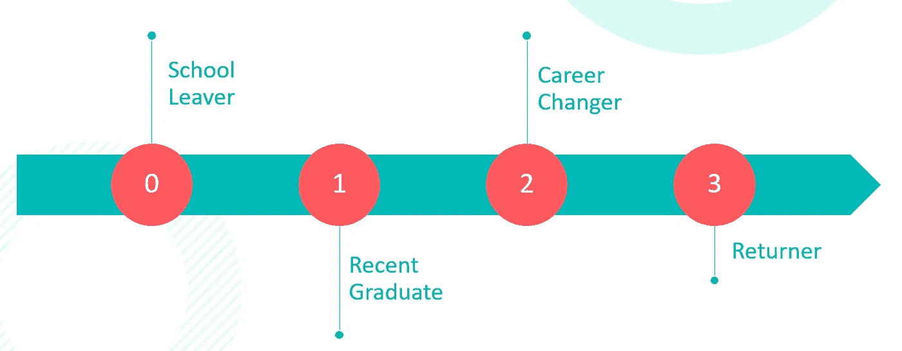

# IT 入门:重新开始科技职业的指南

> 原文：<https://medium.com/version-1/getting-into-it-a-guide-on-re-starting-tech-careers-d269949875c8?source=collection_archive---------4----------------------->

# 介绍

在过去的 30 年里，我见证了技术越来越多地支撑着我们的日常生活，扮演着至关重要的角色，并且几乎在每个行业都根深蒂固。

即使是最初范围有限的行业，如制造业和银行业，现在也看到技术被:

工业化农业，广泛采用物联网(IoT)设备来优化和控制生产环境。
娱乐，拥有海量的点播流媒体内容库。
零售业，其机器学习(ML)算法针对产品供应，以及准时化(JiT)精益库存。

每个组织背后都有技术，但技术背后是 IT 专业人员，他们让一切工作正常进行，并不断推动当前的发展。

无论你是开始还是重新开始你的职业生涯，科技行业的职业生涯有许多不同的角色，提供了极其多样的职业道路和许多不同的发展路线。每个人投身科技行业都有不同的原因，但是这个时机再好不过了！

# 评估您现在所处的位置()

科技行业不断变化的格局意味着角色总是在演变；总有新的东西要学，没有人会在个人学习和发展上“止步不前”(L&D)。

决定你的下一步可能会令人生畏，因为有多种途径可以让你(重新)开始科技职业生涯，包括学术研究、在职培训或自学。

Figure 1: Assess your offset

# 在云端:学位与大学课程

获得学位，或一些高等教育的学术资格，是离校生的一个普遍选择；学术研究领域包括:

计算
计算机工程和电子学
计算机科学

然而，这已经成为一个越来越昂贵的选择，不仅仅是在你的财务方面，因为许多学生毕业时背负着沉重的学生债务；但是时间承诺——或者借用一个经济学术语:“机会成本”——伴随着走这条路。许多学士学位需要至少三年的全日制学习才能完成。

你可能会发现学术机构提供的模块不一定符合你未来的职业规划。由于教学课程通常与教师的研究兴趣非常一致，而且没有任何“课外”活动(见下文)，你可能会发现自己就像一个离校生一样缺乏经验。

# 地面上的靴子:学徒和训练营

作为任何正式学术教育的替代方案，这些课程提供在职培训，通常同时努力获得行业认可的认证。你在学习的同时获得回报，并有一个行业经验丰富的技术培训师/导师网络围绕着你，同时获得直接的行业经验和宝贵的技能。

投入的时间通常少于正规学术途径所需的时间，可以用来让自己成为一个永久的角色，无论是在提供课程的主办机构还是其他机构。

许多成熟的高质量技术雇主提供毕业生招聘计划和/或学徒计划，以建立自己的人才管道。

# 总有第三条路:大规模开放在线课程(MOOCs)

你的个人情况可能会让你对学术或学徒的长期承诺充满挑战。你可能已经有工作或者忙于照顾家庭。

有各种在线产品来迎合你的 L&D，比如通过 MOOC.org 提供的平台。MOOCs 是免费的在线课程，任何人都可以注册，学习新技能，推进自己的职业生涯。

虽然要求更多的自律才能完成，但 MOOCs 在学习的主题和完成的时间上都提供了更多的灵活性。走这条 MOOC 路线，通过他们的[开放式课程](https://ocw.mit.edu/)，有可能获得麻省理工学院(MiT)的著名学位。

# 为你的下一个技术职位有针对性地提升技能

Figure 2: Target your Learning & Development

在线招聘网站可以帮助你确定你对哪些技术职位感兴趣，以及哪些技能是雇主所需要的。

找出你的技能组合中的任何差距是一个有用的起点，因为这个练习的结果将告诉你应该将你的注意力放在哪里，以进行任何进一步的 L&D。

# 重新审视和应用以前的工作经验

看起来你没有招聘启事上列出的任何技能，但是所谓的“软”技能可能出奇的重要，许多技能可以转化为技术角色；从你的目标角色的角度考虑你过去担任的任何角色。

# 获得行业认证

获得认证可能会让你快速进入技术岗位，你可以在几周内学习并获得认证，而不是几年。

# 资产，而不是负债

你在另一个领域的学位可能是一项资产，而不是负债。乍一看，科学、技术、工程和数学(STEM)学位可能比你毕业时获得的哲学或文学学位更适合你所选择的技术职业，但是，要关注你的学位在未来的应用方式；创造性的解决问题的方法，高超的写作和沟通技巧，以及对逻辑的高度欣赏，都有助于将你的学位重塑为一项资产。

# 从底层开始变得舒适

从初级职位获得的经验是非常宝贵的；准备好从底层开始，一路向上，不断提升自己的技能。以今天应用程序部署的尖端工具为例:无服务器框架，其第一个稳定版本出现在 2021 年；昨天是容器，前天是虚拟机。总的来说，技术角色和技术行业从来都不是一成不变的，我们都在不断发展，随着新工具和技术的开发、发布和广泛采用，我们也在不断学习它们。

许多科技雇主正通过采纳 BYO(自建)人才管道的理念，正面解决他们的技能短缺问题；提供训练营式的学徒级招聘计划，有时也称为学院。这些提供了一条通往入门级职位的捷径，再加上通过相关行业认证的铺垫，值得一试。

# 学习相关的技术技能并获得经验

“课外”活动，也许是开发个人项目和维护你自己的 GitHub 来自学一门编程语言或其他技能，或者为一个开源项目做贡献，如果你的就业经验缺乏当前的相关性，这些活动可以帮助你通过招聘活动的筛选阶段。

以我自己曲折的经历来看，个人项目可以成为学习一项新技术技能或编程语言的绝佳动力，也可以作为展示浓厚兴趣的作品集，展示你自我指导学习的能力，并给你一些与面试官谈论的技术话题。你在“空白”时间做的事情可能会影响雇主对你的职业生涯有一个更全面的看法。理解编程的基本知识将会让你在寻找(下一个)技术职位时占据上风。利用在线免费提供的许多自我指导、自定进度的 L&D 机会。

如果你对云计算技术职业特别感兴趣，CloudResumeChallenge.dev 和[https://learntocloud . guide](https://learntocloud.guide)提供了一个优秀的云无关的初级读本和对云计算的全面介绍。

# AWS 如何应对技术技能短缺

AWS(亚马逊网络服务)已经迎接挑战，正面解决当前的数字技能短缺问题。

[AWS SkillBuilder 资源](https://explore.skillbuilder.aws/learn)是一个学习中心，帮助您建立按需云技能，提供涵盖 AWS 云服务产品的免费数字培训，以及更基本的概念，如 AWS 良好架构的框架和 AWS 共同责任模型。

注册自己的 AWS 免费层帐户将允许您跟随任何实践教程，这将提供比仅仅阅读理论更丰富的体验。能够在真正的 AWS 云上提供真正的基础设施将有助于您的学习具体化。

除了 SkillBuilder 产品，AWS 还推出了几项旨在重新培训人力资源，甚至影响年轻人职业方向的计划。

# AWS 教育

AWS 教育对任何个人开放，无论他们的教育、经历或职业生涯处于哪个阶段。提供免费的自定进度在线培训资源和实验室，旨在学习、实践和评估您的云技能。

 [## AWS 教育

### 按照您自己的步调、用您自己的时间来构建您的云技能，并且完全免费。AWS Educate 现在对任何…

aws.amazon.com](https://aws.amazon.com/education/awseducate) 

# AWS 学院

AWS Academy 使高等教育机构能够让学生为行业认可的云计算认证和职业生涯做好准备。提供免费、随时可教的云计算课程，帮助教育工作者站在云创新的最前沿，以便他们能够让学生具备在增长最快的行业之一就业所需的技能。

 [## AWS 学院|培训和认证| AWS

### 赋权高等教育机构，为学生准备行业认可的认证和职业生涯的…

aws.amazon.com](https://aws.amazon.com/training/awsacademy) 

# AWS 重新启动

AWS re/Start 提供基于课堂的全日制技能发展，帮助个人为云职业做好准备，并将他们与潜在雇主联系起来。专注于失业或未充分就业的个人，申请不需要技术背景。学习者通过基于场景的学习、动手实验和课程获得技术和软技能。Re/Start 还提供简历和面试辅导，帮助学员做好面试准备。

 [## AWS 重启|培训和认证| AWS

### AWS 重新开始是一个全职的，基于课堂的技能发展和培训计划，为个人准备…

aws.amazon.com](https://aws.amazon.com/training/restart) 

# AWS GetIT

AWS GetIT 是一项旨在通过鼓励 12-13 岁的女孩考虑从事科技职业来激发下一代科技人才的倡议。它贯穿一个学年，邀请学校组队参加校际应用程序开发竞赛。参与者学习实用的数字技能，体验团队合作，并从向更广泛的观众展示想法中获得自信；决赛选手在年度 AWS 峰会上展示他们的想法！在整个课程中，参与者受到来自 AWS 和更广泛的 IT 行业的女性大使的鼓舞和支持。

 [## AWS 懂了

### AWS GetIT 是亚马逊网络服务(AWS)设计的一项倡议，旨在鼓励 12-13 岁的女孩考虑从事…

aws.amazon.com](https://aws.amazon.com/campaigns/aws-get-it) 

# 最后

现在是进入这一领域的最佳时机。随着家庭宽带的广泛采用，再加上大量的在线培训、实验室和研讨会，你真的可以自我指导你的学习道路，并获得宝贵的技能和经验，无论你的起始职位或当前的承诺。每个人都有自己的选择。

**关于作者:**
莎伦·米切尔是 AWS DevOps 第 1 版的工程师。