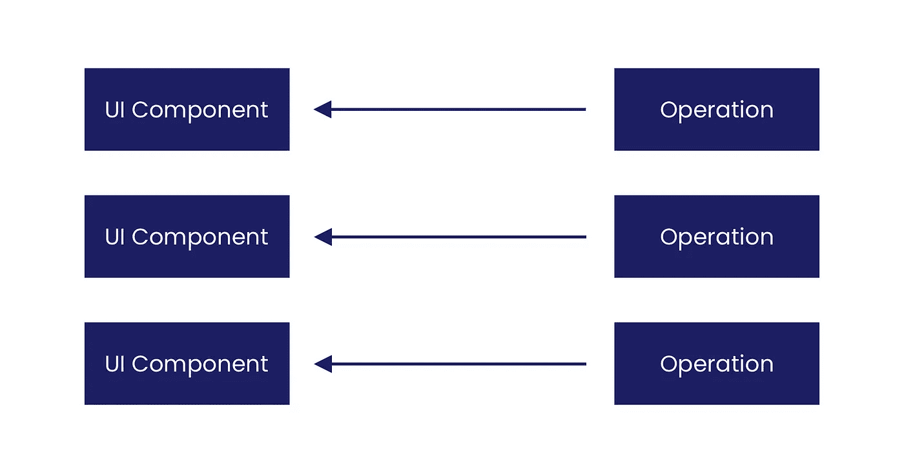
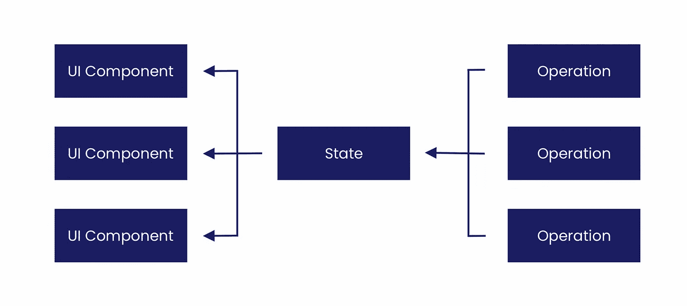
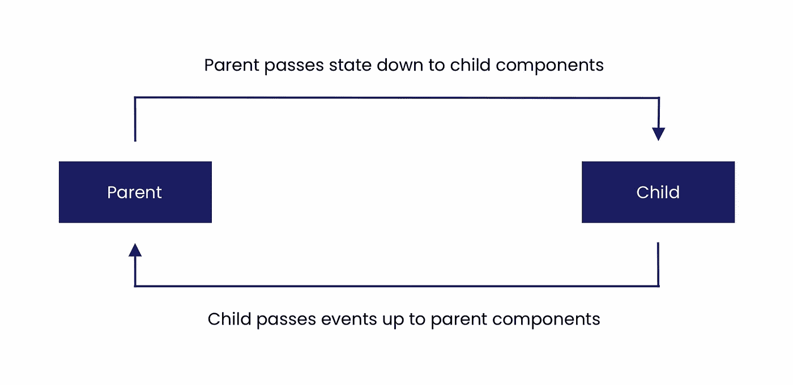

# 为 Jetpack Compose 准备好我们的应用

> 原文：<https://medium.com/google-developer-experts/getting-our-apps-ready-for-jetpack-compose-d9f8416de8ed?source=collection_archive---------0----------------------->

自从 Jetpack Compose 发布以来，随着该框架的开发人员和 alpha 版本的发布，人们越来越兴奋地将它集成到我们的应用程序中。随着向 Compose 的迁移，我们将会看到开发人员生产率、应用程序稳定性和可维护性的巨大改进，以及在招聘等方面的其他副作用(谁不想在采用这些新技术的团队中工作呢！).然而，除了所有这些话题之外，我经常被问到的一个关于 Jetpack Compose 的问题是什么时候会有一个稳定的版本？这也是我经常想知道的事情！虽然这还不太可能发生，但我觉得重要的是关注我们现在可以做些什么来让我们的团队和应用为 compose 采用做好准备——有一系列事情我们可以开始或继续做，以便在时机到来时使这种过渡更加平稳。很可能我们不会马上迁移我们的整个应用程序(尽管这可能很诱人)，我们为准备我们的应用程序所做的任何事情都将有助于减少最终过渡中的任何摩擦，同时自然地改进我们的代码库。

**注意:**在这篇文章中，我一直在谈论 Jetpack Compose 及其工作原理。如果你还没有探索 Compose 或者它是如何工作的，[我会推荐一些来自官方文档的额外读物](https://developer.android.com/jetpack/compose)。

# 开始以声明式 UI 思维方式思考

即使我们目前没有使用 Jetpack Compose 给我们的声明性方法，我们也可以开始尝试在我们的应用程序上使用声明性思维。声明式 UI 的一个重要概念是状态——我们的 UI 组件是使用我们提供的数据值组成的，而不是在值发生变化时手动控制视图属性(setText、setVisibility 等)。这种状态的概念变得更容易管理，因为状态代表一个真实的来源，也就是说，组成你的用户界面的所有不同的组件都引用同一个状态对象，而不是被单独修改。

在这种方法开始变得更加普遍之前(Android 之前的 ViewModel 和 livedata)，我们可能已经习惯了从不同的源单独设置视图属性。例如，触发一个导致一些数据被发出的操作，一旦这些数据变得可用，结果将最终被传递到某个视图。随着多个操作的发生，屏幕状态的不同部分变得相当解耦，因为它们是单独操作的

这里的问题是，你的 UI 没有单一的表示你的屏幕应该由什么组成——当这些单独的数据流填充 UI 组件时，内容很容易变得不同步，并且变得非常不可预测，因为你的数据可能在任何地方被改变。当涉及到组合时，这就成了一个更大的问题，因为您的整个 UI 将随着任何状态的改变而重新呈现，数据保持同步是很重要的，这样，如果数据发生了变化，您就可以确保 UI 的其余部分将以可预测的方式呈现。为您的状态提供一个真实的来源不仅有助于确保这一点，还有助于为 Jetpack Compose 准备相关的屏幕。

我们可以看到，现在我们有了一个单一的状态引用，它由屏幕上的任何操作来操作。然后，这个状态引用用于控制我们屏幕上组件的所有状态，而不是在涉及状态时单独管理每个组件。这有助于保持这些组件的无状态，使用它们来简单地描述我们的状态所代表的内容。这种方法对于可组合 UI 来说是完美的——因为可组合组件是使用提供给它们的状态来呈现的，使用单一的真实来源意味着当我们重新呈现我们的屏幕时，我们可以组合来自相同来源的内容，确保我们的状态的表示总是正确地反映在 UI 中。

# 单向数据流

单向数据流本身是一个完全独立的主题，可能会有自己的博客帖子，但在谈论状态时，也应该提到这个概念——它也与单一真实来源的想法密切相关。你可以在戴维·冈萨雷斯的演讲中了解更多关于单向数据流和 android 的知识。

简而言之，单向数据流的目标是数据应该只有一种方式传输到屏幕或应用程序的其他部分。关于视图和数据层之间的数据流，假设用户按下一个按钮，这个按钮的交互被一个监听器捕获，这个监听器触发视图模型中的一个函数，这个函数触发存储库中的一个请求。这个请求返回，在我们的视图模型中设置状态，然后它发出结果来响应按钮的按下。我们在这里可以看到，数据流是以圆周运动的方式运行的——根据所使用的架构和框架，其实际实现可能看起来非常不同，但关键的概念是始终坚持循环。

同样的情况也适用于我们的 UI 组件——当我们的 UI 重新呈现时触发按钮状态后，接收新状态的父组件应该将该状态传递给它的任何子组件——同样，保持我们的 UI 组件无状态，并使用它们来简单地描述状态。然后，如果这些子组件希望自己触发任何事件，比如它们自己的按钮按下，这些事件将被传递给父组件，然后再次触发整个事件循环。

在这种情况下，来自任何组件的交互都必须通过父组件触发事件，父组件进而操纵我们的状态，进而更新我们的 UI。在这里，我们的 UI 及其状态变得更加可预测，因为我们确切地知道我们的状态在哪里以及如何被操纵。说到作曲，这个概念是关键。对于 Jetpack Compose，composables 是从状态及其任何变化中呈现的——因此，这里可以通过使用单向数据流来确保可预测性和有效性。在 UI 组件中坚持无状态原则也有助于在自动化测试中保持低摩擦，因为我们只需要关心它们的呈现和行为，而不需要关心状态管理。

# 分离 UI 组件

Jetpack Compose 专注于呈现我们应用程序的 UI，这意味着它不负责数据流、业务逻辑或我们应用程序的任何其他问题。我们的目标是拥有轻量级的组件，这些组件与我们项目中的其他关注点相分离。也就是说，这与我们应用程序中当前视图类的目标并没有什么不同——即使没有 compose，这也有助于解耦这些类，从而提高它们的可维护性和可测试性。当涉及到采用 compose 时，让我们现有的视图类与 compose UI 组件的职责相匹配(尽可能紧密地)将极大地减少将该组件切换为可组合组件时的任何摩擦。在作曲之前，我们可以在这个领域做一些事情。

当处理项目中的现有代码时，现在可以进行小的重构，以减少将来采用 compose 时的摩擦。作为一个练习，也许可以快速浏览一下应用程序中的视图组件，并思考一下，如何将该组件转换为可组合组件？如果没有想到什么，那太好了！然而，在许多情况下，该组件可能正在管理它自己的状态，直接触发一个存储库，显示一个对话框或触发一些影响屏幕状态的其他动作。因为这些影响状态，如果你想坚持这篇文章中提到的其他事情，这些都是需要改变的。

尽管这些都可以在组合迁移期间一次性完成，但这不仅增加了摩擦，还增加了更改的范围——因此增加了我们代码中回归的机会。与此同时，我们可以做一些小的重构来帮助简化我们的转换——这些可以小到将对话框移动到父组件并通过回调触发其显示，或者将视图管理状态移动到父组件并将其传递到子组件。

在采用 compose 之前向项目中添加新的视图类时，一定要询问该视图的职责。考虑到这一点，在技术规范和代码评审期间可能会想到一些问题:

*   这个业务逻辑应该包含在这个视图中吗？我们能在父类中利用这种逻辑，并让传入的数据反映这一点吗？
*   而不是由视图来管理这种状态，是否有可能将它从其父代传递下来？
*   为什么我们不通过监听器触发一个事件并向上游传递一个事件，而不是直接在视图中执行请求呢？

正如我们所看到的，这些示例问题与本文之前提到的一些概念直接相关。可能还会想到其他一些事情，我只想在这里提供几个例子。要考虑的重要事情是，对于我们现在正在写的东西，为了在这里采用 compose 需要多少改变，以及我们现在能做什么来减少我们将来的 compose 债务？

# 不要强调每个细节

虽然我们可能试图分离我们的 UI 组件，并开始考虑 compose 等价物，但很可能有些东西从第一天起就无法在 compose 中重新创建，或者您根本不知道如何立即实现某些东西。利用 compose 与 Android 视图的互操作性，我们将能够将现有的组件直接插入到我们的可组合 UI 中。因此，如果您决定迁移一个具有相当复杂 UI 的屏幕，那么您将能够一点一点地解决这个问题。虽然为你面前的任务处理好每一件事看起来很不错，但同时保持务实也很重要。适当的采用有利于团队发展——所以如果需要利用互操作性在你的应用中添加对屏幕的合成支持，这比根本不添加合成要好。

# 开始计划你的领养吧

记住以上所有内容，我们知道可以对代码做些什么来开始为 Jetpack Compose 做准备。然而，规划您的采用路径很重要，因为它很容易被更大的图片所吸引。如果你在一个更大的代码库中工作，这可能更真实——与它将如何转变为一个基于 Compose 的项目相比，想到应用程序现在的位置可能是非常令人畏惧的。但是，记住后退一步，把事情分成小块来考虑。从我们现在所处的位置，到我们舒适地使用 compose 的位置，需要一步一步地做些什么。请记住，将 UI 转换为声明性方法只是 compose 迁移的一部分——如果没有本文其余部分提到的一些概念，采用 compose 将会增加难度。

这个计划的一部分可以包括确保所有的新特性都遵循单向数据流和分离 UI 组件的原则，因为你现在越是可以开始采用这一点，到时候就越少需要投入工作。当审查拉式请求或准备某个特性的技术细节时，尽量确保您合并的内容不会使您将来的工作更加困难。虽然这是我们努力要做的事情，但是声明性思维在这里改变了一些事情。有了这种想法，并且有了应用程序如何管理状态和数据流的某种形式的标准，向您介绍 compose 代码库将变得更加自然。

在您的 UI 中采用 Compose 只是拼图的一小部分，您还需要考虑一些事情，例如用上述概念增强团队，Compose 框架和引入的任何其他变化(例如为 composables 编写测试)。

# 明斯克 21 计划(棒棒糖)

Jetpack Compose 需要 minSDK 21，是安卓棒棒糖。虽然自那以后我们已经发布了许多版本的 Android，但仍然有一些用户在他们的设备上运行不到这一要求，以及支持它的应用程序。不管怎样，如果不给自己创造太多的工作，这可能会成为您采用 compose 的一个障碍。因为一个稳定的版本还需要一段时间，所以如果你目前支持 minSdk 21 以下的版本，有一些事情需要考虑。

*   为什么我们还在支持低于明斯克 21？那里是否有某种形式的业务需求，或者仅仅是我们有一段时间没有重新审视的东西？
*   低于 minSdk 21 的用户占我们用户的百分比是多少？我们了解这些用户以及他们使用我们应用的行为吗？他们与我们的目标用户一致吗？
*   目前我们是否知道或计划解决由运行 21 之前版本的设备引起的其他问题？
*   Jetpack Compose 将为我们的应用程序带来的好处是否超过了保留支持或 pre-21 的缺点？
*   如果我们要更新到 minSdk 21，我们现在可以做些什么来确保那些不能更新的人仍然可以享受我们的应用程序中的当前功能集？

支持旧版本的 Android SDK 肯定会在开发和测试过程中造成困难。有时我们可能无法使用某些库，或者面临在旧的 SDK 版本中特别出现的问题。这些事情不仅会损害开发人员的生产力，还会影响团队的产出。记住这一点，重要的是要了解为什么这种支持仍然存在，询问它是否是你仍然需要的东西。如果决定更新 minSdk 版本，你可以开始计划你可能需要做的事情，以确保那些无法更新的人仍然可以享受你的应用程序(例如，修复任何关键的错误，并确保在支持取消之前稳定发布)。更快地完成任何工作来改变这个最小支持也将有助于更平稳地过渡到作曲。

# 在你的团队中建立动力

因为 Jetpack Compose 不仅要求我们改变构建应用程序 UI 的思路，还要求我们学习和理解一套新的 API。虽然框架仍处于 alpha 阶段，事情可能会略有变化，但使用 compose 的概念和方式可能会保持不变，一般来说，声明式 UI 也是如此。因此，探索 compose 并亲自尝试它不会浪费时间。

比这更进一步的是，利用这一点在你的团队中建立作曲的动力。也许您可以举行一个小型演示，向您的团队介绍一些概念，或者甚至举办一些 hack-day，让人们以实践的方式学习和使用 compose。因为 Compose 将是我们构建应用程序的方式，所以这对贵公司来说是一项值得的投资。例如， [Snapp mobile 已经举办了几次这样的 hackdays](https://twitter.com/jossiwolf/status/1322110584477933568) ，让他们的团队在一个协作的环境中探索 compose。因为 compose 在一段时间内还不稳定，这允许人们逐渐为转变做准备，并作为一个团队一起学习框架。

在 Compose 学院，我为 Jetpack Compose 主持了一系列研讨会，这是让您的团队适应这个新框架的好方法。如果您的团队对此感兴趣，[请给我们发电子邮件](mailto:contact@compose.academy)！

# 要耐心

最重要的是，对采用这种新的 UI 构建方式要有耐心。虽然这是一个令人兴奋的时刻，但当前的 Android UI 框架不会很快消失——因此将有足够的时间迁移到 compose。这一点很重要，不要被闪亮的新东西淹没——你可能不会马上迁移你的整个代码库，你甚至可能不会从第一天起就在我们应用的每个新功能中使用它。不仅有些事情 compose 不会马上支持，而且它们也可能是您工作中的其他优先事项，仍然为您的用户提供价值。

虽然 Compose 最终将成为在我们的 Android 应用程序中构建 UI 的标准，但这将是一场马拉松，而不是短跑——所以享受这个旅程吧！

虽然我们可能有一系列的事情可以做，为 Jetpack Compose 做准备，但上面概述了我脑海中的一些事情，这些事情可能是成功采用的关键。你已经在考虑让你的团队采用 Jetpack Compose 了吗，或者你有什么经验可以帮助你走向正确的方向吗？如果是这样的话，我很想听听他们的故事！