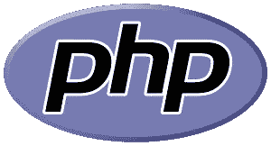

# 通过 Node.js、Ruby、Python、PHP、C#和 Java 中的 REPL 驱动开发开始探索 SDK

> 原文：<https://medium.com/square-corner-blog/getting-started-exploring-sdks-with-repl-driven-development-in-node-js-49e6316dc6a0?source=collection_archive---------4----------------------->

> 注意，我们已经行动了！如果您想继续了解 Square 的最新技术内容，请访问我们的新家[https://developer.squareup.com/blog](https://developer.squareup.com/blog)

使用 API 越快越好。SDK 通过提供一个已经编写好的、预先制作好的 API 客户端来帮助加速这个入门过程，这个客户端*只需在你已经在使用的语言中*工作即可。例如， [Square Connect API](https://docs.connect.squareup.com/) 拥有半打语言的 SDK。

那么我们如何探索一个 SDK 呢？一种方法是从文档中获取示例，将它们保存到文件中，然后运行它们。这个过程是可行的，但是您可以通过删除保存到文件的步骤并使用称为 REPL 的东西来减少第一次 API 调用的时间。

如今，许多(如果不是大多数)语言都带有 REPL。每个 Square Connect SDK 语言实际上都附带了一个 REPL！下面我们将快速看一下用各种语言开始 REPL 驱动的开发的例子。如果你已经知道什么是 REPL，并且想直接进入例子，这里有 [**Node.js**](/p/49e6316dc6a0#4fc5) ， [**Ruby**](/p/49e6316dc6a0#9f2d) ， [**Python**](/p/49e6316dc6a0#835e) ， [**PHP**](/p/49e6316dc6a0#1c9b) ， [**CSharp**](/p/49e6316dc6a0#e408) 和 [**Java**](/p/49e6316dc6a0#c466) 的链接。

# 什么是 REPL？

“REPL”是首字母缩写词，代表“读取”、“评估”、“打印”和“循环”您通常从命令行输入 REPL，然后通过文本界面进行交互。REPL 会阅读你输入的内容，直到你按下“回车”键然后，编程语言对您输入的文本进行评估，并将结果打印到屏幕上。然后是循环部分，重新开始读取输入——这样您就有了交互体验。

REPL 让您尝试一段代码，并立即看到结果。它允许您直接在终端中运行代码，并立即看到结果。与将代码保存到文件中，然后用适当的语言手动执行该文件相比，这通常是一种更方便的测试代码的方式。

# **REPL 驱动发展**

首先，让我们确定 REPL 驱动开发(RDD)不是测试驱动开发(TDD)的替代品。RDD 是你可以用来增加你的 TDD 的东西。REPL 是一个探索的地方，然后处理你制造的混乱。您的测试巩固了您从代码中学到的东西，这些代码是为后代保留的。实际上，REPL 对于探索您的测试也非常方便，尤其是在追踪错误的时候。REPL 提供的紧密的、交互式的反馈循环加快了调试代码和测试的速度。

抛弃代码是一件美妙的事情。当你知道你不打算保持这种状态时，它会减轻你的压力，所以你可以去探索。你总是可以用一个你改变并重复运行的文件来做到这一点，但是在文本编辑器和终端之间来回切换需要时间。最后，你必须清理你所做的一切，否则就会留下烂摊子。REPL 让你自由探索并与你的代码互动！

# **REPL 探索 SDKs】**

探索您正在研究的 SDK 是 REPL 的一个很好的用途。它不仅允许您在浏览 API 时尝试各种端点，还允许您自省并询问响应它们能做什么。下面我们将以 Square Connect SDKs 为例，它支持 Ruby、PHP、Python、Node.js、Java 和 CSharp。让我们看看如何使用流行的[家酿](https://brew.sh/)包管理器在 macOS 上为每种语言安装开发环境 REPL。

# **红宝石**


Image by Ruby Visual Identity Team, licensed under [CC BY-SA 2.5](https://creativecommons.org/licenses/by-sa/2.5/deed.en).

虽然 Ruby 已经安装在 macOS 上，但使用 brew 获得最新版本还是不错的:

```
$ brew install ruby
```

我们不需要为 Ruby 安装包管理器，因为`gem`命令是 Ruby 自带的。Ruby 还附带了一个名为`irb`的 REPL。

值得一提的是一种流行的`irb`替代品，叫做`pry`。Conrad Irwin 做了一个很棒的演讲，展示了名为 [REPL 驱动开发和 Pry](https://www.youtube.com/watch?v=D9j_Mf91M0I) 的高级特性。它非常值得一看。

由于 RubyGems 附带了 Ruby，我们可以只安装`square_connect` gem:

```
$ gem install square_connect
```

现在我们已经准备好离开 shell，进入 Ruby REPL，只需输入`irb`:

```
$ irb
irb(main):001:0> ▊
```

这个新的命令行是一个交互式的 Ruby 解释器。从这里我们可以开始使用 Square SDK:

```
irb(main):001:0 require 'square_connect'
=> true
```

以下是从终端实时看到的上述所有步骤:


这样，我们就可以交互式地探索来自 Ruby 的 Square Connect SDK 了！接下来让我们看看如何在其他语言中达到这一点。

# **PHP**



Image by Colin Viebrock, licensed under [CC BY-SA 4.0](https://creativecommons.org/licenses/by-sa/4.0/).

PHP 也随 macOS 一起发布。我们将继续使用 PHP 的 macOS 系统版本，但是我们需要安装一个名为 Composer 的 PHP 包管理器:

```
$ brew install homebrew/php/composer
```

从这里开始，用`composer`安装`square/connect`就很简单了:

```
$ composer require square/connect
```

最后，我们可以进入 PHP 附带的简单 REPL，它需要 Square Connect SDK:

```
$ php -a
Interactive shellphp > require_once('vendor/square/connect/autoload.php');
php > ▊
```

PHP 内置的 REPL 功能不多，所以值得考虑一个替代品，比如 [Boris](https://github.com/borisrepl/boris) 。

# CSharp


我们将使用 Mono 在 macOS 上运行 CSharp。与其他软件包相比，此软件包需要一段时间来安装:

```
$ brew install mono
```

然后我们可以使用`nuget`为 CSharp 安装 Square Connect SDK:

```
$ nuget install Square.Connect
```

单声道配备了 CSharp REPL，因此我们将使用它。我们只需将 REPL 指向刚刚由`nuget`安装的 Square Connect SDK `.dll`:

```
$ csharp -r:Square.Connect.2.5.1.237/lib/net45/Square.Connect.dll
csharp> using Square.Connect;
```

# **Python**


Image by the Python Software Foundation, licensed under [GPL](https://www.gnu.org/licenses/gpl.html).

Python 2 随 macOS 一起发布，但是让我们先来看看 Python 3:

```
$ brew install python3
```

然后我们可以使用 Python `pip`包管理器来安装 Square Connect SDK:

```
$ pip3 install squareconnect
```

Python 还附带了内置的 REPL，所以我们将使用它:

```
$ python3
>>> import squareconnect
```

# **Node.js**


Image by Javacript authors, licensed under [MIT](https://opensource.org/licenses/MIT).

Node.js 没有随 macOS 一起发布，所以让我们从 Homebrew 获取它:

```
$ brew install node
```

然后让我们使用节点的 NPM 包管理器来安装 Square Connect SDK:

```
$ npm install square-connect
```

现在我们准备使用 Node 的内置 REPL:

```
$ node
> const SquareConnect = require('square-connect');
```


# **Java**


与我们今天看到的其他语言不同，Java 安装需要从 Oracle 的网页下载并点击协议进行安装。一旦安装了 Java，我们将需要一个包管理器，所以我们将使用 Maven:

```
brew install maven
```

然后我们可以安装最新版本的 Square Connect SDK:

```
$ mvn dependency:get -Dartifact=com.squareup:connect:RELEASE
```

从 JDK 9 开始，Java 附带了一个名为`jshell`的 REPL。这有点冗长，但是您可以像加载其他 REPLs 一样加载 Square Connect SDK:

```
$ jshell --class-path ~/.m2/repository/com/squareup/connect/2.5.1/connect-2.5.1.jar
jshell> import com.squareup.connect.ApiClient;
```

# **结论**

好吧，这是一个很大的安装！既然我们的 REPLs 和 SDK 包已经安装好了，我们就可以用上述任何一种语言来探索 Square Connect SDK 了。上面的每个 REPLs 都有不同的特性和功能。一些语言附带了很好的 REPL，但通常值得探索替代方法。一些 REPLs 相当简单，而另一些 REPLs 让您可以深入代码，并可用于严肃的调试。当你尝试一门语言或一个 SDK 时，考虑用 REPL 来探索。编码快乐！