# 开始使用 Yeoman 动作生成器构建动作

> 原文：<https://medium.com/google-developer-experts/getting-started-to-build-your-actions-with-yeoman-action-generator-5ea63098e078?source=collection_archive---------0----------------------->

我在本文中向您介绍了 Yeoman 动作生成器。

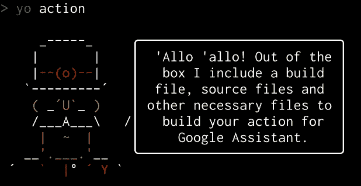

目前，谷歌助手的生态系统正在稳步成长。当然，有一个开发环境来构建动作，因此开发人员可以构建自己的动作来扩展 Google Assistant 的功能。该平台名为“谷歌行动”。

当您构建动作时，实际上您需要编写一个代码来与用户和您的动作进行交互。该代码被称为“履行”。Google 上的 Actions 将用户请求发送到您的 HTTP 上的实现代码，并期待 HTTP 响应，其中包含为用户做出响应的短语。有必要通过实现代码来处理 JSON 请求/响应，但是格式有点复杂。Google Client Library 上的动作有能力处理它们，因此开发人员可以使用 SDK 轻松编写实现代码。

在我写这篇文章的时候，有两个官方 SDK:

*   [对 NodeJS 的 Google 客户端库的操作](https://github.com/actions-on-google/actions-on-google-nodejs)
*   [对谷歌 Java 客户端库的操作](https://github.com/actions-on-google/actions-on-google-java)

要使用它们，您需要准备一个开发环境。例如，安装 NodeJS 或 Java 开发工具包，编写您反复编写的构建脚本和初始代码，配置您的项目以部署每个云服务，等等。但是，这些代码集对于所有项目来说几乎是相同的。

当您开始构建您的操作时，您应该能够通过简单的方式获得代码集。

今天，您可以使用 Yeoman 动作生成器自动生成代码集。您的代码集是在您回答一些问题后由生成器生成的。基本上，生成的代码集是没有任何接触的工作。也就是说，您可以将其快速部署到您选择的云服务。

# 支持的操作类型、云服务和语言

在当前版本中，生成器支持以下功能:

*   **动作类型:**动作 SDK 和 Dialogflow。
*   **云服务:** Firebase 函数、Google Cloud 函数和 Google AppEngine。
*   **语言:** JavaScript，TypeScript，Java。

```
? Which type do you want to use for your action? (Use arrow keys)
> Actions SDK 
  Dialogflow? Which cloud service do you want to deploy for your action? (Use arrow keys)
> Firebase Functions 
  Google Cloud Functions 
  Google AppEngine? Which language do you want to use for your action? (Use arrow keys)
> JavaScript 
  TypeScript
  Java
```

您可以选择每个选项来生成您的操作。但是，实际上有如下一些限制:

*   **Firebase 函数，Google Cloud 函数:** JavaScript 或 TypeScript。
*   **谷歌 AppEngine:** 仅限 Java。

根据您对操作类型的选择，生成的源代码会发生变化。此外，如果选择了 Actions SDK，则会创建一个`action.json`文件来注册您的操作包。

# 如何安装

您可以使用以下命令安装 Yeoman 动作生成器:

```
$ npm install -g yo generator-action
```

请注意，在安装它们之前，您需要安装 NodeJS 8 或更高版本。

# Actions SDK、Google Cloud 函数和 TypeScript

在这里，我将介绍一个用例，以便您可以了解如何使用这个生成器。

作为第一种情况，我们尝试使用 Actions SDK 生成由 TypeScript 编写的操作，以部署到 Google Cloud 功能。我们假设动作的名称是“Hello world”。

## 先决条件

在创建操作之前，您需要安装以下软件:

*   NodeJS 8 或更高。
*   [谷歌云 SDK](https://cloud.google.com/sdk/docs/)

此外，您需要使用以下命令更新并安装测试版:

```
$ gcloud components update && gcloud components install beta
```

## 创建 AoG 项目

要为 Google Assistant 创建一个动作，需要在 Google 上创建一个新的 Actions 项目(AoG)。访问谷歌控制台上的[动作，点击`Add/import project`按钮。](https://console.actions.google.com/)

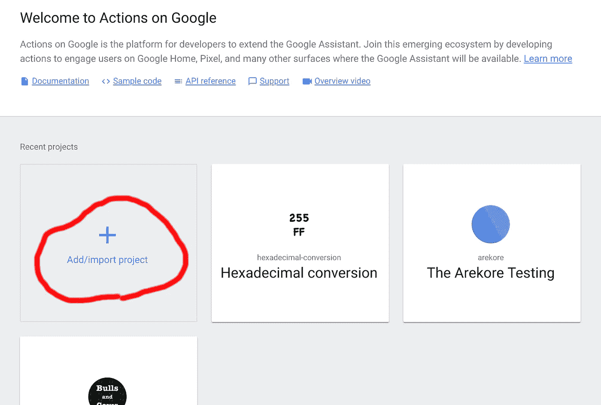

谷歌控制台上的操作会询问你姓名、语言和国家。您填写每个字段，然后点击`CREATE PROJECT`按钮。

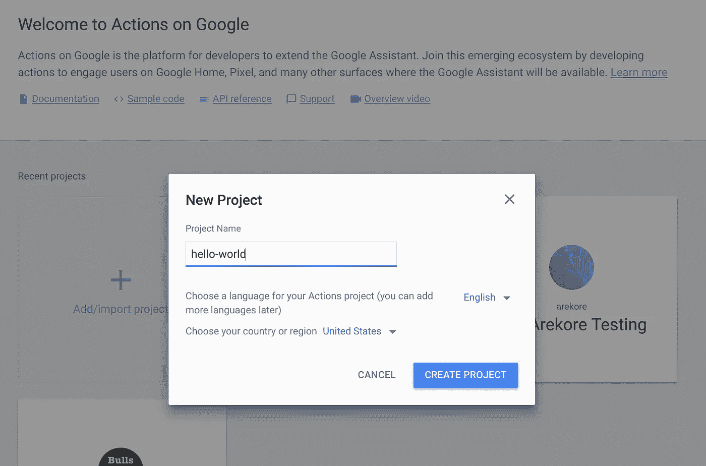

在下一页，点击`Actions SDK`按钮。另外，点击下一个弹出窗口上的`OK`按钮。

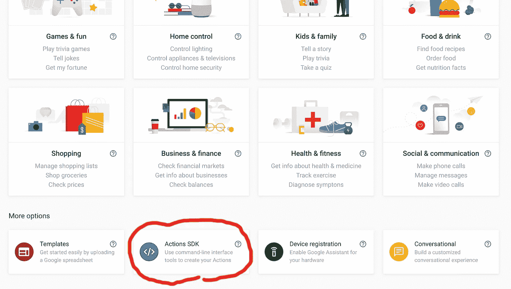

您需要获得刚才创建的项目 ID。点击齿轮图标，然后点击`Project settings`菜单项。

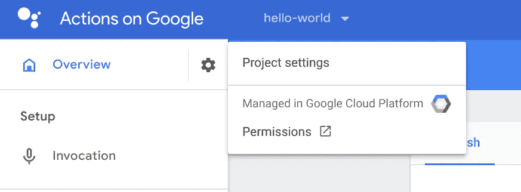

您应该在项目设置页面上看到`Project ID`值。留着吧。

## 下载 gactions 命令

要在谷歌上注册你的动作，需要一个`gactions`命令。您可以从以下页面下载:

[](https://developers.google.com/actions/tools/gactions-cli) [## gactions CLI |对 Google 的操作| Google 开发者

### 要使用 update 参数，必须使用操作的项目 ID。您可以通过点击设置获得您的项目 ID…

developers.google.com](https://developers.google.com/actions/tools/gactions-cli) 

下载它，并将命令文件放在 PATH 环境中包含的某个目录下。

## 使用约曼动作生成器生成文件

现在，让我们生成您的项目文件！在您的终端中，执行以下命令:

```
$ mkdir hello-world
$ cd hello-world
$ yo action
```

您看到了来自生成器的欢迎消息，同时，生成器提出了第一个问题。

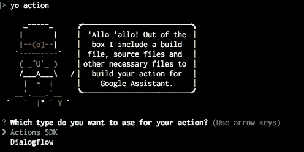

选择`Actions SDK`。然后，生成器会询问您想要使用的云服务。

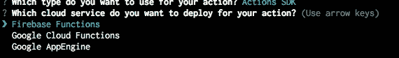

选择`Google Cloud Functions`。接下来，生成器会询问您希望使用哪种语言来编写实现代码。

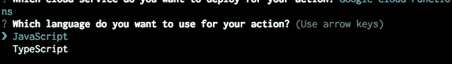

作为最后一个问题，生成器会询问您项目 ID。

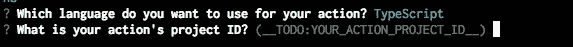

键入上一步保留的`project ID`。

如果已经有了`yarn`，生成器生成文件，并执行命令`yarn install`来安装依赖项。

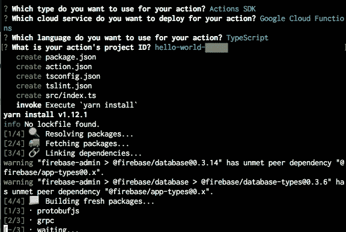

在生成文件和安装依赖项之后，您应该会看到如下结束消息:

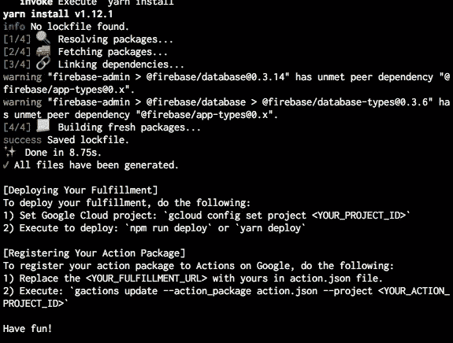

哇！你有了新的代码集！

## 部署您的履行代码

您现在得到的代码集无需任何接触即可工作。也就是说，您可以部署代码。执行以下命令:

```
$ gcloud config set project <YOUR_PROJECT_ID>
$ yarn deploy
```

如果你用的是`npm`，你可以用`npm run deploy`代替纱线。实际上，`yarn deploy`命令运行两个任务:构建 TypeScript 编写的代码，用`gcloud`命令部署到 Google 云平台。如果部署成功，您将看到如下输出:

```
Created .gcloudignore file. See `gcloud topic gcloudignore` for details.
Deploying function (may take a while - up to 2 minutes)...done.                               
availableMemoryMb: 256
entryPoint: fulfillment
httpsTrigger:
  url: https://us-central1-hello-world-*****.cloudfunctions.net/fulfillment
labels:
  deployment-tool: cli-gcloud
name: projects/hello-world-*****/locations/us-central1/functions/fulfillment
runtime: nodejs8
serviceAccountEmail: hello-world-*****@appspot.gserviceaccount.com
sourceUploadUrl: https://storage.googleapis.com/gcf-upload-us-central1-12643551-0839-****-****-3518bb26eda4/77dea571-****-****-b69a-924ffecff74f.zip?GoogleAccessId=service-414****89196@gcf-admin-robot.iam.gserviceaccount.com&Expires=1552270433&Signature=EoZWuBug06v8036umcw1O4BpJYOETvYA%2BZrg9aMhe7H5EkD8Hi%2FYnH%2FO0B%2B3mGEKR1tlNSAfsSVU8MN9lcE9FvO3U0JZLfFTj4sUyaz6A%2BTY0E%2F6lPfGv%2FsCzvOB74fU5zxWDbgH4f9jq1PWZNqjd0lIyZciNXD9E%2BWi4...
status: ACTIVE
timeout: 60s
updateTime: '2019-03-11T01:50:29Z'
versionId: '1'
```

在上面的输出中，`httpsTrigger:url`很重要。

## 注册您的行动包

您已经有一个名为`action.json`的动作包文件。但是，您需要编辑该文件。用您喜欢的文本编辑器打开`action.json`文件。

```
{
  "actions": [
    {
      "name": "MAIN",
      "fulfillment": {
        "conversationName": "myFulfillment"
      },
      "intent": {
        "name": "actions.intent.MAIN"
      }
    }
  ],
  "conversations": {
    "myFulfillment": {
      "name": "myFulfillment",
      "url": "<YOUR_FULFILLMENT_URL>",
      "fulfillmentApiVersion": 2
    }
  },
  "locale": "en"
}
```

“conversation.myFulfillment.url”里有`<YOUR_FULFILLMENT_URL>`。将占位符替换为您刚才部署的履行代码的 URL。然后，执行以下命令:

```
$ yarn update-action
```

如果成功，您将看到如下输出:

```
Your app for the Assistant for project hello-world-***** was successfully updated with your actions. Visit the Actions on Google console to finish registering your app and submit it for review at https://console.actions.google.com/project/hello-world-*****/overview
```

## 测试您的行动

在 Google 控制台上打开 Actions，并选择您的行动项目。然后，点击左侧导航菜单上的`Simulator`菜单项。

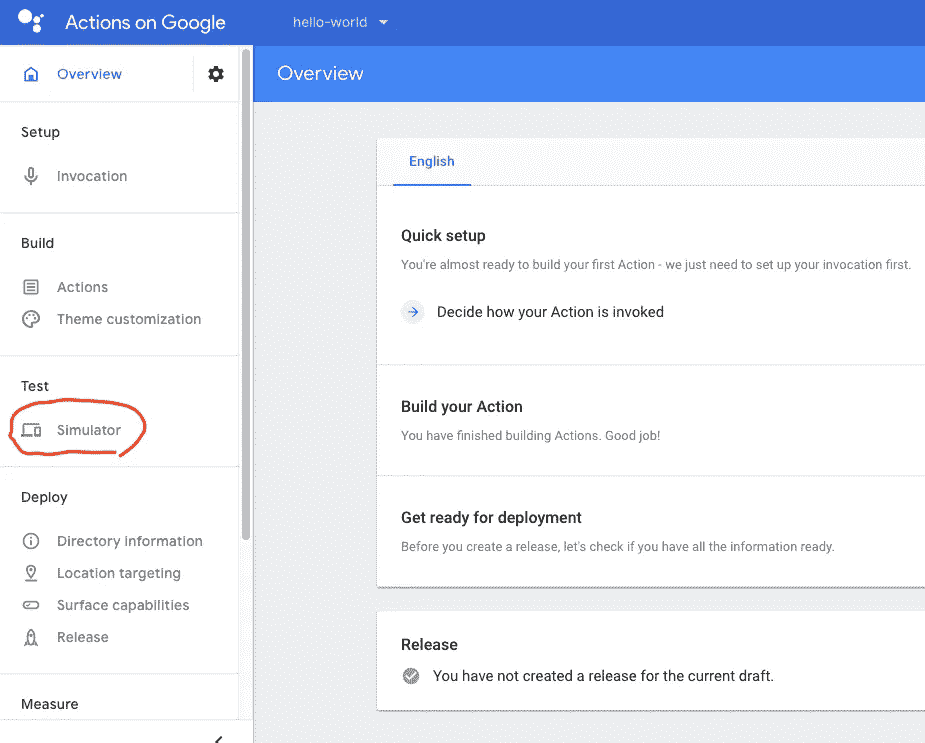

动作模拟器打开。您可以使用短语“与我的测试应用程序对话”来调用您的操作。

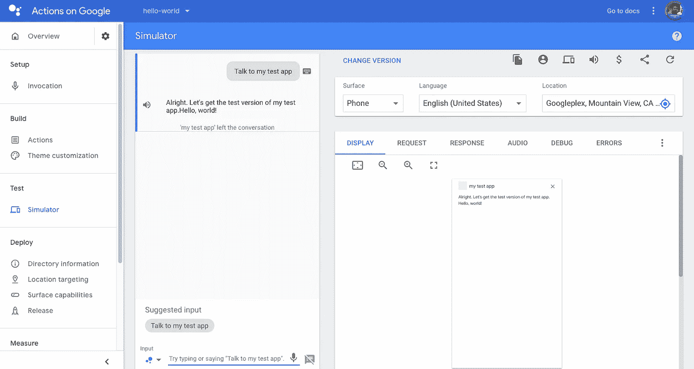

太好了！我们可以确认行动奏效了。

## 生成器生成了什么文件？

生成后，您将拥有以下文件:

```
hello-world
├── action.json      - Action Package file.
├── node_modules     - Generated by `yarn install`.
├── package.json     - Node project file.
├── src
│   └── index.ts     - The fulfillment code.
├── tsconfig.json    - For TypeScript.
├── tslint.json      - For TypeScript.
└── yarn.lock        - Generated by `yarn install`.
```

当前版本为 0.2.7，以下代码是由生成器为履行代码创建的:

```
import * as functions from 'firebase-functions';
import { actionssdk } from 'actions-on-google';const app = actionssdk({
  debug: true
});app.intent('actions.intent.MAIN', (conv): void => {
  conv.close('Hello, world!');
});exports.fulfillment = functions.https.onRequest(app);
```

也就是说，它是一个简单的“Hello，world”程序。我认为这是建立你的行动的一个好的起点。

# 结论

约曼行动生成器项目已经在 GitHub 上托管。

[](https://github.com/yoichiro/generator-action) [## 洋一郎/发电机-动作

### 谷歌助理的行动实现代码项目约曼发电机。-洋一郎/发电机-动作

github.com](https://github.com/yoichiro/generator-action) 

我打算为 Azure 和 etc 添加其他支持。此外，我认为有必要生成具有其他功能的代码:登录、交易、i18n 等等，而不仅仅是简单的“Hello，world”输出。

我希望你可以用生成器更容易地构建你的动作。请随时告诉我你改进发电机的想法！