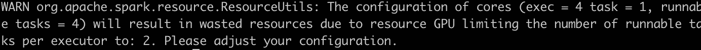
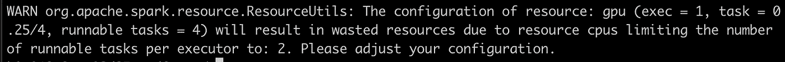
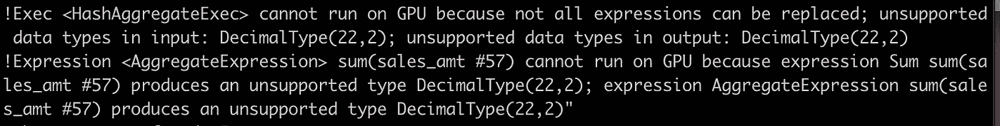

# Apache Spark + GPU + RAPIDS 入门(第一部分)

> 原文：<https://medium.com/walmartglobaltech/getting-started-with-apache-spark-gpu-rapids-part-i-938664771092?source=collection_archive---------0----------------------->

**先决条件:**本文假设读者了解 Spark 3.0 的架构和设置，并且已经使用过 Spark 2.0。

Spark 3.0 版本增加了一个新特性，使用 RAPIDS 库在 GPU 上运行 Spark 工作负载。该功能将帮助数据科学家/数据工程师使用单一工具创建从 ETL(提取转换负载)/ELT(提取负载转换)到模型训练的单一管道。这个特性的主要优点是 Spark 可以在 CPU 和 GPU 之间无缝切换处理。下一段中的概念验证(PoC)细节旨在帮助您启动 Apache Spark + GPU + RAPIDS 之旅，在我的案例中，我在基于 GCP (Google 云平台)的 Spark 3.0 Dataproc 集群上执行了 PoC，该集群运行 Dataproc 2.0.7、CUDA 10.2、RAPIDS 0.18 和 Spark RAPIDS 0.4.1。相同的 PoC 可以在任何其他云平台上试用。关于本文的一个标注——它完全基于 Spark 3.0 的数据工程观点。

第一步是启用 RAPIDS 库。在将 **spark.rapids.sql.enabled** 设置为 **true** 之后，我们将指示 spark 利用底层 GPU 进行处理，只要有在 GPU 上运行特定指令的选项。GPU 不支持的指令将自动退回到 CPU 进行处理。将 **spark.rapids.sql.enabled** 设置为 false 将只在 CPU 上运行您的指令。
在本文的后面，我将举例说明如何检查哪个部分在 GPU 上执行，哪个部分在 CPU 上执行。

既然我们已经知道了如何在 GPU 上启用 Spark，那么让我们来看看一些可以用来优化处理的重要配置参数。

**spark . task . resource . gpu . amount**:设置每个任务的 GPU 资源量

**spark . rapids . SQL . concurrentgputasks**:设置并发 GPU 任务的数量

**spark . executor . resource . gpu . amount**:设置每个执行器的 GPU 数量

理想情况下，CPU 上的并行度应该等于 GPU 上的并行度，这样才不会浪费资源-

> **GPU 并行度**= spark . executor . resource . GPU . amount/spark . task . resource . GPU . amount
> 
> **CPU 并行度**= spark . executor . cores/spark . task . CPU

让我们用一个例子来理解这一点，

假设，我们有 4 个核心 CPU 连接到一个 GPU。有三种可能的情况，让我们从第一种情况开始，使用带有运行时配置的 spark-shell 运行每一种情况，同样可以使用配置文件设置来实现:

**GPU 并行度= CPU 并行度**

> 火花壳
> 
> — — conf spark.executor.cores=4
> 
> ——conf spark . task . resource . GPU . amount = . 25
> 
> ——conf spark . task . CPU = 1
> 
> ——conf spark . executor . instances = 4
> 
> ——conf spark . executor . resource . GPU . amount = 1

这是理想情况，Spark 启动时没有任何警告消息，因为 4/1 = 1/.25

**GPU 并行< CPU 并行**

> 火花壳
> 
> — — conf spark.executor.cores=4
> 
> ——conf spark . task . resource . GPU . amount = . 5
> 
> ——conf spark . task . CPU = 1
> 
> ——conf spark . executor . instances = 4
> 
> ——conf spark . executor . resource . GPU . amount = 1

1 / .5 ( **GPU 并行** ) < 4 / 1 ( **CPU 并行**)

> 火花壳
> 
> — — conf spark.executor.cores=4
> 
> ——conf spark . task . resource . GPU . amount = . 25
> 
> ——conf spark . task . CPU = 2
> 
> ——conf spark . executor . instances = 4
> 
> ——conf spark . executor . resource . GPU . amount = 1

> 1 / .25 ( **GPU 并行** ) > 4 / 2 ( **CPU 并行**)

请注意，将**spark . rapids . SQL . concurrentgputasks**设置为更高的值会导致内存不足错误或性能下降，通常该值应该在 2 到 4 之间。

现在我们已经了解了在 Spark 上运行应用程序所需的基本配置，让我们看看如何检查 SQL 的哪一部分阻塞了要在 GPU 上执行的指令。

**spark . rapids . SQL . explain**将输入作为 ALL/NONE/NOT_ON_GPU 之一

设置 spark . rapids . SQL . explain = NOT _ ON _ GPU 将导致打印所有这些不能在 GPU 上执行的指令。

到目前为止，GPU 还不支持各种操作/数据类型，其中一个例子是支持十进制数据类型，在撰写本文时，CPU 上的 Spark 支持 128 位精度，而 GPU 上的 Spark 支持高达 64 位精度(高达十进制(18，x))。因此，即使您的操作是在 Decimal(9，2)和 Decimal(12，6)的属性之间执行的，Spark inserts **也会提升 Precision** 将值转换为 compute 而不会溢出。因为结果可能是十进制的(19，8)，并且因为它在 GPU 上不受支持，所以计算将在 CPU 上执行。

让我们举一个例子，sales_yrly 表包含年销售额，属性 sales_amt 定义为 decimal(12，2)

> Scala > spark . conf . set(" spark . rapids . SQL . explain "，" NOT _ ON _ GPU ")；
> 
> Scala > spark . SQL(" explain select sum(sales _ AMT)from sales _ yrly ")

您可以在下面的截图中看到，当我们启用“NOT_ON_GPU”时，无法在 GPU 上运行的操作已在解释计划中突出显示

在开始 Spark on RAPIDS 之旅之前，预先检查哪些运营商受支持，哪些不受支持将是有益的。所有这些操作在官方文档页面上都有很好的描述。

这标志着本文第一部分的结束，在下一篇文章中，我们将更深入地研究 Dag，以了解 Spark 3.0 中的操作是如何执行的。

# 参考资料:

[*https://nvidia.github.io/spark-rapids/*](https://nvidia.github.io/spark-rapids/)