# Azure DevOps 管道入门

> 原文：<https://medium.com/version-1/getting-started-with-azure-devops-pipelines-84993ee9d261?source=collection_archive---------3----------------------->

Photo by [Christopher Gower](https://unsplash.com/@cgower?utm_source=medium&utm_medium=referral) on [Unsplash](https://unsplash.com?utm_source=medium&utm_medium=referral)

Azure DevOps Pipelines 是一项基于云的服务，旨在加快和简化 DevOps 任务——持续集成(CI)和持续交付(CD)。该平台允许持续构建、测试和部署到任何平台和云服务。它适用于任何编程语言和项目类型。Azure Pipelines 通过提供一种快速简单的方法来自动化 CI/CD 流程，有助于建立用户容易获得的高质量代码和一致性。

**为什么要用 Azure DevOps 管道？**

适用于任何语言或平台

同时部署到不同类型的目标

与 Azure 部署集成

在 Windows、Linux 或 Mac 计算机上构建

与 GitHub 集成

使用开源项目。

**让我们建立一个简单的管道**

为了演示，让我们举一个简单的例子。我们将看到如何为一个简单的 python 应用程序获取代码，构建 docker 映像，并使用 Azure DevOps 管道将其推送到现有的 Azure 容器注册中心。

我们希望将图像推送到名为“TestContainerRegistryN”的容器注册表中。目前，它不包含任何存储库。

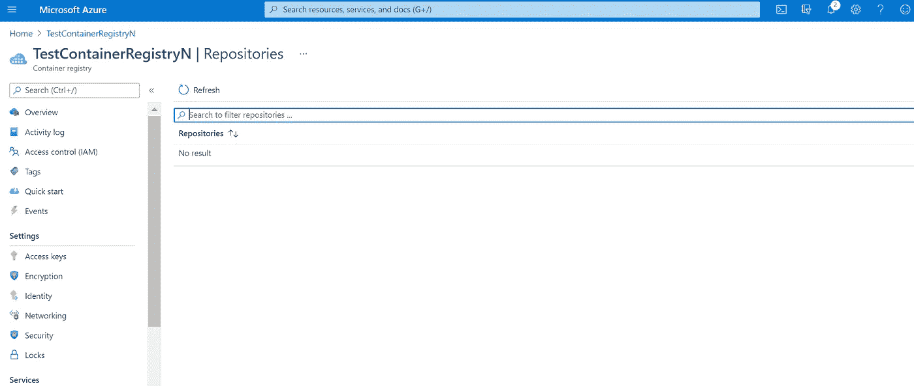

**一些先决条件:**

Microsoft Azure 帐户

Azure 订阅

**创建 Azure DevOps 管道:**

***第一步*** :登录 Azure 云门户，搜索“Azure DevOps organization”。从下面的建议中点击相同的。

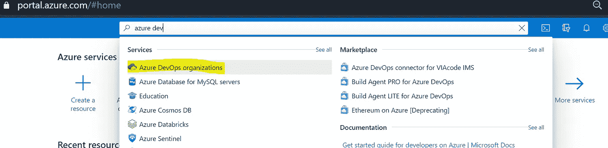

***第二步:*** 在组织下创建一个组织和项目。

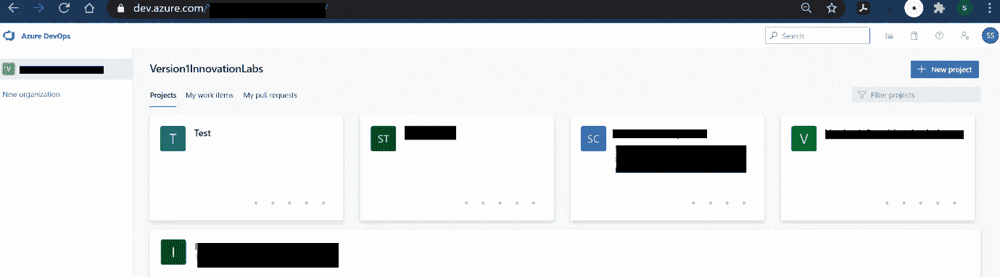

***第三步:*** 点击项目。它将显示如下:

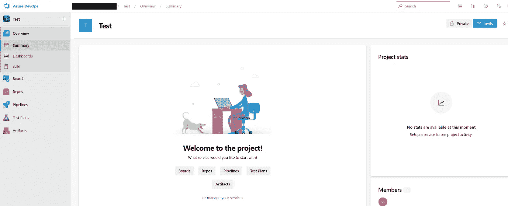

***第四步:*** 点击回购。要么导入您的代码 Git，要么将您的代码从本地推送到 Repo。您可以根据需要在一个项目下创建多个回购。

应用程序的代码被添加到测试报告下，如下所示。

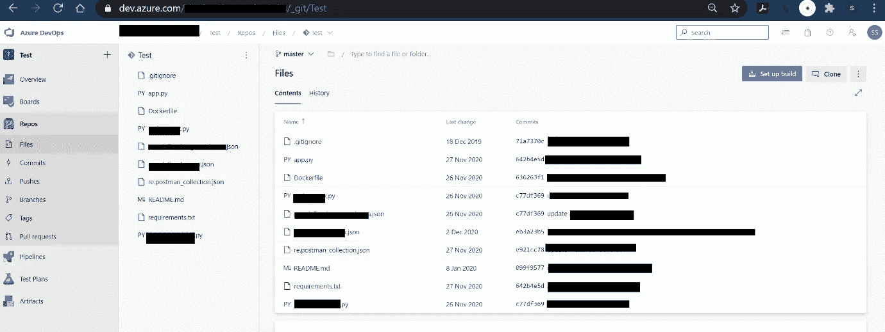

***第五步:*** 新建一个构建管道。

单击管道。

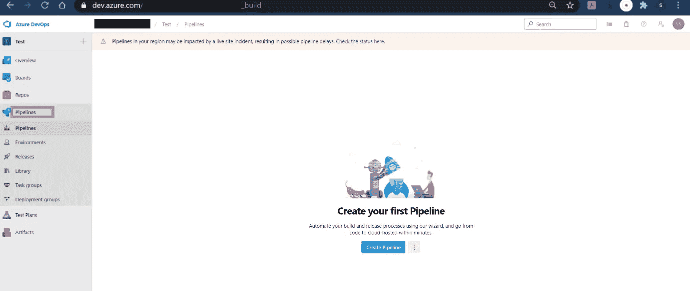

点击创建管道。点击使用经典编辑器选项。

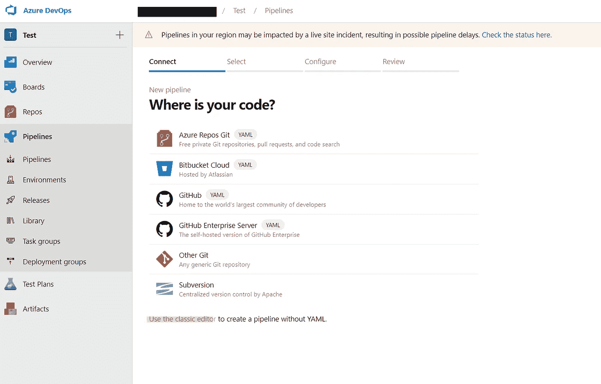

因为，我们的代码被推送到 Azure Repos，选择 Azure Repos Git 选项，并选择正确的存储库和分支。然后点击继续。

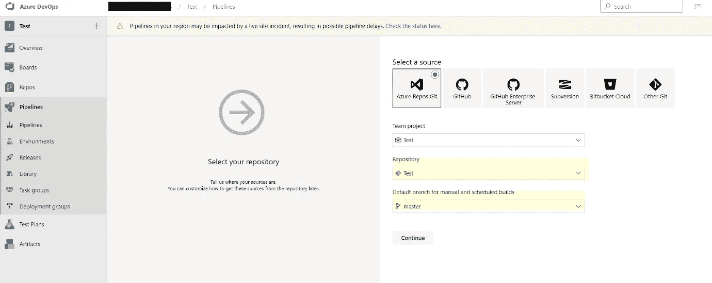

在下一个阶段，在搜索栏中键入 docker，然后选择模板“Docker 容器”。

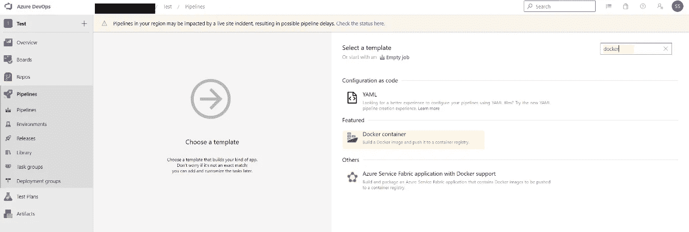

单击应用。

第一个任务是建立一个形象。选择 Azure 订阅和容器注册表(您希望将 Docker 映像推送到那里)。此外，提及存储库中 Dockerfile 文件的位置和所需的映像名称。

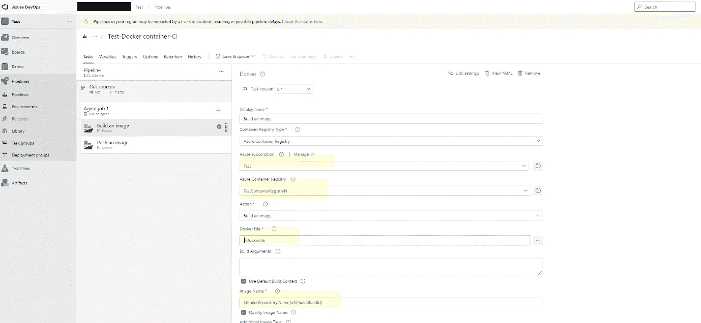

点击下一个任务—推送图像。

再次选择 Azure 订阅、所需的容器注册中心和图像名称。请记住，要保持与上一步相同的图像名称。

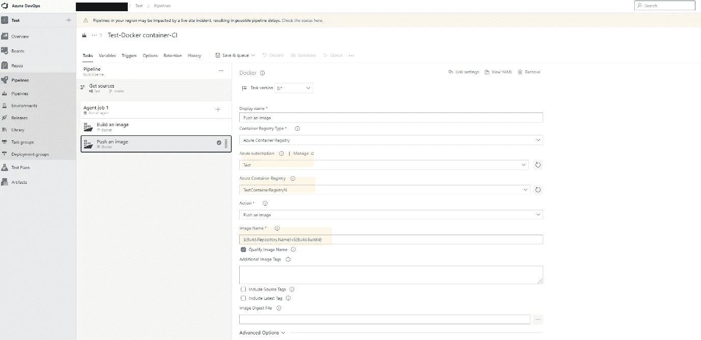

现在，点击保存和排队。

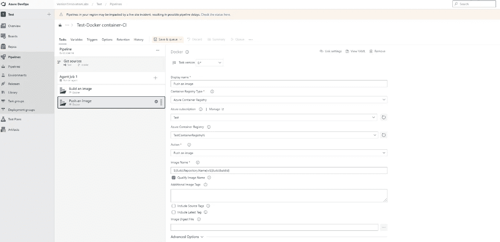

现在点击保存并运行。

您现在可以看到管道正在排队等待执行，很快它就进入了运行阶段。

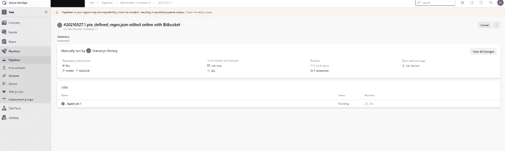

您还可以通过单击代理作业 1 来查看日志以检查任何错误。

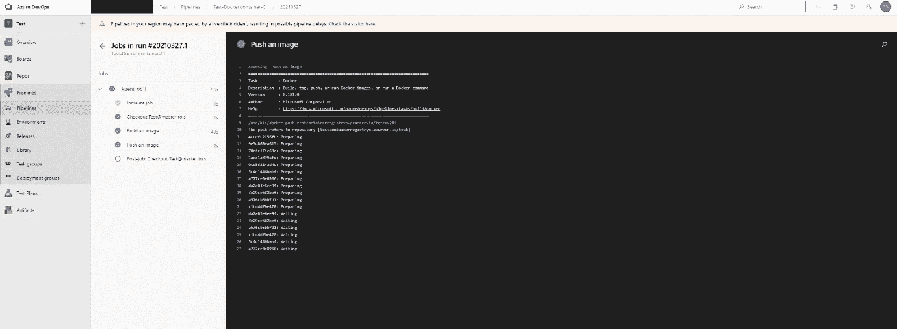

一旦所有阶段都完成了，您会看到一个绿色的勾号，这表示管道已经成功执行。docker 映像必须被推送到 Azure 容器注册中心。

让我们检查一下。瞧啊。！它在那里。

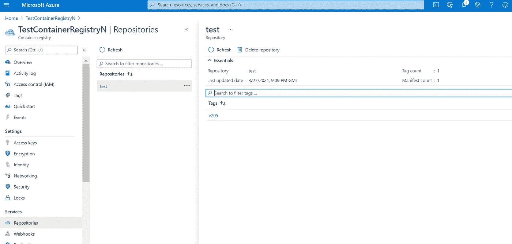

这是一个小用例，展示了如何在 Azure DevOps 管道中创建管道。您还可以轻松地启用持续集成，这意味着，每次进行更改并将其推送到代码存储库时，这个管道都会自动触发。

在 medium 上关注我，并继续关注我在 Azure DevOps 管道上的未来帖子。

# 关于作者

Sharanya Shenoy 是 Version 1 的助理顾问，自 3 月 19 日以来一直在创新实验室工作，利用多项颠覆性技术进行创新。作为数据科学的研究生，Sharanya 的主要关注领域是机器学习和人工智能。