# 云中业务流程管理入门

> 原文：<https://medium.com/oracledevs/getting-started-with-business-process-management-in-the-cloud-d78f73aa5c37?source=collection_archive---------1----------------------->

> 最初由 [Andreas Chatziantoniou](https://twitter.com/magicchatzi) 于 2016 年 11 月 11 日发布。要了解更多最新的入门知识，[查看官方文档](https://docs.oracle.com/en/cloud/paas/process-cloud/index.html)。

来自业务流程管理(BPM)环境的 Oracle Process Cloud Service (PCS)在外观和感觉上都与众不同，并且具有许多可能被忽视的优点。本文展示了如何发现 PC 的潜力，并在您的项目中很好地利用它。

# 我们生活的世界

多年来，预算已经从 IT 部门转移到业务部门。这导致了一种情况，我们遇到“公民开发者”，典型的商业用户(至少在理论上)编写他们自己的应用程序。

因为现在许多服务都驻留在云中，这些公民开发人员可以立即开始，而不需要等待 it 部门几周时间来配置系统。这些云服务可以立即访问，并为小型企业应用程序的快速发布提供了一个易于使用的开发环境。

因此，让我们来看看一个公民开发者如何使用电脑。

# 界面

与所有 Oracle 云服务一样，首次登录您的域时，您会看到一个有点技术性的仪表盘。这绝对是针对开发者和云管理员的。

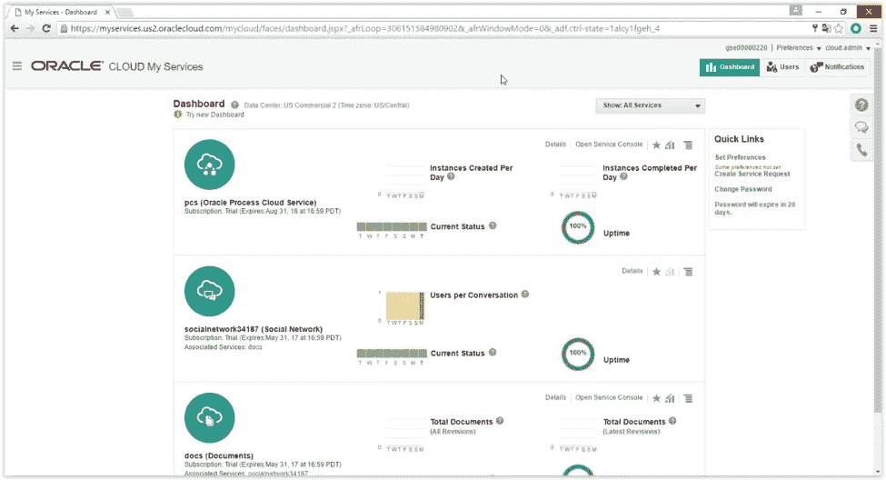

**图 1:云服务仪表板**

对于与典型的 Oracle 企业管理器云控制打过交道的人来说，这当然看起来很轻松。请记住，我们不是——我重复一遍:不是——在管理云环境。您在这里看到的就是您需要看到的—正常运行时间和实例/对话/文档的数量，等等。—组成您的云服务。

在我看来，这个网站的重要特征隐藏在右上角:

*   仪表板(参见图 1)
*   用户
*   通知

我们稍后将回到这些。

普通的公民开发人员(或 C.DEV)会喜欢 PC，因为它不杂乱，而且在一定程度上，没有精通 it 的东西。

从这里点击云服务的服务控制台，将我们带到 C 级。DEV 希望看到:

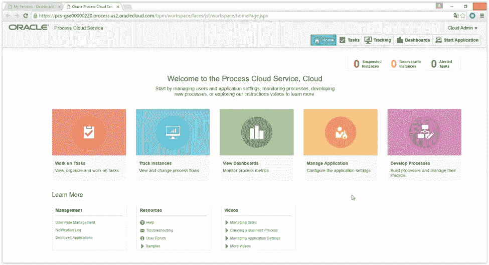

**图 2: PCS 控制台**

这种界面比我们已经习惯的更像智能手机应用程序。请注意，我们是作为云管理员登录的，因此我们可以查看和访问所有内容。普通用户的视野有限。

第一步是开发我们的第一个 PCS 流程。点击图标会将 C.DEV 带到 PCS Composer。

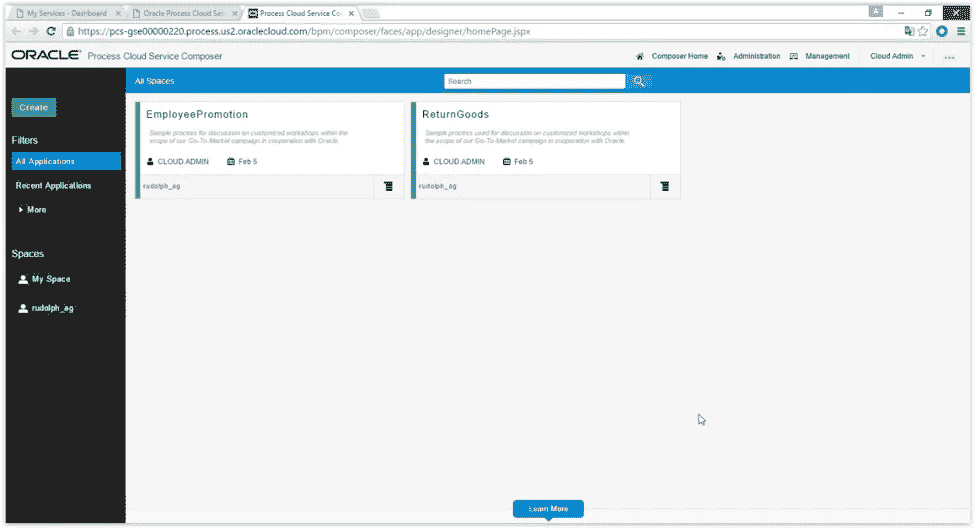

**图 3: PCS Composer**

它看起来仍然非常基础，但这就是云服务的概念:只展示你可以在这里做的事情，而不是所有可能的事情。再次注意“好东西”隐藏在右上角。

创建流程非常简单:只需点击 **Create** 按钮。(如果您已经这样做了，请单击您的应用程序并继续工作。)

许多开发活动都有向导方法，用对话框来指导您。虽然这有利于快速启动，但我们仍然需要评估它对大型项目团队和复杂环境是否有用。这也给了我们一个很好的想法，PC 的第一个用例是什么:将现有的系统粘在一起以得到一个急需的报告，或者在部门级别上描述面向过程的工作。

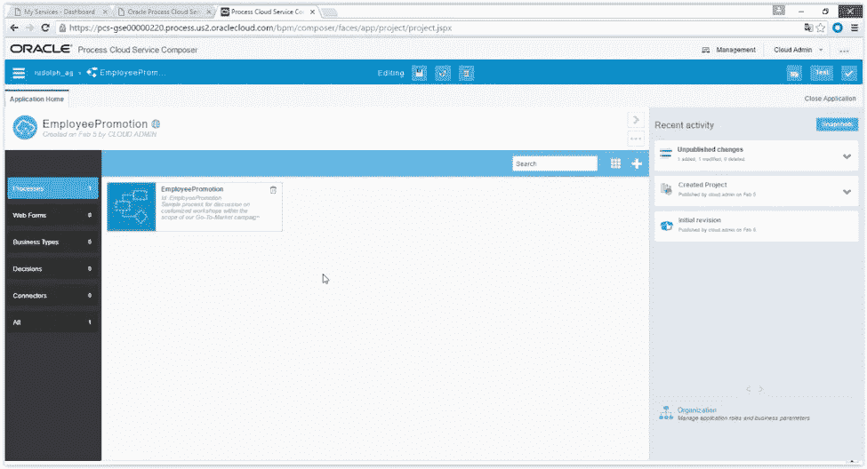

**图 4:创建一个流程**

从这里，我们可以设计流程或做其他有趣的事情，如创建 Web 表单(非常方便地输入流程所需的信息)或描述连接器，我们将需要它们来与其他系统或服务进行交互。

# 流程设计者

现在我们的 C.DEV 将设计一点流程。

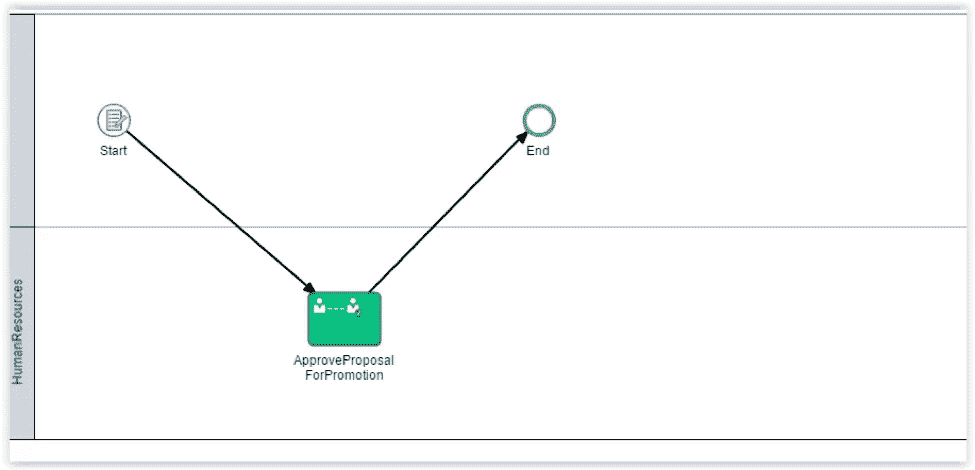

**图 5:流程编辑器**

这里我们有一个非常简单的过程，通过显示一个 Web 表单来执行开始。泳道**人力资源部**的人需要批准这个提议。对于 C.DEV 来说，这是非常自然的，因为他对过程的大部分观点都集中在批准、审查和自助服务上。与普通企业级应用程序的不同之处在于，并不是每一个微小的细节都需要在一开始就存在。敏捷性是 C.DEV 的“银弹”。涵盖最初的步骤，并在每次需要时添加一点。

PCS Composer 的一侧有一个调色板，其中包含一些可能性(不像您可能习惯于 BPM 中的那样多):

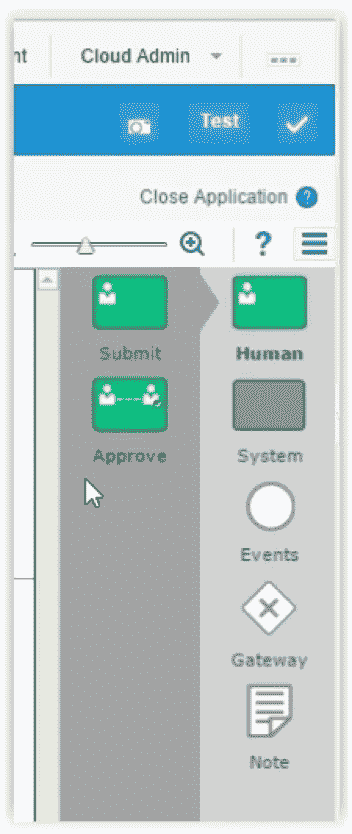

**图 6:作曲调色板**

有了这个，你就可以为你的过程建立良好的流程。员工晋升的一个例子是新员工获得一台计算机的子流程:

**图 7:员工晋升流程**

显然，必要的 BPM 特性，如子流程、网关和服务都存在。PCS 最大的潜力之一就在于此:能够轻松地将新流程添加到现有流程中。想象一下，启动了员工晋升流程，然后经过一个试点阶段，扩展到其他部门。如上例所示，被提升的员工可以订购一台新电脑。添加这一功能就像从其他部门提供服务一样简单(例如，当员工有资格获得公司汽车时进行车队管理，工厂管理人员打印带有新头衔的新名片，等等)。

在 Web 表单创建方面，呈现了一个非常直观且易于使用的界面。所以我们的 C.DEV 从最简单的格式开始，依赖于每个人都能理解的值。没有复杂的数据结构，但有日常数据值(员工姓名、员工级别、计算机)，甚至会填充一些预定义的值，如下所示:

**图 8:网页表单**

通过拖放功能，C.DEV 可以轻松地构建 Web 表单，为 PC 输入数据。众所周知的构建模块，如文本字段、日历功能或下拉菜单，都可以插入到 Web 表单中。

Web 表单将在后台用于填充业务对象和数据对象，这些对象将在流程的执行中使用。下面是一个创建业务对象的示例:

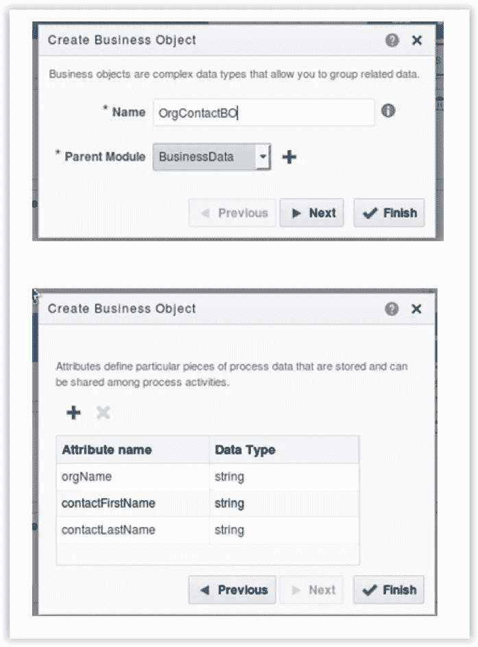

**图 9:创建一个业务对象**

在 PCS 流程中，Web 表单可以提供输入方法(例如，文本字段)来获取数据并将其添加到业务对象中。在上面的例子中，将创建一个 Web 表单，并将业务对象添加到其中:

**图 10:添加一个业务对象**

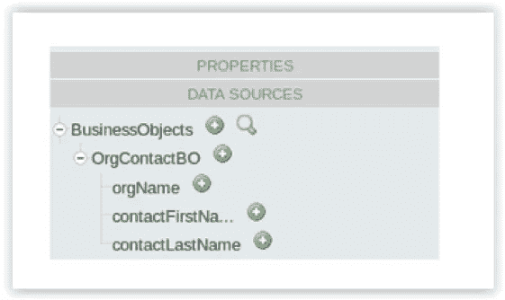

**图 11:选择业务对象**

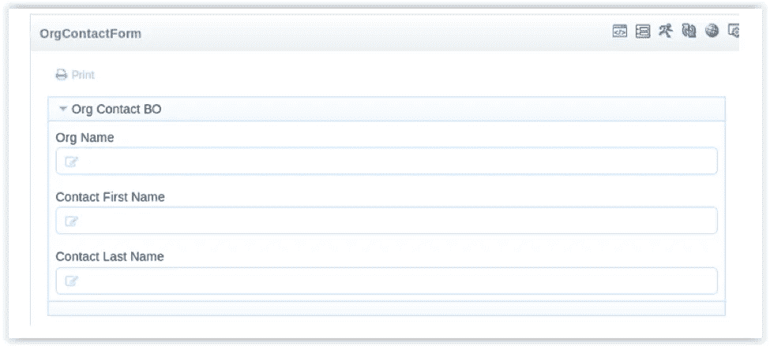

**图 12:网络表单**

使用这样的工具，即使是业务分析师也可以成为 C.DEV 并创建有用的流程。

在流程的创建过程中，首先对流程建模是非常方便的。建模是指绘制和描述流程，而不直接关注底层业务和数据对象。这样做的理由是留在建模者的世界里。这通常是知道过程但不知道所有相关数据的所有本质细节的人。

这给我们带来了 PCS 的另一个好处:C.DEV 可以很容易地创建一个应用程序(过程),并将实现留给知道如何处理数据和访问后端系统等的同事。

为了仅对流程建模，有必要将流程活动置于草稿模式。在每个活动属性页面中，您会发现一个**是草稿**复选框。激活时，验证过程不会检查所有业务类型和数据对象是否正确。

**图 13:“是草稿”选项**

此时，我们有一个可以部署的流程(可能还有一些业务类型和数据对象)。

# 让这个过程进入现实世界

要部署应用程序(流程)，需要使用另一种向导方法。

**图 14:定位应用程序**

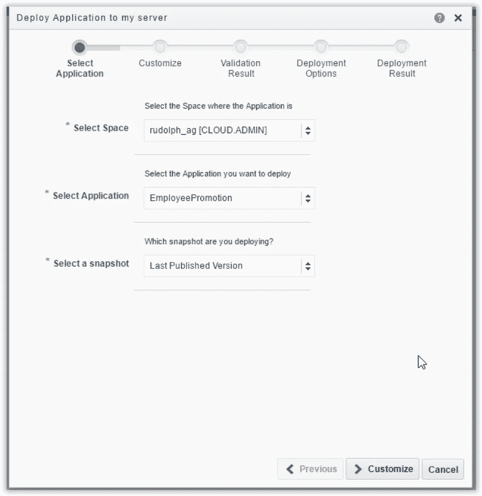

**图 15:选择应用**

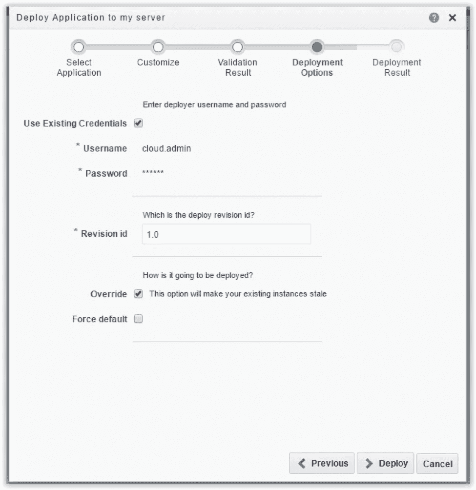

**图 16:部署选项**

现在可以使用该流程了。从 C.DEV 的角度来看，这是非常有价值的，因为这种部署通常由 IT 部门完成。但是因为基础设施在云中，它几乎是即时可用的。困难的技术问题现在被封装并且不可见，允许 C.DEV 部署应用程序。

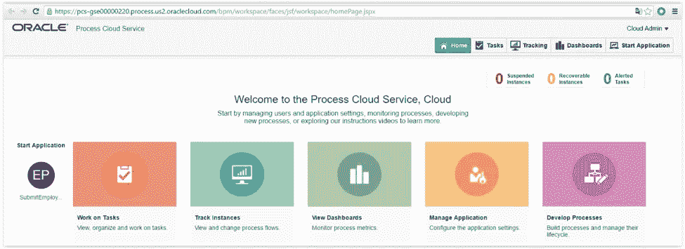

**图 17:仪表板中的员工晋升申请(EP)**

该应用程序显示在仪表板中(可以根据您的需要进行定制)。现在可以启动应用程序并输入值。

使用附加功能(查看任务、跟踪任务和仪表板)也提供了一些类似管理的可能性(例如，当任务未完成时，它会显示在任务列表中)。跟踪可以让你看到为什么一个过程没有完成，或者它在等待什么，等等。

回到我们的任务，我们打开一个实例化，单击 **Approve** ，看到它已经完成。

**图 18:流程审批**

# 结论

PCS 的吸引力在于开发过程和投入生产的简易性。本文中提供的例子只需要几分钟，因此您可以想象生产率的提高。显然，为了工作，需要通过向流程添加数据来实现流程。通常，这不是由 C.DEV 完成的，而是由一个精通 IT 的人完成的——然后这个过程就可以被部门使用了。

给你一个建议:当涉及到非常复杂的过程时，让一些小东西快速工作的容易可能会对你不利。规划和与 IT 部门的互动将再次变得必要。

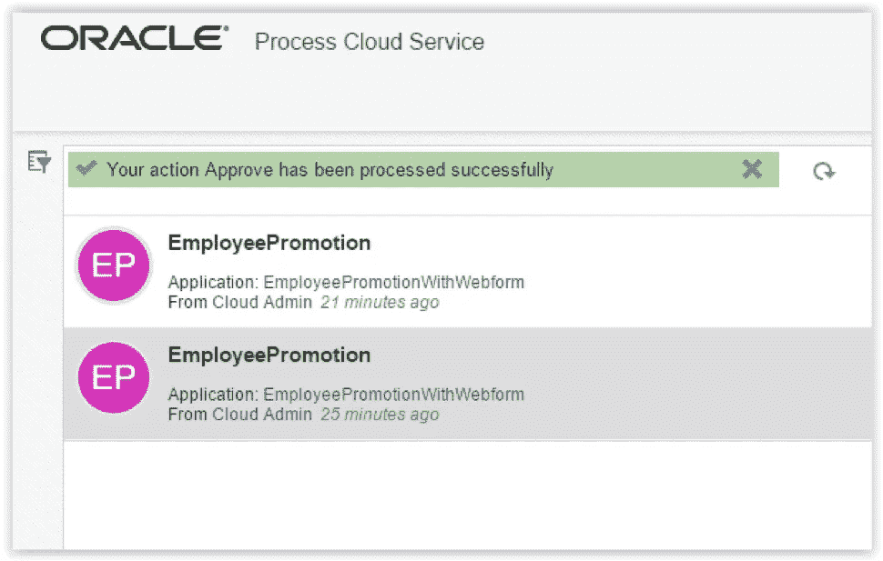

**图 19:审批处理成功**

使用 Oracle 电脑提供了多种可能性，可以让您快速上手并投入运行。与其他云服务集成也有简单的方法，最典型的是文档云服务和集成云服务。

# 关于作者

Oracle ACE[Andreas Chatziantoniou](https://twitter.com/magicchatzi)是 foglove-IT 的所有者，他专门研究 Oracle 融合中间件和 Oracle 数据库技术，并且是 rudolph-ag(瑞士)的合作伙伴。

> 这篇文章代表了作者的专业知识、发现和观点。Oracle 在这个领域发布了这份报告，作为鼓励在该社区内交流此类信息以及促进同行评估和评论的更大努力的一部分。相关的 Oracle 产品团队尚未审查本文是否符合 Oracle 的标准和实践，本文的发布不应被解释为 Oracle 对本文所述内容的认可。

*最初发表于*[*【community.oracle.com】*](https://community.oracle.com/docs/DOC-1008448)*。*