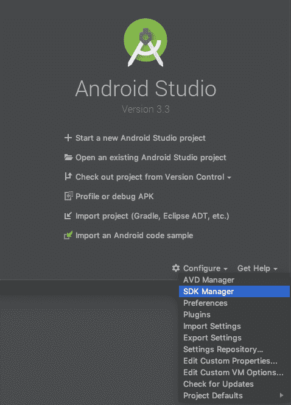
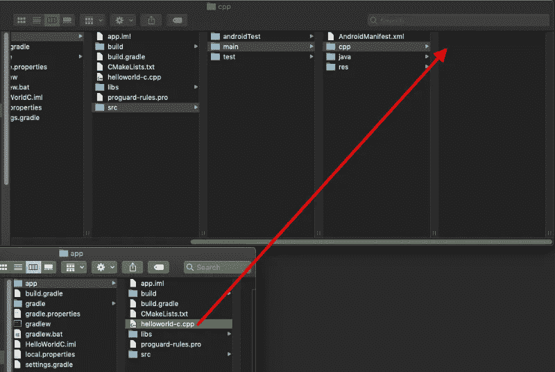

# C++和 Android 原生活动入门

> 原文：<https://medium.com/androiddevelopers/getting-started-with-c-and-android-native-activities-2213b402ffff?source=collection_archive---------0----------------------->

# 介绍

我将带您了解如何设置一个简单的 Android 原生活动。我将介绍基本的设置，并尝试为您提供前进所需的工具。

虽然我的重点是游戏，但我不会告诉你如何编写 OpenGL 应用程序或如何设计你自己的游戏引擎。这是一个几乎可以填满书籍的讨论。

# 为什么选择 C++

在 Android 上，操作系统及其支持基础设施被设计成支持用 Java 或 Kotlin 编程语言编写的应用程序。用这些语言编写的应用程序受益于嵌入到系统底层架构中的工具。许多核心的 Android 系统特性，比如 Android UI 和意图处理，只通过 Java 接口公开。

选择使用 C++，并不比使用诸如 Kotlin 或 Java 之类的托管语言更“原生”于 Android。与直觉相反，在某种程度上，你正在编写一个只有部分 Android 功能可用的外国应用程序。对于大多数应用程序来说，使用像 Kotlin 这样的语言会更好。

这条规则有几个例外。游戏开发是我最关心的事情。由于游戏通常使用定制的渲染逻辑，通常用 OpenGL 或 Vulkan 编写，所以预计游戏看起来与标准的 Android 应用程序不同。当你也考虑到 C 和 C++对于每一个计算平台几乎都是通用的，以及相对丰富的 C 库来支持游戏开发时，走上原生开发的道路就变得合理了。

如果你想从头开始做一个游戏，或者移植现有的游戏，Android 的原生开发工具包(或 NDK)及其支持工具已经准备好了。事实上，我将向您展示的本机活动提供了一个简单的一站式商店，您可以在其中设置 OpenGL 画布并开始收集用户输入。你可能会发现，尽管 C 的认知开销，一些常见的代码挑战，如从游戏数据构建顶点属性数组，在 C++中变得比高级语言更容易。

# 我不会报道的

我不会向你展示如何初始化一个 [Vulkan](https://www.khronos.org/vulkan/) 或 [OpenGL](https://www.khronos.org/opengles/) 上下文。我推荐通读谷歌提供的[样本](https://github.com/googlesamples/android-ndk/)，尽管我会提供一些提示让你的生活更轻松。你可以选择使用像 SDL 这样的库，甚至谷歌的库。

# 设置您的 IDE

首先，我们需要确保您已经为本地开发安装了所有东西。为此，我们需要安卓 NDK。启动 Android Studio:

并在“配置”下选择“SDK 管理器”:

从这里安装 LLDB(本机调试器)、CMake(我们将使用的构建系统)和 NDK 本身:

# 创建您的项目

现在您已经设置好了一切，我们将创建一个项目。我们想要创建一个没有活动的空项目:

自 Gingerbread 以来，NativeActivity 就已经出现在 Android 中，但如果你刚刚开始学习，我建议你选择当时可用的最高目标。

现在我们需要制作一个 CMakeLists.txt 来告诉 Android 如何构建我们的 C++项目。在项目视图中右键单击您的应用程序，并创建一个新文件:

已命名 CMakeLists.txt:

并创建一个简单的 CMake 文件:

我们声明我们正在 Android Studio (3.6.0)中使用最新的 CMake，并且我们正在构建一个名为 helloworld-c 的共享库。我还添加了一个我们必须创建的源文件。

为什么是共享库而不是可执行文件？Android 使用一个称为 Zygote 的进程来加速在 Android 运行时内启动应用程序或服务的过程。这适用于 Android 中每个面向用户的进程，所以你的应用程序运行代码的第一个机会实际上是在一个托管的虚拟机中。然后，托管代码必须加载一个包含您的逻辑的共享库文件，如果您使用本机活动，这将为您处理。相反，当构建一个可执行文件时，期望操作系统会直接加载你的程序并执行一个叫做“main”的 C 函数这是 Android 中的*可能*，但我还没有发现它的任何实际用途。

现在创建 C++文件:

并将它重新定位到我们在 make 文件中指定的目录:

让我们放入一些小东西，它会告诉我们它是否正在正确构建:

最后，让我们将 C++项目链接到我们的应用程序中:

如果一切顺利，项目将成功更新:

您可以毫无问题地运行构建:

至于你的构建脚本有什么变化。如果你打开你的应用的 build.gradle，你应该会看到这个`externalNativeBuild`条目:

# 创建本地活动

活动基本上是 Android 用来显示应用程序界面的窗口。通常你会用 Java 或 Kotlin 编写一个扩展 Activity 的类，但是 Google 创建了一个特殊的 C 等价类，叫做 native activity。

# 设置您的构建文件

创建本地活动的最佳方式是包含`native_app_glue`。许多示例将其从 SDK 复制到他们的项目中。这并没有错，但是我个人的偏好是把它留在原地，让这个成为我的游戏所依赖的库。我将使它成为一个静态库，这样我就不用支付动态库调用的额外成本:

这里有很多东西需要分解，所以我们开始吧。首先我`add_library`创建一个名为`native_app_glue`的库，并将其命名为`STATIC`库。然后我寻找自动生成的环境变量`${ANDROID_NDK}`来寻找 NDK 安装中的一些文件。使用这个，我取出了 native_app_glue 的实现:`android_native_app_glue.c`。

在我将代码与目标关联之后，我想说目标在哪里找到它的头文件。我使用`target_include_directories`将文件夹和它所有的标题放在一起，并将它们标为`PUBLIC`标题。其他选项是`INTERNAL`或`PRIVATE`这些范围现在无关紧要。一些教程可能会使用`include_directories`而不是`target_include_directories`。这是一种更古老的做法。最近的`target_include_directories`允许您将目录与目标相关联，这有助于降低大型项目的复杂性。

现在，我希望能够将东西记录到 Android 的 LogCat 中。仅仅写入标准输出(例如:`std::cout`或`printf`)并不像在普通的 C 和 C++应用程序中那样有效。使用`find_library`定位`log`，我们缓存 Android 的日志库，以备后用。

最后，我们告诉 CMake 让`helloworld-c`依赖于`native_app_glue`、`android`，以及我们使用`target_link_libraries`调用的库`log-lib`。这将让我们在 C++项目中引用本机应用程序逻辑。在`add_library`之前的`set`调用也确保了 helloworld-c 没有实现由`android_native_app_glue`提供的一个名为`ANativeActivity_onCreate,`的函数。

# 编写一个简单的本地活动

现在我们准备好了，让我们建立我们的应用程序！

这里发生了什么事？

首先，用`extern "C"{}`，我们只是告诉链接器我们需要把那些花括号之间的所有东西都当作 C。你仍然可以在里面写 C++代码，但是对于我们程序的其余部分来说，这些函数看起来像 C 函数。

我正在创建一个小占位符函数`handle_cmd`。这将作为我们未来的信息循环。任何触摸事件、窗口事件、& c 都会通过这里。

节目的核心是`android_main`。当应用程序启动时，这个函数由`android_native_app_glue`调用。我们首先将`pApp->onAppCmd`指向我们的消息循环，这样系统消息就有了去处。

接下来我们使用`ALooper_pollAll`来处理所有排队的系统事件，第一个参数是超时。如果我们得到一个大于或等于 0 的值，我们需要帮助`pSource`处理事件。否则，我们继续，直到应用程序关闭。

我们仍然不能运行这个活动，但是可以自由构建以确保一切正常。

# 将所需信息添加到 ApplicationManifest 中

现在我们需要填写您的 AndroidManifest.xml 来告诉您的系统如何运行您的应用程序。您可以在应用程序>清单> AndroidManfiest.xml 下找到它:

首先，我们将告诉 Android android 关于本机活动(称为“android.app.NativeActivity”)的信息，并告诉它不要因为方向变化或键盘状态变化而破坏活动:

然后我们告诉本机活动在哪里可以找到我们想要运行的代码。如果您忘记了名称，请查看您的 CMakeLists.txt！

我们告诉 Android 操作系统这是一个启动器活动，也是主要活动:

如果一切顺利，您可以点击 debug 并看到一个空白窗口！

# 为 OpenGL 做好准备

google 样本库中已经有优秀的 OpenGL 样本:

 [## googlesamples/android-ndk

### Android 工作室的 Android NDK 示例。通过在…上创建帐户，为 googlesamples/android-ndk 开发做出贡献

github.com](https://github.com/googlesamples/android-ndk/tree/master/native-activity) 

我会给你一些有用的提示让你开始。首先，要使用 OpenGL，在 CMakeLists.txt 中添加以下几行:

在这里，你可以为各种 Android 平台做更多的智能工作，但是将 EGL 和 GLESv3 添加到你的目标中对于最新版本的 Android 来说是没问题的。

接下来，我想创建一个名为`Renderer`的类来处理我的渲染。如果你用一个构造函数来初始化你的渲染器，用析构函数来销毁它，用一个`render()`函数来渲染，我建议你的程序看起来像这样:

所以，我做的第一件事就是开始使用`android_app`中这个叫做`userData`的小字段。你可以在这里存储任何你想要的东西，这个`android_app`的每个实例都会得到它。我选择添加我的渲染器。

接下来，我只能在窗口初始化后拥有一个渲染器，并且在它被破坏时必须将其删除。我使用我之前告诉过你的那个`handle_cmd`函数来做这件事。

最后，如果有渲染器(即:窗口已创建)，我从`android_app`检索它，并要求它渲染。否则我就继续处理这个循环。

# 结论

此时，您已经准备好使用 OpenGL ES 3，就像您在任何其他平台上一样！如果您需要更多资源或教程，以下是一些有用的链接:

*   谷歌的安卓 NDK 样本对我拼凑这个教程是非常宝贵的:【https://github.com/googlesamples/android-ndk/ 
*   对于原生活动:[https://github . com/Google samples/Android-ndk/tree/master/native-activity](https://github.com/googlesamples/android-ndk/tree/master/native-activity)
*   CMake 是我在 Android for C++上的首选构建系统，你可以在这里找到参考页面:[https://cmake.org/](https://cmake.org/)
*   如果你是第一次接触 CMake，或者如果你对`target_include_directories`而不是`include_directories`不熟悉，我推荐你阅读“现代”CMake:[https://cliutils.gitlab.io/modern-cmake/](https://cliutils.gitlab.io/modern-cmake/)
*   OpenGL ES 3 参考页面:[https://www.khronos.org/registry/OpenGL-Refpages/es3.0/](https://www.khronos.org/registry/OpenGL-Refpages/es3.0/)
*   安卓的 Java OpenGL 教程。它以 Java 为中心，但是讨论了许多 Android 特有的问题:[https://developer.android.com/training/graphics/opengl/](https://developer.android.com/training/graphics/opengl/)
*   NeHe 的 OpenGL 教程有点过时了，主要集中在旧的 OpenGL 桌面版本上。我还没有找到更好的 OpenGL 入门教程:[http://nehe.gamedev.net/](http://nehe.gamedev.net/)