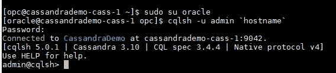
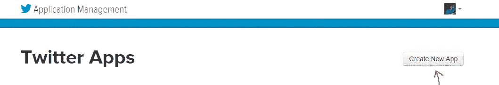
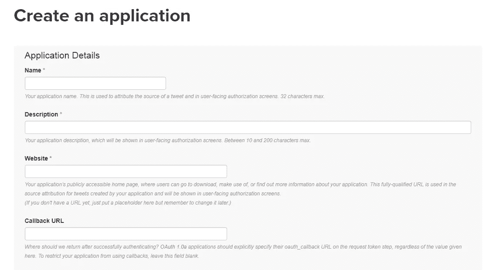
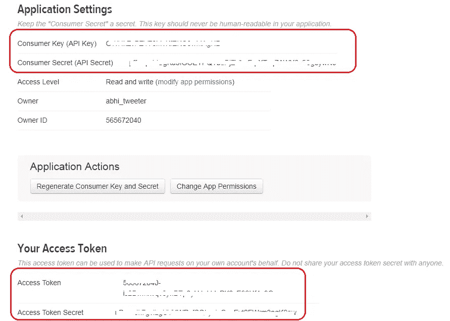
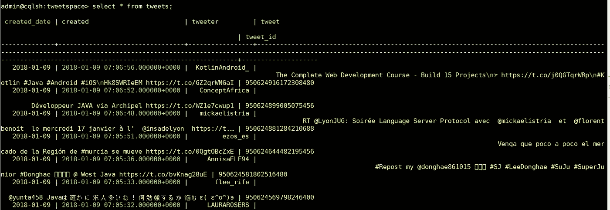

# 使用 Cassandra & Spring 数据在 Oracle 云上构建推文分析服务

> 原文：<https://medium.com/oracledevs/getting-started-with-cassandra-using-oracle-data-hub-cloud-550889f4126e?source=collection_archive---------0----------------------->

基于云原生和微服务的系统受益于这样一个事实，即它们能够负担得起成为**多语言**的成本，即一个系统可以构建为多个分布式服务的组合，每个服务都使用特定于其需求的运行时/语言。通常，每个服务还有一个专用的数据存储。同样，这是特定于服务需求的 RDBMS 或 NoSQL 数据库(或者可能是 *NewSQL* ？)

**NoSQL** 家族中的一员是 [Apache Cassandra](http://cassandra.apache.org/) ，它是一个分布式(无主)数据库，具有独特的**宽行**数据模型。其水平可扩展和分区/分片功能内置了对多数据中心复制的支持，使其成为永不停机的弹性云服务的绝佳选择

好消息是[甲骨文云](https://cloud.oracle.com/)现在包括 [**数据中心云服务**](https://cloud.oracle.com/datahub) ，它提供 Cassandra 作为*管理的*解决方案

 [## 数据中心云服务|甲骨文云

### 数据中心云服务现在提供了一个高度可扩展的、宽列、分布式键值 NoSQL 数据库，以支持您的…

cloud.oracle.com](https://cloud.oracle.com/datahub) 

在一个基于 Twitter(当然还有 tweets)的实用而简单的时序应用(典型的 Cassandra 用例)的帮助下，这篇博客向您介绍了[Oracle Data Hub Cloud Service](https://cloud.oracle.com/datahub)！)哪里

*   持续的推文流(高速数据)被消费并保存到数据中心云
*   然后使用另一个服务从数据中心云中查询相同的内容

上面提到的(微)服务被部署到 [Oracle 应用容器云](https://cloud.oracle.com/application-container-cloud)(一个多语言的云原生应用开发平台)，并且它们享有该平台提供的与数据中心云的原生集成能力(稍后将详细介绍)

[](https://cloud.oracle.com/application-container-cloud) [## 应用容器云| ACC | Oracle 云

### 云中的 Java 标准版和 Node.js。

cloud.oracle.com](https://cloud.oracle.com/application-container-cloud) 

# Oracle 数据中心云服务初级读本

在我们深入了解本质之前，这里有一个关于 Oracle 数据中心云的快速产品概述

Oracle Data Hub Cloud 是针对各种数据存储的伞式服务，在 Oracle Cloud 上作为托管的 **PaaS** (平台即服务)提供。正如您可能已经发现的那样，在撰写本文时，Oracle 数据中心云包括开源软件**Apache Cassandra**——它将逐渐扩展到包括流行的开源数据库

## 关键目标

*   **一致的** —跨多个数据库的相同管理体验
*   **自动化** —生命周期操作完全自动化
*   **完全控制** —对数据和服务的访问(ssh)

## 它的一些功能包括

*   **集群配置** —这是一个简单、快速且灵活的过程，您可以选择所需的属性，包括内存、存储、备份等。让平台为您旋转集群
*   **完整的生命周期管理** —纵向扩展/横向扩展(内存和存储)、纵向扩展/横向扩展(集群节点)
*   **打补丁/升级** —此过程完全自动化，并具有回滚功能
*   **监控—** 专用服务控制台，用于访问集群/节点指标，如 CPU、内存、存储、读/写延迟、压缩等
*   **灵活性** —大多数操作可以通过控制台、REST API 和 CLI 执行
*   **基础架构选择** —选择基于 [Oracle 云基础架构](https://cloud.oracle.com/cloud-infrastructure)的裸机服务器，或者选择基于虚拟机的计算([OCI-经典](https://cloud.oracle.com/en_US/compute-classic) ) — [详情请点击此处](https://docs.oracle.com/en/cloud/paas/data-hub-cloud/user/data-hub-cs-clusters-oci.html)

# 架构概述

> Github 上有这款应用

[](https://github.com/abhirockzz/accs-cassandra-twitter-timeseries-app) [## abhirockzz/accs-Cassandra-Twitter-time series-app

### accs-Cassandra-twitter-time series-app-带有 Twitter 数据的简单时间序列应用程序，在 Oracle 数据中心使用 Cassandra…

github.com](https://github.com/abhirockzz/accs-cassandra-twitter-timeseries-app) 

图表总是有帮助的..这就是了


High level architecture

显然，整体解决方案非常简单

*   **Tweet Producer** 是一个 Java 应用程序，它使用 [Twitter 流 API](https://developer.twitter.com/en/docs/tutorials/consuming-streaming-data) 来消费 Tweet 并将它们推送到数据中心的 Cassandra 集群
*   **Tweet 查询服务**定义了一个 REST API，并与 Cassandra 交互以获取 Tweet 数据

# 解决办法

让我们看看解决方案的一些相关细节

## 推特制作应用

*   这是一个 Java 应用程序，使用 [twitter4j](http://twitter4j.org/en/) 库来消费推文流
*   应用用户定义的过滤标准/术语从流中过滤相关推文
*   将 tweet 数据异步推送给 Cassandra
*   它提供了一个 REST API 来按需启动/停止应用程序，例如`/tweets/producer`

> 应用程序容器云中的**服务绑定**功能简化了与数据中心云上的 Cassandra 实例的连接(更多信息见下一小节)

## 推特查询服务

*   这是一个基本的 [Spring Boot](https://projects.spring.io/spring-boot/) 应用，它利用了 [Spring 数据](http://projects.spring.io/spring-data/)和 Spring Web
*   Spring Data 中的 [Cassandra 模块](https://projects.spring.io/spring-data-cassandra/)用于与 Cassandra 交互
*   `spring-boot-starter-web module`用于公开一个 REST API 来查询 tweet 相关信息

## 绑定到数据中心云的服务

应用容器云为数据中枢云提供现成的服务绑定。这为你的应用程序提供了一个安全的通信渠道，而无需你做任何明确的事情

> 在数据库基础设施级别不需要与端口相关的配置

[这是此功能的文档](https://www.oracle.com/pls/topic/lookup?ctx=en/cloud/paas/app-container-cloud/jsewn&id=GUID-BCD4C8AA-0E1C-490D-92E8-6BAE003F5F5C)

## 关于 Cassandra 数据模型的几句话

下面是这个表(用来存储推文)的样子


Data model

*   `tweeter` —Twitter 的网名，例如 abhi_tweeter
*   `tweet` —推文本身(字符串格式)
*   `tweet_id` —推文的 ID，例如
*   `created` —推文创建时的时间戳格式
*   `created_date` —文本格式的日期，如 2018–01–01

该表旨在以**时间序列**风格存储推文——主键的设计考虑到了这一需求。它由单个**分区**键和**聚类**列组成

`created_date` 是**分区的**键——它暗示着

*   它用于确定特定推文将到达的分区
*   每个分区将包含一天价值的推文
*   只有该列可以用在查询的 WHERE 子句中(除非您创建了二级索引)，也就是说，它允许您搜索某一天的所有推文(稍后您将看到这一点)

`create` 和`tweeter` 是**聚类**列

*   它们决定数据如何在磁盘上排序并在查询中返回
*   由于在`tweeter`之前指定了`created` 列，因此将使用推文时间戳进行排序(即首先是最新的推文)，然后是推文屏幕名称(按字母顺序)
*   通过将`allow filtering`添加到查询中，还可以在 where 子句中使用`tweeter` 列

# 基础设施设置

让我们快速浏览一下如何设置基础

*   使用 Oracle Datahub 云控制台和引导 Cassandra 设置 Cassandra 集群(**键区**和**表**)
*   创建一个 **Twitter 应用**，为我们提供所需的认证令牌

## Oracle 数据中心云

**规定卡珊德拉集群**

从引导一个新集群开始—详细的[文档在这里](https://docs.oracle.com/en/cloud/paas/data-hub-cloud/user/creating-cluster.html)


Cluster create options

> 也可以使用 CLI 来完成此操作

下面的代码片段显示了一个运行 Cassandra **3.10.0** 的基本单节点集群


Oracle Datahub cloud Cassandra Cluster

创建键空间和表

**SSH 进入 Cassandra 集群节点**

> 文档[可在此处获得](https://docs.oracle.com/en/cloud/paas/data-hub-cloud/user/connecting-cluster-node-secure-shell-ssh.html#GUID-16765BDA-5713-43C7-82D4-5EE62E31C481)

**启动 cqlsh**

`sudo su oracle` —此处的相关[信息](https://docs.oracle.com/en/cloud/paas/data-hub-cloud/user/linux-user-accounts.html)

`cqlsh -u admin `hostname``



Logged into cqlsh

**创建密钥空间**

`CREATE KEYSPACE **tweetspace** WITH REPLICATION = { ‘class’ : ‘SimpleStrategy’, ‘replication_factor’ : 1 };`

**创建存储推文的表格**

`USE tweetspace;`

`CREATE TABLE **tweets** (
**tweeter** text,
**tweet_id** text,
**tweet** text,
**created** timestamp,
**created_date** text,
PRIMARY KEY ((created_date), created, tweeter)
) WITH CLUSTERING ORDER BY (created DESC);`

只是再确认一下— `desc tweetspace;`

## 创建您的 Twitter 应用程序

您需要在 Twitter 中设置一个应用程序，以便访问您将在 **Tweet Producer service** 中使用的安全令牌/密钥

首先访问[https://apps.twitter.com/](https://apps.twitter.com/)和**创建新应用**



Create a new Twitter app



Fill in the required details

完成后，请检查**键和访问令牌**部分以获得所需的信息——您将在应用程序部署期间使用它



Twitter Keys and Access Tokens

# 构建和部署

首先从 Github 获取项目— `git clone [https://github.com/abhirockzz/accs-c](https://github.com/abhirockzz/accs-microservices-service-discovery)assandra-twitter-timeseries-app`

## 建设

**推文制作 app**

*   `cd accs-dhcs-cassandra-tweets-producer`
*   `mvn clean install`

构建过程将在`target` 目录中创建`accs-cassandra-tweets-producer-dist.zip`

**推文查询服务**

*   `cd accs-dhcs-cassandra-tweets-api`
*   `mvn clean install`

构建过程将在`target` 目录中创建`accs-dhcs-cassandra-tweets-api-dist.zip`

## 部署也称为向云推进

借助 Oracle Application Container Cloud，您在部署应用程序方面有多种选择。本博客将利用 **PSM CLI** ，这是一个用于管理 Oracle 云服务的强大命令行界面

> 其他部署选项包括 [REST API](https://docs.oracle.com/en/cloud/paas/app-container-cloud/apcsr/index.html) 、 [Oracle 开发者云](https://docs.oracle.com/en/cloud/paas/developer-cloud/csdcs/deploying-application-oracle-developer-cloud-service.html#GUID-6FE6D850-65DC-471D-A249-F7CCA9CAB56F)，当然还有[控制台/UI](https://docs.oracle.com/en/cloud/paas/app-container-cloud/csjse/creating-application.html)

您可以在您的机器上下载并设置 PSM CLI(使用`psm setup` ) — [详情请点击](https://docs.oracle.com/en/cloud/paas/java-cloud/pscli/using-command-line-interface-1.html)

部署这两个应用程序

*   **推文制作人**

使用您的 Twitter 访问令牌和 Oracle 数据中心云实例详细信息更新`deployment.json`

```
{
 “instances”: 1,
 “memory”: “2G”,
 “environment”: {
 “TWITTER_CONSUMER_KEY”: “<as per your app>”,
 “TWITTER_CONSUMER_SECRET”: “<as per your app>”,
 “TWITTER_ACCESS_TOKEN”: “<as per your app>”,
 “TWITTER_ACCESS_TOKEN_SECRET”: “<as per your app>”,
 “TWITTER_TRACKED_TERMS”: “cloud,nosql”
 },
 “services”: [
 {
 “type”: “DHCS”,
 “name”: “<as per your instance>”,
 “username”: “<as per your instance>”,
 “password”: “<as per your instance>”
 }
 ]
}
```

把拉链放进云里！

`psm accs push -n **TweetsProducer** -r java -s hourly -m manifest.json -d deployment.json -p target/accs-cassandra-tweets-producer-dist.zip`

*   **推文查询服务**

也为该服务更新`deployment.json`

```
{
 “instances”: 1,
 “memory”: “2G”,
 “services”: [
 {
 “type”: “DHCS”,
 “name”: “<as per your instance>”,
 “username”: “<as per your instance>”,
 “password”: “<as per your instance>”
 }
 ]
}
```

..并部署这个应用程序

`psm accs push -n **TweetsQueryService** -r java -s hourly -m manifest.json -d deployment.json -p target/accs-dhcs-cassandra-tweets-api-dist`

> 一旦执行，异步进程就会启动，CLI 会返回其作业 ID，以便您跟踪应用程序的创建

部署应用程序后，导航至 Oracle Application Container 云应用程序页面进行确认— *记下应用程序 URL*


Tweets Producer and Query services deployed successfully

这里是作为结果创建的**服务绑定**(之前解释过)和环境变量(还有几个没有包括在这里)的快照


Oracle Data Hub Service Bindings

# 试车

一切都准备好了——是时候看看实际情况了

**启动 tweets producer app**

`curl -X GET <tweet_producer_app_url>/tweets/producer`例如`curl -X GET [https://**TweetsProducer**-ocloud200.uscom-central-1.oraclecloud.com](https://tweetsproducer-ocloud200.uscom-central-1.oraclecloud.com/)/tweets/producer`

> 等待一段时间(大约一分钟左右)，让制作人开始表演

如果您[检查应用程序容器云中的日志](https://docs.oracle.com/en/cloud/paas/app-container-cloud/csjse/exploring-application-administration-page.html#GUID-3AEE3584-5DBA-463A-A274-07DF90F8A0E7)，您应该会看到类似的内容，表明 tweet 流处理已经启动

`INFO: started producer thread
Establishing connection.
Connection established.
Receiving status stream.`

**使用推文查询服务**

*   查询给定**日期** — `curl -X GET <tweets_query_app_url>/tweets/date/<date>`的所有推文，例如`curl -X GET [https://TweetsQueryService-ocloud200.uscom-central-1.oraclecloud.com](https://tweetsqueryservice-ocloud200.uscom-central-1.oraclecloud.com/)/tweets/date/**2018–01–09**`

```
…
 {
 “tweeter”: “KotlinAndroid_”,
 “tweet”: “The Complete Web Development Course — Build 15 Projects\n☞ [https://t.co/j0QGTqrWRp\n#Kotlin](https://t.co/j0QGTqrWRp\n#Kotlin) #Java #Android #iOS\nHk8SWRIeEM [https://t.co/GZ2qrWNGaI](https://t.co/GZ2qrWNGaI)",
 “created”: 1515481616000,
 “created_date”: “**2018–01–09**”,
 “tweet_id”: “950624916172308480”
 }…
```

*   查询**用户** — `curl -X GET <tweets_query_app_url>/tweets/tweeter/<tweeter>`的所有推文，例如`curl -X GET [https://TweetsQueryService-ocloud200.uscom-central-1.oraclecloud.com](https://tweetsqueryservice-ocloud200.uscom-central-1.oraclecloud.com/)/tweets/tweeter/**_openknowledge**`

```
…{
 “tweeter”: “**_openknowledge**”,
 “tweet”: “RT [@JAXenter](http://twitter.com/JAXenter): Enterprise Tales: Java EE 8 — ein politisches Release [https://t.co/5JHvvZiTlz](https://t.co/5JHvvZiTlz) #javaee #javaee8 [@mobileLarson](http://twitter.com/mobileLarson) #java #enterpris…”,
 “created”: 1515481083000,
 “created_date”: “2018–01–09”,
 “tweet_id”: “950622682420269056”
 }…
```

*   查询特定用户 — `curl -X GET <tweets_query_app_url>/tweets/<date>/<tweeter>`在**日**的所有推文，例如`curl -X GET [https://TweetsQueryService-ocloud200.uscom-central-1.oraclecloud.com](https://tweetsqueryservice-ocloud200.uscom-central-1.oraclecloud.com/)/tweets/**2018–01–09**/**AgrawalSadhuram**`

```
{
 “tweeter”: “**AgrawalSadhuram**”,
 “tweet”: “RT [@lokshaktidaily](http://twitter.com/lokshaktidaily): IndonesiaVsMalaysia:JavaPrincess acceptsSanatandharm: [@Sanjeevarora64](http://twitter.com/Sanjeevarora64) [@ghost22090440](http://twitter.com/ghost22090440) [@mallikarjun456](http://twitter.com/mallikarjun456) [@narendrapjoshi](http://twitter.com/narendrapjoshi) [@S](http://twitter.com/S)…”,
 “created”: 1515481003000,
 “created_date”: “**2018–01–09**”,
 “tweet_id”: “950622344669667328”
 },
 {
 “tweeter”: “**AgrawalSadhuram**”,
 “tweet”: “[https://t.co/UD2xTHaZ2d\nhttps://t.co/G2oCCwzW6A](https://t.co/UD2xTHaZ2d\nhttps://t.co/G2oCCwzW6A) [https://t.co/flqwPAjVqI](https://t.co/flqwPAjVqI)",
 “created”: 1515481001000,
 “created_date”: “**2018–01–09**”,
 “tweet_id”: “950622336973066241”
 }
```

*   查询**所有推文** — `curl -X GET <tweets_query_app_url>/tweets`例如`curl -X GET [https://TweetsQueryService-ocloud200.uscom-central-1.oraclecloud.com](https://tweetsqueryservice-ocloud200.uscom-central-1.oraclecloud.com/)/tweets`

> 您也可以使用 **cqlsh** 直接运行相同的查询



Query using **cqlsh** on Data Hub Cloud

*   要**停止**制作人应用程序— `curl -X DELETE <accs_app_url>/tweets/producer` 并在需要时重新启动它(与您启动它的方式相同)


Stop the tweets producer app

# 摘要

我意识到这是一个相当长的博客！下面是对所学内容的快速回顾

*   数据中心云概述
*   使用 Spring Boot、Spring Data、twitter4j 构建的基于 Twitter 的时间序列应用程序的详细信息，以及我们特定用例的一些 Cassandra 数据建模背景
*   基础架构设置、配置和部署到云
*   最后，测试我们的端到端解决方案

# 不要忘记…

*   深入阅读 Oracle 数据中心云文档

 [## Oracle 数据中心云服务-入门

### 帮助管理员、开发人员和用户开始使用 Oracle Event Hub Cloud Service 的文档。

docs.oracle.com](https://docs.oracle.com/en/cloud/paas/data-hub-cloud/index.html) 

*   查看 Oracle Application Container Cloud 教程—每个运行时都有适合的内容！

 [## Oracle 应用容器云服务—创建您的第一批应用

### Oracle 应用容器云服务教程。学习创建你的第一个应用程序。

docs.oracle.com](https://docs.oracle.com/en/cloud/paas/app-container-cloud/create-first-applications.html) 

*   关于应用程序容器云的其他博客

[](/tag/app-container-cloud/latest) [## 关于应用容器云的最新故事和新闻—中型

### 阅读关于应用容器云的最新文章。每天，成千上万的声音阅读、书写和分享重要的…

medium.com](/tag/app-container-cloud/latest) 

干杯！

> 本文表达的观点是我个人的观点，不一定代表甲骨文的观点。