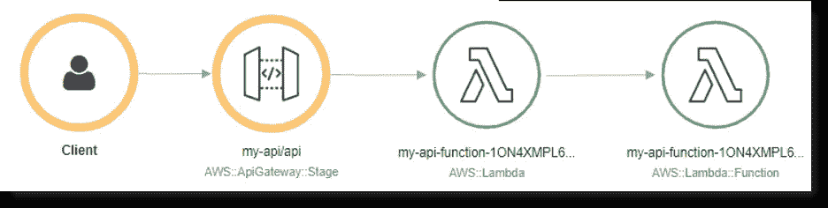
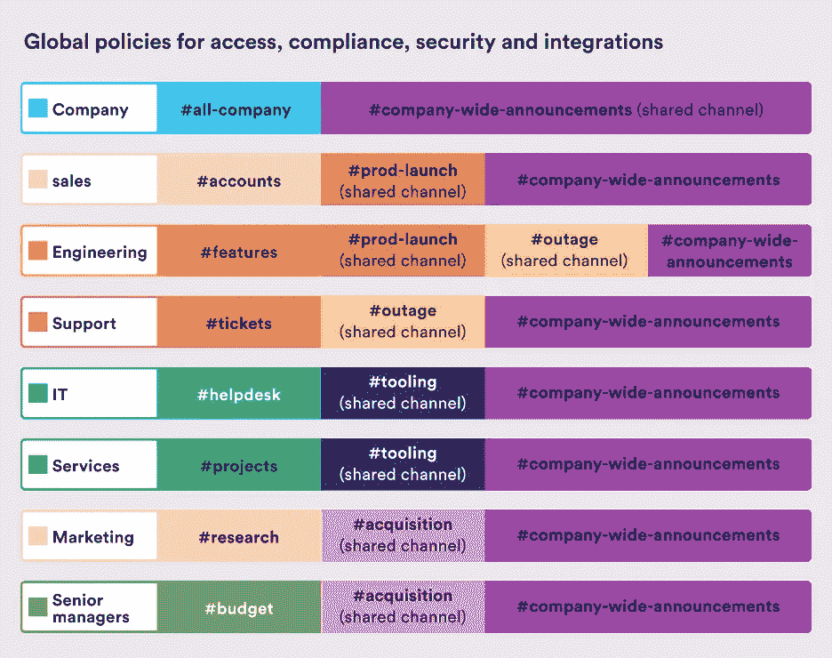
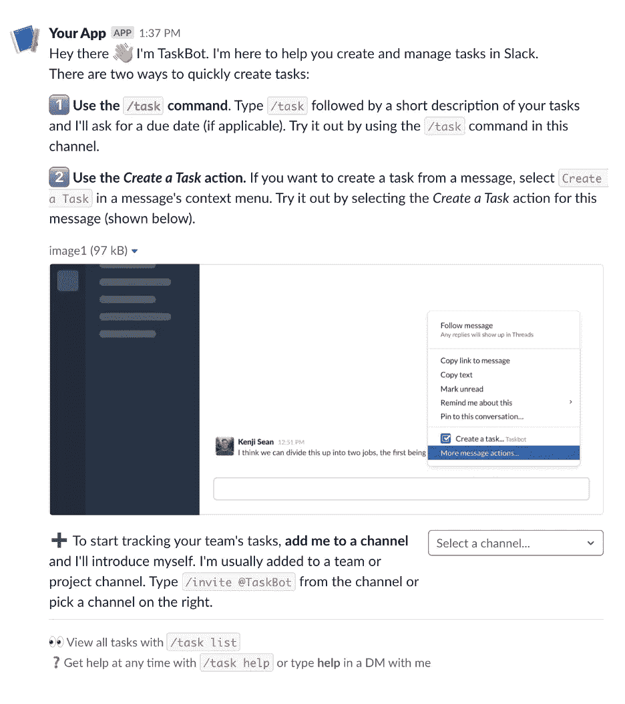
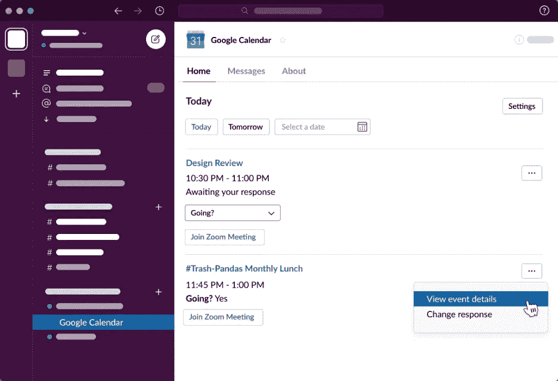

# 开始创建 Slack 机器人和 Slack 应用

> 原文：<https://medium.com/capital-one-tech/getting-started-with-creating-slack-bots-slack-apps-37e49bea7523?source=collection_archive---------1----------------------->

## 从聊天机器人开发者那里构建你的第一个企业 Slack 应用的六个技巧

我叫 Anirudha Simha，是 Capital One 的高级软件工程师，正在开发一个内部聊天机器人。它的功能包括使用机器学习和自然语言处理(NLP)回答常见问题，并支持 API 驱动的与各种流行服务(如 Confluence、JIRA 和 Github)的可操作集成。我们的聊天机器人主要用作 Slack 中的一个应用程序，它支持 150 多个不同的 Slack 频道，被 Capital One 内部各种团队的数千名员工使用。

根据我的经验，这些类型的应用程序提供了一种将各种工作流和流程集成到 Slack 的好方法，允许用户从一个环境中完成许多任务。如果实施得当，Slack 应用程序可以提供显著的好处，但也有一些技巧。在这篇博客中，我将介绍在构建、拥有和维护一个高度可扩展的企业 Slack 应用程序时，你应该牢记的六个注意事项。

关于 Slack 应用程序和 Slack 机器人的几句话。虽然这些术语有时可以互换使用，但它们是不同的东西；一个应用程序可能包含机器人，也可能不包含，机器人只是应用程序中与用户交互的一部分。大多数应用程序倾向于有一个机器人组件，但它不是一个应用程序的必要方面。这里的区别并不明显，所以我将通篇使用术语“Slack app”。

***请注意****——本文使用亚马逊网络服务(AWS)作为云服务的例子，然而其他的云提供商也可以工作或者有等效的服务。*

# 考虑#0:为什么要建立一个 Slack 应用？

首先也是最重要的，你为什么要做一个 app？它的目的和作用是什么？

你的应用在你的组织中的角色将影响你如何设计和构建它的考虑；最终包括它为您带来的价值和效用。构建 Slack 应用程序的一些原因和作用包括:

*   自动化所有的事情！
*   集成根据您组织的需求和考虑而定制的流程。
*   使用户能够执行操作，而不必留出空闲时间。
*   提供自动化支持。
*   创造一个有趣的工具，帮助在你的公司内创造文化。😎

# 考虑 1:通过 Slack Events API 和 Socket 模式获取事件

虽然你的 Slack 应用程序的最终目标是以一种有影响力和价值驱动的方式与你的用户交流和互动，但这最终也依赖于了解 Slack 中发生了什么。那就是使用 Slack 的基于事件的系统，通过 HTTP 端点或 WebSockets，通知你的应用程序你的工作空间正在发生什么。

## 时差事件 API

Slack 提供了[几个 API](https://api.slack.com/apis)来消费。 [web API](https://api.slack.com/web) 用于查询 Slack 的信息并执行操作。下一个问题是，如何将事件信息传递给应用程序？这是通过[事件 API](https://api.slack.com/apis/connections/events-api) 完成的。通过公开一个公共端点并将其提供给 Slack 应用程序，Slack 可以将事件转发到您的端点供您处理，并且只有您选择订阅的事件才会被发送。例如，您可以选择接收关于您的应用程序所属频道中添加的反应的 HTTP 事件，或者您可以注册以获取每次新成员加入频道时的事件。你可以在这里看到松弛事件的完整列表。

## 套接字模式

[套接字模式](https://api.slack.com/apis/connections/socket)是 Slack 的一个特性，它使用 [WebSockets](https://en.wikipedia.org/wiki/WebSocket) 来实现与事件 API 相同的功能。开发人员不需要向 Slack 提供一个面向公众的 URL，因为 WebSocket 连接将取代它。根据我的经验，套接字模式是在公司代理的限制下工作的最佳方式。此外，因为套接字模式是一种 WebSocket 连接，所以它比公开静态 HTTP 端点的传统方法具有更少的延迟。然而，这是以需要建立持久连接为代价的(因此没有无服务器方法)。

# 考虑# 2——使用无服务器和容器作为你的松散应用基础设施

在部署您的企业 Slack 应用程序时，您会希望在成本、可用性和性能之间取得最佳平衡。为此，我个人推荐使用像 AWS Lambda 这样的无服务器方法(如果您使用套接字模式，请阅读下面的内容),因为它非常划算，可扩展性很好，并且简单易用。

***请注意****——由于本文的目的不是介绍建立基础设施的细节，我将留下一些文章的链接，这些文章可以帮助建立我在下面讨论的各种基础设施方法。*

## 无服务器方法

大多数采用这种无服务器方法的实现都使用 API 网关来公开一个公共 URL，然后将事件转发给 lambda 函数。AWS API 网关和 lambda 函数的示例如下所示:

Image Source: [https://docs.aws.amazon.com/lambda/latest/dg/services-apigateway.html](https://docs.aws.amazon.com/lambda/latest/dg/services-apigateway.html)

**这里有一个关于创建连接到 API 网关的 AWS lambda 函数的教程**

*   [https://docs . AWS . Amazon . com/lambda/latest/DG/services-API gateway-tutorial . html](https://docs.aws.amazon.com/lambda/latest/dg/services-apigateway-tutorial.html)

**这里有专门针对松弛应用的循序渐进方法的文章**

*   [https://medium . com/glass wall-engineering/how-to-create-a-Slack-bot-using-AWS-lambda-in-1 hour-1 DBC 1 b 6 f 021 c](/glasswall-engineering/how-to-create-a-slack-bot-using-aws-lambda-in-1-hour-1dbc1b6f021c)
*   [https://Slack.dev/bolt-js/deployments/aws-lambda](https://slack.dev/bolt-js/deployments/aws-lambda)

这种无服务器方法允许轻松扩展事件，同时仍然具有很高的性能和成本效益，这使得它非常方便，因为随着您的组织的增长，AWS lambda 可以根据您的需求进行扩展。

## 基于容器的方法

如果您正在运行[套接字模式](https://api.slack.com/apis/connections/socket)或使用[Bolt](https://api.slack.com/tools/bolt)(Slack 的 SDK 使得设置监听 Slack 事件的服务器变得非常容易)而不使用[无服务器框架](https://www.serverless.com/open-source/)，那么上面的无服务器方法将不适用于您。但是，基于容器的方法(例如 ECS、Docker)可以。

**这是一篇关于理解亚马逊弹性容器服务(ECS)的文章**

*   [https://docs . AWS . Amazon . com/AmazonECS/latest/developer guide/welcome . html](https://docs.aws.amazon.com/AmazonECS/latest/developerguide/Welcome.html)

**这是一篇逐步介绍如何在 ECS** 中部署 Docker 容器的文章

*   [https://AWS . Amazon . com/getting-started/hands-on/deploy-docker-containers/](https://aws.amazon.com/getting-started/hands-on/deploy-docker-containers/)

这种基于容器的方法提供的优点是，它总是在运行，不会受到冷启动或 lambdas 受限的 15 分钟执行时间限制的影响。

# 考虑 3——了解松散的工作空间组织如何影响您的应用

Slack 中最高级别的组织是工作区，它包含所有的渠道。如果你熟悉 [Discord](https://discord.com/company) ，那么它就类似于 Discord 的服务器。企业网格是可以相互通信的工作空间的集合。一个小的创业公司可能有一个包含所有渠道的单一工作空间。然而，较大的组织可能有多个工作空间，每个工作空间用于不同的工作职能(例如，一个工作空间用于人力资源组织，一个工作空间用于技术，等等..).

*你可以通过 Slack 的文档了解更多关于* [*企业网格*](https://slack.com/resources/why-use-slack/slack-enterprise-grid) *和* [*工作区*](https://slack.com/help/articles/212675257-Join-a-Slack-workspace#:~:text=A%20Slack%20workspace%20is%20made,step%2Dby%2Dstep%20instructions.) *。*

我们可以在下图中看到一个企业网格的例子。这里显示了各种工作空间，如工程或营销，每个都有自己的渠道。然而，也有一些渠道，如#全公司公告，在公司的所有工作场所都可用。

*Image Source:* [*https://slack.com/resources/why-use-slack/slack-enterprise-grid*](https://slack.com/resources/why-use-slack/slack-enterprise-grid)

Slack 应用程序安装在每个工作区，因此应用程序所有者需要确保应用程序安装在预期用户将进行交互的每个工作区。

**单一工作区** —跨单一工作区运行的组织通常只需要担心单一工作区(在 Slack API 文档中也称为团队)。这简化了开发人员的过程，因为他们只需安装到一个工作区，并且只需要担心一个应用程序令牌。

**多个工作区** —跨多个工作区的组织必须意识到他们的应用程序需要安装在每个工作区上。这意味着应用程序将需要查看任何传入的响应，并使用“team”字段来识别事件来自哪个工作区，然后为该工作区使用适当的应用程序令牌。

**企业网格**——如果你的组织正在使用企业网格，那么考虑将你的应用程序转换成一个[组织范围的应用程序](https://api.slack.com/enterprise/apps)并使用其组织范围的令牌。这使您可以使用单个应用程序令牌，该令牌将适用于所有工作区，同时提供简化的令牌管理/使用。

# 考虑 4——理解 Slack 用户界面的构建“模块”

当设计 Slack 应用程序的 UI/UX 时，你会希望与你的设计保持一致，并遵循良好的设计原则。实际上，Slack 应用程序中的 UI/UX 规则对许多应用程序都是通用的，所以这应该不会太难。

*如果你有兴趣了解更多，可以阅读关于* [*人机交互(HCI)指南*](https://www.tutorialspoint.com/human_computer_interface/guidelines_in_hci.htm) *。*

Slack 通过使用一个叫做 block-kit 的模板化 UI 框架来帮助你与 HCI 原则保持一致(更多细节[在这里](https://api.slack.com/block-kit/building)和[在这里](https://api.slack.com/block-kit))。积木套件的基础积木被恰当地命名为*积木*。块是简单的 JSON 格式，带有特定的字段和值，作为某些 Slack web API 调用的输入。当提供块时，这些 web API 调用的输出导致消息、模态和 Slack 中的其他表面中的元素(文本框、按钮、下拉菜单、文本等)的堆叠视觉布局。您可以在下图中看到块元素的示例。

*Source: Block Kit Builder example generated* [*template*](https://api.slack.com/tools/block-kit-builder?blocks=%5B%7B%22type%22%3A%22section%22%2C%22text%22%3A%7B%22type%22%3A%22mrkdwn%22%2C%22text%22%3A%22Hey%20there%20%F0%9F%91%8B%20I%27m%20TaskBot.%20I%27m%20here%20to%20help%20you%20create%20and%20manage%20tasks%20in%20Slack.%5CnThere%20are%20two%20ways%20to%20quickly%20create%20tasks%3A%22%7D%7D%2C%7B%22type%22%3A%22section%22%2C%22text%22%3A%7B%22type%22%3A%22mrkdwn%22%2C%22text%22%3A%22*1%EF%B8%8F%E2%83%A3%20Use%20the%20%60%2Ftask%60%20command*.%20Type%20%60%2Ftask%60%20followed%20by%20a%20short%20description%20of%20your%20tasks%20and%20I%27ll%20ask%20for%20a%20due%20date%20(if%20applicable).%20Try%20it%20out%20by%20using%20the%20%60%2Ftask%60%20command%20in%20this%20channel.%22%7D%7D%2C%7B%22type%22%3A%22section%22%2C%22text%22%3A%7B%22type%22%3A%22mrkdwn%22%2C%22text%22%3A%22*2%EF%B8%8F%E2%83%A3%20Use%20the%20_Create%20a%20Task_%20action.*%20If%20you%20want%20to%20create%20a%20task%20from%20a%20message%2C%20select%20%60Create%20a%20Task%60%20in%20a%20message%27s%20context%20menu.%20Try%20it%20out%20by%20selecting%20the%20_Create%20a%20Task_%20action%20for%20this%20message%20(shown%20below).%22%7D%7D%2C%7B%22type%22%3A%22image%22%2C%22title%22%3A%7B%22type%22%3A%22plain_text%22%2C%22text%22%3A%22image1%22%2C%22emoji%22%3Atrue%7D%2C%22image_url%22%3A%22https%3A%2F%2Fapi.slack.com%2Fimg%2Fblocks%2Fbkb_template_images%2FonboardingComplex.jpg%22%2C%22alt_text%22%3A%22image1%22%7D%2C%7B%22type%22%3A%22section%22%2C%22text%22%3A%7B%22type%22%3A%22mrkdwn%22%2C%22text%22%3A%22%E2%9E%95%20To%20start%20tracking%20your%20team%27s%20tasks%2C%20*add%20me%20to%20a%20channel*%20and%20I%27ll%20introduce%20myself.%20I%27m%20usually%20added%20to%20a%20team%20or%20project%20channel.%20Type%20%60%2Finvite%20%40TaskBot%60%20from%20the%20channel%20or%20pick%20a%20channel%20on%20the%20right.%22%7D%2C%22accessory%22%3A%7B%22type%22%3A%22conversations_select%22%2C%22placeholder%22%3A%7B%22type%22%3A%22plain_text%22%2C%22text%22%3A%22Select%20a%20channel...%22%2C%22emoji%22%3Atrue%7D%7D%7D%2C%7B%22type%22%3A%22divider%22%7D%2C%7B%22type%22%3A%22context%22%2C%22elements%22%3A%5B%7B%22type%22%3A%22mrkdwn%22%2C%22text%22%3A%22%F0%9F%91%80%20View%20all%20tasks%20with%20%60%2Ftask%20list%60%5Cn%E2%9D%93Get%20help%20at%20any%20time%20with%20%60%2Ftask%20help%60%20or%20type%20*help*%20in%20a%20DM%20with%20me%22%7D%5D%7D%5D) *(please note that this link requires you to sign into your Slack workspace to view)*

虽然开发人员可以选择更改按钮的颜色，但大多数元素的位置和样式是固定的，这进一步加强了一致的外观和感觉。然而，由于你在如何定位某些元素上有一定的余地(例如，在文本部分内嵌一个按钮，而在文本部分正下方有一个按钮)，你会希望保持一致，以使你的应用程序易于使用，并在视觉上有品牌。这也包括使用视觉效果，如 gif、图像和表情符号。我个人喜欢在我的模块中使用表情符号等视觉元素，因为它们有助于分解文本。然而，使用这些元素的决定将根据您的用例、应用程序和偏好而有所不同。就像所有的事情一样，找到适量的文字、互动元素和视觉元素来传达你想要的东西，同时又不至于太多或太密集，这是一种平衡。

*请注意，在设计您的积木时，您可以使用* [*积木套件生成器*](https://app.slack.com/block-kit-builder) *来可视化它们的外观(请注意，此链接需要您登录到一个空闲工作区才能查看)。这是一个很好的方式，可以让用户看到事物的实际样子，并允许快速原型化。我非常，非常推荐使用这个，因为它使可视化消息和模态变得更加容易，并且包含的模板是灵感的巨大来源。*

# 考虑 5——松弛应用交互的简单指南

Slack 应用程序有多种方式来交流信息，以及在设计它们时应该考虑的因素。这包括 Slack 应用程序做什么，它传达的信息的紧迫性/重要性，或者一个频道获得了多少流量。这些都会影响你希望你的应用程序如何与用户互动，这是需要注意的。

**TL；不要把用户从一个频道拖到另一个频道，当他们做某事时提供反馈，要知道你应该如何和在哪里显示信息，不要让他们不知所措。**

## 在频道里做你的工作

如果工作可以在渠道中完成，那么就在渠道中完成。除非必要，否则不要要求用户必须转到另一个特定的频道或切换到应用程序的直接消息(DM)。例如，如果您有一个 Slack 应用程序，允许用户向某个渠道发起并发送一个投票，那么能够在该渠道中调用流程就很有意义，而不是使用 Slack 应用程序将用户定向到 DM。

## 提供信息反馈

在采取行动后向用户提供反馈，这样用户就能清楚地看到正在发生的事情。如果有长时间运行的流程可能需要用户等待片刻，这一点尤其重要。例如*“嘿，我们刚收到你的申请，机器人正在处理，请耐心等待！一旦它完成处理，你会在几分钟内收到机器人的回复。”*我还喜欢在我的信息中添加表情符号或图像等视觉元素，让它们更加突出。对于上面的消息，一个带有旋转加载图标的表情符号可能会有助于强化某件事情仍在处理中的想法。同样，这个想法是为了让用户不必去猜测是否有什么事情正在发生，或者他们的交互是否做了什么；然而，这并不意味着你需要用反馈淹没他们——但是以后会有更多的反馈。

## 谁，什么，在哪里——环境很重要

当给用户回复时，考虑你在和谁说话，你在说什么，你在哪里。如果你处于一个繁忙的频道，并且只有一个用户需要看到回复，那么让你的应用发布消息给所有人看可能是不合适的。相反，让你的应用程序在一个线程中发布响应可能会更好，短暂地(所以只有特定的用户可以看到)，直接在消息选项卡(又名 DM)中发布给用户，或者发布给主页选项卡。

*   **线索回复**——当你想在主渠道或现有线索中跟进某件事时，这种方法很有用。一个很好的例子是，如果你的 Slack 应用程序正在回答一个用户在主频道上发布的问题，应用程序应该以主题回复的形式发布它的响应。
*   **短暂消息** —消息(线索化或非线索化)仅对特定用户可见。短暂的消息不能保证会一直存在，可能会在一段时间后“消失”，这一点在使用它们时应该考虑到。短暂消息的一个很好的用例是，如果用户通过点击大拇指按钮与你的应用程序进行交互以提供反馈，而你希望应用程序回应“谢谢你，你的反馈已被记录！”整个渠道不需要看 app 的响应，只需要看用户。
*   **直接消息/消息标签**——是用户和你的 Slack 应用之间一对一的渠道。这为你的应用程序提供了一个很大的空间来向你的用户发送信息，而不会在一个更大的频道中丢失。如果您需要向用户传达一些重要的历史信息，他们可能希望以后引用，我会考虑使用 messages 选项卡。例如，假设一个用户正在您的渠道中与您的应用程序进行交互，您希望让他们知道他们的操作是成功的，并给他们一些确认号码，以便日后参考。你可以让你的应用程序在频道中回复用户(短暂的)，让他们知道操作是成功的，完整的细节已经在 DM 中发送给他们(此时你将在 DM 中发送完整的细节给他们)。这是一个很好的用例，因为用户可能不一定需要确认号码，但是如果他们需要，那么他们可以在 DMs 中看到相关的日期、时间和信息，而不必搜索整个频道。
*   **主页标签**——是一个“表面”，是应用程序与用户一对一体验的一部分。它与“消息”选项卡/界面相似，都是一对一的体验。然而，虽然直接消息往往更加流畅和短暂，随着新信息的增加而变化，但应用程序主页只有在特别更新时才会发生变化。由于应用程序主页不像“信息”标签那样是动态的，所以它是一个存储信息块的好地方，比如即将到来的事件或应用程序认为用户应该很容易就能拿到的重要信息。

*Image Source:* [*https://api.slack.com/tutorials/app-home-with-modal*](https://api.slack.com/tutorials/app-home-with-modal)

## 应用在哪里，家就在哪里

我想特别注意一下“主页”选项卡和“消息”选项卡之间的区别。虽然相似，但还是有一些差异需要了解。主页选项卡是一个包含“块”的表面，应用程序需要为每个用户更新它。但是，在应用程序再次更新之前，它将保持不变。与此同时,“消息”标签更加动态，将包含用户和应用程序之间的消息，或者如果你不想让用户回复，就只包含应用程序。由于“消息”选项卡更具动态性，它具有历史感，并保留了可能有助于回头参考的旧信息；类似于引用收件箱中的旧邮件。总的来说,“主页”、“信息”和“关于”构成了“应用主页”。很好地利用 app home 的一个很好的例子就是谷歌日历应用。它使用“主页”选项卡显示特定日期的日程。但是，它使用“消息”选项卡向用户发送关于他们可能需要了解的即将到来的事件和更新的通知。最重要的信息在应用程序主页中可见，但其他更动态和不断变化的信息发布在 DM/Messages 选项卡中供用户查看，这样做的好处是可以保留这些历史记录，以防用户出于某种原因需要查阅。

## 不要乱！

与用户互动时的另一个考虑是小心不要用太多的信息或太多的消息和通知淹没他们。有时候少即是多。也就是说，请记住，如果你有很多选项、按钮、文本等要显示，请考虑优先显示最重要的内容。你可以使用按钮甚至[模态](https://api.slack.com/surfaces/modals)来分页浏览更多信息，这取决于你所显示的内容。如果你在列举事情，按钮可以很好地工作，而如果你想呈现一个包含更多信息或可操作性的弹出窗口，模态可能是好的。

记住，在繁忙的频道中，上下文很重要。除非必要，我们不希望每个人都看到我们的应用程序与特定用户的交互。在这种情况下，短暂的消息确实会有所帮助。

# 考虑事项#6 —选择备用库

在开发你的 Slack 应用时，有许多 Slack 库可供你使用，Slack 甚至发布了一份完整的社区驱动开源库列表和一份由 Slack 构建的 T2 工具列表。在这些选项中，我个人推荐使用 Slack 的 Bolt 库，它可用于 JavaScript、Python 和 Java。Bolt 会定期更新，以支持新发布的 Slack 功能，文档也足够简单，可以帮助完成基本任务，如响应消息或无服务器运行应用程序。

除了 Slack 的 Bolt 库，还有 Slack 针对 [Node.js](https://slack.dev/node-slack-sdk/) 、 [Python](https://github.com/SlackAPI/python-slack-sdk) 、 [Java](https://github.com/slackapi/java-slack-sdk/) 的官方 SDK。

# 结论

Slack 应用程序是强大的工具，可以为您组织的工作流提供深度集成和自动化，从而提高您团队的效率。在构建这些应用时，你需要考虑基础设施、接收事件，当然还有 UI/UX。

如何接收事件和如何托管应用程序是密切相关的考虑因素，取决于您自己的技能组合以及您组织的云和基础架构策略。最终，无论您是通过公共 HTTP 端点使用 Events API，还是通过运行 Socket-mode 的 ECS 容器，甚至是两者的某种混合模型来使用 Lambda，上述考虑都应该允许您在应用程序中接收 Slack 事件。

关于用户界面/UX，记住这些要点。利用 Slack 的 block-kit 框架，为你的应用程序与用户的各种接触点构建视觉上令人愉悦且可用的 GUI。意识到你的应用在哪里以及如何交互。这是你的应用应该如何引导用户与它互动，以及它应该如何回应的一个因素。最后，找到如何提供反馈的平衡点，使反馈信息丰富而又不至于让人不知所措。

我希望这篇关于构建 Slack 应用程序的介绍性指南有助于在构建 Slack 应用程序时提供一些帮助和更深入的见解！

*标题图片由* [*贝瑟尼*](https://unsplash.com/@bkotynski?utm_source=unsplash&utm_medium=referral&utm_content=creditCopyText) *上* [*下*](https://unsplash.com/s/photos/productive-work?utm_source=unsplash&utm_medium=referral&utm_content=creditCopyText) *。*

*披露声明:2021 资本一。观点是作者个人的观点。除非本帖中另有说明，否则 Capital One 不隶属于所提及的任何公司，也不被这些公司认可。使用或展示的所有商标和其他知识产权是其各自所有者的财产。*

*原载于***。**