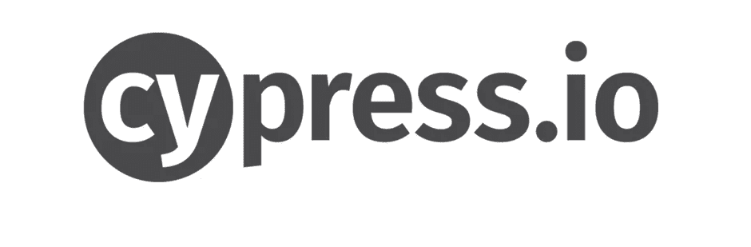
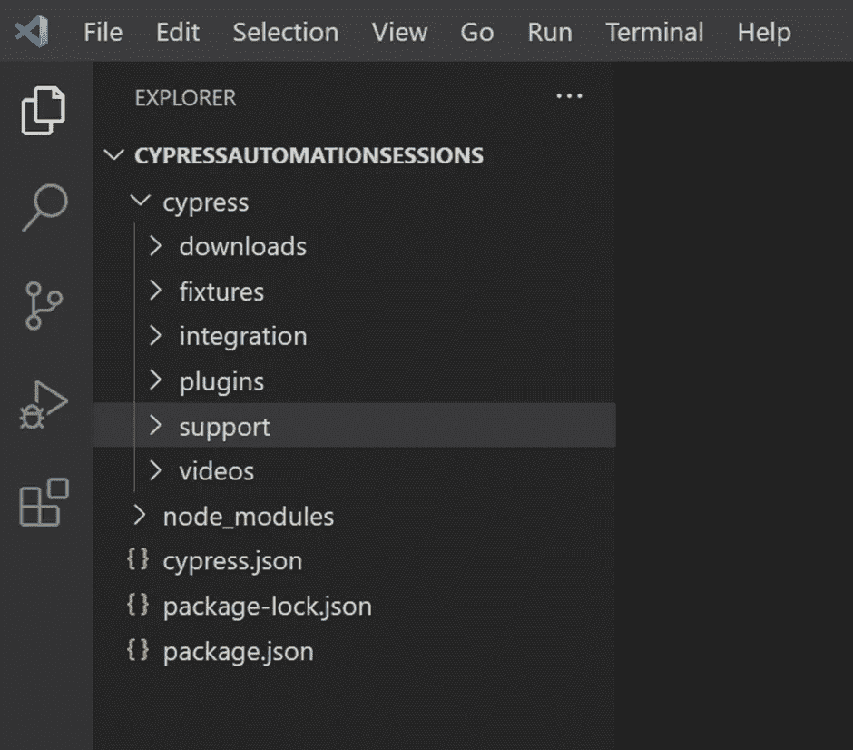
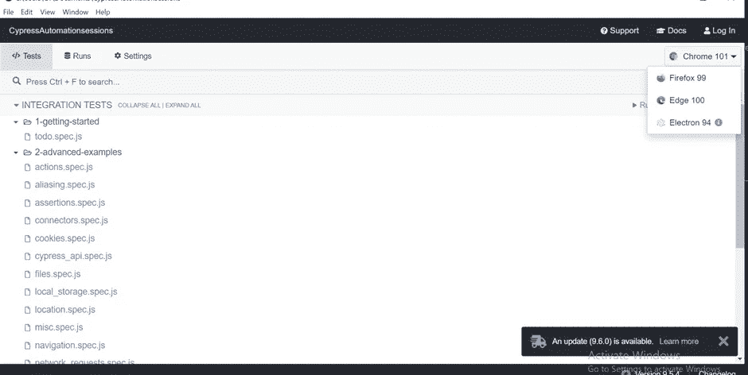

# Cypress 入门

> 原文：<https://medium.com/version-1/getting-started-with-cypress-8bfc2a07e8cc?source=collection_archive---------3----------------------->



Cypress 是一个基于 JavaScript 的用于端到端测试的一体化框架，已经提供了您可能需要的所有内置特性。

# Cypress 安装指南

**先决条件:**

*   [安装 Visual Studio 代码 IDE](https://visualstudio.microsoft.com/) 【可以使用任何 IDE】
*   [安装节点 JS](https://nodejs.org/en/download/)

下面是柏木详细的[安装指南。](https://docs.cypress.io/guides/getting-started/installing-cypress)

Cypress 是作为 npm 包提供的，所以只需从存储库中安装 NPM 包，并将其配置为使用 Cypress。

首先，创建一个新文件夹，我将它命名为 mine **cypressdemo** ，移入其中并初始化一个新的 JavaScript 项目:

> mkdir 密码演示&& cd $_
> 
> npm 初始化-y

*   在 cypressdemo 文件夹中，打开终端或命令提示符。
*   输入命令:**NPM install cypress–save-dev**
*   一旦安装完成，输入命令: **npx cypress open**

**npx cypress open** 命令第一次准备 cypress 并启动 Cypress 测试运行程序，在这里我们可以看到示例测试并使用它们。

# 理解 Cypress 中的文件夹结构



默认情况下，Cypress 带有一个文件夹结构。主文件夹是 **cypress，**里面有子文件夹。

*   **集成:**这个文件夹包含了实际的测试脚本。
*   **Fixtures:** 如果你在测试中使用外部数据，你的数据可以被组织在 Fixtures 文件夹中。
*   **Plugins:**Plugins 文件夹包含特殊文件，可以用来在项目加载之前执行代码。如果您的项目需要任何预处理程序，请将它们包含在该文件夹中并相应地进行配置。默认情况下，plugins 文件夹包含 index.js 文件，可以定制该文件来创建自己的任务。
*   **支持:**支持文件夹包含实用程序、全局命令、常用代码等。该文件夹默认自带两个文件——**commands . js**和 **index.js** ，可以根据需要添加其他文件和文件夹。
*   **资产**:测试运行后会创建一个名为**下载**的文件夹，其中包含截图、视频等。

# 为 Cypress 自动化编写您的第一个测试用例

**密码演示**文件夹包含

1.  节点模块文件夹
2.  柏树文件夹
3.  cypress.json 文件
4.  package.json 文件
5.  包锁. json 文件。

为了创建您的测试，导航到 **cypress/integration** 并创建一个新的文件夹(例如: **demo** )。

在 demo 文件夹中，使用下面的代码创建测试文件(例如: **firsttest.js** ):

> //firsttest.js
> 
> 描述('我的第一次测试'，()=> {
> 
> it('启动浏览器并导航'，()=> {
> 
> cy . visit([https://www.google.com/](https://www.google.com/)’)；
> 
> cy.title()。应该('情商'，'谷歌')
> 
> })
> 
> })

# 使用 Cypress 运行第一个自动化测试

1.  **使用 Cypress 测试运行器**执行 Cypress 测试

从 Visual Studio 代码终端或命令行，在项目文件夹级别运行命令( **cypressdemo** )。

```
npx cypress open
```

上面的命令打开了 Cypress 测试运行器。选择新创建的测试文件。

点击 demo 文件夹下的 **firsttest.js** 文件执行测试。



2 **。使用命令行运行 Cypress 测试**

**语法:**

```
npx cypress run [--spec <path_to_spec_file]
```

使用以下命令运行 **firsttest.js** :

```
npx cypress run --spec "./cypress/integration/demo/firsttest.js"
```

上面的命令以 headless 模式执行测试，因此我们不会看到任何浏览器启动或测试执行，所有这些都发生在后台。


**关于作者:** Thimmaraju 是 Version 1 的一名 QA 自动化工程师。