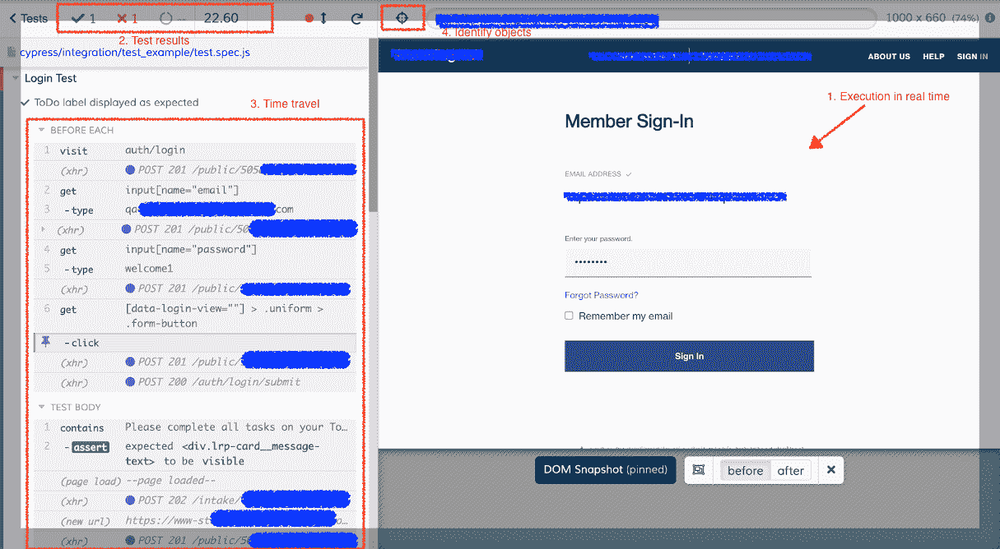
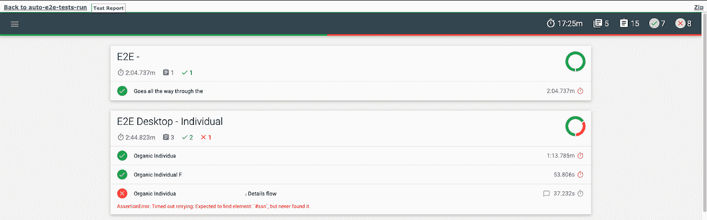
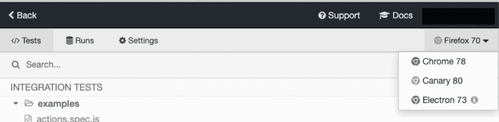

# Cypress.io 入门—第 1 部分，简介。

> 原文：<https://medium.com/globant/getting-started-with-cypress-io-part-1-introduction-566b7c8ce37e?source=collection_archive---------1----------------------->

几年前，你在网上搜索自动化工具的第一个结果是 *Selenium，*这是一个强大的开源工具，具有很好的特性，有一个广泛的社区可以获得支持，并且覆盖了 web 自动化测试的大部分需求。后来开发了更多具有新功能或增强功能的工具，但其中一些仍然使用 *Selenium* 引擎作为核心库。

如今，有数十种自动化工具提供了非常好的功能，适应特定的需求，并使用完全不同的技术，其中之一是 [Cypress.io](https://www.cypress.io/) ，这是一种基于 JavaScript 的开源工具，正在被测试自动化工程师和开发人员高度接受。

总之，Cypress.io 依赖并扩展了几个工具和库来创建一个强大的生态系统。这些工具包括用于依赖管理的 *Node.js* 、 *npm* 或 *yarn* 、用于断言管理的 *Chai* 、用于测试结构管理的 *Mocha* 、用于存根和间谍机制的 *Sinon* 以及作为编写测试脚本的编程语言的 *JavaScript* 。

他们称自己为“*为现代网络*打造的下一代前端测试工具”。有了 Cypress.io，你将不再需要复杂的设置和安装多个依赖项来编写测试……也不再需要处理驱动程序来与浏览器交互。

您可以从不同的测试级别编写测试；单元、集成和系统，这就是它被不同的工程角色使用的原因。

它在浏览器中与测试中的应用程序一起执行，并直接与 DOM 交互，这使得测试运行起来非常快。有关 Cypress.io 架构的更多详细信息，请参考 cypress . io 指南上的[关键差异](https://docs.cypress.io/guides/overview/key-differences.html#Architecture)文档。

你可以在 Cypress.io 中找到许多很棒的特性，但是当然在选择它作为你的主要自动化工具之前，你也需要考虑一些缺点。

在本文档中，我们将通过一个简单的测试示例、林挺配置、一个报告工具和一些其他功能，逐步介绍其中的一些功能。但在此之前，我们先来回顾一下一些主要特性。

## **主要特征。**

重试能力。

Cypress.io 附带了一个奇妙的[重试能力](https://docs.cypress.io/guides/core-concepts/retry-ability.html#Commands-vs-assertions)机制，默认启用，它使一些命令和断言能够自动重试它们的操作，而无需添加任何等待或额外的断言。

自动等待是该功能的一部分，您可以为不同的操作定义[超时](https://docs.cypress.io/guides/references/configuration.html#Timeouts)，可以根据需要进行修改。这是一个很棒的内置特性，可以在脚本的不同级别进行管理和覆盖。

**试跑者。**

内置的[测试运行器](https://docs.cypress.io/guides/core-concepts/test-runner.html#Overview)会让你的生活变得更加简单，当你运行测试运行器时，你将能够利用测试运行器提供的许多功能，这里有一些:

1.  **实时执行。你可以看到你的测试是如何执行的，它们的状态以及所有的步骤和动作在你的浏览器中被执行……顺便说一句，你可以在执行过程中继续使用其他程序甚至浏览器的多个实例，而不会影响任何东西。**
2.  **测试结果**。一旦执行完成，您将得到执行摘要、通过的测试数量、失败的测试数量、执行时间。
3.  **时间旅行**。在操作和步骤之间导航，以探索到底发生了什么，这允许您查看应用程序在操作执行之前和之后的情况，查看控制台日志、网络呼叫和其他用于调试的强大功能。
4.  **识别物体**。有一个方便的查找功能，可以帮助您获得元素的最佳定位器，您可以复制/粘贴完整的 get/contains 命令。

Cypress Test Runner

**Cypress.io 仪表盘。**

[仪表板](https://docs.cypress.io/guides/dashboard/introduction.html#Features)是一个集中式报告工具，Cypress.io 提供它来记录你的历史测试运行以及其他伟大的特性，它不是一个免费的服务，但它有一个试用版供你测试。

其中一些功能有助于您更好地组织跑步和优化资源。以下是其中的一些:

*   能够跟踪不同项目的结果。
*   CI 整合。
*   记录本地和 CI 执行。
*   CI 上的自动负载平衡。
*   强大的并行功能。
*   能够对测试进行分组，以便更好地组织。

记者。

Cypress.io dashboard 是一个强大的、非常好的集中式报告工具，但是让我们现实一点，并不是所有的项目都有相同的需求，不需要在这样的工具上花钱。

如果您正在一个大型项目中工作，运行来自不同团队或应用程序的多个测试，对保留历史结果并对其进行良好组织感兴趣，在 CI 中运行他们的测试并尽可能优化您的资源以节省成本…那么请继续前进，看看 Cypress.io dashboard，它有您需要的一切。

如果这不是你的情况，你可能想看看其他的选择。Cypress.io 有几个分散的报告工具以及其他集中的(免费的)报告工具。

因为 Cypress.io 构建在 Mocha 之上，所以您可以利用他们的报告，包括 mochawesome，这是一个简单但很好的 html 报告，可以显示您可能需要的所有内容。

Mochawesome report.

更多详情请查看[记者](https://docs.cypress.io/guides/tooling/reporters.html)文档。

**截图和视频**

Cypress.io 自动生成执行视频(无头运行时)和失败图像。这些默认特性可以通过更新一些[配置属性](https://docs.cypress.io/guides/references/configuration.html)来修改。

**跨浏览器测试。**

在这个文档创建的时候，Cypress.io 支持很多浏览器，其中大部分是 chrome 系列浏览器(包括 Electron 和基于 Chromium 的 Microsoft Edge)和 Firefox。完整列表可在他们的[浏览器支持](https://docs.cypress.io/guides/guides/launching-browsers.html#Browsers)文档中查看。

一旦安装了 Cypress.io，电子浏览器也是可用的，这是执行的默认浏览器，但是 Cypress.io 也会自动检测您在系统中安装的浏览器，并在测试运行器中显示它们，如下所示:

您也可以使用相同的浏览器，通过 CLI 中的–browser 属性来执行您的测试。

## **要回顾的其他重要特性。**

*   Cypress.io 可以有头运行，也可以无头运行。
*   嘲讽的好工具。
*   强大的调试功能。
*   自动重试失败的测试。
*   与网络请求交互的能力。
*   用于视觉测试的插件。
*   Cypress.io Dashboard:片状测试分析器特性、松弛通知等等。

**缺点。**

当然，Cypress.io(和任何其他工具一样)也有它的缺点，请查看这篇文档，其中解释了一些 [**永久**权衡](https://docs.cypress.io/guides/references/trade-offs.html#Permanent-trade-offs-1)，下面是其中一些:

*   Cypress.io 不支持也不会支持[多标签](https://docs.cypress.io/guides/references/trade-offs.html#Multiple-tabs)或[多浏览器](https://docs.cypress.io/guides/references/trade-offs.html#Multiple-browsers-open-at-the-same-time)交互。
*   它[支持单个域](https://docs.cypress.io/guides/guides/web-security.html#Same-superdomain-per-test)，每次测试只限于访问[相同来源的域](https://docs.cypress.io/guides/references/trade-offs.html#Same-origin)。
*   [浏览器支持](https://docs.cypress.io/guides/guides/launching-browsers.html#Browsers)限制。
*   与[iframe](https://docs.cypress.io/guides/guides/web-security.html#Cross-origin-iframes)交互的限制。
*   仅限于 JavaScript 和 Typescript 语言。请参考本[设置](https://docs.cypress.io/guides/tooling/typescript-support.html#Install-TypeScript)使用 typescript。

参考 [Cypress.io 最佳实践](https://docs.cypress.io/guides/references/best-practices.html)了解他们关于尽可能利用 Cypress.io 的建议。

如果你想继续学习 Cypress.io，请考虑看看本文的第 2 部分: [**开始使用 cypress . io——第 2 部分，创建你的第一个项目。**](/globant/getting-started-with-cypress-io-part-2-creating-your-first-project-1e09f6dc38db)

有任何问题，请不要犹豫，打电话到 mario.gr@globant.com 与我联系。

谢谢！

Mario Garcia——Globant QE 技术经理。