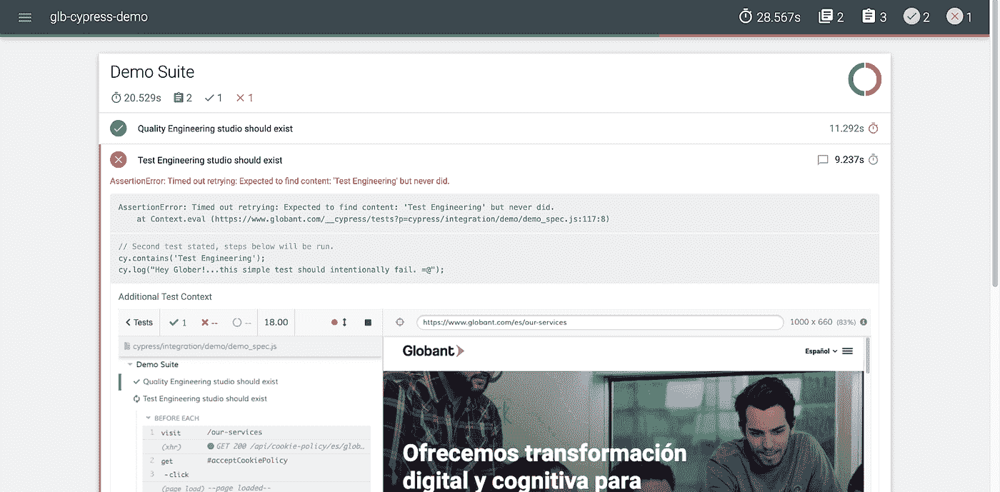

# Cypress.io 入门—第 2 部分，创建您的第一个项目。

> 原文：<https://medium.com/globant/getting-started-with-cypress-io-part-2-creating-your-first-project-1e09f6dc38db?source=collection_archive---------0----------------------->


在开始阅读**cypress . io 入门—第 2 部分之前，**请考虑看一下[**cypress . io 入门—第 1 部分**](/globant/getting-started-with-cypress-io-part-1-introduction-566b7c8ce37e) **，**在这里，我将介绍这个伟大的工具，分享我对它的特性以及缺点的想法和发现。如果 Cypress.io 是您项目的正确选择，这可能会帮助您做出决定。

开始之前，请确保您的计算机上安装了节点和 npm，如果没有，请根据您的操作系统遵循以下指南:

*   [Mac 安装指南](https://treehouse.github.io/installation-guides/mac/node-mac.html)。
*   [Windows 安装指南](https://treehouse.github.io/installation-guides/windows/node-windows.html)。

让我们开始吧…

**1-创建一个项目。**

选择一个目录来创建一个新文件夹，打开一个终端并移动到项目目录，然后键入 ***npm init*** 并按照实用程序向导创建项目的 package.json。

**2-安装依赖项。**

一旦步骤 1 完成，package.json 就创建好了。给它添加下面的依赖项，并在终端中执行 ***纱安装*** 或 ***npm 安装*** 。请确保所有终端命令都在项目目录中执行。

**3-打开柏树滑道**。

键入 ***纱柏开*** 或 ***npm 跑柏*** *开*端子。
Cypress runner 将被打开，此时一个名为 *cypress* 的新文件夹将被添加到您的项目中。在这个新文件夹中，您还会看到一个 *integration/examples* 目录，其中包含几个帮助您理解 cypress 内置命令如何工作的文件。我真的建议花些时间看看这些文件。

请参考 Cypress.io 推荐的[文件夹结构](https://docs.cypress.io/guides/core-concepts/writing-and-organizing-tests.html#Folder-Structure)，所有这些文件夹也是第一次运行 Cypress 时默认创建的。

**4-环境管理。**

这是通过上面 package.json 依赖项中已经列出的*配置*模块来管理的。

*   打开 cypress/plugins/index.js 文件，插入如下代码:

*   创建以下文件，这只是一个示例假设您有生产和登台环境，您可以根据您拥有的环境随意命名这些文件:

```
default.jsonproduction.jsonstage.json
```

下面只是这些文件中属性的一个示例:

*   要针对特定环境运行执行测试，请执行以下操作:

```
export NODE_ENV=production yarn cypress-open
```

*   要在不同的环境中执行，只需运行:

```
export NODE_ENV=stage yarn cypress-open
```

**注**。如果没有值传递给 NODE_ENV，default.json 属性将被视为默认值。更多详情请参考[配置](https://www.npmjs.com/package/config)设置。

**5-创建你的第一个测试。**

测试被添加到 cypress/integration 目录中，您可以根据需要添加子文件夹来组织您的测试。我为这个例子创建了一个演示文件夹。

在集成目录下创建一个新文件，例如 demo_spec.js。

要执行您的测试，您可以通过执行 *yarn cypress open* 并单击您的测试来启动测试运行程序，或者在 CLI 中使用***yarn cypress run-spec ' cypress/integration/demo/demo _ spec . js****'，*记住添加您的 NODE_ENV。

**6-设置 mochawesome 报告。**

该报告所需的模块已经在上面的 package.json 依赖项中列出，它们是 *mocha* 、*mochaawe*、*mochaawe-merge*和*mochaawe-report-generator*。

注意，我使用 cypress api 来定义 cli 属性，清理以前的报告文件并生成新的报告。

还要注意的是，有不同的方法来设置 mochawesome report，并且有许多文章描述了如何做，我在下面添加了具体的步骤和定制，我是为了这个演示而做的:

**一、**安装摩卡模块。

**二。将以下内容添加到 cypress.json 中**

**三。**一旦测试失败，直观地看到发生了什么是有帮助的，所以让我们将失败图像插入到报告中，将下面的代码添加到 cypress/support/index.js 文件中:

**四。在你的项目根目录下创建一个名为 reports 的新文件夹，git 忽略它的内容。这是报告及其资产将被添加的位置，您可以更改报告位置，只需确保更新 cypress.json 文件上的 reportDir 属性。**

**V.** 最后，在项目的根目录下创建这个文件:runner.js.
这个文件使用 cypress API 来运行测试，同时清理以前的报告、资产，并执行 mocha 合并过程。这是一个可选步骤，但如果您决定不使用它，请记住，您将需要手动或在单独的脚本中清理您现有的报告文件，并执行所需的合并过程，以在单个报告中获得所有规格结果。关于合并步骤的更多细节，请参考 [mochawesome-merge](https://www.npmjs.com/package/mochawesome-merge) 。

在 runner.js 中插入以下代码:

要使用 runner.js 执行您的规范，请在 CLI 中运行以下脚本:

```
node runner -s ‘cypress/integration/demo/*_spec.js’
```

**七。**执行规范后，检查 mochawesome.html 报告是否创建在 reports/mochawesome-report 目录下。看起来是这样的:



**7-林挺设置。**

在你的项目中有一个 linter 是一个很好的实践，可以确保人们遵循标准，并且在项目的贡献者之间有一致性。对于 Cypress.io，我使用已经在上面的 package.json 依赖项中列出的 eslint-plugin-cypress 模块。

**设置**:

**I.** 在项目目录下创建一个. eslintrc.json 文件，并在下面添加代码:

注意:我显式地添加了默认的 cypress 规则，只是为了你的可见性和让你决定什么对你的项目有意义，你也可以从任何其他林挺设置中扩展。

**二。作为一个可选步骤，我建议添加一个. eslintignore 文件，并添加您希望 linter 忽略的文件。示例:**

**三。**在您的 IDE 中安装 eslint 扩展。在我的例子中，我使用的是 VS 代码。

**四。最后，我在 package.json 上添加了以下脚本:**

```
“lint”: “eslint \”cypress/**/*.js\””,“lint-fix”: “eslint — fix \”cypress/**/*.js\””,
```

第一个将分析您的代码，并在您的终端中抛出错误/警告。第二个将根据您的设置直接修复它们。

要执行这些脚本，在你的终端中输入 yarn 

你已经有了一个简单的基础项目，可以开始编写一些测试了。

有很多事情可以用 Cypress.io 来完成，当然可以添加到这个项目中来改进它，例如与 CI、docker 设置、其他报告工具、可视化测试插件等的集成，这样做的目的只是给你一个非常简单的例子，让你开始并探索它提供的一些很棒的特性。

Cypress.io 是一个很棒的自动化工具，它很容易设置，只需几个步骤就能让你在很短的时间内上手。它不依赖于 JavaScript 生态系统，基本上你可以测试任何在浏览器中运行的东西。有各种各样的插件可以让你的自动化项目更加健壮，拥有更多的特性。更不用说他们的测试运行器是创建和调试您的测试的伟大工具。

Cypress.io 文档也非常好，你可以找到很多例子和底层细节，关于每个命令如何工作，它允许的属性和它产生的结果。此外，Cypress.io 社区发展迅速，你可以很容易地找到支持。

另一方面，请考虑我上面列出的缺点，例如，如果您的应用程序使用选项卡或多浏览器来管理流，或者由于特定的 DOM 限制，必须在特定的不受支持的浏览器上进行测试，那么您可能需要评估其他工具。

最后，我鼓励你查看一下[配置文件文档](https://docs.cypress.io/guides/references/configuration.html)，这样你就可以根据你的需求定制你的项目。

如有任何问题，请随时拨打 mario.gr@globant.com 的[与我联系。](mailto:mario.gr@globant.com)

谢谢！

Mario Garcia——Globant QE 技术经理。