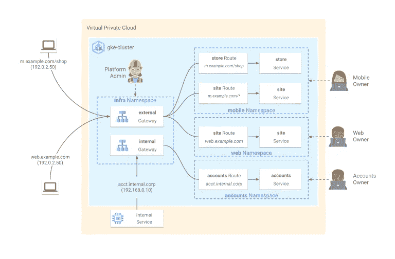

# GKE 网关控制器入门

> 原文：<https://medium.com/google-developer-experts/getting-started-with-gke-gateway-controller-ee45c3bc8996?source=collection_archive---------0----------------------->

一年前，谷歌[宣布](https://cloud.google.com/blog/products/containers-kubernetes/new-gke-gateway-controller-implements-kubernetes-gateway-api)GKE[网关控制器](https://cloud.google.com/kubernetes-engine/docs/concepts/gateway-api)的预览版，虽然最初玩起来有点酷，但它并没有提供 [Kubernetes 网关 API](https://gateway-api.sigs.k8s.io/) 当时应该带来的任何令人敬畏的、改变游戏规则的功能。然而，随着最近发布的网关 API *v0.4.3* ，GKE 网关控制器也进入了 *v1alpha2* 阶段，并带来了它必须提供的一些令人兴奋的功能，所以我在这里解释一些使用案例以及如何开始使用 GKE 网关控制器。

# 介绍

Ingress 是一个强大而有用的功能，通常用于许多 Kubernetes 部署和许多不同的实现，通过[各种 ingress 控制器](https://kubernetes.io/docs/concepts/services-networking/ingress-controllers/)实现不同的功能集。其实我之前也对比过 [NGINX Ingress 和 GKE Ingress](/@glen.yu/nginx-ingress-or-gke-ingress-d87dd9db504c) ！

传统入口的缺点在于入口资源和服务资源需要在同一个名称空间中。入口资源和它的控制器之间也有一对一的关系，这意味着所有的路由和规则都在一个大的 YAML 文件中定义。如果您是在您的集群上运行的应用程序的唯一所有者，并且您管理它的所有端点，这可能看起来没什么大不了的，但是如果您是共享租户或者不同的端点由不同的团队管理，那该怎么办呢？这里的一对一关系可能会带来一些管理上的挑战；一个团队可能会意外破坏另一个团队的路线。

Kubernetes 网关 API 引入了一些特性，这些特性允许网关(实际上是您的负载平衡器或入口控制器)和路由之间的一对多关系。这允许不同的团队各自管理自己的端点和路由。通过[跨名称空间路由](https://gateway-api.sigs.k8s.io/v1alpha2/guides/multiple-ns/)，入口和服务资源不再需要在同一个名称空间中，这意味着网关本身可以是由平台团队管理的独立名称空间，而共享网关的应用团队也将拥有自己的名称空间。

The possibilities the GKE Gateway controller can bring!

## 什么是 GKE 网关控制器？

Kubernetes Gateway API 已经被宣布为 Kubernetes 的下一代入口，并且已经有许多下游实现。GKE 网关控制器是谷歌对 Kubernetes 网关 API 的实现——毕竟，它必须集成 GCP 的功能，如云负载平衡、[网络端点组(NEGs)](https://cloud.google.com/load-balancing/docs/negs) 等。

# 部署演示

我们将部署一个非常简单的涉及跨名称空间路由的演示。

*   安装 Kubernetes 网关 API 自定义资源定义(CRD): `kubectl kustomize "github.com/kubernetes-sigs/gateway-api/config/crd?ref=v0.4.3" | kubectl apply -f -`
    ***更新****2022–12–26:*GKE 网关控制器通过
    `gcloud container clusters update CLUSTER_NAME --gateway-api=standard --region=REGION`启用
*   创建名称空间，并且必须将`shared-gateway-access`标签设置为`true`。您可以申请以下清单:`kubectl apply -f namespaces.yaml`

*   在`infra-ns`名称空间:`kubectl apply -f gateway.yaml`中部署 GKE 第 7 层全局外部负载平衡器(`gke-l7-gxlb`)网关

*   在`store-ns`名称空间中部署 *store* pods 和服务:`kubectl apply -f store.yaml`
    **注意:**我发现有必要在服务定义中显式指定使用 NEGs 的注释，尽管这应该是默认行为。

*   展开 [HTTPRoute](https://gateway-api.sigs.k8s.io/v1alpha2/api-types/httproute/) : `kubectl apply -f store-route.yaml`

**注意:**neg 的创建和路线的同步可能需要几分钟的时间，所以请耐心等待。

## 测试

您可以通过查看`kubectl describe gateway external-http -n infra-ns`的输出来获取网关的 IP 地址，也可以使用`kubectl get gateway external-http -n infra-ns -o=jsonpath="{.status.addresses[0].value}"`直接查询

之后您可以`curl`端点，但是您必须提供正确的主机头(例如`curl -H "host: store.example.com" 123.45.67.89/de`来匹配到达`store-german`后端的路由)。

## 清理

以相反的顺序在部署清单上运行`kubectl delete`。

# 下一步是什么？

上面的演示对于这篇中型文章来说是简短的，但是如果你想看完整的演示(使用内部负载平衡器)，你可以在我的[自由层 GKE 回购](https://devlibrary.withgoogle.com/products/cloud/repos/Neutrollized-free-tier-gke)中找到它(以及其他示例)。

阅读[Kubernetes API](https://gateway-api.sigs.k8s.io/v1alpha2/guides/getting-started/)入门指南，熟悉它的特性(例如[流量分流](https://gateway-api.sigs.k8s.io/v1alpha2/guides/traffic-splitting/))，这样你就可以开始思考如何使用它来提高安全性、工作流、测试等。

请记住，GKE 网关控制器仍处于预览模式，随着它向最终的 *v1beta1* 和更高版本发展，您可以期待更多的变化(可能是突破性的变化——甚至从 *v1alpha1* 到 *v1alpha2* 经历了相当多的突破性变化)。

## PSA

如果你想了解更多关于 Kubernetes、GKE 或者只是谷歌云的知识，请查看[谷歌开发库](https://devlibrary.withgoogle.com/)，这是一个与 GCP 相关的博客文章、操作方法和代码示例的宝库。

*编辑 2022–07–22:*网关 API 在 *v1beta1* (从 CRD v0.5.0 开始)