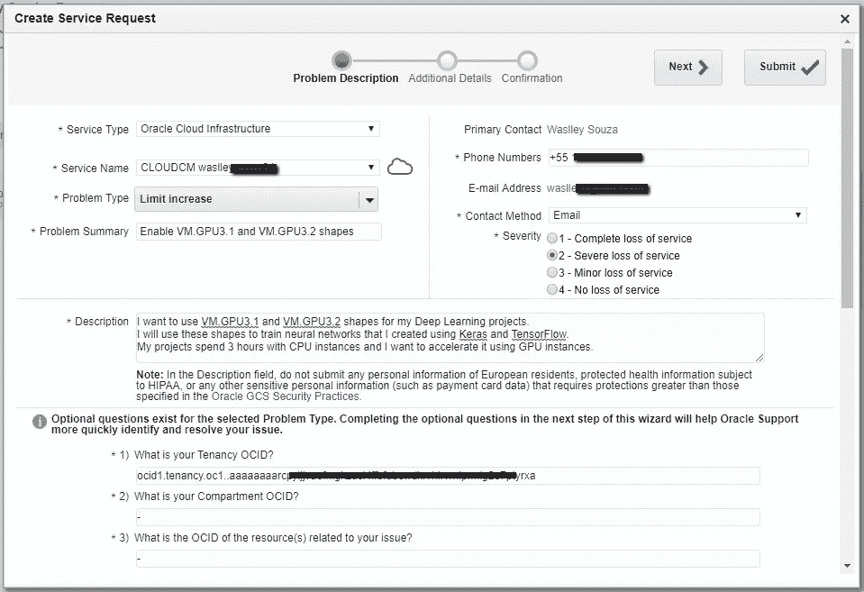
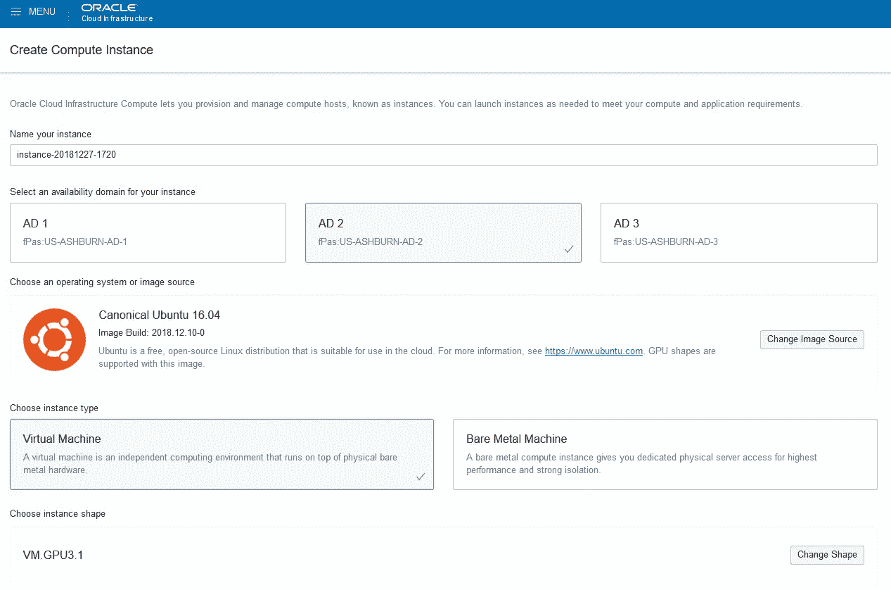

# Oracle 云中的 GPU 实例入门

> 原文：<https://medium.com/oracledevs/getting-started-with-gpu-instances-in-oracle-cloud-cb58720a4b88?source=collection_archive---------0----------------------->

如果您在某个时候正在处理人工智能(机器学习或深度学习)项目，您将需要将 CPU 实例更改为 GPU 实例，以加快模型的训练。

如今，大多数云提供商都提供 GPU 服务，你可以用它来加速你的项目。甲骨文云提供两种最先进的 GPU 型号供您选择:英伟达 V100 和英伟达 P100。


在这篇博文中，您将了解如何在 Oracle 云中请求和创建 GPU 实例。

访问您的 Oracle 云帐户，然后进入“菜单”>“管理”>“租赁详情”。


单击服务限制并展开“计算”部分。在此部分，您可以看到您帐户的限额。默认情况下，GPU 实例的限制为 0(零)。


要提高限额，您需要转到 [My Oracle Support](https://support.oracle.com) 并打开服务请求。


单击创建服务请求。


从显示的菜单中选择以下选项:

*   **服务类型:**选择 Oracle 云基础设施。
*   **服务名称:**选择您的甲骨文云账户。
*   **问题类型:**选择**账户提供、计费和终止**，然后选择**限额增加**。
*   **描述:**输入好的描述(比如:我想用 VM。GPU3.1 和 VM。我的深度学习项目的 GPU3.2 形状。我将使用这些形状来训练我使用 Keras 和 TensorFlow 创建的神经网络。我的项目在 CPU 实例上花费了 3 个小时，我想使用 GPU 实例来加速它)。
*   OCID，你的职业是什么？:输入您的**租赁 OCID** 。
*   **14)您为哪个地区和可用性领域请求此服务？:**输入**美国-阿什本**或**英国-伦敦**。
*   什么服务/资源需要限额增加？:选择**计算**。
*   上述服务的总限额是多少？:
    输入新的总限值(例如:1 代表 VM。用于虚拟机的 GPU3.1 和 1。GPU3.2)。
*   你想通过这次加薪达到什么目的？:输入请求的
    原因(例如:我想为我的深度学习项目使用 GPU 形状)。



我的严重性为 2 的服务请求在 5 小时内得到解决。


现在你可以创建你的 GPU 实例了！

从显示的菜单中选择以下选项:

*   **操作系统或镜像来源:** Canonical Ubuntu 16.04。
*   **实例形状:** VM.GPU3.1



单击“显示高级选项”，然后单击图像选项卡。
选择 gen 2-GPU-2018 . 12 . 10–0 作为您的映像构建。


点击创建！

当实例的状态变为正在运行时，获取公共 IP 地址并访问它。


要验证实例，请运行:

```
nvidia-smi
```


现在，您可以使用 Oracle 云来加速您的人工智能项目。

玩得开心！

*原载于 2018 年 12 月 28 日*[*【waslleysouza.com.br】*](http://waslleysouza.com.br/en/2018/12/getting-started-with-gpu-instances-in-oracle-cloud/)*。*