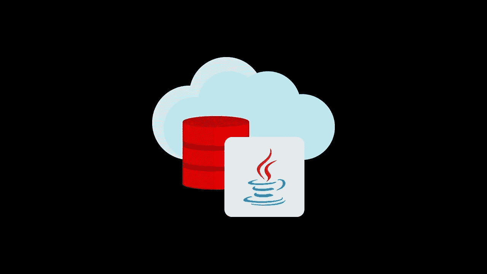

# 用 JDBC 可调用语句调用存储过程

> 原文：<https://medium.com/oracledevs/getting-started-with-invoking-stored-procedures-using-jdbc-and-callablestatement-6a247fd1957a?source=collection_archive---------1----------------------->

[Java Database Connectivity](https://www.oracle.com/database/technologies/appdev/jdbc.html)

华雷斯少年

## 介绍

这篇博客文章是一个实用的分步指南，介绍如何使用 JDBC 和 Oracle 数据库调用 [PL/SQL](https://www.oracle.com/ie/database/technologies/appdev/plsql.html) 。另一个令人兴奋的选择是使用 [Java 存储过程](https://docs.oracle.com/en/database/oracle/oracle-database/21/jjdev/developing-Java-stored-procedures.html)。您可以用与 PL/SQL 相同的方式运行它们，但这将是未来博客文章的主题。