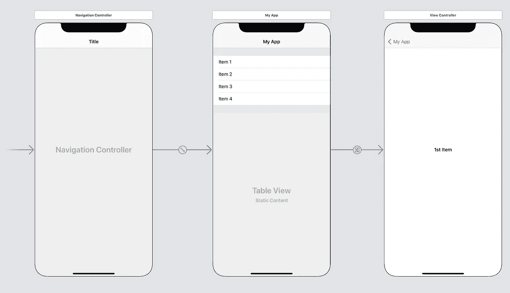

# iOS UI 测试入门

> 原文：<https://medium.com/capital-one-tech/getting-started-with-ios-ui-testing-b85bf858496f?source=collection_archive---------4----------------------->

## *你的 iOS 应用的 UI 测试保证你的用户得到你最好的体验，并给你对代码的信心*


因此，您的 iOS 应用程序经过了全面的单元测试，这意味着您可以保证您的业务逻辑功能符合您的预期。但是你的移动用户体验到的视图呢？你如何保证你展示的信息是你认为你是谁？单元测试视图是不合适的，但是对于 iOS 应用程序来说，UI 测试不是很脆弱并且很难开始吗？与单元测试相比，UI 测试确实需要更长的时间，使用更多的资源。(这就是为什么你应该使用单元测试来测试你所有的代码——他们擅长于此。)但自动化 UI 测试比手动测试你的每个应用的体验花费的时间和资源少得多，并且在 Xcode 中开始 iOS UI 测试可能比你预期的更简单。

你不需要做一个大爆炸，考虑增加一些快乐路径测试来防止回归。然后，随着您对新测试的信心的增加，在您创建新特性的时候，逐渐增加新的测试。在这篇文章中，我将介绍如何开始编写您的第一个测试，以及如何让 Xcode 帮助您获得知识和信心。我还会给你一些在引入更多测试时要考虑的要点，比如你可以添加的测试类型和它们擅长什么，以及如何最好地构建你的测试。

# 编写您的第一个 UI 测试

在 Xcode 的导航器面板中，打开测试导航器。然后，在左下方，单击+按钮，并选择“新建 UI 测试目标”。


这里的默认值很可能是正确的，但是如果您的项目有多个目标，请检查您是否将测试添加到了正确的目标中。在文件检查器中，您会看到 Xcode 已经创建了一个新的 UITests 组，其中包含一个示例测试文件。


为了简单起见，让我们删除类定义中的所有内容，这样您将得到如下内容:

```
import XCTest

class My_Sample_AppUITests: XCTestCase {

}
```

现在来创建我们的测试。与单元测试一样，测试函数必须以单词`test`开头，所以让我们创建一个新函数。

```
func test_myFirstTest() {

}
```

我们需要做的第一件事是告诉我们的应用程序启动。我们用`XCUIApplication().launch()`来做这件事，但是我们希望保留应用程序引用以备后用，所以让我们继续把它添加到我们的新测试函数中。

```
let app = XCUIApplication()
app.launch()
```

如果您现在运行此测试，您将看到您的应用程序已启动，并且测试通过。下一个阶段是与我们的应用程序进行交互。

## 如何让你的测试导航你的应用

下一步是浏览我们的应用程序。首先学习这个的最好方法是让 Xcode 为我们做这件事。将光标放在新的测试函数中，位于启动应用程序的调用下方。你会在 Xcode 的底部栏看到一个红色的“录制”按钮。点击此按钮。Xcode 会执行您的测试，直到光标所在的位置，然后暂停。现在，您在应用程序中执行的任何操作都会被 Xcode 记录在代码中。


例如，我创建了一个非常简单的主/详细应用程序，它有一个表格视图，可以推送到一个详细视图，显示用户在表格上点击的值。该应用程序有四个项目，标记为 1-4。



对于我的测试，我想点击项目 1，并检查“第一个项目”是否显示在详细信息屏幕上。我将导航回来，然后对第 4 项进行同样的操作。因此，我将在模拟器中执行这些导航操作。下面是完整的测试函数，包括 Xcode 为我编写的代码。

```
func test_myFirstTest() {
        let app = XCUIApplication()
        app.launch()

        let app = XCUIApplication()
        let tablesQuery = app.tables
        tablesQuery.staticTexts["Item 1"].tap()

        let myAppButton = app.navigationBars["UIView"].buttons["My App"]
        myAppButton.tap()
        tablesQuery.staticTexts["Item 4"].tap()
        myAppButton.tap()
    }
```

显然，这需要稍微整理一下，但是如果我们去掉为我们添加的第二个`let app = XCUIApplication()` Xcode，我们现在就有了一个功能测试。测试重复了我们刚才执行的动作，但是它仍然没有断言屏幕上的任何内容。接下来让我们添加这些。

## 用你的测试检查你的屏幕

让我们深入了解 Xcode 刚刚为我们编写的一些导航代码:

```
let tablesQuery = app.tables
tablesQuery.staticTexts["Item 1"].tap()
```

这段代码的大部分，在`.tap()`之前的所有内容都是一个元素查询。我们代码中的一个请求，要求测试运行人员在屏幕上找到一个元素。这个元素在我们的测试中是不存在的，除非我们对它做些什么。这可能是与元素的交互，如上所述，也可能是检查元素的属性。我们知道应该有四个单元格标记为 Item 1 - 4，所以让我们为它们写一个断言。我们这样做的方式与我们在单元测试中断言某些东西的方式相同。

```
XCTAssert(tablesQuery.staticTexts["Item 1"].exists)
XCTAssert(tablesQuery.staticTexts["Item 2"].exists)
XCTAssert(tablesQuery.staticTexts["Item 3"].exists)
XCTAssert(tablesQuery.staticTexts["Item 4"].exists)
```

让我们为细节屏幕上的标签添加一些断言，并整理代码，这就是我们完成的测试。

```
func test_myFirstTest() {
        // element queries
        let app = XCUIApplication()
        let mainTable = app.tables

        let item1Cell = mainTable.staticTexts["Item 1"]
        let item2Cell = mainTable.staticTexts["Item 2"]
        let item3Cell = mainTable.staticTexts["Item 3"]
        let item4Cell = mainTable.staticTexts["Item 4"]

        let item1Label = app.staticTexts["1st Item"]
        let item4Label = app.staticTexts["4th Item"]

        let backButton = app.navigationBars["UIView"].buttons["My App"]

        // test
        app.launch()

        // check cells
        XCTAssert(item1Cell.exists)
        XCTAssert(item2Cell.exists)
        XCTAssert(item3Cell.exists)
        XCTAssert(item4Cell.exists)

        // navigate to detail
        item1Cell.tap()

        // check screen
        XCTAssert(item1Label.exists)

        // navigate to another detail
        backButton.tap()
        item4Cell.tap()

        // check screen
        XCTAssert(item4Label.exists)
}
```

## 如何为未来的扩展构建测试

在上面的测试中，您可能会注意到，在测试开始时，我们有大量的项目查询。随着我们添加更多的测试，我们可能会想要重用它们，并且可能会添加到它们中。

以及我们在屏幕上执行的操作，看起来在整个测试中会有很多重复。[机器人测试模式](/capital-one-tech/robot-pattern-testing-for-xcuitest-4c2f0c40b4ad)是为 UI 测试创建可重用构建模块的一个很好的答案，它不仅减少了重复，而且将测试分解成易于遵循的步骤，即使对于那些不熟悉阅读代码的人来说也是如此。

# 用户界面测试的类型

有许多不同风格的 UI 测试。通常我们都称它们为“UI 测试”，但实际上它们在重要方面是不同的，因为它们有不同的功能和不同的复杂性。我认为在这个阶段，在开始你的项目之前，知道不同类型的 UI 测试之间的区别是很重要的。通过这种方式，您可以构建具有特定用途的测试，这意味着更一致、更可靠的测试。

## 存根 UI 测试

存根 UI 测试与编写良好的单元测试有一个相似的原则:提取被测试内容之外的任何内容。像网络请求、用户默认设置、存储的文件和数据库之类的东西——应用程序代码本身之外的任何东西。这是我建议开始任何新的 UI 测试项目的地方。存根部分确实意味着设置这些测试的成本更高，但最终的测试将更可靠，故障也更容易跟踪。提取任何外部依赖项允许您隔离应用程序代码的任何故障。这些测试的确切范围可以由您决定——您可以将范围保持得非常窄，类似于单元测试，并检查单个屏幕或者单个组件。但是考虑到 UI 的一个重要部分是你的用户与你的屏幕交互的方式。我推荐范围稍微大一点的测试，通过一条路径导航，边走边检查屏幕。几乎就像是对一个特性的端到端测试。

我不会在这里告诉你具体如何存根你的外部项目，因为这真的取决于你的应用程序是如何架构的。但是这里有一些你可以考虑的选择:

*   将服务器集成到您的应用程序中，以返回存根网络响应。
*   在应用程序外部设置一个服务器，通过从测试代码发送网络请求来返回可控制的存根响应。
*   剔除应用程序中提供网络响应或其他数据的某些代码，并使用启动参数控制这些存根。

## E2E 测试

端到端测试允许您检查应用程序的完全集成，不仅仅是您的 iOS 代码，还包括您的服务器代码。E2E 测试真正触及到返回真实数据的真实服务器。虽然这听起来好像没有设置开销，但在测试中，你需要确保你的应用程序从你接触的任何服务接收的数据是可靠的。也许你需要提供特定的账户状态，你还需要确保应用程序中存储的任何数据都是一致的。根据您的应用程序，这可能很重要，并且可能需要持续的维护，而 stubbing 可以消除这种维护。当您发出真实的网络请求时，这些测试也将是运行时间最长、最不可靠的。所以要明智地使用它们。然而好处是，这些测试尽可能接近你的用户在使用你的应用时的体验。

## 快照/截图测试

快照测试对于防止回归非常有用。UI 测试关心信息是否显示在屏幕上，但是它不关心信息是否显示在正确的位置，正确的顺序，或者正确的颜色。通过快照测试，您的测试可以导航您的应用程序并截图。如果此屏幕截图不同于已知良好的参考，则您的测试失败。

截图测试不是 XCTest 内置的特性，但是可以使用来自 [Point Free](https://www.pointfree.co/episodes/ep41-a-tour-of-snapshot-testing) 的 [SnapshotTesting](https://github.com/pointfreeco/swift-snapshot-testing) 库来添加。

## 其他应用

Xcode 具有评估应用性能的内置功能，包括诸如[启动时间](https://www.avanderlee.com/optimization/launch-time-performance-optimization/)、[内存使用量](https://developer.apple.com/documentation/xcode/preventing-memory-use-regressions)和[动画性能](http://www.wwdcnotes.com/notes/wwdc20/10077/)等措施。UI 测试评估应用程序屏幕的方式与辅助技术相同，所以任何写得好的测试也是一个可访问性测试，但是如果你想更进一步，A11yUITests 库可以提供帮助。

# UI 测试提示

为了帮助你继续构建你的应用程序的 UI 测试覆盖率，有一些提示可能会有所帮助。

## 禁用动画

禁用动画并不意味着你正在测试的应用不会完全是你的客户将会看到的体验，但它仍然会非常接近，并且好处是更快和更可靠的 UI 测试。在你的 app 代码集中`UIView.setAnimationsEnabled(false)`。我建议将它放在一个编译器宏中，这样就可以在发布版本之外进行编译。

## 失败后继续

一般来说，我们希望测试很快失败，但有时，比如当您编写测试或调试失败时，在失败后继续是可取的。`XCTestCase`拥有财产`continueAfterFailure`。将此设置为`true`，以便在发现故障后继续测试，但是我建议在管道测试运行中，将此设置保持为`false`。默认情况下，苹果将此设置为`true`。

## 等待元素

如果你在屏幕上显示某个东西之前等待动画或网络服务返回，那么`XCTAssert(item1Cell.exists)`将不起作用。相反，你可以使用一旦物品出现在屏幕上就会实现的期望。使用这些，我们对`item1Label`的期望如下:

```
let predicate = NSPredicate(format: "exists == true")
let expectation = XCTNSPredicateExpectation(predicate: predicate, object: item1Label)
let result = XCTWaiter.wait(for: [expectation], timeout: 5)
XCTAssertEqual(result, .completed)
```

## 通过标识符查找元素

在你的应用程序代码中，每个视图都有一个名字令人困惑的属性`accessibilityIdentifier`。设置此项允许您通过该 ID 查找视图，而不是搜索整个文本。这可以使元素查询更快、更可靠。如果您的应用程序是本地化的，这意味着您的测试可以在任何本地化的语言中运行。如果您确实使用了这种技术，请记住在元素的标签上断言，以确保您呈现的是您认为的字符串。对于下面的示例测试代码，我们已经在应用程序代码中设置了`itemLabel.accessibilityIdentifier = "Item1"`。

```
let item1Label = app.staticTexts["Item1"]
XCTAssertEqual(item1Label.label, "1st Item")
```

# 通过测试建立对应用的信心

UI 测试是一种强有力的方法，可以确保您为用户提供您认为的体验，同时避免耗时和重复的手动测试。和任何项目一样，启动都是有成本的，但 Xcode 有助于让它尽可能无缝。我相信，一旦你走到这一步，你就会被 UI 测试的好处所打动。你的用户，以及你的产品所有者，会为此感谢你的。您将有信心对您的应用程序进行更改，因为您知道您的测试将在任何问题变成 bug 之前发现它们。

[*技术向量*](https://www.freepik.com/vectors/technology) *由 vectorjuice 创建—*[*【www.freepik.com】*](http://www.freepik.com)

*披露声明:2021 资本一。观点是作者个人的观点。除非本帖中另有说明，否则 Capital One 不隶属于所提及的任何公司，也不被这些公司认可。使用或展示的所有商标和其他知识产权是其各自所有者的财产。*

*原载于*[*https://www.capitalone.com*](https://www.capitalone.com/tech/software-engineering/getting-started-with-ios-ui-testing/)*。*