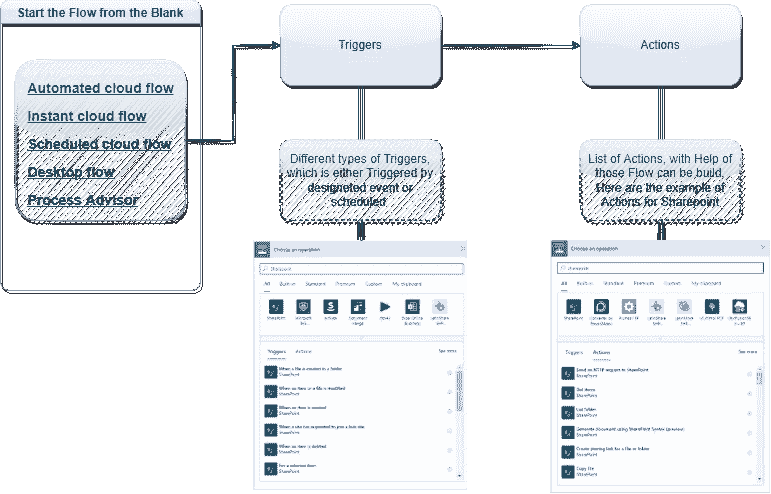

# 开始使用 Microsoft Power Automate

> 原文：<https://medium.com/globant/getting-started-with-microsoft-power-automate-a8b06cfb6b7b?source=collection_archive---------0----------------------->

[Power Automate](https://powerautomate.microsoft.com/en-us/) ，原名 Microsoft Flow，是一款在线工具，用于在应用和服务之间构建自动工作流，以同步文件、获取通知和收集数据。它是微软 365 应用程序和插件的一部分。

这篇文章有助于在 Flow 的帮助下通过无代码方法开发自动化解决方案。任何熟悉微软 office 等办公套件基础的人都可以构建流程来自动化他们的日常工作。

# Power Automate 的用例示例

Power Automate 足够强大，可以用作连接 PowerApps 和后端服务的层。目前，Flow 可以连接 3000 多种服务，通过自定义连接器，您可以连接任何在线或内部服务。

在某些情况下，自动化流程包括:

*   **收到 Outlook 邮件附件后，保存到 OneDrive** 。Power Automate 可以保存发送到相应 SharePoint 文件夹的任何与客户端相关的附件。因为它将保存在适当的文档库中，所以您将花费更少的时间来搜索电子邮件以发现您需要的内容。
*   **控制节假日的申请和审批**。为了有效地管理全年的休假，拥有自动化的批准过程将是有利的。当一名员工试图离开时，Power Automate 会自动向经理发送请求，然后通知经理如何回应。
*   利用团队提醒员工并请求批准新文件。发送重要文件可能需要批准，这可能是一个耗时的过程，并且需要联系多名工作人员。当新文档提交到 SharePoint 时，可以使用 Power Automate 随时寻求批准，以自动执行此过程。一旦完成，团队通知团队成员。这种应用的一个例子是:一个项目可能从许多文档开始，这些文档必须被创建、批准和传输，然后才能继续进行。您可以创建必要的文件，将它们放在 SharePoint 文件中，然后 Microsoft 团队会立即通知必要的团队成员，该文档需要他们的批准。一旦批准完成，他们可以采取进一步的行动，你会得到通知。
*   记录你的在线提及。定期收集提及您的企业或特定产品的热门推文可能是您工作的一部分。但是手动操作会花费很多时间。如果一条推文包含特定的关键字，并且被转发超过 20 次，Power Automate 可以发送推送通知。例如，这可能会被品牌提及激活，使您能够跟踪您的品牌在社交媒体上的效果。要使用此模板，必须安装 Power Automate 程序。
*   **配置一个 CRM 系统，发送关于财务运营和销售数据的每周通知。**在这种情况下，Flow 将自动发送每周电子邮件，以显示财务运营和销售数据。该流程可以被修改和定制以包括其他相关信息。
*   **在两个云数据源之间复制文件。**比如可以在 Dropbox 和 SharePoint 之间复制文件；每当您在其中一个中创建一个新的时侯，都可以这样做，它会自动复制到另一个中。

# 它是如何工作的

举个例子，如果我们想从 SharePoint 上的文件中读取一些信息，并向团队中的个人发送一条关于 Microsoft 团队的消息。为了自动化这种情况，Power Automate 需要与 SharePoint 和 MS 团队建立联系。因此，要建立连接，需要连接器和它们各自的可用动作，在此帮助下，我们可以创建一个自动化流程。

有超过 150 个[数据源](https://learn.microsoft.com/en-us/power-automate/add-manage-connections)(或[连接器](https://learn.microsoft.com/en-us/connectors/))可用。在连接器/数据源的帮助下，我们可以收集数据、同步文件、获取通知等。通过使用连接器，我们可以构建一个定制的多步骤流程，或者从数百个模板中进行选择。建议:如果你找不到某个模板，尝试一下 [Power Automate 食谱](https://medium.com/r?url=https%3A%2F%2Fpowerusers.microsoft.com%2Ft5%2FPower-Automate-Cookbook%2Fbd-p%2FMPA_Cookbook)。

一旦在 Power Automate 中配置了一个流程，它就会在后台完成所需的自动化任务，上传文件，并通知您特定的通知。

Power Automate 中的工作流依赖于触发事件。可能会发生以下任何一种情况:

How Power Automate works.

*   [计划的](https://learn.microsoft.com/en-us/power-automate/run-scheduled-tasks) —创建每天、每小时或每分钟执行一次一项或多项任务的云流。在指定的日期，经过指定的天数、小时数或分钟数。
*   [即时(也就是点击按钮)](https://learn.microsoft.com/en-us/power-automate/mobile/run-instant-flows) — [在 Power Automate 中创建即时流](https://learn.microsoft.com/en-us/power-automate/introduction-to-button-flows#introducing-instant-flows)，然后它可以在任何时候从您的移动设备上的任何地方运行。即时流以前被称为按钮流。
*   [自动化流程](https://learn.microsoft.com/en-us/power-automate/get-started-logic-template)——开始的一个好方法是使用一个适合你组织场景的模板。您可以从一组模板中选择最适合您的方案的模板。搜索[所有模板](https://flow.microsoft.com/templates/)或按类别浏览以找到您的场景，然后按照模板中的步骤从模板创建云流。
*   [桌面流程](https://learn.microsoft.com/en-us/power-automate/desktop-flows/introduction) — Power Automate 通过桌面流程功能变得更加广泛，使您能够自动化所有重复的桌面流程。借助全新的直观 Power Automate 桌面流程设计器，使用预构建的拖放操作或记录您自己的[桌面流程](https://learn.microsoft.com/en-us/power-automate/desktop-flows/create-flow)以供以后运行，实现自动化比以往任何时候都更快、更容易。

**微软流程的组成:**

*   [**连接器**](https://learn.microsoft.com/en-us/connectors/) —通过数据网关连接服务我们可以连接到本地应用程序。我们也可以创建自定义连接器
*   [**触发器**](https://learn.microsoft.com/en-us/power-automate/triggers-introduction) —触发器是在发生时启动流程的事件。流也可以手动触发或调度。
*   [**动作**](https://learn.microsoft.com/en-us/power-automate/multi-step-logic-flow) —流程执行的动作/作业，如获取、列表、创建、编辑等。
*   [**条件**](https://learn.microsoft.com/en-us/power-automate/add-condition) —执行流动动作所依赖的条件
*   [**模板**](https://powerautomate.microsoft.com/en-us/templates/) —现有流程模板，快速创建常用流程。
*   [**批准**](https://learn.microsoft.com/en-us/power-automate/get-started-approvals) —批准是批准流程中某些事情的一种方式。

# 摘要

Power Automate 是一个无代码/低代码平台，用于在应用程序和云服务之间创建自动化工作流，以同步文件、获取通知和收集数据。已经有预定义的连接器和模板可以帮助以更快的方式创建自动化。

# 支持资源

以下是 Microsoft 文档链接，它们有助于引导您探索 Power Automate 中的更多内容。

*   [入门](https://docs.microsoft.com/en-us/power-automate/getting-started)
*   [介绍视频](https://www.youtube.com/watch?v=hCuxuUaGC6Y)
*   [微软 Power Automate 概述](https://www.youtube.com/watch?v=CdXBL7CfwVE&t=8s)
*   [微软学习](https://docs.microsoft.com/en-us/learn/browse/?products=power-automate&term=Power%20Automate)
*   [电力自动化论坛](https://powerusers.microsoft.com/t5/Microsoft-Power-Automate/ct-p/MPACommunity)
*   [电力自动化食谱](https://powerusers.microsoft.com/t5/Power-Automate-Cookbook/bd-p/MPA_Cookbook)
*   [Power Automate 模板](https://us.flow.microsoft.com/en-us/templates/)
*   [Power Automate 博客](https://flow.microsoft.com/en-us/blog/)
*   [常见问题解答](https://docs.microsoft.com/en-us/power-automate/frequently-asked-questions)
*   [支持](https://us.flow.microsoft.com/en-us/support/)