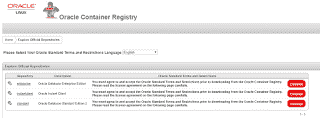

# Docker 容器中的 Oracle 数据库入门！

> 原文：<https://medium.com/oracledevs/getting-started-with-oracle-database-in-a-docker-container-c8234f93320d?source=collection_archive---------0----------------------->

使用 Docker 的好处之一是快速简单的配置。我想亲自了解一下这是否能帮助我在开发环境中快速启动和运行 Oracle 企业版数据库。Oracle 在 Oracle [容器注册表](https://container-registry.oracle.com/)中为其标准版和企业版数据库提供 Docker 映像。Lucas Jellema 已经提供了两篇关于这个问题的博客([这里](https://technology.amis.nl/2017/11/17/quick-introduction-to-oracle-container-registry-running-one-of-oracles-prebaked-images/)和[这里](https://technology.amis.nl/2017/11/18/run-oracle-database-in-docker-using-prebaked-image-from-oracle-container-registry-a-two-minute-guide/))，这是一个有用的起点。在这篇博客中，我将描述一些我要做的选择和遇到的挑战。总而言之，我对注册表中的 Docker 映像非常满意，因为它们提供了一种非常简单的方法来自动安装 EE 数据库。你可以在这里找到一个安装了 Docker 和 Docker 命令来执行[的浮动配置 shell 脚本，以及关于如何使用它的描述](https://github.com/MaartenSmeets/provisioning/blob/master/provision.sh)[这里](http://javaoraclesoa.blogspot.nl/2017/10/quickly-create-virtualbox-development.html)。

# 码头工人

在 Oracle Linux 7 上安装 Docker

## 为什么是码头工人

为这个博客做准备是我在研讨会之外的第一次真正的码头经验。在这个练习中，我主要欣赏 Docker 的好处是

*   Docker 使用[半虚拟化](https://monkeyvault.net/docker-vs-virtualization/)，它比 VirtualBox 或 VMWare 上的完全虚拟化更加轻量级。
*   如果您有 Docker 映像或 Docker 文件，那么在容器中安装产品已经完全脚本化了。有很多图片和 docker 文件可用。也由 Oracle 等软件供应商提供和支持。
*   Docker CLI 非常用户友好。例如，您可以丢弃您的容器并创建一个新的，或者停止它并在以后再次启动它。在容器中启动 shell 也很容易。例如，与 VBoxManage 进行比较。

为了在 Oracle Linux 7 上安装 Docker，您需要做一些如下所述的事情。

## 准备文件系统

默认情况下，Docker 映像/容器创建在/var/lib/docker 中。您不需要为此专门创建一个文件系统，但是， [Docker 在 BTRFS](https://docs.docker.com/engine/userguide/storagedriver/btrfs-driver/) 类型的文件系统上运行良好。然而，在 Oracle Linux 上[不支持](https://docs.docker.com/engine/userguide/storagedriver/btrfs-driver/)。Docker 有两个版本。Docker CE 和 Docker EE。Docker CE 没有通过甲骨文 Linux 的[认证](https://www.docker.com/docker-oracle-linux)，而 EE 通过了认证。对于 Docker CE，BTRFS 只推荐在 Ubuntu 或 Debian 上使用，对于 Docker EE，BTRFS 只支持在 SLES 上使用。

如果您确实想使用 BTRFS 分区(风险自担)，并且想使用 Kickstart 自动安装操作系统，您可以这样做:

零件 btrfs.01 —尺寸=1000 —增长

Bt rfs/var/lib/docker-label = docker Bt rfs . 01

查看完整的 Kickstart 示例[此处](https://github.com/MaartenSmeets/provisioning/blob/master/packer/ol74_http/ks.cfg)为 Oracle Linux 7，以及博客关于如何使用 Kickstart 文件与 Packer [此处](http://javaoraclesoa.blogspot.nl/2017/10/quickly-create-virtualbox-development.html)。

Oracle Linux 7 中默认启用的存储库中不存在启用存储库 Docker。您可以通过以下方式自动启用它们:

yum-config-manager-启用 ol7_addons

yum-config-manager-启用 ol7_optional_latest

yum-config-manager-启用 ul7_uekr4

## 安装 Docker

安装 Docker 只需一个命令:

yum install docker-engine Bt rfs-progs Bt rfs-progs-devel-y

如果您不使用 BTRFS，您可以不使用这些包。

## 启动 Docker 守护进程

Docker CLI 与需要运行的守护程序对话。启动守护进程并使其在引导时启动可以通过以下方法完成:system CTL start docker system CTL enable docker

## 允许用户使用 Docker

您可以将用户添加到 docker 组，以便允许其使用 docker。但是，这是一种不好的做法，因为用户可以获得系统的超级用户访问权限。允许非 root 用户执行 docker 的方式在[这里](http://www.projectatomic.io/blog/2015/08/why-we-dont-let-non-root-users-run-docker-in-centos-fedora-or-rhel/)描述。您允许用户使用 sudo 执行 docker 命令，并为 docker 命令创建一个别名来执行 sudo docker。您还可以调整 docker 命令，只允许访问特定的容器。

添加到/etc/sudoers

Oracle ALL =(ALL)no passwd:/usr/bin/docker

创建以下别名

别名 docker="sudo /usr/bin/docker "

# Oracle 数据库

## 选择版本

为什么不是 XE？

我的目的是从零开始自动完成 SOA 套件的安装。在之前的博客中，我描述了如何开始使用 Kickstart，vagger，Packer 来准备操作系统。在那篇博文中，我以安装 XE 数据库作为结束。安装完 XE 数据库后，需要运行存储库创建实用程序(RCU)来为 SOA 套件创建表空间、模式、表等。这里我不能继续我的自动安装，因为 RCU 想要创建物化视图。但是，高级复制选项不是当前版本 XE 数据库的一部分。没有自动的方法让安装程序跳过错误并继续，就像您通常手动安装一样。我需要一个非 XE 版本的数据库！然而，数据库的其他版本在安装和自动化方面更为复杂。例如，您需要安装数据库软件、配置监听器、创建数据库、创建脚本以便在操作系统启动时启动数据库。不是 DBA(也没有成为 DBA 的野心)，这不是我想投入太多时间的事情。

进入 Oracle 容器注册表！

Oracle Container Registry 包含企业版和标准版数据库的预配置映像。容器注册表还包含关于如何使用这些图像的有用信息。标准版数据库至少使用 4Gb 内存。企业版数据库有一个精简版本，功能较少，但只使用 2Gb 的 RAM。苗条的形象也小了很多。只有大约 2Gb 可以下载，而不是将近 5Gb。标准版可以使用配置文件中的密码进行配置，而企业版使用默认密码“Oradoc_db1”。Docker 映像可以为其数据文件使用一个挂载的共享。

创建一个帐户并接受许可证

为了使用容器注册表，您必须首先创建一个帐户。接下来，您必须登录并接受特定映像的许可证。这已经在[这里](https://technology.amis.nl/2017/11/17/quick-introduction-to-oracle-container-registry-running-one-of-oracles-prebaked-images/)描述过了，非常简单。

在你完成了这些并且如上所述安装了 Docker 之后，你就可以开始使用镜像并创建容器了！

## 开始使用图像并创建一个容器

首先，您必须从您的操作系统登录到容器注册表。这可以使用如下命令来完成:

docker 登录-u Maarten . smeets @ amis . nl-p XXX container-registry.oracle.com

XXX 不是我的真实密码，我也不是无意中把它提交给 GitHub 的。您应该在这里使用您为容器注册表创建的帐户。

我创建了一个包含一些设置的小配置文件(db_env.dat)。这些是目前可以从单独的配置文件中获得的所有配置选项。该文件包含以下 4 行内容:

DB_SID=ORCLCDB

DB_PDB=ORCLPDB1

DB_DOMAIN=localdomain

DB_MEMORY=2GB

接下来，您可以提取图像并使用它运行一个容器:

docker run-d-env-file db _ env . dat-p 1521:1521-p 5500:5500-it-name docker db container-registry . Oracle . com/database/enterprise:12 . 2 . 0 . 1-slim

p 选项指定端口映射。我希望端口 1521 和端口 5500 映射到我的主机(VirtualBox，Oracle Linux 7)操作系统。

您可以使用以下命令查看容器是否启动并运行:

docker ps

您可以在容器内部启动一个 shell:

docker exec -it dockerDB /bin/bash

我可以使用以下命令轻松停止数据库:

码头停止码头

然后重新开始

docker 开始 dockerDB

如果要连接到容器内部的数据库，可以使用 ORCLPDB1.localdomain 用户 SYS 密码 Oradoc_db1 主机名 localhost(在 VirtualBox 机器上运行时)端口 1521 的服务。对于 RCU，我从 RCU 配置向导中创建了一个 Oracle Wallet 文件，并使用它来自动化 RCU 并在容器数据库中安装 SOA 套件所需的工件。此处见[。](https://github.com/MaartenSmeets/provisioning/tree/master/software)

# 最后

我很惊讶使用注册表中的 Docker 图片是如此的简单。安装并准备好 Docker 本身需要做更多的工作。基于映像创建容器后，使用 Docker CLI 管理它也非常容易。作为一名开发人员，这让我非常高兴，我推荐其他开发人员尝试一下！如果你想在更大的范围内使用这些图片，还是有一些挑战的。

## 可能的有限配置

许多客户使用不同的标准。Docker 映像带有特定的配置，并且只能通过配置文件以(非常)有限的方式进行配置(如上所示)。您可以挂载一个外部目录来存储数据文件。

## 功能限制

此外，Docker 容器数据库只能运行一个实例，不能打补丁，并且不支持 Dataguard。我可以想象，在生产中，无法修补数据库可能是一个问题。但是，您可以用新版本替换整个映像，并希望新版本仍然可以使用旧的数据文件。不过，你得检查一下这个。

## 在同一台机器上运行多个容器是低效的

如果在同一台机器上同时运行多个 Oracle 数据库容器，您将无法从多租户特性中受益，因为每个容器都运行自己的容器和可插拔数据库。每个容器都运行自己的监听器。

*原载于 2017 年 12 月 30 日*[*【javaoraclesoa.blogspot.com】*](https://javaoraclesoa.blogspot.nl/2017/12/getting-started-with-oracle-database-in.html)*。*