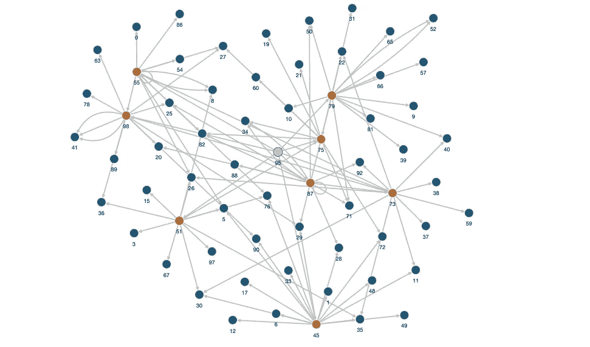
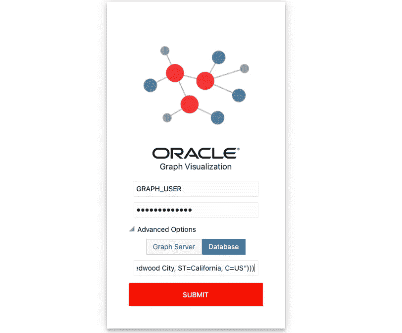
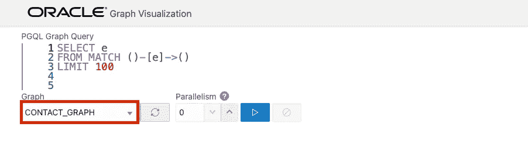
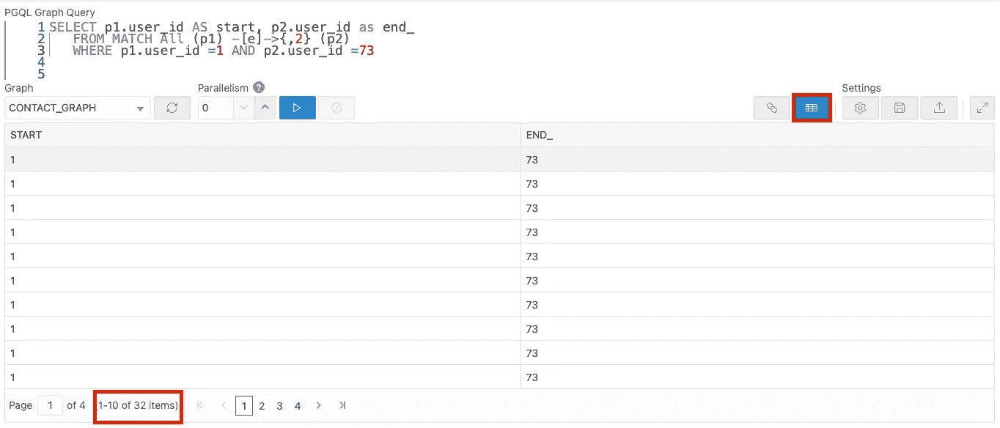
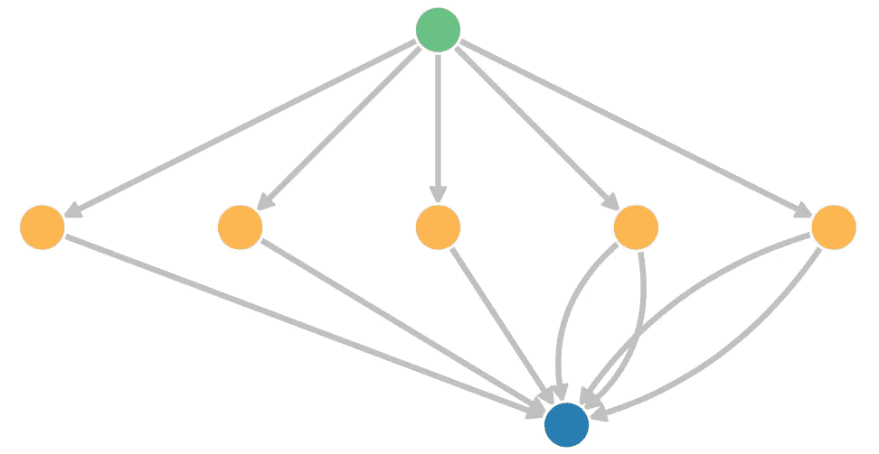

# Oracle 图形服务器和客户机入门

> 原文：<https://medium.com/oracledevs/getting-started-with-oracle-graph-server-and-client-43e458253fec?source=collection_archive---------5----------------------->

在本文中，我们将探索一个简单的用例来开始使用 Oracle Graph Server 和 Client。



# 先决条件

本文假设您已经有了一个 **Oracle 数据库，并为该数据库**配置了 Graph Server。如果您还没有这样做，您可以按照[的这些步骤](/@rahultasker/deploy-oracle-graph-on-oci-with-autonomous-database-without-a-database-wallet-15708145c8a4)在 Oracle Cloud 上部署带有自治数据库的图形服务器/客户端市场映像，或者按照我们的[官方文档](https://docs.oracle.com/en/database/oracle/property-graph/21.2/spgdg/oracle-graph-server-and-client-installation.html)部署图形服务器/客户端。

我们还假设您已经**创建了一个数据库用户，该用户拥有图形**的必要权限。如果没有，如果您使用自治数据库，您可以遵循这些步骤[;如果您使用自我管理的 Oracle 数据库，您可以遵循这些步骤](/@rahultasker/deploy-oracle-graph-on-oci-with-autonomous-database-without-a-database-wallet-15708145c8a4)[。](https://docs.oracle.com/en/database/oracle/property-graph/22.2/spgdg/basic-steps-using-oracle-database-authentication.html)

您已经在 Graph Server VM 上安装了**SQL 和必要的包**。默认情况下，Oracle Marketplace 映像已经安装了此功能。如果你有一个自我管理的数据库，你可以安装[这个 PL/SQL 包](https://docs.oracle.com/en/database/oracle/property-graph/22.2/spgdg/installing-pl-sql-packages-oracle-database.html)到你的数据库；点击[此处](https://www.oracle.com/tools/downloads/sqlcl-downloads.html)下载 SQL，点击[此处](https://docs.oracle.com/en/database/oracle/sql-developer-command-line/20.2/sqcug/using-pgql-plug-sqlcl.html#GUID-E0EFA43F-003F-4C8C-8056-54E9A428B8B7)下载 SQL 的 PGQL 插件。

# 创建数据库表

1.  使用支持图形的用户连接到 Oracle 数据库。有关连接到 Oracle 数据库的说明，请参见此[文档](https://docs.oracle.com/en/database/oracle/oracle-database/tutorial-create-conn/index.html?opt-release-19c)。要连接到自治数据库，请参见本[文档](https://docs.oracle.com/en/cloud/paas/atp-cloud/atpgs/autonomous-connect-sql-developer.html#GUID-14217939-3E8F-4782-BFF2-021199A908FD)。
2.  创建以下表格:

```
create table users_table(
   user_id         NUMBER(4),
   first_name      VARCHAR2(50),
   last_name       VARCHAR2(50),
   gender          VARCHAR2(50),
   date_of_birth   TIMESTAMP(3),
   phone_number    VARCHAR2(50),
   infected        VARCHAR2(50),
   date_diagnosis  TIMESTAMP(3),
   constraint pk_uid primary key (user_id)
);create table contacts(
   contact_id      NUMBER(4),
   reporting_user  NUMBER(4),
   contact_user    NUMBER(4),
   contact_start   TIMESTAMP(3),
   contact_end     TIMESTAMP(3),
   infectious_start TIMESTAMP(3),
   infectious_end  TIMESTAMP(3),
   constraint pk_cid primary key (contact_id),
   constraint FK_rep_user
      FOREIGN key (reporting_user) references users_table(user_id),
   constraint FK_con_user
      FOREIGN key (contact_user) references users_table(user_id));
```

`users_table`将代表该图中的所有顶点。`contacts`表将代表该图中的所有边。

# 加载数据

1.  下载[这个 zip 文件](https://objectstorage.us-ashburn-1.oraclecloud.com/p/p3AFrSMppUbwMnKlfO1258cI2n4w-vWfW0cp1gRbP8B-nv2Fb_ZvC-zGVUS30bfQ/n/oradbclouducm/b/contact-tracing-blog/o/oracle_graph_server_contact_tracing.zip)，其中包含每个表的 csv 文件。
2.  将`users.csv`载入`users_table`，将`contacts.csv`载入`contacts`。这可以通过 SQL Developer 来完成，这里的[给出了一个例子](https://docs.oracle.com/database/121/ADMQS/GUID-7068681A-DC4C-4E09-AC95-6A5590203818.htm#ADMQS0826)。

# 创建图表

1.  SSH 到您的图形服务器实例。
2.  使用您的图形用户登录到 SQLcl。如果您将 marketplace 图像与 Autonomous 一起使用，将如下所示:

```
$ sql -oci
$ Username? (''?) **graph_user@<ADB_connection_string>**
$ Password? **<graph_user_password>**
```

3.使能 PGQL 模式。

```
pgql auto on;
```

4.创建属性图。

```
PGQL> CREATE PROPERTY GRAPH Contact_Graph
   VERTEX TABLES ( 
      graph_user.users_table KEY ( user_id ) 
      PROPERTIES ( 
         date_diagnosis, 
         date_of_birth, 
         first_name,
         gender,
         infected,
         last_name,
         phone_number,
         user_id 
      )) 
   EDGE TABLES ( 
      graph_user.contacts SOURCE KEY ( reporting_user ) 
      REFERENCES users_table DESTINATION KEY ( contact_user ) 
      REFERENCES users_table PROPERTIES ( 
         contact_end,
         contact_id,
         contact_start,
         contact_user,
         infectious_end,
         infectious_start,
         reporting_user
 ));
```

4.从 SQL 断开连接。

# 使用图形可视化工具登录

此时，我们应该能够看到图表已经在数据库中创建了。我们将能够使用 SQL 或图形可视化工具运行 PGQL 查询。请注意，当我们将图表加载到内存中时，我们可以额外运行图表分析算法，并获得对数据的更多了解。

1.  在浏览器中，导航到 Oracle 图形可视化工具。这应该看起来像:

```
[https://<IP of graph viz>:7007/ui/](https://129.213.36.55:7007/ui/login)
```

2.选择**高级选项**下拉菜单，并选择**数据库**选项卡。

3.在**数据库 URL** 框中，输入您的数据库 JDBC url。



4.点击**提交。**

# 查询您的图表

1.  在图形可视化中，选择左下方的下拉框，然后选择我们刚刚制作的图形。



2.查询并可视化 CONTACT_GRAPH 的 100 个元素(节点和边)。该查询显示了 100 个元素的结果，其中源顶点与目的顶点有一个事务。换句话说，这显示了人们相互接触的 100 次。

```
select * 
from match (s)-[t]->(d) on contact_graph 
limit 100
```

3.基于联系人是否被感染进行查询和可视化。

```
select * from
match (s) - [t] -> (d) on contact_graph 
where s.infected='yes'
```

4.假设一个人在诊断前或诊断后两周可能具有传染性，进行询问和想象。

```
select * from 
match (s) - [t] -> (d) on contact_graph 
where s.infected = 'yes' and (s.date_diagnosis >=  t.infectious_start and s.date_diagnosis <=  t.infectious_end)
```

5.我们可以钻得更深，看看是否有任何人在一个群体中被感染，然后谁暴露了更多的人。

```
select * from
match (s) - [t] -> (d) - [f] -> (v) on contact_graph 
where s.infected = 'yes' and (s.date_diagnosis >=  t.infectious_start and s.date_diagnosis <=  t.infectious_end)
```

6.但是，我们也想看看接触的人是否暴露在传染范围内。

```
select * from
match (s) - [t] -> (d) - [f] -> (v) on contact_graph
where s.infected = 'yes' and (s.date_diagnosis >=  t.infectious_start and s.date_diagnosis <=  t.infectious_end)
and d.infected = 'yes' and (d.date_diagnosis >=  f.infectious_start and d.date_diagnosis <=  f.infectious_end)
```

# 示例使用案例

假设 Judy(用户 ID 1)听说 Janet(用户 ID 73)被感染，并将病毒传播给了其他几个人。这个人关心他们的健康，并问*“在任何时候，我是否离珍妮特只有两个或更少的接触点？”*我们可以通过用 Janet 和 Judy 的用户 ID 运行*匹配所有*查询来帮助她。

1.  运行以下查询。这里，我们查询 Judy 和 Janet 之间的所有具有两条或更少边的路径。

```
SELECT p1.user_id AS start, p2.user_id as end_
   FROM MATCH All (p1) -[e]->{,2} (p2)
   WHERE p1.user_id =1 AND p2.user_id =73
```

2.单击图形可视化工具中的表格模式选项，可以看到 Judy 和 Janet 之间有 32 条路径，两条或更少的边。



3.我们可以确认 Judy 和 Janet 从未直接接触过下面的查询，该查询应该返回一个空结果。

```
SELECT *
   FROM MATCH (p1) -[e]-> (p2)
   WHERE p1.user_id =73 AND p2.user_id =1
```

4.然后，我们可以查询 Janet 在被感染时接触了哪些人，以及这些人在与 Judy 接触时是否被感染并具有传染性。

```
SELECT *
   FROM MATCH (p1) -[e]-> (i) -[f]-> (p2)
   WHERE p1.user_id =73 AND p2.user_id =1
and
   i.infected='yes'
and
   ((e.infectious_start <= e.contact_start and e.contact_start <= e.infectious_end)
   or (e.contact_start <= e.infectious_start and e.contact_end <= e.infectious_end)
   or (e.contact_start <= e.infectious_start and e.infectious_end <= e.contact_end))
and
   ((f.infectious_start <= f.contact_start and f.contact_start <= f.infectious_end)
   or (f.contact_start <= f.infectious_start and f.contact_end <= f.infectious_end)
   or (f.contact_start <= f.infectious_start and f.infectious_end <= f.contact_end))
```



有了这些信息，我们可以回答 Judy 的问题，告诉她 32 次她离 Janet 有两个接触点。然而，他们两人从未有过直接接触，其中只有四个接触点处于 Janet 的传染范围内，是中间接触点。

然后，您可以继续使用类似的语法进行查询，并探索图形！你可以在这里找到 PGQL [的官方文档](https://pgql-lang.org/)。

请从以下网址了解有关 **Oracle Graph** 的更多信息:

*   [中](/tag/oracle-graph) (=所有带有 Oracle Graph 标签的文章)
*   [堆栈溢出](https://stackoverflow.com/questions/tagged/oracle-graph) (=带有 oracle-graph 标记的问题)
*   [Slack AnDOUC](https://join.slack.com/t/andouc/shared_invite/zt-1a2hmiz6f-vLlblcQyv0t9FMraMMP5uQ) (=邀请链接，请访问#graph)
*   [Slack OracleDevRel](https://join.slack.com/t/oracledevrel/shared_invite/zt-uffjmwh3-ksmv2ii9YxSkc6IpbokL1g) (=邀请链接，请访问#oracle-db-graph)