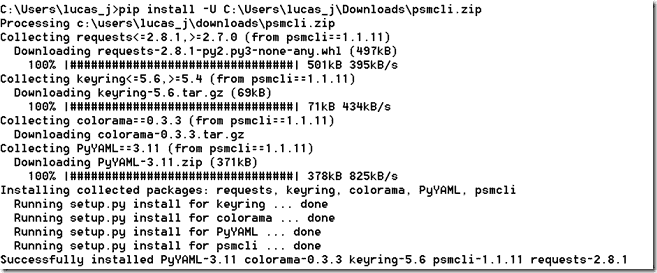
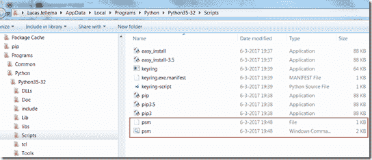
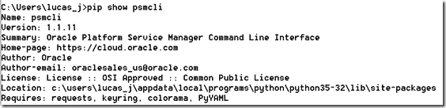
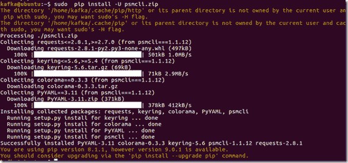
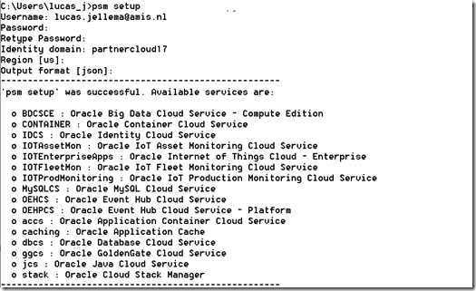
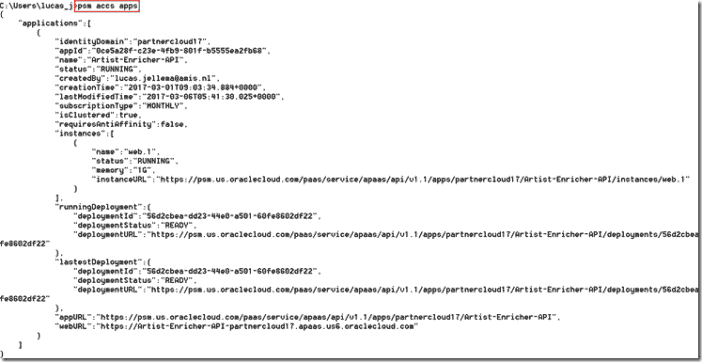
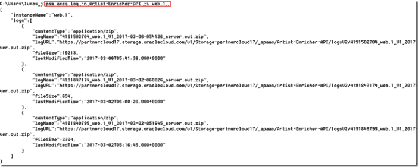
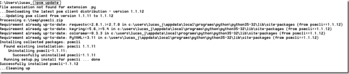

# Oracle 云平台服务管理器命令行界面(PSM CLI)入门

> 原文：<https://medium.com/oracledevs/getting-started-with-oracle-paas-service-manager-command-line-interface-psm-e80ff498e578?source=collection_archive---------1----------------------->

Oracle PaaS Service Manager (PSM)提供了一个命令行界面(CLI ),您可以使用它来管理 Oracle 公共云中各种服务的生命周期。这为编写(重复)任务脚本打开了大门，例如在 ACCS 上(重新)部署应用程序以调配新环境。与使用 GUI 相比，PSM 使在 Oracle 公共云上执行管理操作变得更加容易和高效。

请注意，CLI 是 PaaS REST APIs 上的一个瘦包装器，它调用这些 API 来支持常见的 PaaS 特性。

安装和配置 PSM 的步骤非常简单，只需大约 6 分钟。我将简要地向你介绍一下。它们也被很好地记录了下来。在我继续之前，我想感谢 Oracle 的 Abhijit Ramchandra Jere，他在 PSM 方面慷慨地帮助了我。

# 1.安装 Python (3.3+)和 cURL

PSM 是基于 Python 的工具。要设置并运行它，您需要在您的机器上设置 Python。

# 2.下载 PSM

psmcli.zip 可以从 Cloud UI 下载(如这里的所述)，也可以通过 cURL 从 REST API 获取(如这里的所述):

> *curl-I-X GET-u " Lucas . jellema:password "-H " X-ID-TENANT-NAME:cloud 17 "-H " Accept:application/JSON "*[*https://PSM . us . Oracle cloud . com/PAAs/API/v 1.1/instance GMT/cloud 17/services/cs/instances*](https://psm.us.oraclecloud.com/paas/api/v1.1/instancemgmt/cloud17/services/cs/instances)

# 3.将 PSM 作为 Python 包安装

通过一个简单的语句，PSM 从下载的 zip 文件中安装(参见此处的)

> *pip install -U psmcli.zip*

这会将 PSM 安装到 Python 脚本目录中:

使用验证结果

> *pip 显示 psmcli*

在 Linux 上:

# 4.为身份域和到云的连接配置 PSM

运行 PSM 的设置，并将其配置为与您的身份域一起使用(请参见[文档](http://docs.oracle.com/en/cloud/paas/java-cloud/pscli/configuring-command-line-interface-1.html))。注意:这一步假设包含 PSM 的 Python 脚本目录在 PATH 环境变量中。

> *psm 设置*

您可以在机器上为多个身份域或用户帐户使用 PSM。切换到不同的身份域只需再次运行 *psm 设置*即可。我需要提供身份域、区域和凭据来进行切换。

注意:psm 会记住操作系统重启后的设置；它不记得以前连接过的身份域的凭据。

# 5.开始使用 PSM 来检查和操作 PaaS 服务

PSM 可以与许多 PaaS 服务一起使用，用于检查它们的运行状况、停止和(重新)启动、扩展和执行许多管理活动。全部见[文档](http://docs.oracle.com/en/cloud/paas/java-cloud/pscli/psm-shared-commands1.html)。

一些例子:

列出应用程序容器云上的所有应用程序:

> *psm accs 应用*

列出 ACCS 上特定应用程序的日志详细信息:

> *PSM accs log-n |–app-name name-I |–instance-name name*
> 
> *PSM accs log-n Artist-Enricher-API-I web . 1*

并显示日志文件列表

# 6.更新 PSM

要摆脱关于他们是可用的 PSM 的较新版本的有点烦人的消息，并获得最新版本，您只需键入:

> *psm 更新*

等待大约 15 秒钟。

**问题:**

我遇到了一个问题，因为我的机器上有多个 Python 版本。PSM 是作为 Python 3.6 版本的包安装的，我试图在 PATH 环境变量中运行 PSM 的第一个版本 Python 3.6。显然，这失败了。

我遇到的错误:ModuleNotFoundError:没有名为“opaascli”的模块

解决方案:我删除了除了一个 Python 版本之外的所有版本(3.5，因为 3.6 由于缺少 pip，安装不顺利)，然后安装了那个版本。

# 资源

关于 PSM 的文档:[http://docs . Oracle . com/en/cloud/PAAs/Java-cloud/PS CLI/abouit-PAAs-service-manager-command-line-interface . html](http://docs.oracle.com/en/cloud/paas/java-cloud/pscli/abouit-paas-service-manager-command-line-interface.html)

关于 Oracle PaaS REST APIs 的文档:[https://apicatalog.oraclecloud.com/ui/](https://apicatalog.oraclecloud.com/ui/)

[ACCS](https://technology.amis.nl/tag/accs/) [cli](https://technology.amis.nl/tag/cli/) [命令行](https://technology.amis.nl/tag/command-line/) [甲骨文云](https://technology.amis.nl/tag/oracle-cloud/)[PAAs](https://technology.amis.nl/tag/paas/)[PSM](https://technology.amis.nl/tag/psm/)[python](https://technology.amis.nl/tag/python/)[scripting . devo PS](https://technology.amis.nl/tag/scripting-devops/)

*原载于 2017 年 3 月 7 日*[*technology . amis . nl*](https://technology.amis.nl/2017/03/07/getting-started-with-oracle-paas-service-manager-command-line-interface-psm/)*。*