# Oracle Spatial 和图形入门— RDF 知识图(第 1 部分)

> 原文：<https://medium.com/oracledevs/getting-started-with-oracle-spatial-and-graph-rdf-knowledge-graph-part-1-fa400427c6bd?source=collection_archive---------0----------------------->

Oracle 数据库包括一个企业级资源描述框架(RDF) triplestore，作为空间和图形选项的一部分。RDF 是一种 W3C 标准的图形数据模型，用于表示知识图，越来越多地用于支持智能应用程序。有关 RDF 数据模型和其他相关技术的更多信息，请查看 W3C 数据活动。

这是一个博客系列的第 1 部分，展示了如何在 Oracle 公共云上设置一个全功能的 RDF triplestore。在第 1 部分中，我们将展示如何在现有的 Oracle 数据库云服务(DBCS)实例上配置 Oracle Spatial 和 Graph — RDF 语义图。在本例中，我们将使用 Oracle 数据库版本 18.1。关于如何创建 DBCS 实例的更多信息，请参考教程[这里](https://docs.oracle.com/en/cloud/paas/database-dbaas-cloud/tutorial-create-quickstart-dbcs-instance/index.html)或者下载本博客末尾的详细操作文档。本博客系列的后续文章将展示如何加载公开可用的 RDF 数据集和配置 W3C 标准的 SPARQL 端点。

我们将使用 Oracle SQL Developer 与 DBCS 实例进行大部分交互。从 18.1 版本开始，SQL Developer 包含了一个很好的 RDF 语义图插件，我们将在这篇博文中使用它。

首先，使用 SQL Developer 为系统用户打开一个到您的 DBCS 实例的连接。使用 SQL Developer 连接到 DBCS 实例有几种方法。有关连接 SQL Developer 的更多信息，请参考数据库云服务[用户指南](https://docs.oracle.com/en/cloud/paas/database-dbaas-cloud/csdbi/connect-db-using-sql-developer.html)。

使用系统连接的 SQL 工作表来执行以下查询，以检查 DBCS 实例上的 RDF Semantic Graph 安装。

```
SELECT * FROM MDSYS.RDF_PARAMETER;
```

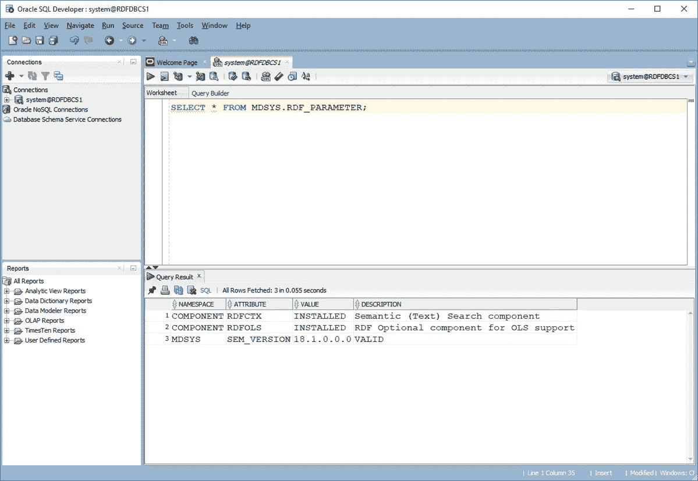

查询结果应该显示 RDF 语义图的有效 18.1.0.0.0 安装。

接下来，我们将创建一个语义网络，为存储 RDF 数据准备数据库。作为先决条件，我们需要为语义网络创建一个表空间。以 SYSTEM 的身份运行以下 SQL 语句，为语义网络创建一个表空间。

```
create bigfile tablespace rdftbs 
  datafile ‘?/dbs/rdftbs.dat’ 
  size 512M reuse autoextend on next 512M 
  maxsize 10G 
  extent management local 
  segment space management auto;
```

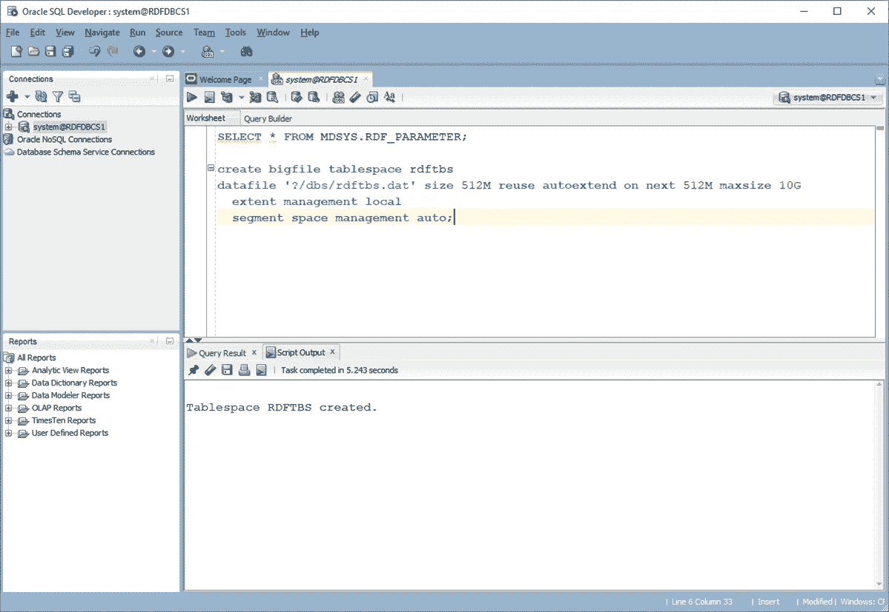

现在我们可以使用 SQL Developer 的 RDF 语义图组件来创建语义网络。通过单击连接名称旁边的加号展开系统连接，然后向下滚动到 RDF 语义图组件。右键单击 RDF 语义图并选择 Create Semantic Network。

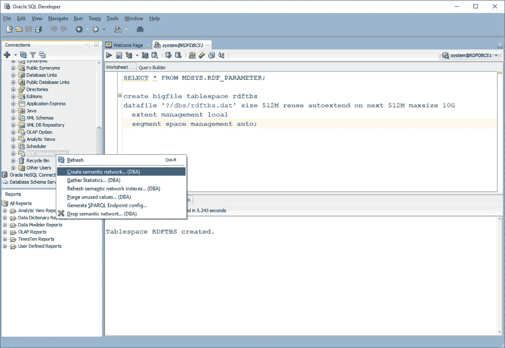

使用下拉菜单选择我们之前创建的表空间，然后单击 Apply。

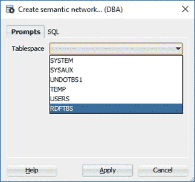

就是这样。我们已经验证了 RDF 语义图的安装，并创建了存储 RDF 数据所需的所有数据库对象。

接下来，我们将对默认索引配置进行一些更改，以获得更好的通用查询性能。展开 RDF 语义图下的网络索引，查看当前网络索引的索引代码。索引代码中的每个字母对应于 RDF 四边形的一个组成部分:S-主语，P-谓语，C-规范宾语，G-图，M-模型。默认情况下，会创建两个索引:强制的 PCSGM 唯一索引和 PSCGM 索引。当 SPARQL 三元组模式在谓词位置有常量时，这种索引方案非常有效，但是如果变量出现在谓词位置，这种方案可能会遇到性能问题。

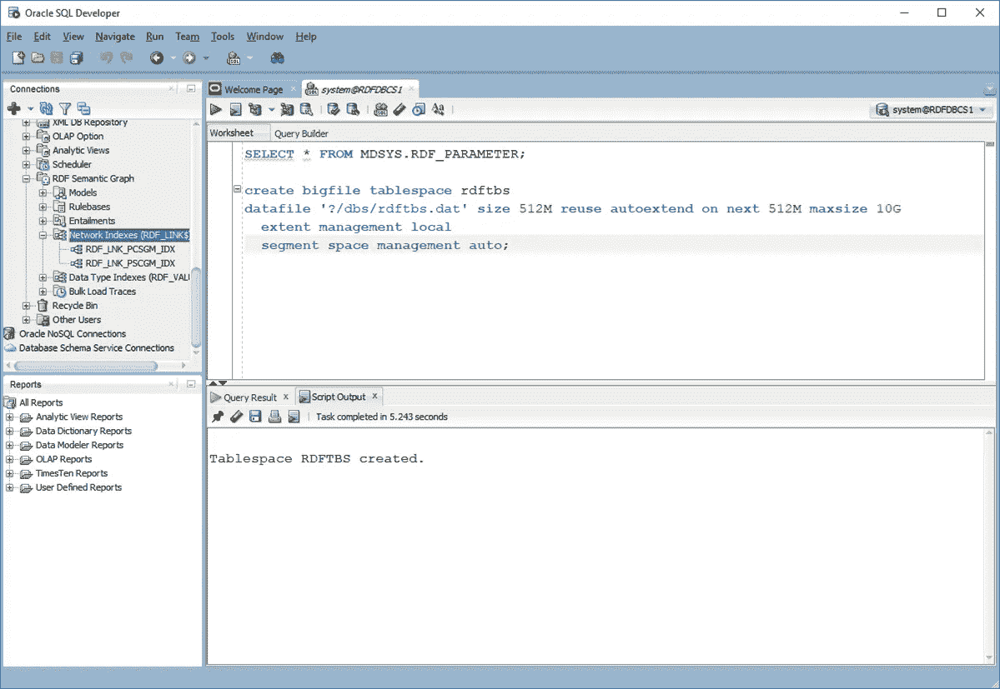

对于更一般的方案，PCSGM、SPCGM 和 CSPGM 的三索引组合效果很好，因此我们将删除 PSCGM 索引，并添加 SPCGM 和 CSPGM 索引。

右键单击 RDF_LNK_PSCGM_IDX 并选择 Drop Semantic Index。

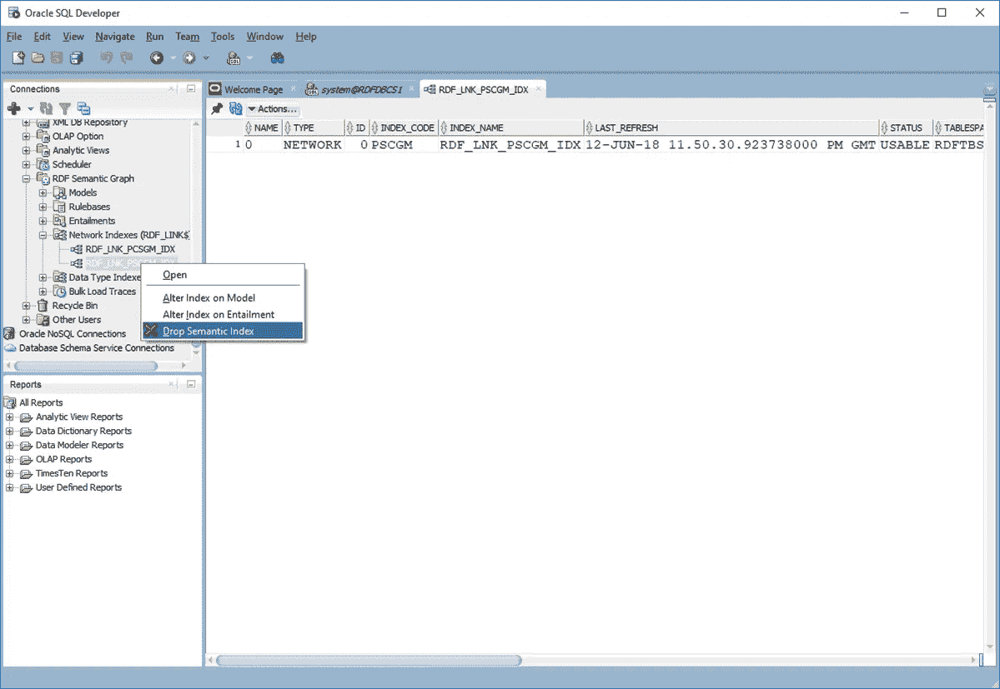

单击应用。

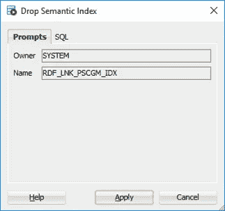

现在只有 PCSGM 索引应该出现在网络索引下。

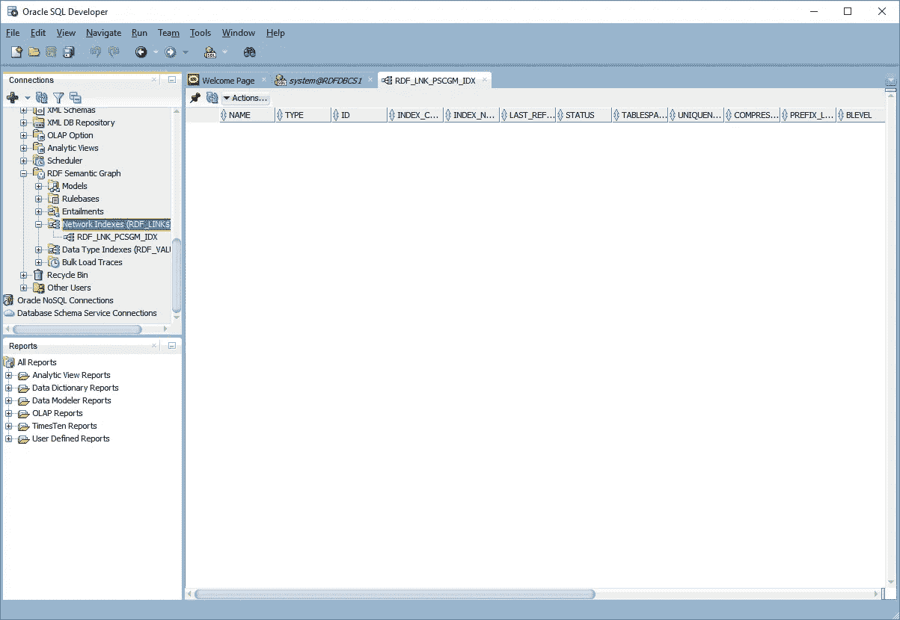

右键单击网络索引并选择创建语义索引。

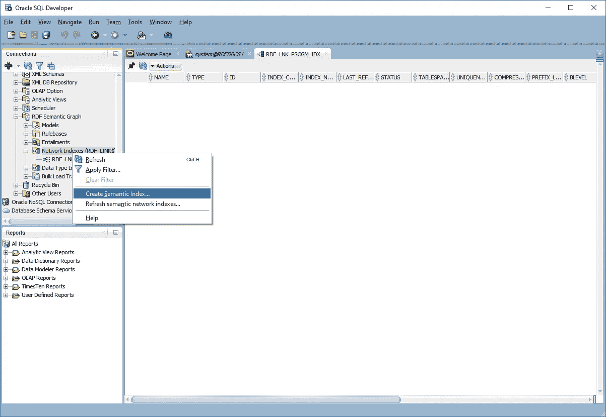

输入 SPCGM 作为索引代码，然后单击应用。

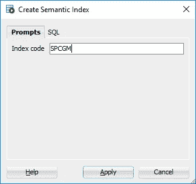

接下来，使用 CSPGM 作为索引代码重复这一过程。

现在，您应该可以在网络索引下看到 CSPGM、PCSGM 和 SPCGM 索引。

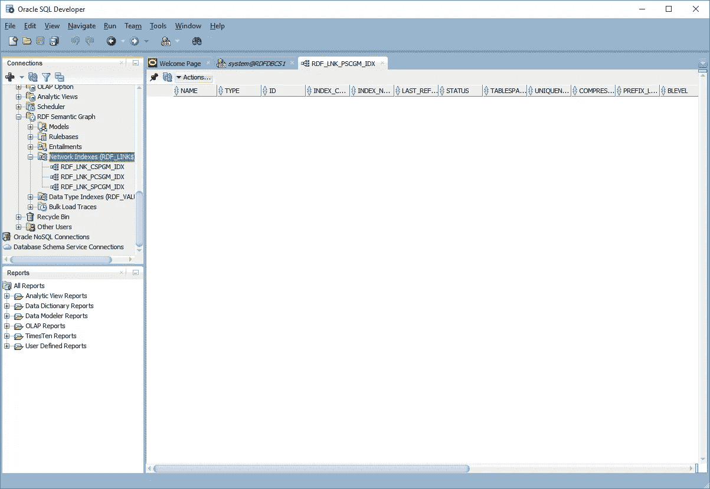

至此，我们已经在 DBCS 实例上创建了一个语义网络，并为通用 SPARQL 查询设置了一个索引方案。我们的 DBCS 实例现在可以加载一些 RDF 数据了。本系列的下一篇博文将展示如何加载和查询公开可用的 RDF 数据集。

关于如何记录这个博客系列的详细信息，请点击[这里](https://github.com/mperry455/rdf-graph-oracle-public-cloud-18c/blob/main/RDF_18_1_DBCS_how_to.pdf)。