# Oracle Spatial 和图形入门— RDF 知识图(第 2 部分)

> 原文：<https://medium.com/oracledevs/getting-started-with-oracle-spatial-and-graph-rdf-knowledge-graph-part-2-2def0bc08a5c?source=collection_archive---------2----------------------->

这是“Oracle Spatial 和图形入门— RDF 知识图”系列的第二部分在这篇博文中，我们将使用 SQL Developer 将一些公开可用的资源描述框架(RDF)数据加载到我们的 DBCS 实例中，并使用 SQL Developer 中的 SPARQL 查询编辑器执行一些 SPARQL 查询。点击[此处](/oracledevs/getting-started-with-oracle-spatial-and-graph-rdf-knowledge-graph-part-1-fa400427c6bd)阅读本系列的第一部分。

我们将使用的数据来自链接地理数据项目:【http://linkedgeodata.org/About 

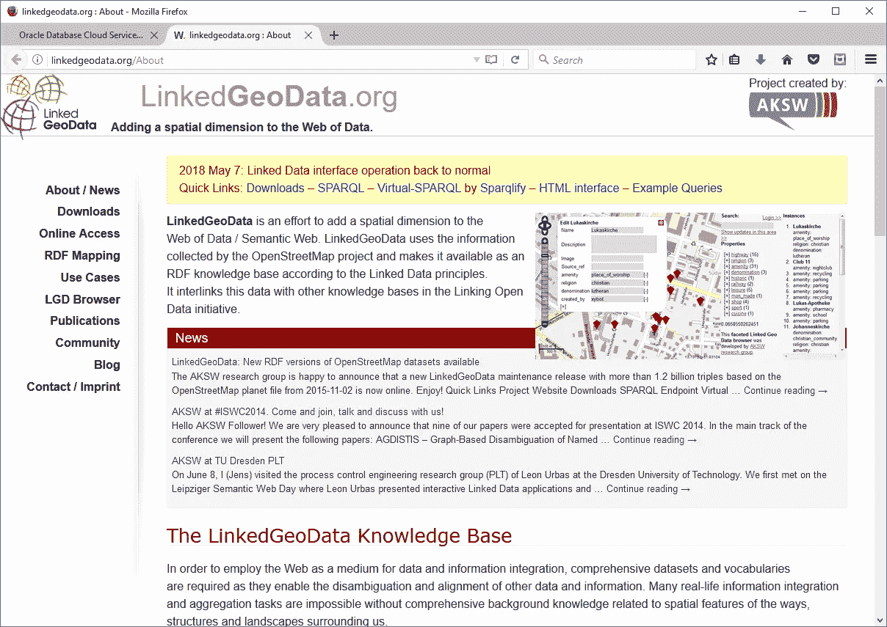

该项目提供了几个可下载的数据集，索引如下:[https://hobbit data . informatik . uni-Leipzig . de/LinkedGeoData/downloads . LinkedGeoData . org/releases/](https://hobbitdata.informatik.uni-leipzig.de/LinkedGeoData/downloads.linkedgeodata.org/releases/)

我们将使用一个 120 万的体育设施三元数据集:[https://hobbit data . informatik . uni-Leipzig . de/LinkedGeoData/downloads . LinkedGeoData . org/releases/2015-11-02/2015-11-02-sport thing . node . sorted . nt . bz2](https://hobbitdata.informatik.uni-leipzig.de/LinkedGeoData/downloads.linkedgeodata.org/releases/2015-11-02/2015-11-02-SportThing.node.sorted.nt.bz2)

将 SportThing.node.sorted.nt.bz2 下载到您的客户端计算机，并使用 WinSCP 之类的程序将该文件复制到您的 DBCS 实例。参考 DBCS [用户指南](https://docs.oracle.com/en/cloud/paas/database-dbaas-cloud/csdbi/copy-files-node.html)了解更多关于如何将文件复制到您的 DBCS 实例或从您的实例复制文件的信息。WinSCP 的详细说明可以在这篇博文末尾的 HOW-TO 文档中找到。在本例中，我们将文件复制到了 DBCS 实例上的/home/oracle。

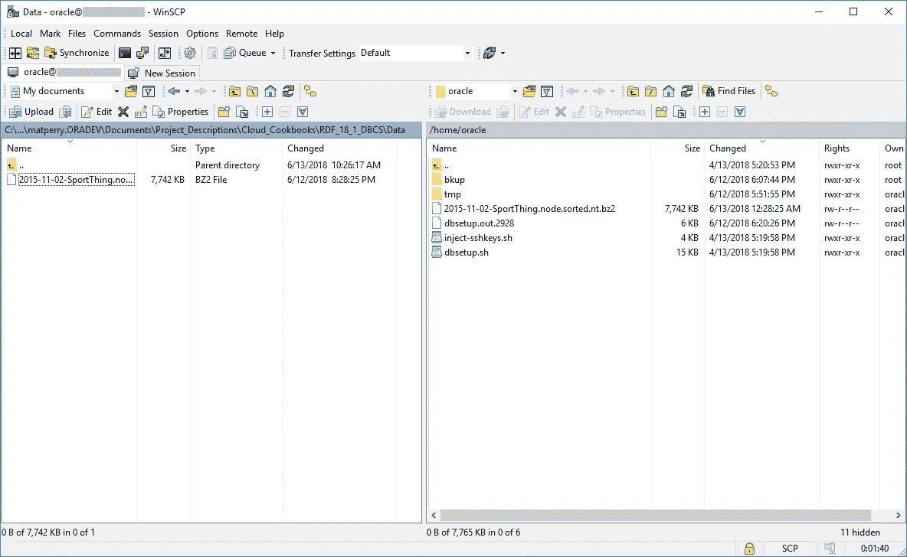

我们将使用一个拥有 connect、resource 和适当表空间权限的普通数据库用户来执行装载操作。回想一下，在上一期文章中，我们使用系统用户来创建和配置我们的语义网络。在 SQL Developer 中为所需的数据库用户打开一个连接。在这个例子中，我们使用了 RDFUSER。展开 RDFUSER 连接，并展开 RDF 语义图组件。

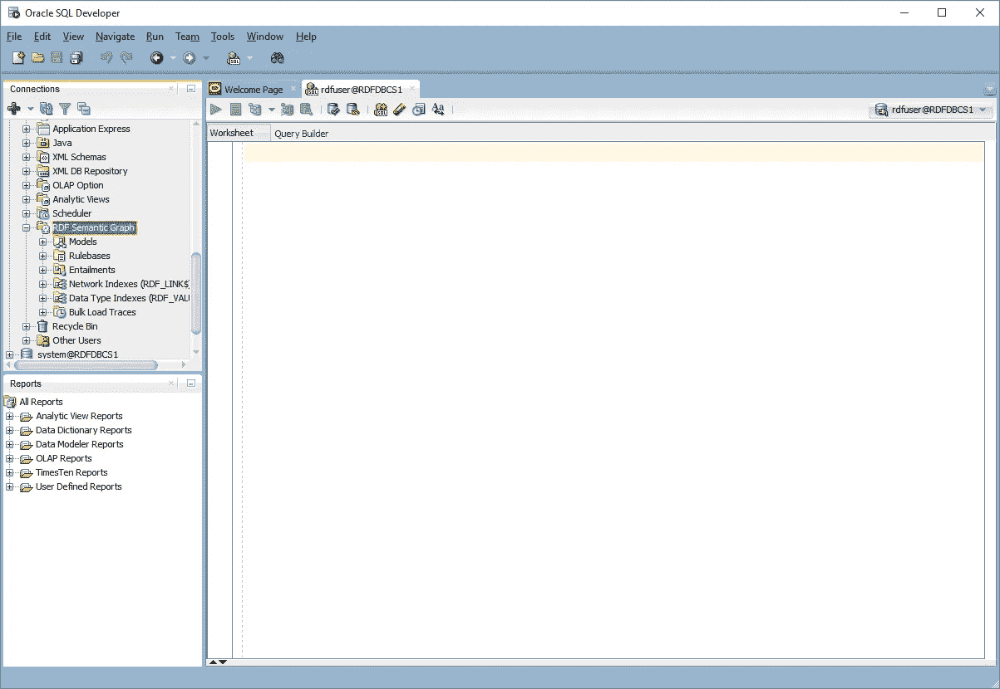

第一步是创建一个语义模型来保存我们的 RDF 数据集。右键单击模型并选择新建模型。

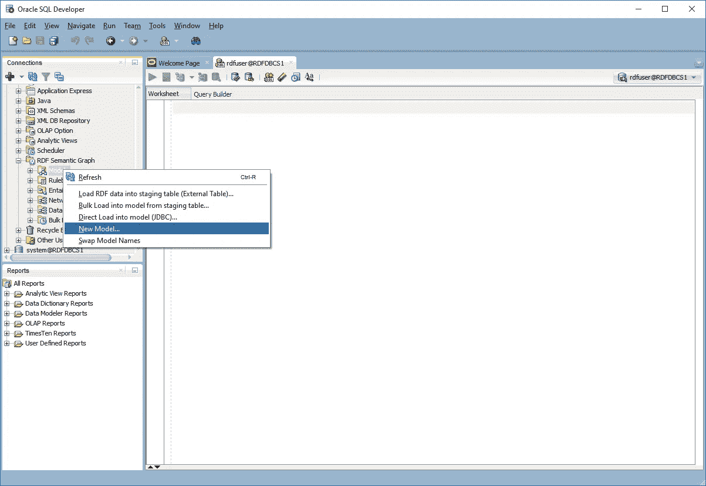

输入一个模型名称，并选择创建一个具有三列的新应用程序表。选择为模型表空间创建语义网络时使用的表空间。单击应用。

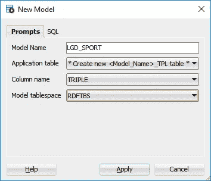

我们现在已经创建了一个模型来保存我们的 RDF 数据。如果在 RDF 语义图下展开模型和常规模型，应该会看到我们创建的 LGD _ 体育模型。

现在，我们将批量加载下载的 RDF 文件。大容量装载流程包括两个主要步骤:

1.  将文件从文件系统加载到数据库中的简单暂存表中。
2.  将数据从临时表加载到我们的语义模型中。

第一步涉及从外部表进行装载，因此我们需要使用系统连接在数据库中创建一个目录，并授予 RDFUSER 对该目录的权限。

展开系统连接，右键单击目录。然后选择创建目录。

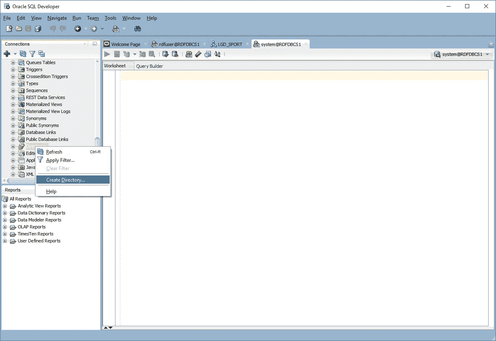

输入目录名和数据库服务器上目录的完整路径。单击应用。

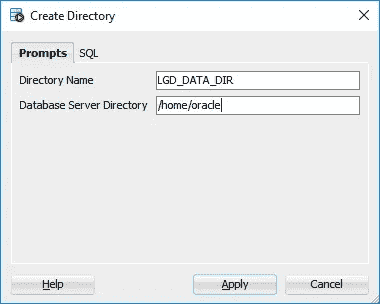

展开目录并单击目录名以查看详细信息。

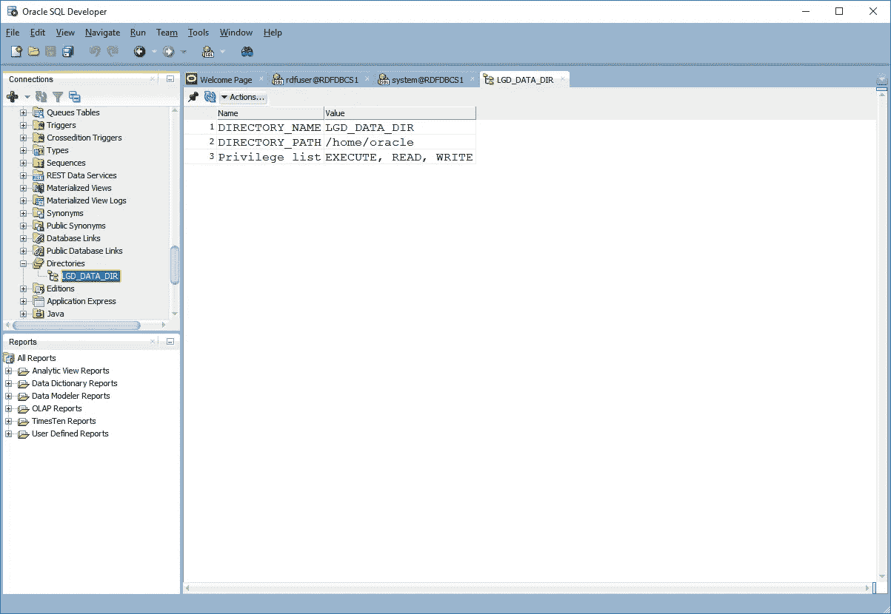

现在，我们需要将这个目录的权限授予 RDFUSER。单击操作并选择授权。

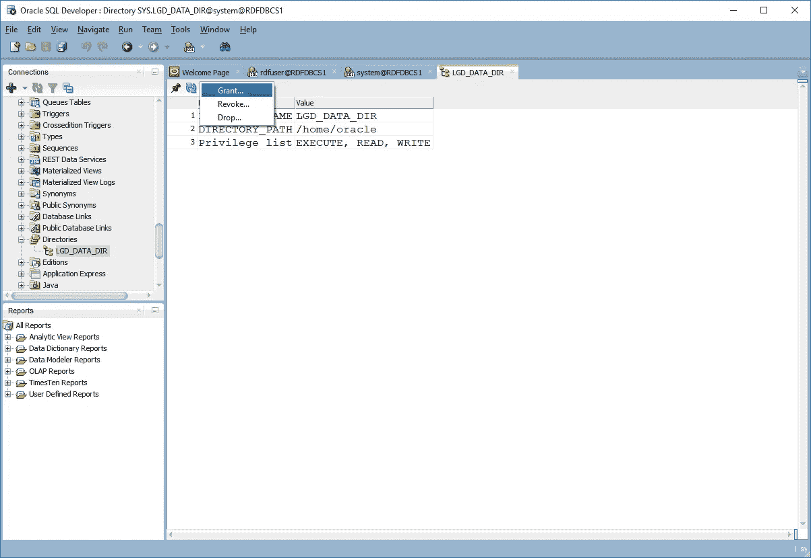

授予 RDFUSER 读写权限。单击应用。

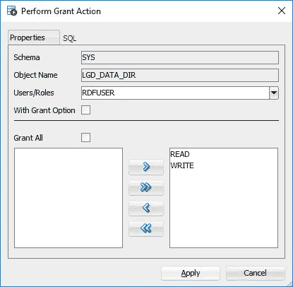

RDFUSER 现在可以访问我们的 DBCS 实例上的/home/oracle 目录。

在装载到 staging 表之前，我们需要从 Unix 命令行执行一些操作。下载的 RDF 文件是压缩的，所以我们将使用 Unix 命名管道来传输未压缩的数据，而不是存储文件的未压缩版本。

以 oracle 用户的身份使用 PuTTY 建立到远程 DBCS 实例的 SSH 连接(有关如何建立 SSH 连接的更多信息，请参见 DBCS [用户指南](https://docs.oracle.com/en/cloud/paas/database-dbaas-cloud/csdbi/connect-ssh.html#GUID-C5DAB5B8-1FFA-4122-9181-189561F6E0F1))。然后执行以下命令创建一个命名管道来传输未压缩的数据。

```
mkfifo named_pipe.nt
bzcat 2015–11–02-SportThing.node.sorted.nt.bz2 > named_pipe.nt &
```

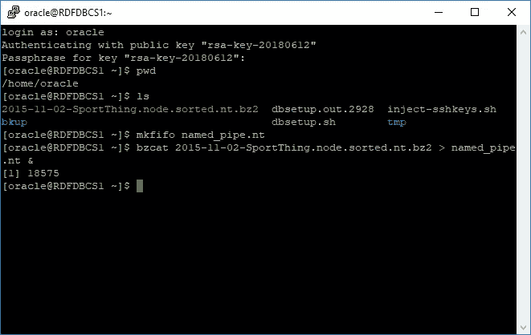

现在，在 SQL Developer 中展开 RDFUSER 连接，并展开 RDF 语义图组件。然后右键单击 Models 并选择“Load RDF data into staging Table(External Table)”

为要创建的外部表选择一个名称(我们使用 LGD _ 外部 _ 选项卡),并填写“源外部表”选项卡上的其他字段。

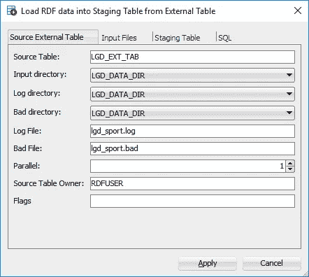

在“输入文件”选项卡上输入要加载的文件的名称(在本例中为 named_pipe.nt)。

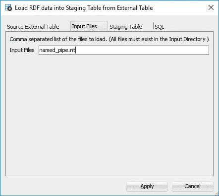

最后，使用 Staging Table 选项卡输入将要创建的临时表的名称(我们使用 LGD_STG_TAB ),并选择适当的格式。

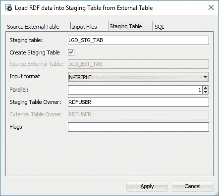

现在，单击“应用”将数据加载到 LGD_STG_TAB 中。检查 LGD_STG_TAB 的内容。

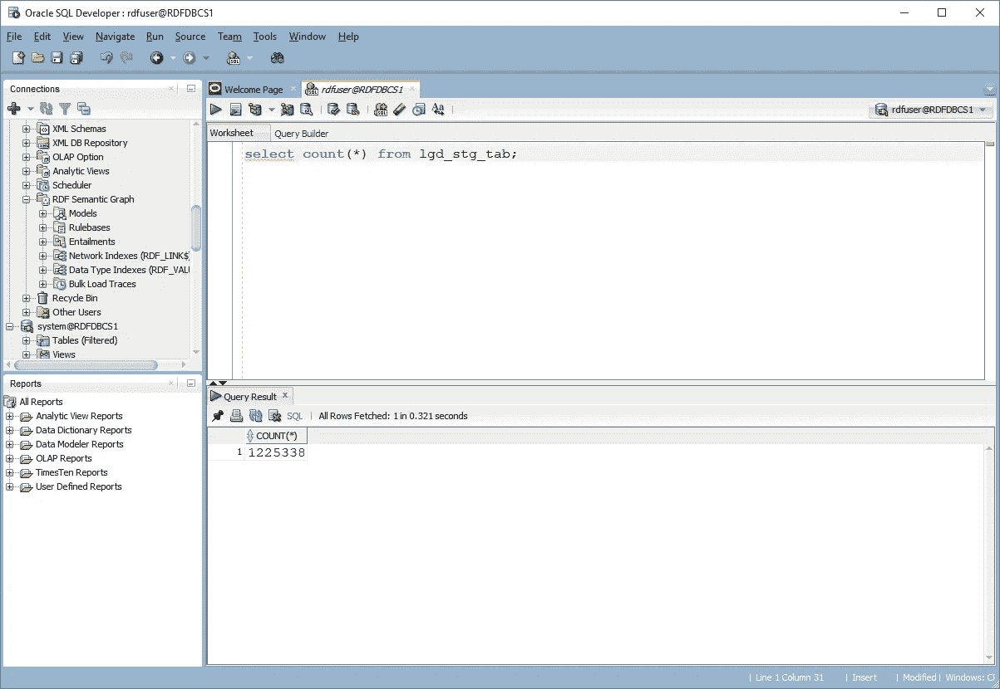

接下来，我们将把数据从 LGD_STG_TAB 加载到 LGD_SPORT 语义模型中。要打开批量装载接口，请在 RDFUSER 连接下展开 RDF Semantic Graph。然后，右键单击模型并选择“从临时表中批量加载到模型中”。

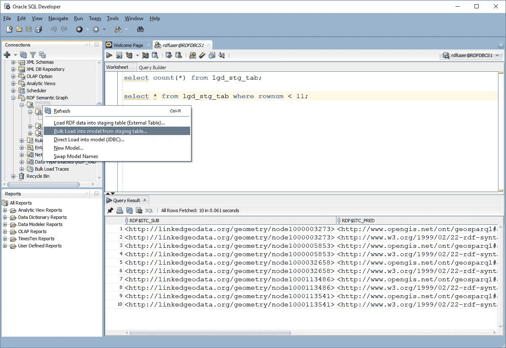

输入 LGD _ 体育模型，取消选择创建模型选项，因为我们已经创建了这个语义模型。此外，选择 LGD_STG_TAB 作为临时表名。注意不要选择外部表(LGD _ 外部 _ 标签)，因为它也将被列出。有关批量加载的其他选项的更多信息，请查阅[用户指南](https://docs.oracle.com/en/database/oracle/oracle-database/18/rdfrm/SEM_APIS-reference.html#GUID-AB6697BF-C840-4F48-8C81-FACB3CA54B1A)。单击 Apply，加载将在一分钟左右完成。

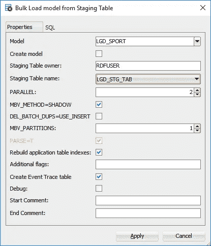

现在我们已经完成了批量加载，收集整个 RDF 网络的统计信息是一个好主意。只有特权用户才能收集整个 RDF 网络的统计数据，因此我们需要使用 SYSTEM 用户或其他 DBA 用户。展开系统连接下的 RDF 语义图组件，右键单击 RDF 语义图并选择 Gather Statistics。

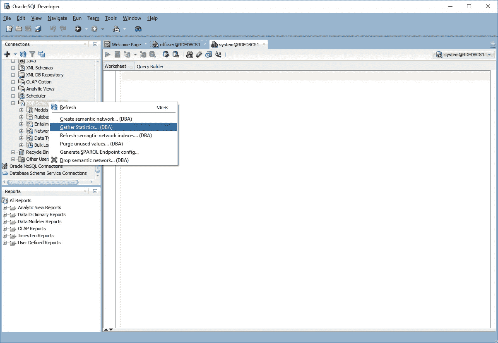

输入所需的并行度，然后单击应用。

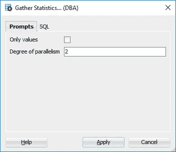

收集统计数据后，就可以查询数据了。

现在，我们将使用 SQL Developer 的 SPARQL 查询编辑器来查询我们的数据集。回到 RDFUSER 连接，在 RDF 语义图下展开 Models 和 Regular Models。单击 LGD _ 体育将打开这个语义模型的 SPARQL 查询编辑器。

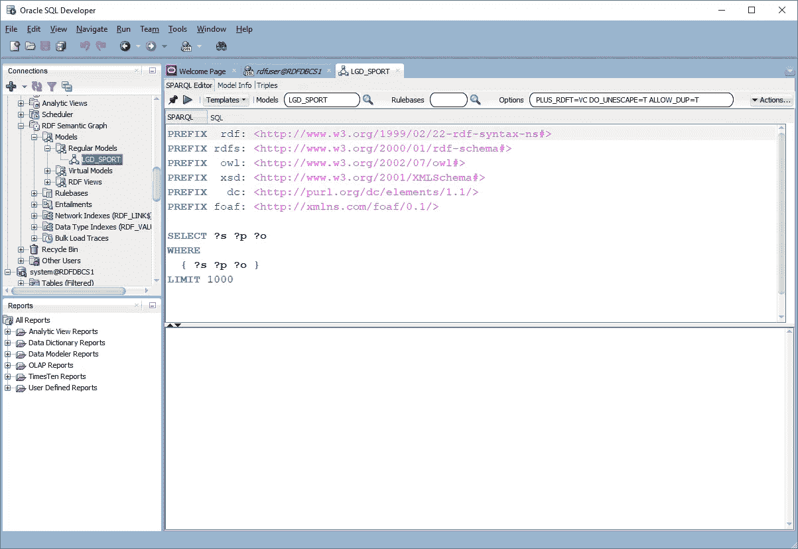

您可以在这里编辑和执行 SPARQL 查询。此外，还提供了几个预先创建的模板。

单击“模板”->“人口统计”->“全部计算”来计算 LGD _ 体育模型中的所有三元组。

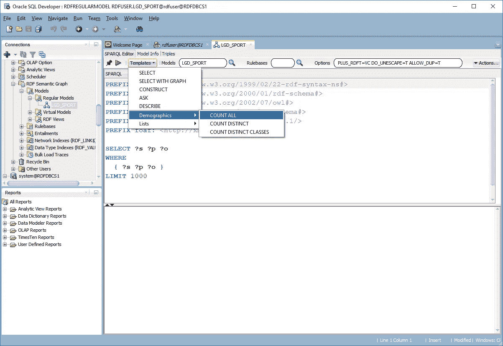

出现警告时，单击是。

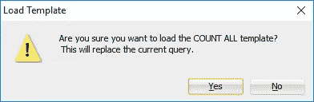

单击绿色三角形运行查询。

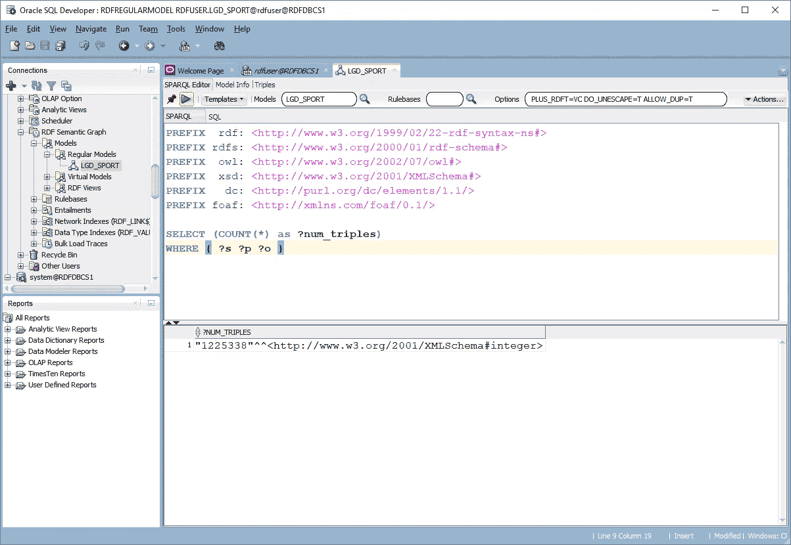

您还可以直接编辑 SPARQL 查询。以下示例显示了一个 SPARQL 查询，用于获取前 10 个属性及其三元组计数。

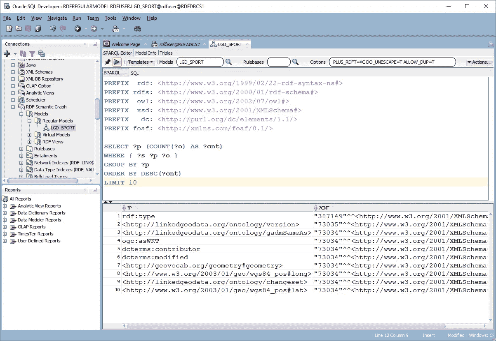

除了 SPARQL SELECT 查询，还支持构造和描述查询。下面的查询描述了 LGD 体育模型中的一个特定资源。请注意，查询中使用的任何名称空间前缀也将用于简化查询结果中的值。这里我们又增加了几个前缀。

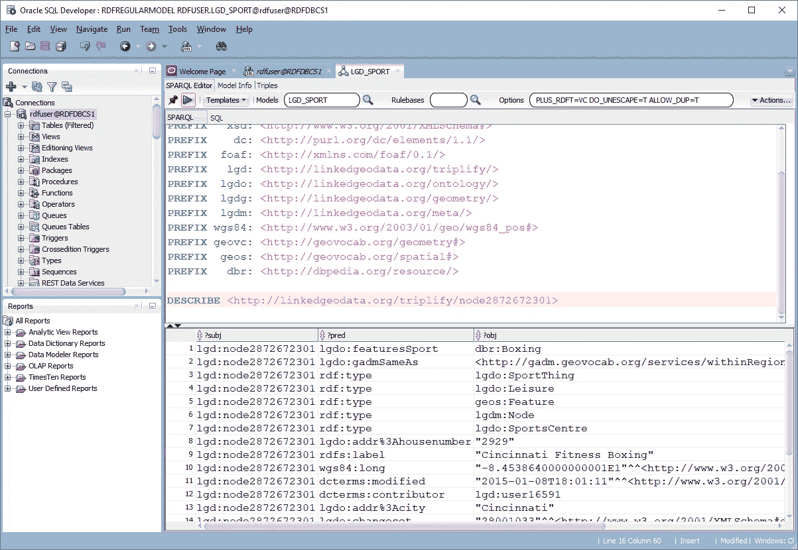

就是这样。我们已经成功地将一个公开可用的 RDF 数据集批量加载到我们的 DBCS 实例中，并使用 SQL Developer 的 SPARQL 查询编辑器执行了一些查询。在下一期中，我们将设置一个 W3C 标准的 SPARQL 端点来提供 REST 接口。

点击[这里](https://github.com/mperry455/rdf-graph-oracle-public-cloud-18c/blob/main/RDF_18_1_DBCS_how_to.pdf)获得详细的操作方法。