# Oracle Spatial 和图形入门— RDF 知识图(第 3 部分)

> 原文：<https://medium.com/oracledevs/getting-started-with-oracle-spatial-and-graph-rdf-knowledge-graph-part-3-ce40edc4b1f5?source=collection_archive---------2----------------------->

这是“Oracle Spatial 和图形入门— RDF 知识图”系列的第三部分在这篇博文中，我们将通过配置一个 W3C 标准的 SPARQL 端点来完成我们在 Oracle 公共云中的 RDF triplestore 的设置。点击本系列之前文章的链接:[第一部分](/oracledevs/getting-started-with-oracle-spatial-and-graph-rdf-knowledge-graph-part-1-fa400427c6bd)、[第二部分](/oracledevs/getting-started-with-oracle-spatial-and-graph-rdf-knowledge-graph-part-2-2def0bc08a5c)。

W3C 为查询和更新 RDF 数据定义了几个[标准 REST API](https://www.w3.org/TR/sparql11-protocol/)。Oracle RDF Semantic graph 利用 Apache Jena Fuseki 来提供这些接口的实现。Oracle 对 Apache Jena 的支持通过特定于 Oracle 的 Apache Jena 接口实现，提供了 Apache Jena 和 Oracle RDF 语义图之间的紧密集成。

这篇博文将展示如何在我们的 DBCS 实例上设置和运行 Apache Jena Fuseki。Fuseki 可以作为独立的服务器或 Java web 应用程序运行。在这种情况下，我们将在我们的 DBCS 实例上将 Fuseki 作为独立服务器运行。您还可以设置一个 Oracle Java Cloud Service 实例，并将 Fuseki Java web 应用程序部署到包含的 Web Logic Server 实例中。

第一步是从 OTN 下载最新的 Oracle Apache Jena 支持。打开网页浏览器进入[http://www . Oracle . com/tech network/database/options/spatialand graph/downloads/index-156999 . html](http://www.oracle.com/technetwork/database/options/spatialandgraph/downloads/index-156999.html)。选择下载 Oracle Database 12c Release 12.1.0.2 支持 Apache Jena 3.1、Apache Jena Fuseki 2.4 和 Protégé Desktop 5.0。

下载完成后，将下载的 Oracle Support for Apache Jena 文件传输到您的 DBCS 实例。在本例中，我们将文件复制到/home/oracle。关于如何将文件复制到 DBCS 实例或从其复制文件的进一步说明可以在 DBCS [用户指南](https://docs.oracle.com/en/cloud/paas/database-dbaas-cloud/csdbi/copy-files-node.html)中找到，或者在本文末尾的详细操作指南中找到。

以 oracle 用户身份打开到 DBCS 实例的 SSH 连接。关于如何建立到 DBCS 实例的 SSH 连接的更多信息，请参见 DBCS 用户指南。

在/home/oracle 中创建一个名为 Jena 的目录。然后将 rdf _ semantic _ graph _ support _ for _ 12c _ and _ jena 310 _ protege _ 5.0 _ 2017 _ 01 _ 19 . zip 移动到新创建的 Jena 目录下，解压文件。

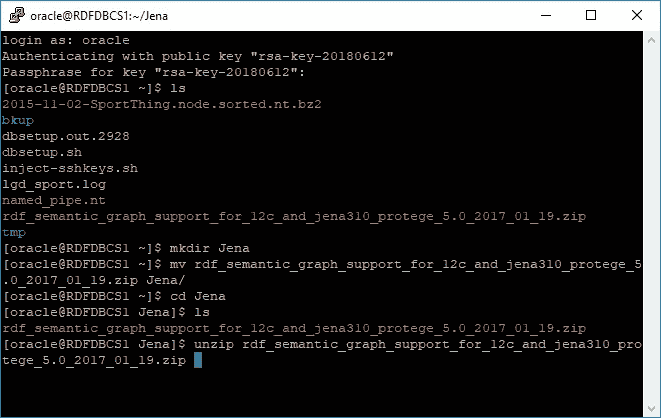

解压缩命令完成后，您将看到几个目录和一个自述文件。

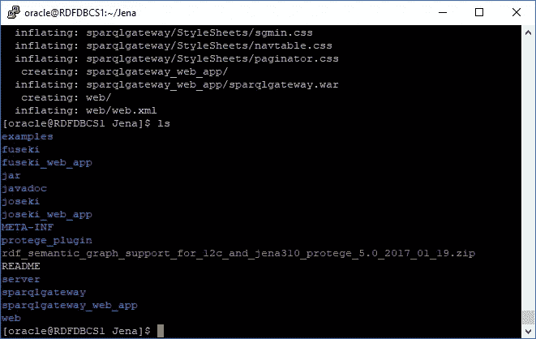

我们现在将配置 Fuseki 来访问我们之前创建的 LGD _ 体育语义模型。将目录更改为/fuseki，并编辑 config-oracle.ttl 文件。

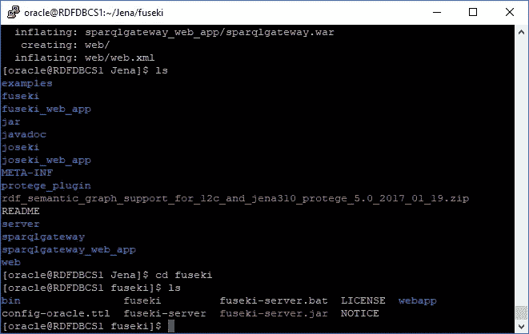

将以下默认数据集规格从

```
<#oracle> rdf:type oracle:Dataset;
    oracle:connection
      [ a oracle:OracleConnection ;
        oracle:jdbcURL “jdbc:oracle:thin:@(DESCRIPTION=(ADDRESS=(PROTOCOL=TCP)(HOST=localhost)(PORT=1521))(CONNECT_DATA=(SERVER=DEDICATED)(SERVICE_NAME=orcl)))”;
        oracle:User “rdfuser” ;
        oracle:Password “rdfuser”
      ];
    oracle:allGraphs [ oracle:firstModel “TEST_MODEL” ] .
```

到

```
<#oracle> rdf:type oracle:Dataset;
    oracle:connection
      [ a oracle:OracleConnection ;
        oracle:jdbcURL “jdbc:oracle:thin:@(DESCRIPTION=(ADDRESS=(PROTOCOL=TCP)(HOST=localhost)(PORT=1521))(CONNECT_DATA=(SERVER=DEDICATED)(SERVICE_NAME=**PDB1.uspm020.oraclecloud.internal**)))”;
        oracle:User “**rdfuser**” ;
        oracle:Password “**rdfuser**”
      ];
    oracle:allGraphs [ oracle:firstModel “**LGD_SPORT**” ] .
```

请注意，根据您的特定 DBCS 实例的设置，SERVICE_NAME 会有所不同。

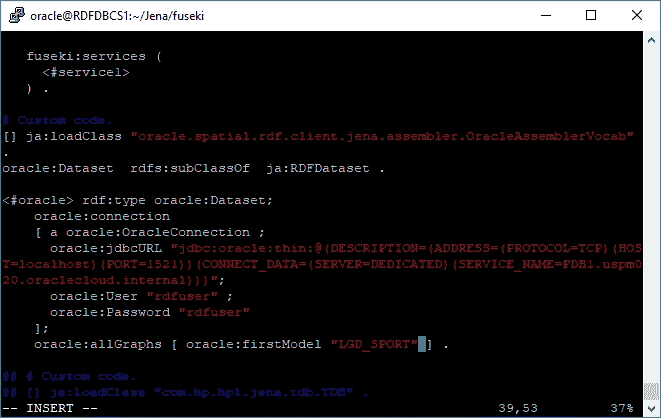

接下来，我们将更改默认的 shiro.ini 配置，以允许非本地主机连接。首先，我们需要启动 Fuseki 来创建一个/run 目录。只需在当前/fuseki 目录中执行以下命令。

```
./fuseki-server
```

一旦看到 Fuseki 已经在端口 3030 上启动的消息，就用 Ctrl-C 杀死这个进程。

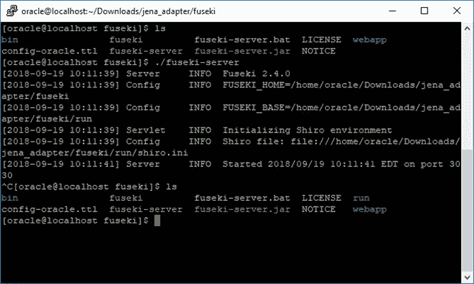

现在应该创建了/run 目录。将目录更改为/run 并编辑 shiro.ini。

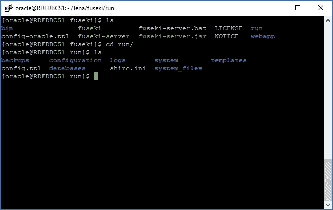

替换

```
/$/** = localhostFilter 
```

随着

```
/$/server = anon
$/** = localhostFilter
```

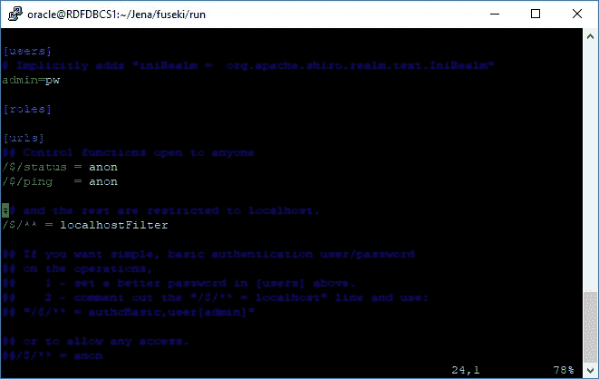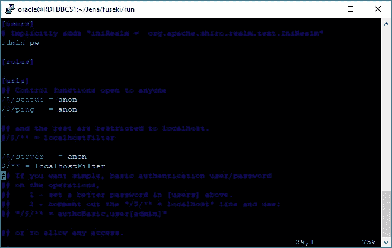

将目录改回/fuseki，并通过运行以下命令启动 fuseki 服务:

```
nohup ./fuseki-server — config config-oracle.ttl > fuseki_out.log &
```

注意，如果我们的连接关闭，我们使用 nohup 来防止 Fuseki 进程终止。

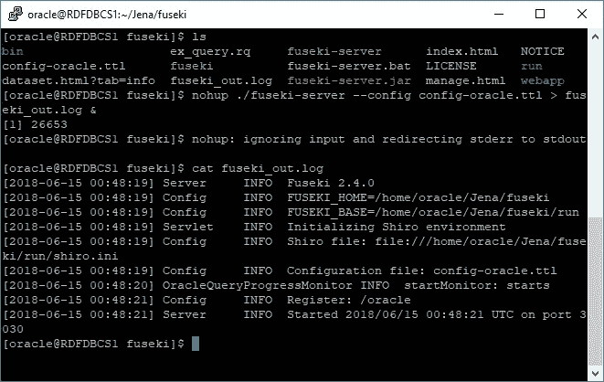

就是这样。Fuseki SPARQL 端点现在已经在我们的 DBCS 实例上启动并运行了。

现在 Fuseki 服务器已经启动并运行在我们的 DBCS 实例的端口 3030 上，有两个连接选项:

1.  为端口 3030 创建一个到我们的 DBCS 实例的 SSH 隧道。
2.  创建一个访问规则，将我们的 DBCS 实例的端口 3030 向公共互联网开放。

在这篇博文中，我们将使用 SSH 隧道来说明第一种方法。关于第二个选项的说明，请参见文章末尾的详细操作方法。使用 SSH 隧道允许我们安全地访问 DBCS 实例上的端口 3030，而无需将端口 3030 向公共互联网开放。

首先，使用 PuTTY 或类似的工具创建一个 SSH 隧道，将客户端计算机上的端口 3030 转发到 DBCS 实例上的端口 3030。我们在这个例子中使用了 PuTTY，如下所示。详细说明请参考 DBCS [用户指南](https://docs.oracle.com/en/cloud/paas/database-dbaas-cloud/csdbi/create-ssh-tunnel.html#GUID-6929CE39-6CD7-46C9-8022-929A9844B1C5)。

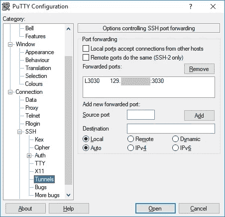

单击打开打开 SSH 隧道，然后打开 web 浏览器访问 http://localhost:3030。

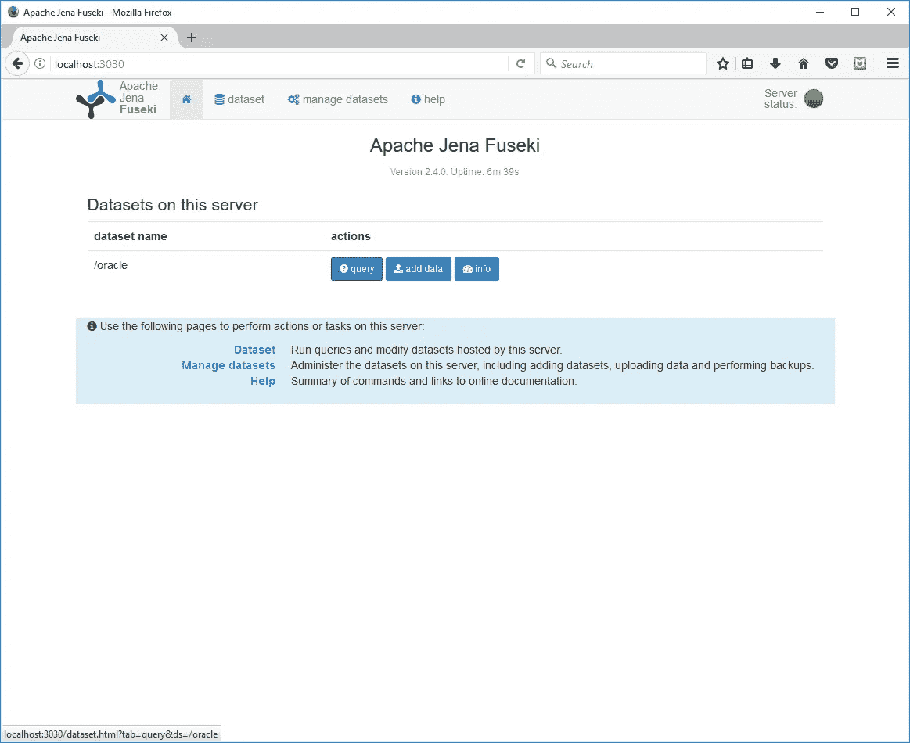

点击〖查询〗按钮，打开 SPARQL 查询界面。

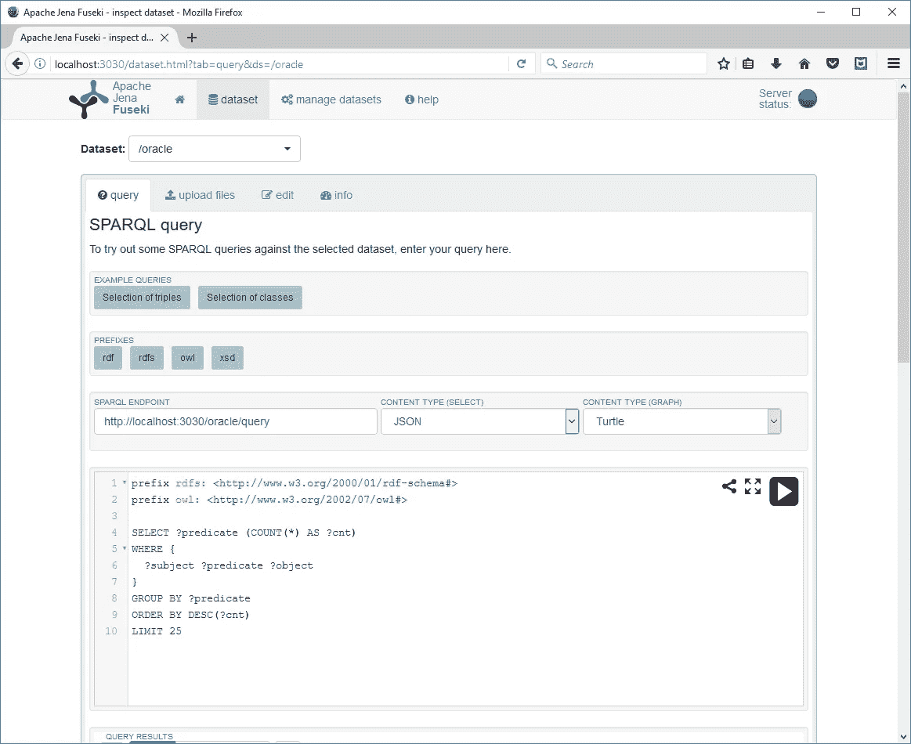

单击 info 查看所有可用的 REST 端点。

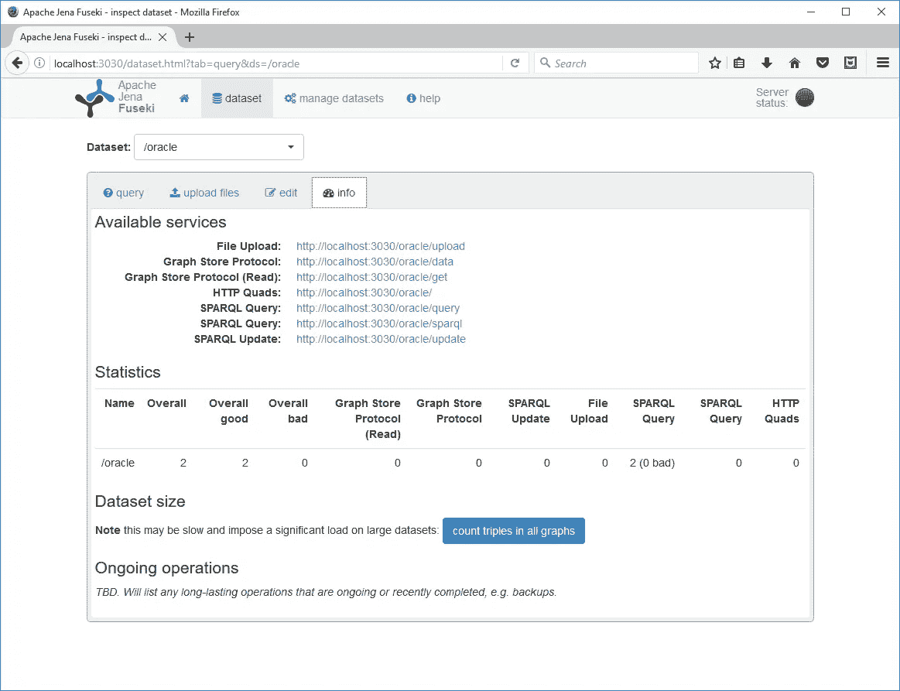

现在，我们已经使用 SSH 隧道连接到运行在我们的 DBCS 实例上的 SPARQL 端点。

我们还可以使用 curl 通过 SSH 隧道直接测试 SPARQL REST 接口。在本例中，我们在 Windows 客户端计算机上使用 Cygwin 终端。下面的 curl 命令将 test_query.rq 文件中的 SPARQL 查询发送到运行在我们的 DBCS 实例上的 Fuseki 端点，并将结果打印到 stdout。

```
curl –X POST –data-binary “@test_quey.rq” –H “Content-Type: application/sparql-query” –H “Accept: application/sparql-results+json” “http://localhost:3030/sparql"
```

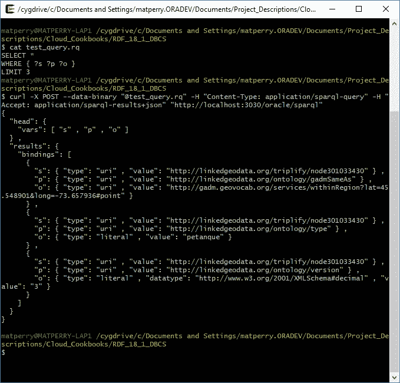

我们完事了。我们已经成功访问了运行在我们的 DBCS 实例上的 W3C 标准 SPARQL REST 端点。

“Oracle Spatial 和图形入门— RDF 知识图”系列的最后一篇文章到此结束。在第一篇文章中，我们在 18.1 DBCS 实例上设置和配置了 Oracle Spatial 和 Graph — RDF 语义图。在第二篇文章中，我们加载了一些 RDF 数据，并使用 SQL Developer 的 SPARQL 查询编辑器运行了一些示例查询，在最后一篇文章中，我们在我们的 DBCS 实例上设置了一个 W3C 标准的 SPARQL 端点，为我们的 triplestore 提供一个 REST 接口。

本博客系列中涉及的所有内容的详细步骤都可以在本[操作指南](https://github.com/mperry455/rdf-graph-oracle-public-cloud-18c/blob/main/RDF_18_1_DBCS_how_to.pdf)中找到。