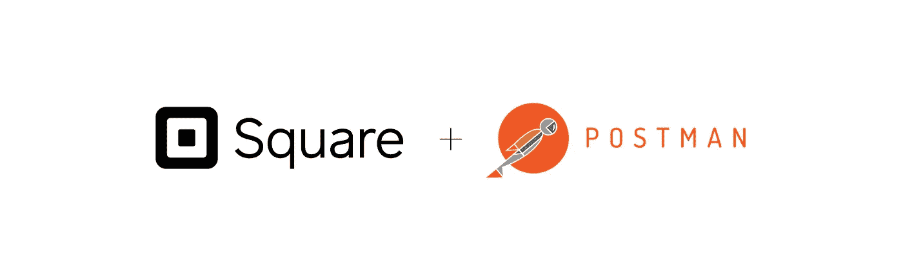
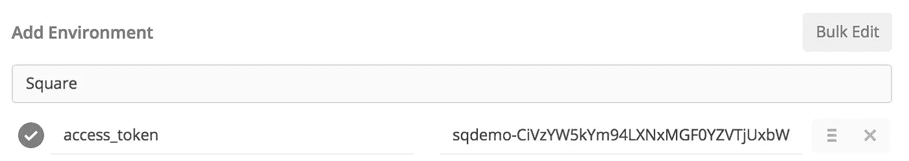
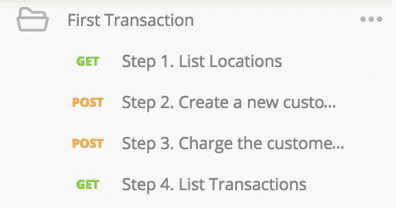

# 开始使用 Postman 和 Square 的 API

> 原文：<https://medium.com/square-corner-blog/getting-started-with-postman-and-squares-apis-e6bd0f2a8a75?source=collection_archive---------3----------------------->

> 注意，我们已经行动了！如果您想继续了解 Square 的最新技术内容，请访问我们的新家[https://developer.squareup.com/blog](https://developer.squareup.com/blog)

在了解一个 API 的特性时，能够尽快试用它是非常重要的。帮助您快速启动和运行的工具之一是 [Postman](https://www.getpostman.com/) ，它允许您组织和运行 REST API 调用组。我们已经添加了一个新的 API 请求集合，使使用 Postman 变得更加容易——对于首次开发人员和经验丰富的 Postman 用户来说都很棒。

# 步骤 0:安装 Postman

在使用 Postman 之前，您需要安装它。访问[https://www.getpostman.com/](https://www.getpostman.com/)，下载您系统的首选版本。

# 第一步:获得邮递员集合

这一步很容易。只需点击该页面上的大 *Run in Postman* 按钮，系统会提示您将收藏导入 Postman。您也可以在 [Square API 文档](https://docs.connect.squareup.com/articles/client-libraries#runningpostman)和 [Square API 参考](https://docs.connect.squareup.com/api/connect/v2/#runningpostman)中找到该按钮。

# 步骤 2:设置您的环境

我们的集合利用 Postman 的环境变量来轻松管理您的 API 凭证。点击*齿轮图标- >管理环境- >添加*应该会打开一个对话框来创建一个新的环境。你可以称环境为`square`或者任何你想要的名字。您需要添加一个带有访问令牌值的密钥`**access_token**` 来处理每个端点的认证。每当你看到一个像 `{{location_id}}`一样的双括号中的变量，它表示一个可以从你的环境中提取的变量。

Hopefully your environment looks something like this. ️

# 第 3 步:试用 API！

现在是时候在 Postman 中尝试一些 API 调用了！

我们的集合中有几个文件夹，每个文件夹都有不同的 API 调用来完成不同的任务，还有一个包含所有端点的 V1 & V2 参考。让我们看看**第一笔交易**文件夹。它具有标准电子商务场景的所有要求，包括创建客户、向他们收费以及查看他们的最终交易。您应该能够毫无困难地按顺序运行每个请求。响应中的相关 id 将自动添加到您的环境中，供后续请求使用。您需要使用您的 [API 沙箱](https://docs.connect.squareup.com/articles/using-sandbox)凭证来使用测试卡随机数。

*   **列出位置**是几乎所有 Connect APIs 调用的第一步，因为位置 ID 在大多数请求的 URL 中。这将在`location_id` *下为您的环境添加第一个启用信用卡处理的位置。*
*   **创建新客户。**为了将客户与交易联系起来，我们需要确保*是*客户。创建的客户的 ID 将自动添加到您的环境中的`customer_id`下。
*   **冲锋！**对于这个请求，我们添加了一个假的 card nonce，但是在真实的场景中，您将使用`[SqPaymentForm](https://docs.connect.squareup.com/articles/ecommerce-overview/)`生成 card nonce，并在服务器端进行这些交易。
*   **列出交易。**您现在可以列出您所在地区的所有交易，并查看您刚刚处理的交易！

你可以在[文档](https://docs.connect.squareup.com/)中了解更多关于 Square APIs 的信息。

*想要更多吗？* [*注册*](https://www.workwithsquare.com/developer-newsletter.html?channel=Online%20Social&sqmethod=Blog) *为我们的每月开发者简讯或者加入我们的* [*Slack 社区*](http://squ.re/slack) *！*