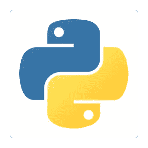

# Python 入门

> 原文：<https://medium.com/quick-code/getting-started-with-python-313eb74915c8?source=collection_archive---------3----------------------->

Python 是一种令人惊叹的语言，被广泛应用于各种应用中。您知道 Python 用于自动化、数据科学和 web 应用程序吗？例如，脸书使用 Python 来处理图像。在开始之前，让我们先来分解一下为了成为一名 Python 忍者需要学习的概念。

1.  **Python 语法**
2.  **数据结构**