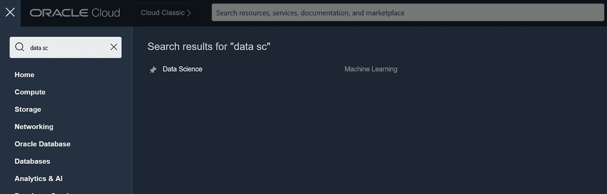
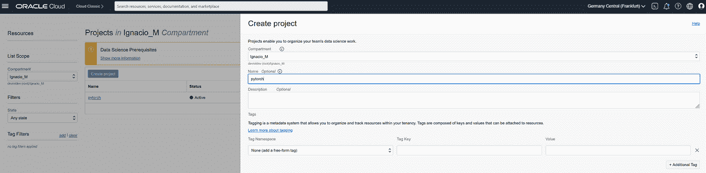
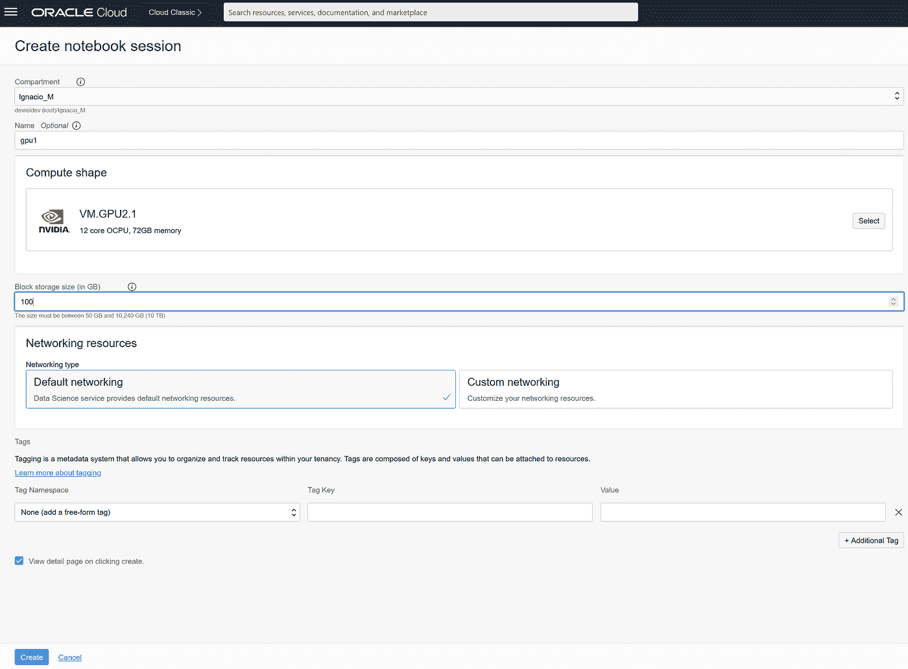
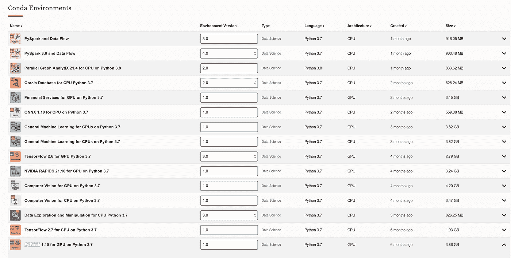
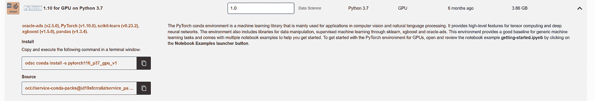
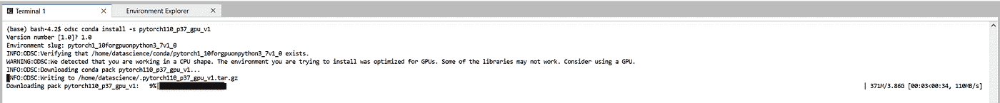
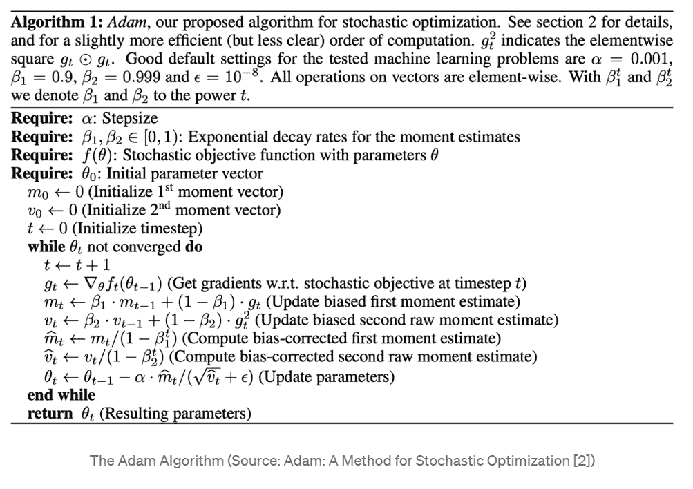
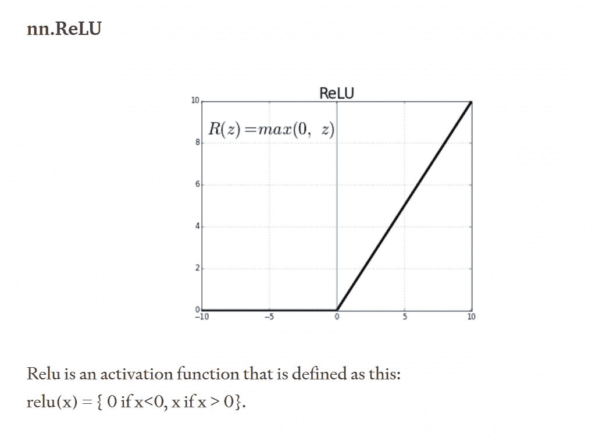

# OCI py torch 入门

> 原文：<https://medium.com/oracledevs/getting-started-with-pytorch-on-oci-dbaa5e7a40ef?source=collection_archive---------0----------------------->

欢迎阅读本系列的第一篇文章，在这里我们将探索诸如 PyTorch 和 TensorFlow 之类的 AI/ML 库。通常，人们对 PyTorch 和它有多棒有一种积极的情绪，而对 TensorFlow 有一种更消极的社会情绪。然而，这两个库都有独特的功能，我希望，通过这一系列文章，我将能够打破成见，展示这两个库都很棒，同时展示其中的一些功能。

我们将学习如何设置 OCI 来处理 PyTorch 的一个问题，如何将这个问题发展成一个具有健壮架构的解决方案，最后测试两个库的性能，看看哪个库最适合这个特定的问题。

# ML 简史

在设置环境和所有“技术”东西之前，有一些关于这些库和 Python 本身的事情需要注意:

*   Python 是在 30 年前创建的，这是大多数人都不会相信的，因为这种编程语言在不久前“爆发”了流行。
*   TensorFlow 是谷歌在 2015 年创建的
*   PyTorch 是一年后由 FAIR(脸书人工智能研究实验室)创造的

因为 Tensorflow 比 PyTorch 早一年创建，所以它在数据科学界很快受到欢迎，这种增长可以在这些库的普遍情绪中观察到，也可以通过比较两个开源存储库中的提交数量来观察，其中 [TensorFlow](https://github.com/tensorflow/tensorflow) 在 GitHub 中的星级数大约是 [PyTorch 的](https://github.com/pytorch/pytorch)的三倍。

很明显，如今数据科学发展非常迅速，因为我们有越来越多的非结构化(和结构化！)我们可以得到的数据。我们的工作是理解这些数据并使其有意义。20 世纪下半叶，我们今天所知的人工智能(AI)诞生了。这使得人类可以“放松”他们复杂的计算，同时将这项工作委托给机器。从那以后，机器学习已经成为日常生活的一个重要部分，尽管它并不明显:

*   垃圾邮件过滤器基于 ML 模型
*   先进的视频游戏反作弊系统(防止黑客)基于 ML 模型，该模型将合法玩家的数据与作弊玩家的数据进行比较，并分析差异以确定不公平游戏，
*   网飞和亚马逊 Prime 对观看内容的建议基于一个 ML 模型，该模型分析你的口味并做出类似的建议
*   特斯拉的 autopilot 驾驶软件基于计算机视觉和 ML 模型，对社会中的驾驶进行实时决策

# 为什么我们需要 PyTorch

PyTorch 是一个很棒的库，可以很好地与 Python 协同工作。当使用 Python 执行数据分析时，我们需要理解 Python 的解释器仅限于在一个处理器上执行。这被称为 GIL 或全局解释器锁，一个只允许一个线程执行解释器的互斥锁(这可以通过用**多处理**模块实现代码来避免)。然而，大多数家用电脑和非专业设备很少配备超过 16/32 核心，这意味着我们理论上最多可以将代码优化提高 16/32 倍，除非我们使用 GPU 来帮助我们。

幸运的是，PyTorch 对 GPU 很友好:我们可以在 CPU、GPU 甚至 TPUs(张量处理单元)中执行我们的代码，这是由 Google 开发的一个特定的硬件单元，主要用于 AI/ML 目的。

从数学的角度来看，张量是一组数据。一个数相当于一个秩为 0 的张量；一维数组(向量)是秩为 1 的张量，矩阵是秩为 2 的张量。这在更多的维度上继续下去，直到我们得到一个秩为 n 的张量。

张量允许我们将数据分组为优化的子集，这些子集将在我们的硬件中高效运行。

# 入门指南

首先，我们需要一个运行 PyTorch 代码的环境。为此，我们前往 Oracle 云基础架构控制台。

我们有两个选择:

*   创建一个计算实例，启动它，安装 Jupyter Notebook 或其他运行 Python 代码的笔记本软件，并安装 PyTorch。这比第二个选项花费的时间要长一些，因为我们必须自己完成所有的配置，但是从长远来看，我们会节省一些钱，因为创建一个计算实例比第二个选项要便宜一些。
*   创建一个 OCI 数据科学笔记本并安装 PyTorch。这非常简单，不需要太多的 IT 知识；我们将拥有笔记本的实时可视化，以及在浏览器中修改它们的界面。

在这一小节中，我将展示如何遵循第二个选项(OCI 数据科学)。

# 创建一个 OCI 数据科学笔记本并安装 PyTorch

首先，我前往 OCI 控制台，导航到 OCI 数据科学:



其次，我创建了一个新项目:



在这个项目中，我们可以有几个笔记本会议；并且这些会话将各自具有自己的存储。此外，笔记本会话可以由多个 OCI 用户同时协作和编辑。



现在我们在笔记本中，我们可以控制机器(我们可以通过终端访问它，就像我们通过 ssh 进入机器一样)或者我们可以通过环境浏览器控制 Python 环境。对于新用户，我强烈推荐 environment explorer，因为它有几个现成的预构建环境。我们可以很容易地在环境浏览器中找到 PyTorch，并安装它。



要安装它，我们在终端中运行带有预建标识符的命令:



无论你决定去哪个部门，我们都必须安装 PyTorch。为此，让我们跟随[的这些步骤](https://pytorch.org/get-started/locally/)。我个人推荐**康达**作为包管理器，因为它简化了虚拟环境的操作:

`bash conda install pytorch torchvision torchaudio cudatoolkit=10.2 -c pytorch`

或带 pip 的同等产品:

`bash pip3 install torch torchvision torchaudio`

一旦我们安装了 PyTorch，我们就可以检查测试笔记本在我们的笔记本上运行是否顺畅。为此，我们可以运行预定义的笔记本示例列表(从环境资源管理器中与 PyTorch 环境一起自动安装)或者自己运行一个示例。我们将混合使用两者来测试 PyTorch 的功能，使用[非常著名的 iris 数据集](https://gist.github.com/curran/a08a1080b88344b0c8a7)。

我们加载虹膜数据集:

```
from sklearn import datasetsfrom sklearn.model_selection import train_test_splitfrom sklearn.preprocessing import StandardScalerimport numpy as npimport pandasimport torchimport torch.nn as nnimport torch.nn.functional as Firis = datasets.load_iris()X = iris['data'] # dependent variables or featuresy = iris['target'] # independent variable or targetscaler = StandardScaler() # we scale our data for normalization purposes as features don't follow a normal distribution (e.g. the sepal length is about 10-20 times bigger than the petal width, both of them being features of the model)X_scaled = scaler.fit_transform(X)X_train, X_test, y_train, y_test = train_test_split(X_scaled, y, test_size=0.2, random_state=2) # we split our data 80/20%
```

我们用三个线性层和 [Adam 优化](https://towardsdatascience.com/complete-guide-to-adam-optimization-1e5f29532c3d)配置了一个非常简单的神经网络模型。如果您对这些概念不熟悉，不要担心，我们将在本系列的后续文章中深入探讨这些东西的含义。现在，只需要知道 Adam 是一个优化算法，有一个复杂的数学公式(见下图)，但是要开始，我们不需要关注这个。你只需要知道关于 Adam 优化的以下内容(一般而言):-它易于实施-它的内存效率很高-它适用于数据密集型问题，这就是 Adam 优化在大数据中众所周知的原因-超参数化(模型调整)被模型产生的准确结果所掩盖，这意味着，我们通常会节省一些时间。



```
class Model(nn.Module):def __init__(self, input_dim):super(Model, self).__init__()# with 3 linear layersself.layer1 = nn.Linear(input_dim, 50)self.layer2 = nn.Linear(50, 50)self.layer3 = nn.Linear(50, 3)# it is compulsory to define the forward function.# this function will pass data into the computation graph of the NN# and will represent the algorithm.# we can use any of the tensor operations inside the forward function, like relu and softmax.def forward(self, x):# ReLU is the activation function that makes the Neural Network non-linear.x = F.relu(self.layer1(x))x = F.relu(self.layer2(x))x = F.softmax(self.layer3(x), dim=1) # our output layer will be a softmax layer# otherwise we wouldn't be able to interpret the result as easilyreturn xmodel = Model(X_train.shape[1])optimizer = torch.optim.Adam(model.parameters(), lr=0.001)loss_fn = nn.CrossEntropyLoss()
```

基本上，我们将有三个输入，神经网络的结果将是这样的:



我们运行代码 100 个时期。一个纪元意味着我们在以前的文章中所做的“训练”过程要重复 n 次，其中 n 是大于 0 的整数。

```
EPOCHS = 100X_train = Variable(torch.from_numpy(X_train)).float()y_train = Variable(torch.from_numpy(y_train)).long()X_test = Variable(torch.from_numpy(X_test)).float()y_test = Variable(torch.from_numpy(y_test)).long()loss_list = np.zeros((EPOCHS,))accuracy_list = np.zeros((EPOCHS,))for epoch in tqdm.trange(EPOCHS):y_pred = model(X_train)loss = loss_fn(y_pred, y_train)loss_list[epoch] = loss.item()# Zero gradientsoptimizer.zero_grad()loss.backward()optimizer.step()with torch.no_grad():y_pred = model(X_test)correct = (torch.argmax(y_pred, dim=1) == y_test).type(torch.FloatTensor)accuracy_list[epoch] = correct.mean()
```

现在，我们可以创建一个[模型工件](https://docs.oracle.com/en-us/iaas/data-science/using/manage-models.htm)。这在使用 Oracle Data Science 笔记本开发代码时尤其有用，因为它与 Oracle ADS(加速数据科学)集成在一起，简化了模型的保存和在未来使用简单命令的重用。

```
# we create the artifact in a temporary directory and store it in a pickle file, like in previous articles# Local path where the artifact will be stored.model_artifact_path = mkdtemp()# preparing the model artifact in a local directory:model_artifact = prepare_generic_model(model_artifact_path,data_science_env=True,force_overwrite=True)# saving the PyTorch model in the same model artifact directory:torch.save(model,os.path.join(model_artifact_path,'torch_lr.pkl'))print(f"The model artifact is stored in: {model_artifact_path}")
```

这将返回:

```
>>> {‘prediction’: [[0.9936151504516602,0.0057501643896102905,0.0006346192094497383]]}
```

现在我们可以访问保存在临时目录中的模型工件，并进行测试预测:

`python test_data = torch.tensor(X_test[:10].tolist()) model_artifact.predict(test_data)`

```
>>> {'prediction': [[0.9936151504516602,0.0057501643896102905,0.0006346192094497383]]}
```

因为我们先前预先定义了秩 1 张量(向量)，所以我们返回了三个不同的数字。如果我们将它们相加，得出 1；每一个代表每个样本成为给定物种的概率。

关于概率的一个注意事项:它实际上是由神经网络通过激活函数执行的分类的权重，这在技术上不是被返回的概率；但这基本上意味着，向量中的数字越大，神经网络就越有可能决定它的类别是数组中那个位置的类别。

我真的希望您喜欢阅读和学习如何在 OCI 上开始使用 PyTorch。

# 我如何开始学习 OCI？

记住，你可以随时免费注册 OCI！您的 Oracle Cloud 帐户提供多项始终免费的服务和 300 美元免费积分的免费试用，可用于所有符合条件的 OCI 服务，最长 30 天。这些永远免费的服务可以在一段时间内无限制地在 T2 使用。免费试用服务可能会一直使用到您的 300 美元免费点数用完或 30 天到期，以先到者为准。你可以在这里[免费报名](https://signup.cloud.oracle.com/?language=en&sourceType=:ow:de:te::::&intcmp=:ow:de:te::::)！

# 加入对话！

如果你对 Oracle 开发人员在他们的自然环境中发生的事情感到好奇，来[加入我们的公共休闲频道](https://join.slack.com/t/oracledevrel/shared_invite/zt-uffjmwh3-ksmv2ii9YxSkc6IpbokL1g?customTrackingParam=:ow:de:te::::RC_WWMK220210P00062:Medium_nachoLoL5)！我们不介意成为你的鱼缸🐠

# 许可证

由伊格纳西奥·吉尔勒莫·马丁内兹撰写，艾琳·道森编辑。

版权所有 2022 Oracle 和/或其附属公司。

根据通用许可许可证(UPL)1.0 版进行许可。

详见[许可证](https://github.com/oracle-devrel/leagueoflegends-optimizer/blob/main/LICENSE)。