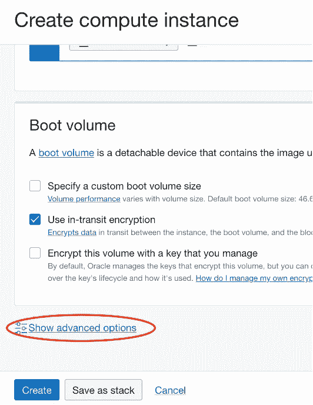
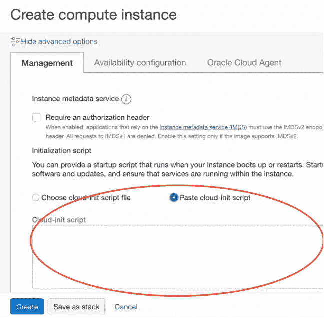

# 在 OCI 上开始使用 Ruby(和 Ruby on Rails)

> 原文：<https://medium.com/oracledevs/getting-started-with-ruby-and-ruby-on-rails-on-oci-3ce2d4c65833?source=collection_archive---------0----------------------->


*照片由* [*克里斯蒂娜·莫里洛*](https://www.pexels.com/@divinetechygirl?utm_content=attributionCopyText&utm_medium=referral&utm_source=pexels) *发自* [*Pexels*](https://www.pexels.com/photo/black-and-gray-laptop-computer-turned-on-doing-computer-codes-1181271/?utm_content=attributionCopyText&utm_medium=referral&utm_source=pexels)

我喜欢红宝石。我很高兴在各种应用程序中使用它，并且非常喜欢它的适应性。它面向对象的优点非常棒——能够在我需要的时候快速轻松地对我需要的功能进行猴子式修补，这既是一件好事，也是一件坏事。大量的灵活性(有些人——不是我——可能会争论太多)可能会阻止一些潜在的采用者，但对我们其他人来说，这很好。

也就是说，Ruby 不像以前那样受欢迎了。Python 的出现抢尽了风头(至少就高级运行时语言而言)。特别是在 Python 3 中包含了面向对象的支持，Python 是一种很好的语言。不管怎样，我还是喜欢露比。需要明确的是，我并不是一个只会一招的小马——我用 C、C++、ASM、PHP、Python 和许多其他语言进行过编程。尽管如此，鲁比在我心中占有特殊的位置。

这篇文章诞生于帮助在 OCI 上使用 Ruby 变得更容易的愿望。这是一个非常基本的话题，有些用户可能不需要/不想要，但我们中的许多人可能会找到有用的参考。事不宜迟，让我们深入了解如何为 Ruby(和 Ruby on Rails)引导一个 OCI 实例。

# 嗯……这很简单。为什么是这篇文章？

是啊，我知道。这是我最初的反应。有几个变量使得这个特定的场景比我最初的反应稍微不那么简单:

aarch64

[rbenv](https://github.com/rbenv/rbenv)

aarch64 架构不应该是一个惊天动地的平台。毕竟，单是过多的 Raspberry Pi(和其他嵌入式/物联网)设备(更不用说企业中基于 RISC 的平台的复兴)就意味着 aarch64 不再是几年前的陌生邻居了。遗憾的是，并不是所有的开发人员都跟上了时代的步伐，所以偶尔会有一些库和/或工具在 aarch64 上不能正常工作。这将会改变。这是必然的。时间和技术无情地向前迈进，所以这只是时间问题。无论如何，我对此感到非常兴奋，并尽我所能在我的解决方案中尽可能地多语种化(利用 AMD64 和 aarch64 ),通常默认为 aarch64。

[rbenv](https://github.com/rbenv/rbenv) 确实是这里最大的因素之一，因为 Ruby 可以通过 *dnf install ruby* 获得:

```
[opc@ruby ~]$ dnf info ruby
Oracle Linux 8 BaseOS Latest (aarch64)                                                   77 kB/s | 3.6 kB     00:00
Oracle Linux 8 BaseOS Latest (aarch64)                                                   44 MB/s |  38 MB     00:00
Oracle Linux 8 Application Stream (aarch64)                                             103 kB/s | 3.9 kB     00:00
Oracle Linux 8 Application Stream (aarch64)                                              46 MB/s |  27 MB     00:00
Oracle Linux 8 Addons (aarch64)                                                          69 kB/s | 3.0 kB     00:00
Available Packages
Name         : ruby
Version      : 2.5.9
Release      : 107.module+el8.4.0+20203+c00aa653
Architecture : aarch64
Size         : 87 k
Source       : ruby-2.5.9-107.module+el8.4.0+20203+c00aa653.src.rpm
Repository   : ol8_appstream
Summary      : An interpreter of object-oriented scripting language
URL          : [http://ruby-lang.org/](http://ruby-lang.org/)
License      : (Ruby or BSD) and Public Domain and MIT and CC0 and zlib and UCD
Description  : Ruby is the interpreted scripting language for quick and easy
             : object-oriented programming.  It has many features to process text
             : files and to do system management tasks (as in Perl).  It is simple,
             : straight-forward, and extensible.[opc@ruby ~]$
```

大多数严肃的 Ruby 开发都需要对 Ruby 运行时的控制(更不用说 Rails 和其他可能用到的 gem 了)。这就是 [rbenv](https://github.com/rbenv/rbenv) 的亮点。是的，这篇文章本来可以用 *sudo dnf install ruby* 来绕过，但那会安装 yum repo 中当时可用的特定版本…这不是我想要的。在本教程下面，你会注意到我选择安装 3.0.1，而 yum repo 版本(上面)是 2.5.9。也许对你来说这不是世界末日，但我想要一些更有控制力的东西。我怀疑很多其他的 Ruby 开发者也会想要这种级别的控制。

# 关于 OCI 的一些情况

在继续之前，有必要停下来了解一下发生的背景:Oracle 云基础设施(OCI)。如果你还没有一个 OCI 帐户，你真的应该得到一个！

为什么你应该有一个 OCI 帐户？！

很高兴你问了。有了 OCI 永远免费账户，你可以免费使用计算、存储、数据库和许多其他 OCI 云服务。永远。是啊…没错。永远！这就解释了为什么我们会在这里工作，对吗？！在这里注册一个账户。想要有一次沿着黄砖路的美好经历，看看我尊敬的同事克里斯写的伟大的[如何做](/oracledevs/create-an-oracle-always-free-cloud-account-bc6aa82c1397)。

# 入门指南

首先创建并登录您的 OCI 计算实例。如果你不确定如何做到这一点，Chris 碰巧为此写了另一个[教程](https://chrisbensen.medium.com/create-an-oci-compute-instance-493d10e2e6a6)——现在是浏览它的好时机。我选择使用基于 A1 的形状( *VM。Standard.A1.Flex* )运行当时可用的最新 Oracle Linux 8 映像。我选择为我的实例使用 arm CPU，尽管您也可以使用基于 amd64 的 CPU。在做任何事情之前，让我们升级系统:

```
[opc@ruby ~]$ sudo dnf update -y && sudo dnf upgrade -y
```

我从零开始——一个全新的例子。现在让乐趣开始吧！安装 rbenv 有几个选项，但是我使用的方法是使用 [rbenv 安装脚本](https://github.com/rbenv/rbenv-installer#rbenv-installer)。让我们现在就开始吧:

```
[opc@ruby ~]$ curl -fsSL [https://github.com/rbenv/rbenv-installer/raw/HEAD/bin/rbenv-installer](https://github.com/rbenv/rbenv-installer/raw/HEAD/bin/rbenv-installer) | bash[opc@ruby ~]$ echo 'PATH="$HOME/.rbenv/bin:$PATH"' >> ~/.bashrc
[opc@ruby ~]$ source ~/.bashrc
[opc@ruby ~]$ echo 'eval "$(rbenv init - bash)"' >> ~/.bash_profile
[opc@ruby ~]$ source ~/.bash_profile
```

耶！我们现在已经设置好了 rbenv。我们需要安装开发工具和一堆其他的包(库)，这样 Ruby 就可以在我们的机器上本地构建和安装了(更多信息见[本页](https://github.com/rbenv/ruby-build/wiki#suggested-build-environment)):

```
[opc@ruby ~]$ sudo dnf config-manager --set-enabled ol8_codeready_builder
[opc@ruby ~]$ sudo dnf groupinstall -y 'Development Tools'
[opc@ruby ~]$ sudo dnf install -y openssl-devel libffi-devel readline-devel gdbm-devel ncurses-devel libyaml-devel
```

值得一提的是，libyaml-devel 包在*ol8 _ codeready _ builder*yum repo 中(参见[本页](https://serverfault.com/questions/1050246/oracle-linux-8-3-cant-find-libyaml-devel)了解更多信息)，这也是启用它的原因。上面的命令将安装相当多的包，所以在它完成它的工作时，请耐心等待。现在我们可以构建 Ruby 运行时了，让我们安装我们的第一个 Ruby 运行时。

# 使用 rbenv 安装 Ruby

注意系统上还没有安装 Ruby 运行时:

```
[opc@ruby ~]$ ruby -v
-bash: ruby: command not found
[opc@ruby ~]$
```

让我们解决这个问题。rbenv 允许设置一个全局的(系统范围的，默认的)Ruby 运行时，以及为一个给定的目录(比如项目/应用程序)安装一个特定的 Ruby 运行时的选项。对于我们的需求，让我们只设置一个单一的，全局的运行时。首先，您需要确定可用的最新运行时版本:

```
[opc@ruby ~]$ rbenv install -l
2.6.9
2.7.5
3.0.3
3.1.0
jruby-9.3.3.0
mruby-3.0.0
rbx-5.0
truffleruby-22.0.0.2
truffleruby+graalvm-22.0.0.2Only latest stable releases for each Ruby implementation are shown.
Use 'rbenv install --list-all / -L' to show all local versions.
[opc@ruby ~]$
```

这些是我写这篇文章时可用的内容——在您的机器上运行时，您可能会看到不同的输出。对我来说，我打算安装 3.1.0(你可以根据自己的喜好选择最新的版本)。

> 警告:版本不断变化。为您的环境选择正确的版本(可能与本文中显示的版本不同)。

# 注意:dtrace

在继续之前…如果您只是尝试运行 *rbenv install* 您可能会遇到我遇到的阻碍，dtrace 会失败:

```
[opc@ruby ~]$ rbenv install 3.1.0
Installing ruby-3.1.0...BUILD FAILED (Oracle Linux Server 8.5 using ruby-build 20220125)Inspect or clean up the working tree at /tmp/ruby-build.20220126152117.391237.wsPH1J
Results logged to /tmp/ruby-build.20220126152117.391237.logLast 10 log lines:
compiling vm_backtrace.c
compiling vm_dump.c
compiling vm_sync.c
compiling vm_trace.c
compiling yjit.c
assembling coroutine/arm64/Context.S
processing probes in object files
dtrace: failed to link script ./probes.d: an error was encountered while processing array.o
DTrace 2.0.0 [Pre-Release with limited functionality]
make: *** [Makefile:469: probes.o] Error 1
[opc@ruby ~]$
```

在网上做了一个快速搜索，我找到了这篇文章说要禁用 dtrace。

# 向前发展…

有了必要的上下文注释，让我们继续安装吧！你会注意到这就是我设置 *RUBY_CONFIGURE_OPTS* 环境变量的原因，该变量在运行*时传递 *— disable-dtrace* 参数。/配置*。

```
[opc@ruby ~]$ RUBY_CONFIGURE_OPTS="--disable-dtrace" rbenv install -v 3.1.0
```

现在，rbenv 需要将其设置为全局 Ruby 运行时:

```
[opc@ruby ~]$ rbenv global 3.1.0
```

现在我们有了一个正常工作的 Ruby 运行时！看看这个:

```
[opc@ruby ~]$ ruby -v
ruby 3.1.0p0 (2021-12-25 revision fb4df44d16) [aarch64-linux]
[opc@ruby ~]$
```

耶！让我们稍微重构一下，这样我们可以有一个更短的 *rbenv* 命令(为 shell 默认设置 RUBY_CONFIGURE_OPTS 变量):

```
[opc@ruby ~]$ echo 'export RUBY_CONFIGURE_OPTS="--disable-dtrace"' >> ~/.bashrc
[opc@ruby ~]$ source ~/.bashrc
```

现在我们可以用更短的命令运行 rbenv:

```
[opc@ruby ~]$ rbenv install 2.7.5
```

瞧啊。成功了。因为我们已经将“disable dtrace”标志设置为一个环境变量，所以我们现在可以愉快地忽略它(它一直存在)。这是一段旅程，但不是疯狂的纪念。不过，展示在 OCI 上使用 Oracle Linux 快速进行 Ruby 开发的“简单途径”是值得的。

# 安装导轨

Ruby 超级棒……但是如果你在做一个 web 应用，你可能会想要使用 Rails(又名 Ruby on Rails，缩写为 RoR)框架。有了 Ruby 的安装，这其实真的很简单！遵循[导轨安装说明](https://guides.rubyonrails.org/getting_started.html)，以下是需要的内容:

```
[opc@ruby ~]$ sudo dnf install -y nodejs
```

需要安装纱线(按照[安装说明](https://yarnpkg.com/getting-started/install)):

```
[opc@ruby ~]$ sudo npm i -g corepack
```

让我们安装一些 gems Rails 所需要的包和库:

```
[opc@ruby ~]$ sudo dnf install sqlite-devel
[opc@ruby ~]$ bundle config set force_ruby_platform true
```

如果不提供第二个命令，nokogiri 安装将会失败:

```
...
ERROR: It looks like you're trying to use Nokogiri as a precompiled native gem on a system with glibc < 2.17:/lib64/libm.so.6: version `GLIBC_2.29' not found (required by /home/opc/.rbenv/versions/3.1.0/lib/ruby/gems/3.1.0/gems/nokogiri-1.13.1-aarch64-linux/lib/nokogiri/3.1/nokogiri.so) - /home/opc/.rbenv/versions/3.1.0/lib/ruby/gems/3.1.0/gems/nokogiri-1.13.1-aarch64-linux/lib/nokogiri/3.1/nokogiri.soIf that's the case, then please install Nokogiri via the `ruby` platform gem:
      gem install nokogiri --platform=ruby
  or:
      bundle config set force_ruby_platform truePlease visit [https://nokogiri.org/tutorials/installing_nokogiri.html](https://nokogiri.org/tutorials/installing_nokogiri.html) for more help.
...
```

看起来我们有 glibc 2.28:

```
[opc@ruby ~]$ ldd --version
ldd (GNU libc) 2.28
Copyright (C) 2018 Free Software Foundation, Inc.
This is free software; see the source for copying conditions.  There is NO
warranty; not even for MERCHANTABILITY or FITNESS FOR A PARTICULAR PURPOSE.
Written by Roland McGrath and Ulrich Drepper.
[opc@ruby ~]$
```

因此，我们按照指示，告诉 bundler 使用 Ruby 平台。您可能会注意到 Rails 安装指南中的一些内容被跳过了…这是因为系统已经有了它。继续安装 Rails gem:

```
[opc@ruby ~]$ gem install rails
```

测试以确保可以看到轨道:

```
[opc@ruby ~]$ rails --version
Rails 7.0.1
[opc@ruby ~]$
```

要创建新的 Rails 项目:

```
[opc@ruby ~]$ rails new my_app
```

我们点火了！这太棒了——我们现在可以开发一个 Rails 应用程序了。可能还需要一些其他的东西，这取决于你想做什么(比如使用 Redis 或者类似的东西，用于 turbo 流，等等。).你可以从这里接手。可以说，我们已经有了一个坚实的平台来构建下一个优秀的 Rails 应用程序！！！

# 自动化这项工作

这可以作为计算实例的云初始化的一部分自动完成。这可以在启动计算实例时直接复制并粘贴到 OCI 控制台中。以下是如何做到这一点。创建计算实例时，在单击“创建”按钮之前，请单击“显示高级选项”(位于屏幕底部):



然后在“管理”选项卡中，选择“粘贴云-初始化脚本”单选按钮(在“初始化脚本”标题下):



并将以下文本粘贴到文本框中:

```
#cloud-configruncmd:
  - dnf config-manager --set-enabled ol8_codeready_builder
  - dnf update -y && dnf upgrade -y
  - dnf groupinstall -y 'Development Tools'
  - dnf install -y openssl-devel libffi-devel readline-devel gdbm-devel ncurses-devel libyaml-devel
  - su - opc -c "curl -fsSL [https://github.com/rbenv/rbenv-installer/raw/HEAD/bin/rbenv-installer](https://github.com/rbenv/rbenv-installer/raw/HEAD/bin/rbenv-installer) | bash"
  - su - opc -c "echo 'PATH=\$HOME/.rbenv/bin:\$PATH' >> ~/.bashrc"
  - su - opc -c "echo 'export PATH' >> ~/.bashrc"
  - su - opc -c "echo 'eval \"\$(rbenv init - bash)\"' >> ~/.bash_profile"
  - su - opc -c "echo 'export RUBY_CONFIGURE_OPTS=\"--disable-dtrace\"' >> ~/.bashrc"
  # update this to whatever version of Ruby you'd like installed (this will be outdated and potentially unsafe very quickly)
  - su - opc -c "rbenv install 3.1.0"
  - su - opc -c "rbenv global 3.1.0"
  # begin Rails part - remove if not needed
  - dnf install -y nodejs sqlite-devel
  - npm i -g corepack
  - su - opc -c "bundle config set force_ruby_platform true"
  - su - opc -c "gem install rails"
  # let us know things are all done
  - su - opc -c "echo '1' >> ~/cloud-init-status.txt"
```

这会将上述内容传递给实例。如果您愿意，可以将其嵌入到计算实例的 Terraform 资源定义中:

```
resource "oci_core_instance" "my_compute" {
  ...
  metadata {
      ...
      user_data = "${base64encode(file("ror.tpl"))}"
      ...
  }
  ...
}
```

下面是 *ror.tpl* 文件中的内容(注意，它与上面的内容相同——我们在创建实例时会将它复制到 OCI 控制台中):

```
#cloud-configruncmd:
  - dnf config-manager --set-enabled ol8_codeready_builder
  - dnf update -y && dnf upgrade -y
  - dnf groupinstall -y 'Development Tools'
  - dnf install -y openssl-devel libffi-devel readline-devel gdbm-devel ncurses-devel libyaml-devel
  - su - opc -c "curl -fsSL [https://github.com/rbenv/rbenv-installer/raw/HEAD/bin/rbenv-installer](https://github.com/rbenv/rbenv-installer/raw/HEAD/bin/rbenv-installer) | bash"
  - su - opc -c "echo 'PATH=\$HOME/.rbenv/bin:\$PATH' >> ~/.bashrc"
  - su - opc -c "echo 'export PATH' >> ~/.bashrc"
  - su - opc -c "echo 'eval \"\$(rbenv init - bash)\"' >> ~/.bash_profile"
  - su - opc -c "echo 'export RUBY_CONFIGURE_OPTS=\"--disable-dtrace\"' >> ~/.bashrc"
  # update this to whatever version of Ruby you'd like installed (this will be outdated and potentially unsafe very quickly)
  - su - opc -c "rbenv install 3.1.0"
  - su - opc -c "rbenv global 3.1.0"
  # begin Rails part - remove if not needed
  - dnf install -y nodejs sqlite-devel
  - npm i -g corepack
  - su - opc -c "bundle config set force_ruby_platform true"
  - su - opc -c "gem install rails"
  # let us know things are all done
  - su - opc -c "echo '1' >> ~/cloud-init-status.txt"
```

最终结果是一样的:您得到了一个功能完整、随时可用的 OCI 计算实例，Ruby、rbenv 和 Rails 都已准备就绪。如果你不想要 Rails，省略这部分…你明白了。

如果您以前没有经常使用它，请知道 cloud-init 在后台运行(很大程度上是静默的)，这就是为什么我们在完成所有操作后会写入文件。它会很高兴地在后台运行一段时间。如果你想监视它在做什么，试试这个:

```
[opc@ruby ~]$ sudo tail -f /var/log/cloud-init-output.log
```

这会告诉你它在做什么。在之后，可能需要几分钟*来完成实例的创建。耐心是关键，但是请放心，您将在几分钟内获得一个现成的实例。如果在* cloud-init 完全完成后，您没有打开一个*新的* shell 会话*，请不要忘记运行:*

```
[opc@ruby ~]$ source ~/.bash_profile
```

否则，您可以退出您的 shell(可能是 SSH)会话并启动一个新的会话，此时您应该可以访问 Ruby 并准备好运行了！

# 结论

我们现在已经有了一个很好的 Ruby 开发平台。我们不仅可以手动设置，而且有一种全自动的方式来实现这一点。多酷啊。！直到下一次，快乐编码，保持位流！

# 加入对话！

如果你对甲骨文开发人员在他们的自然栖息地发生的事情感到好奇，请加入我们的[公共休闲频道](https://oracledevrel.slack.com/join/shared_invite/zt-uffjmwh3-ksmv2ii9YxSkc6IpbokL1g#/shared-invite/email)！我们不介意成为你的鱼缸🐠