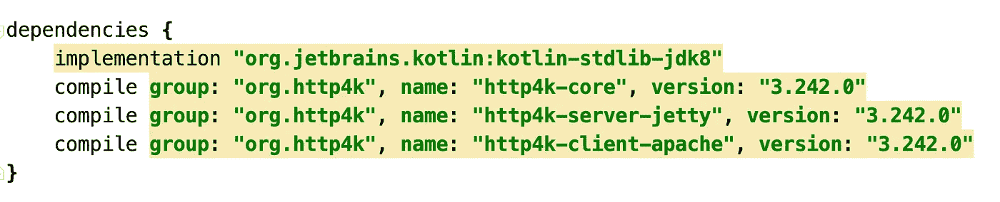
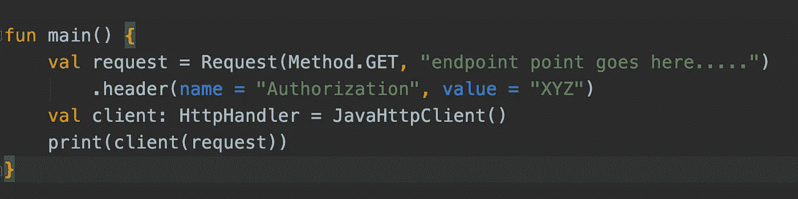
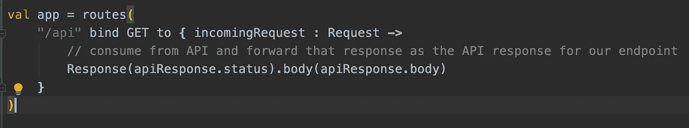
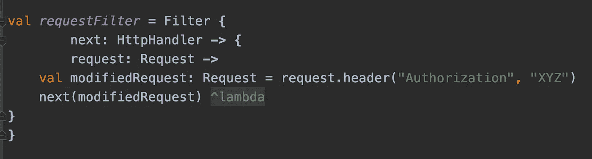
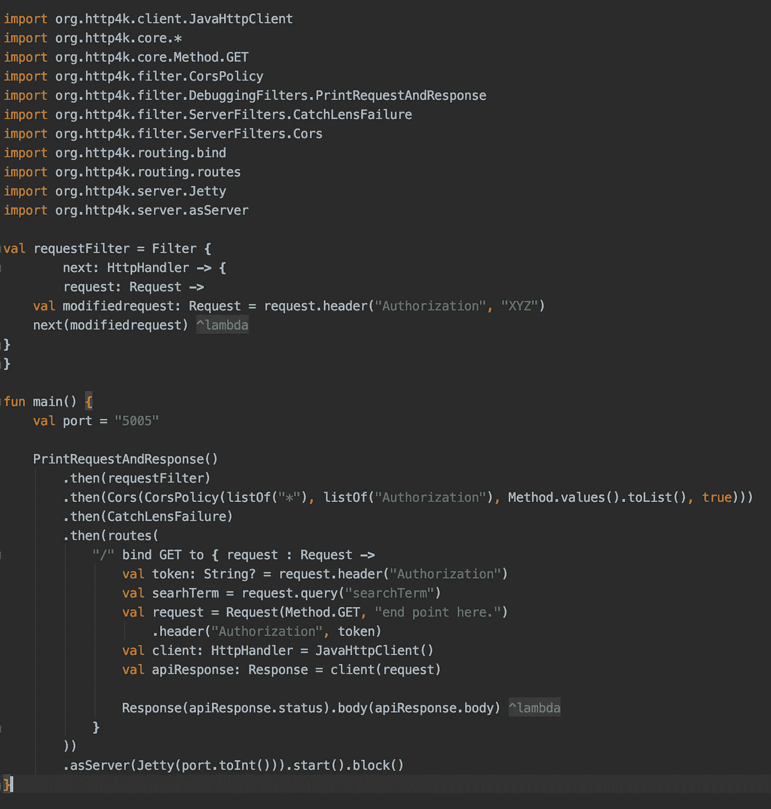

# 使用 Http4k 开始使用服务器端 Kotlin

> 原文：<https://medium.com/globant/getting-started-with-server-side-kotlin-using-http4k-39e9cb0b151d?source=collection_archive---------2----------------------->

Photo by [Safar Safarov](https://unsplash.com/@codestorm?utm_source=medium&utm_medium=referral) on [Unsplash](https://unsplash.com?utm_source=medium&utm_medium=referral)

现在，启动服务器就像编写函数一样简单。听起来很有趣，对吧？！在这篇文章中，我们将看看如何使用 http4k 在 Kotlin 中构建一个具有简单功能的服务器。这来自于将[服务器作为功能](https://monkey.org/~marius/funsrv.pdf)的概念，我们将很快对此进行探讨。

构建可以扩展到大量客户端的服务器端应用程序、与其他编程语言的互操作性、编译到多个平台的能力、空安全、简洁和富于表现力的编码只是 Kotlin 的一些特性。所有这些特性使 Kotlin 有别于其他编程语言。但是在这篇文章中，我们将只关注构建一个可以服务和消费 HTTP 服务的基本服务器。我们将利用 [http4k](https://www.http4k.org/) 库，这是一个轻量级但功能齐全的 http 工具包，使您能够用一个简单的 Kotlin 函数创建 HTTP 客户机或服务器。

所以事不宜迟，我们开始吧！！

一个基本命令将为您创建一个示例 http4k Gradle 应用程序

**curl-s**[**https://raw . githubusercontent . com/http4k/http4k-bootstrap/master/create-app . sh**](https://raw.githubusercontent.com/http4k/http4k-bootstrap/master/create-app.sh)**\-o/tmp/create-app . sh&&bash/tmp/create-app . sh**

确保您的 build.gradle 文件中有以下依赖项

既然我们的项目已经设置好了，我们将构建一个可以从任何公共图像 API 使用 HTTP 服务的客户端，然后构建一个服务器在我们自己的端点上公开相同的服务。

**构建客户端:**

在本节中，我们将了解如何使用外部 API。本例中的外部 API 接受一个授权头和一个查询参数，该参数包含所搜索图像的类别。因此，让我们看看如何编写一个 Kotlin 函数来实现同样的功能。创建一个 Kotlin 文件，并添加以下代码来体验使用 HTTP 服务的魔力。

**构建服务器:**

现在让我们创建我们自己的路由，在这个路由上我们可以公开被消费的 API 映像。

**添加滤镜:**

现在我们已经准备好了服务器和客户端函数，让我们添加过滤器。

过滤器就像拦截器，可以用来对请求或响应执行额外的处理，例如记录请求或捕捉错误，并对其进行处理以使其更加全面。

在这个例子中，我们将通过过滤器添加一个授权头，然后将它链接到我们的 HTTP 处理程序。

总而言之，我们创建了一个客户端来使用公共图像 API，并在我们自己的端点上提供服务，还添加了一个过滤器来添加授权头。这是到目前为止构建的全部源代码。

在我们的最终代码中，我们有几个额外的过滤器来打印请求和响应，以及 Cors 支持，以允许跨源请求和 CatchLensFailure 来处理客户端错误，并适当地将这些错误映射到特定的状态代码。

这篇博客的目的是分享我通过编写一个函数用 Kotlin 构建服务器的经验。在 [http4k](https://www.http4k.org/) 中还有很多其他的特性可以探索。希望这篇文章增加了你探索 Kotlin 的渴望，快乐学习！