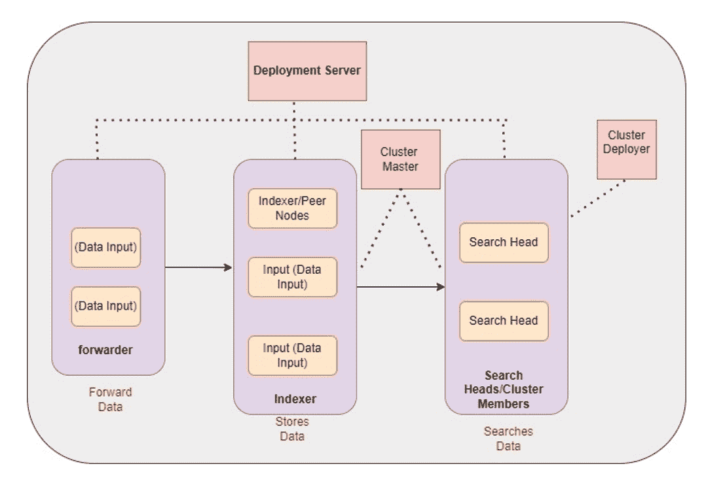
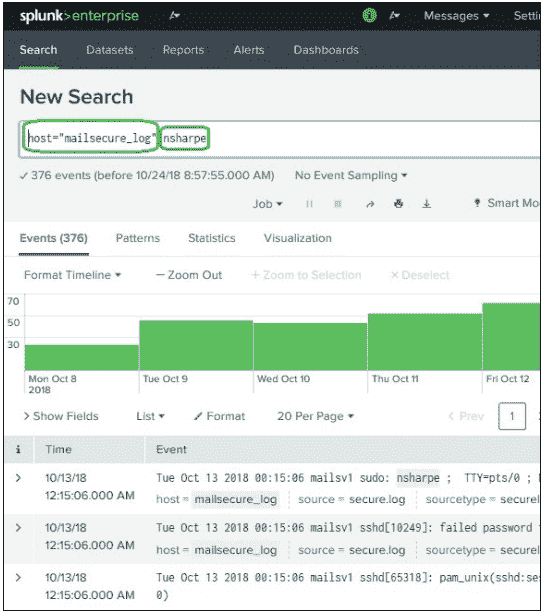
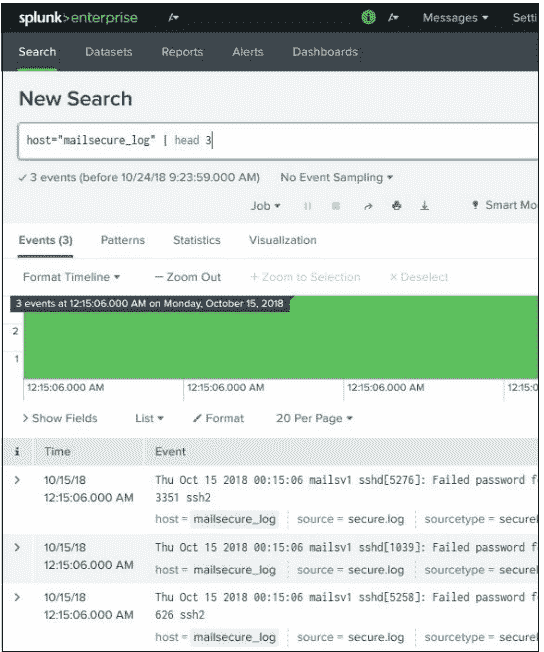
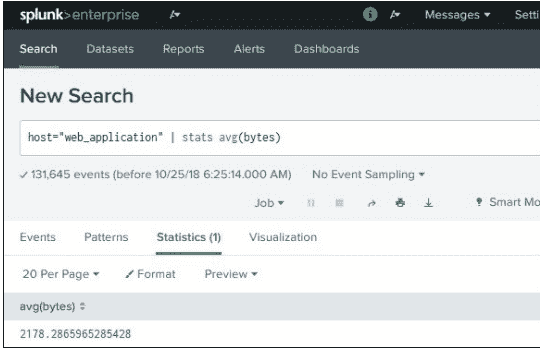
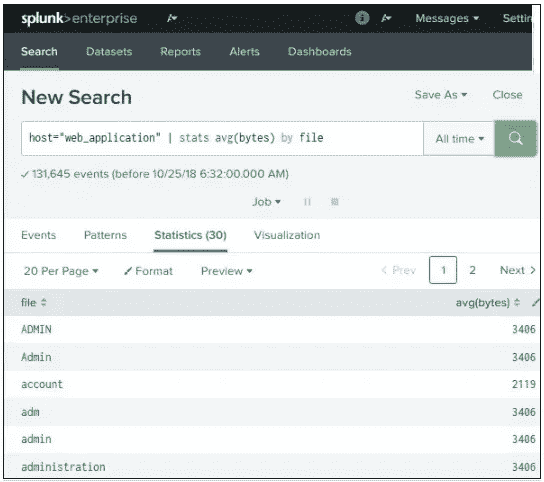

# Splunk 入门

> 原文：<https://medium.com/globant/getting-started-with-splunk-fa0121ab9e89?source=collection_archive---------0----------------------->

Splunk 是一个软件平台，广泛用于实时监控、搜索、分析和可视化机器生成的数据。它在一个可搜索的容器中执行实时数据的捕获、索引和关联，并生成图表、警报、仪表板和可视化效果。Splunk 在整个组织内提供易于访问的数据，便于诊断和解决各种业务问题。

**为什么选择 Splunk :**

*   Splunk 从多个系统实时收集数据
*   它接受任何形式的数据，例如日志文件。csv、json、config 等。
*   Splunk 可以从数据库、云和任何其他操作系统中提取数据
*   它分析和可视化数据以获得更好的性能
*   Splunk 发出警报/事件通知
*   提供实时可见性
*   它满足了行业需求，如水平可伸缩性(并行使用许多系统)

**Splunk 组件:**

1.  处理组件
2.  管理组件

**加工组件:**

**Forwarder :** 从远程机器收集数据，然后将数据转发给索引。

**索引器:**索引器实时处理传入的数据。它还在磁盘上存储&索引数据。

**搜索头:**最终用户通过搜索头与 Splunk 交互。它允许用户做搜索，分析&可视化。

**管理组件:**

*   部署服务器
*   索引器集群(主节点)
*   搜索头集群(部署者)
*   许可证主文件
*   监控控制台

**部署服务器:**充当任意数量的其他实例(称为“部署客户机”)的集中配置管理器。…部署客户端可以是转发器、索引器或搜索头。每个部署客户机属于一个或多个服务器类。

**索引器集群(主节点):**管理集群。它协调对等节点的复制活动，并告诉搜索头在哪里可以找到数据。它还有助于管理对等节点的配置，并在对等节点出现故障时协调补救活动。

**搜索头集群(部署者):**搜索头在一组对等节点上运行搜索。您必须使用搜索头来管理跨索引器集群的搜索。

**许可证主:**许可证基于卷&使用量—例如，每天 50 GB。Splunk 定期检查许可详细信息。

**监控控制台:**监控控制台是 Splunk Enterprise 中包含的一组仪表板、平台警报和运行状况检查。

**Splunk 架构**

Splunk 的架构由各种组件及其功能组成。请参考下图，该图给出了流程中涉及的组件的综合视图:

**转发数据:**

转发器可以跟踪数据，制作数据的副本，并在将特定数据发送到索引器之前对其执行负载平衡。

克隆有助于在数据源上生成任何案例的复制副本，而负载平衡是这样执行的，即使一个案例崩溃，该数据也可以传送到托管索引器的另一个案例。

**存储数据:**

当从转发器获得数据时，它将被丢弃在索引器组件中。在索引器中，获得的数据被划分到不同的逻辑数据存储中，在每个数据存储中，您可以设置权限，这些权限将指导用户的查看和访问。

当数据在索引器中时，您可以探索该数据，并将这些探索分配给不同的搜索伙伴，分配后我们将获得的所有结果将被合并并结转到搜索头。

**搜索数据:**

您还可以安排搜索伙伴并创建警报，当某些情况与保存的搜索匹配时，警报将被激活。

您也可以仅使用知识对象来强化现有的非结构化数据(没有任何格式的数据)。

可以从 Splunk CLI 或 Splunk Web 界面检索搜索标题和知识对象。这种交互发生在 REST API 连接上。

**搜索处理语言(SPL) :**

SPL 是一种包含许多命令、函数、参数等的语言。，编写它们是为了从数据集获得所需的结果。

**SPL 的部件**

*   **搜索词**—这些是您正在寻找的关键词或短语。
*   **命令**—您想要对结果集采取的操作，如格式化结果或对结果进行计数。
*   **功能**——您将对结果应用什么计算。如总和、平均值等。
*   **子句**—如何对结果集中的字段进行分组或重命名。

**搜索术语:**在下面的例子中，我们搜索包含两个突出显示术语的记录。

**命令:**在下面的例子中，我们使用 head 命令过滤掉搜索操作中的前 3 个结果。

**函数:**在下面的例子中，我们使用 Stats avg()函数来计算作为输入的数值字段的平均值。

在下面的例子中，我们得到了 web_application 日志中每个文件的平均字节大小。如您所见，结果显示了每个文件的名称以及每个文件的平均字节数。

**结论:**因此，Splunk 是监控不同基础设施性能、解决问题、创建仪表板、轻松创建报告和警报的完美工具。这是一个管理任何系统的完整工具，所有的日志都是动态存储的。