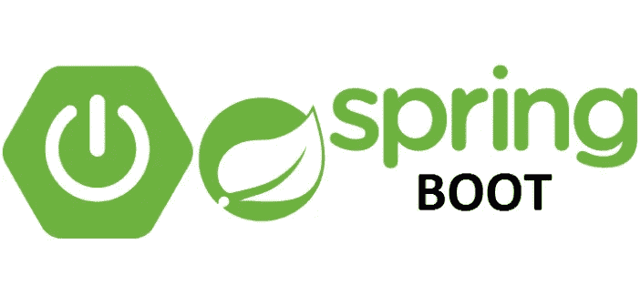
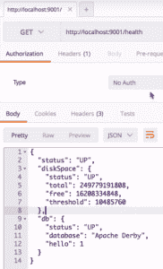
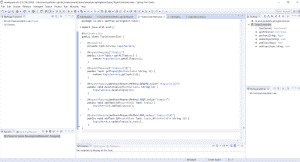
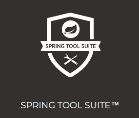
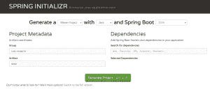
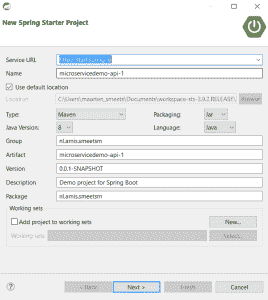
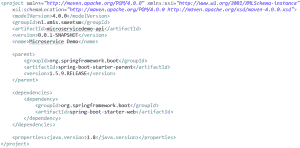

# Spring Boot 微服务入门。为什么和如何。

> 原文：<https://medium.com/oracledevs/getting-started-with-spring-boot-microservices-why-and-how-f4d975a80ccf?source=collection_archive---------0----------------------->

为了快速开发微服务，Spring Boot 是一个普遍的选择。我为什么会对 Spring Boot 感兴趣？在这篇博文中，我会给你一些为什么看 Spring Boot 很有趣的理由，并给出一些如何快速开始的例子。我将很快谈论微服务，然后讨论 Spring Boot，最后讨论应用容器云服务，这是运行和管理您的 Spring Boot 应用的理想平台。这个博客涉及许多主题，但它们很好地结合在一起。你可以在这里查看我的示例 Spring Boot 项目的代码。大部分的 Spring Boot 知识都是通过[Java Brains 接下来的免费课程](https://javabrains.thinkific.com/courses/take/springboot-quickstart)获得的。

# 微服务

在我们深入探讨为什么 Spring Boot 需要微服务之前，我们首先需要了解什么是微服务。这是一个很容易问的问题，但是在这篇博客中用几行字来回答有点复杂。2014 年，马丁·福勒(Martin Fowler)是最早描述微服务特征并实际称之为微服务的人之一。还有什么比他写的文章更好的来源呢？比如这里的。

简而言之，微服务架构风格是一种将单个应用程序开发为一套小服务的方法，每个小服务都在自己的进程中运行，并通过轻量级机制(通常是 HTTP 资源 API)进行通信。这些服务是围绕业务功能构建的，可由全自动部署机器独立部署。这些服务几乎没有集中管理，它们可能用不同的编程语言编写，使用不同的数据存储技术。

—詹姆斯·刘易斯和马丁·福勒

当然，这个定义中包含了很多术语

*   它是开发单个应用程序的一种架构风格。
*   一套小服务，每个都在自己的进程中运行。
*   使用轻量级机制进行通信，通常是 HTTP。
*   围绕业务能力构建。查找[有界上下文](https://martinfowler.com/bliki/BoundedContext.html)。
*   对这些服务进行最低限度的集中管理。这意味着没有应用服务器提供对运行在其上的应用程序的集中管理。
*   可以用不同的编程语言编写或使用不同的存储技术。

一个[微服务架构风格](https://martinfowler.com/microservices/#what)也有几个特点。更详细地看看这样的架构是非常有趣的，例如 [OMESA initiative](http://omesa.io/) 可以帮助你开始。当然，对于所有的架构风格来说，这都是显而易见的事实，如果做得正确，你将获得最大的收益。然而，确定“正确”通常并不简单。

# Spring Boot 微服务公司

Spring Boot 基于与微服务架构一致的某些原则。Spring Boot 的主要目标是:

*   为所有 Spring 开发提供更快、更广泛的入门体验。
*   打破常规坚持己见，但是当需求开始偏离默认时，要迅速离开。
*   提供一系列大型项目共有的非功能特性(例如，嵌入式服务器、安全性、指标、健康检查、外部化配置)。
*   绝对不需要代码生成，也不需要 XML 配置。

Spring Boot 提供的特性也非常适合在中实现微服务。

*   Spring Boot 应用程序可以包含一个嵌入式 Tomcat 服务器。这是一个完全独立的 Tomcat 容器，它的配置是应用程序的一部分。
*   Spring Boot 非常适合创建轻量级 JSON/REST 服务。
*   提供健康检查等功能。Spring Boot 提供[执行器](https://docs.spring.io/spring-boot/docs/current-SNAPSHOT/reference/htmlsingle/#production-ready)。一组允许监控和管理的 REST 服务。看[这里](https://spring.io/guides/gs/actuator-service/)。也可以使用外部化的配置。几乎不需要集中管理功能。
*   由于可以使用不同的存储技术，Spring 提供了 Spring 数据 JPA。JPA 是 Java 持久性 API。这个 API 提供了 [ORM](https://en.wikipedia.org/wiki/Object-relational_mapping) 功能，使得使用关系数据库更加容易(主要是独立于供应商的，支持 EclipseLink、Hibernate 和其他几个)。

请求健康状态的执行器调用示例

# 易于实现的 API 设计模式

网上有大量的描述来提供 API 设计指南。例如，参见[这里的](https://hackernoon.com/restful-api-designing-guidelines-the-best-practices-60e1d954e7c9)。一个 API URL 的例子可以是这样的:【http://api.yourservice.com/v1/companies/34/employees.】T2 注意 URL 的结构，其中包含一个版本号。Oracle 移动云服务文档也有一些设计建议。见[此处](https://docs.oracle.com/en/cloud/paas/mobile-cloud/mcsua/custom-api-design.html#GUID-C8C955BC-048A-4F2D-9D23-DDE3AEE387BB)。这些设计考虑在 Spring Boot 当然很容易实现。

例如，请参见下面的代码示例:

A simple Spring Boot controller

您可以看到 HTTP 操作是如何使用的，以及方法调用映射到 URL 的方式。此示例的额外好处是，它还显示了如何访问请求消息的正文。

# 与后端系统集成

Spring Boot 与 JPA 整合。JPA 提供了一个 API 来轻松实现 ORM。它允许你在 Java 中使用数据库数据支持的对象。对于基本的 CRUD 操作，在 Spring Boot 实现 JPA 所需的工作是最小的。

使用嵌入式 Derby 数据库时，只需要三样东西就可以完成简单的 CRUD 操作。

*   带注释的实体。在 POJO 中只需要两个注释。@Entity 用于注释类，而@Id 用于指示保存主键的变量。
*   扩展 CrudRepository 的存储库接口(来自 org . spring framework . data . repository)
*   在您的服务内部，您可以使用@Autowired 注释来创建一个带有存储库实例的局部变量。

嵌入式 Derby 服务器的连接细节不是必需的。但是它们是用于外部数据库的。如果你想连接到一个 Oracle 数据库，请在这里阅读下面的。

# 与 Node 上的微服务相当

节点还是 Spring Boot？这当然是一个众说纷纭的话题。许多博客被用来比较这两者。例如，参见[这里的](https://www.quora.com/What-are-the-advantages-of-Spring-Boot-over-Node-js-for-a-RESTful-web-service)。

在几个方面，Spring Boot 击败了 Node.js

*   性能。这里看下面这篇文章[。Spring Boot 微服务可以实现比 Node.js 上同类服务更高的吞吐量](https://www.linkedin.com/pulse/nodejs-vs-java-which-faster-apis-owen-rubel?trk=pulse_spock-articles)
*   成熟。Spring 在运行企业应用程序方面有着悠久的历史。Node.js 也可以使用，但是不够成熟。
*   安全。Spring 和 Spring Boot 显然比 Node.js 更好。例如，Node 对 Kerberos 的支持是有限的，而 Spring Boot 为几种安全实现提供了简单的抽象，其中包括 Kerberos 令牌。
*   RDBMS。由于 JPA，这在 Spring Boot 更容易使用。

Node.js 也在几个方面击败了 Spring Boot

*   构建/包管理。对梅文和 NPM 有经验的人通常更喜欢 NPM
*   UI。JavaScript 当然是前端应用程序的首选语言。基于 Java 的框架，比如 JSF 变体，到目前为止还没有像 AngularJS 这样的框架那样的生产力。
*   像 MongoDB 这样的文档数据库。当您可以使用 JSON 时，Node.js 上运行的 JavaScript 代码使得与数据库的交互变得非常容易。

Spring Boot，在 Java 生态系统中也可以与 Ratpack 结合。此处见[。Ratpack 提供了一个高吞吐量、无阻塞的 web 层。语法类似于编写 Node.js 代码的方式。对于 Spring Boot 来说，这当然不是什么大问题，因为 Node.js 上的模块提供了类似的功能。这两种解决方案比你第一眼看到的更相似。](https://www.infoq.com/articles/Ratpack-and-Spring-Boot)

如果你选择 Node.js 或 Spring Boot，这可能主要取决于你拥有的技能和你的应用前景。如果你来自 JavaScript 世界，你可能更喜欢在 Node.js 上写你的微服务。如果你来自 Java 世界，你会更喜欢 Spring Boot。重要的是要明白，是选择 Node.js 还是 Spring Boot 并没有明显的优势。

# Spring Boot 入门

最简单的入门方法就是先看一些网络课程。比如[这个](https://javabrains.thinkific.com/courses/take/springboot-quickstart)来自 Java Brains。我将在下面提供一些好的建议。

# Spring 工具套件(STS)

至于 IDE，每个 Java IDE 都可以，然而，由于 Spring Boot 是建立在 Spring 之上的，你可以考虑使用 Spring 工具套件( [STS](https://spring.io/tools) )。这是一个带有许多特定 Spring 特性的 Eclipse 发行版，使得 Spring 应用程序的开发更加容易。

# 弹簧初始化 r

获得启动项目的另一种方法是转到[https://start.spring.io/](https://start.spring.io/)，指出你的依赖项，然后点击生成项目按钮。这将为您生成一个已经添加了所需依赖项的 Maven 或 Gradle 项目。

有了 STS，您还可以轻松地使用 Spring Initializr 功能。

# Spring Boot CLI

Spring Boot CLI 提供创建和运行 Groovy Spring Boot 应用程序的特性。做类似的事情，Groovy 比 Java 需要更少的代码。它是一种运行在 JVM 上的脚本语言，你可以从 Groovy 访问普通的 Java 类/库。

例如，您可以创建如下应用程序:

@ rest controller
class hello world class {

@ request mapping("/")String home(){ return " Hello World！"}

}

# 真正开始

要开始使用 Spring Boot，必须在 pom.xml 文件中添加一些条目，然后就可以开始了。最简单的方法是使用 STS 中新的 Spring Starter 项目，因为它将为您生成一个 pom，一个主类和测试类。这就是我在我的示例项目[中使用的](https://github.com/MaartenSmeets/microservices-demo)。

*A simple pom.xml to get started with Spring Boot*

# Spring 和 Oracle

Spring 是一个非常常见的 Java 框架。您可以在几个 Oracle 产品和功能中找到它的踪迹。下面是一些例子。如果您查看其他 Oracle 产品，尤其是那些基于 Java 的产品，我希望您会发现更多的例子。

# SOA 套件

例如在 Oracle SOA 套件中。

*   SOA 套件本身在幕后使用 Spring
*   SOA 套件可以使用 Spring 组件

# 大规模开放在线课程

甲骨文在其提供的课程中使用 Spring Boot。例如在[开发可部署在 Oracle Cloud MOOC](https://apexapps.oracle.com/pls/apex/f?p=44785:149:9003268384949::NO:RP,149:P149_EVENT_ID,P149_PREV_PAGE:5623,2) 上的 RESTful Java 微服务。

# 应用容器云服务(ACCS)

ACCS 已经存在一段时间了。与 Spring Boot 一起，他们提供了一个理想的组合，让您的微服务快速开发和运行。

应用程序容器云服务提供了[的特性，这是一款全新的十二因素应用程序](https://12factor.net/),因此您不必自己开发这些特性。这些当然也符合微服务原则，比如将应用作为无状态进程执行。

如果您想将 ACCS 与 Spring Boot 一起使用，有两种方法可以部署您的 Spring Boot 应用程序。

*   您可以通过在 pom.xml 文件的打包标记中指定 war 来创建 WAR 文件。接下来，您可以将这个 WAR 文件部署为一个 Java EE Web 应用程序。这将在后台运行 WebLogic。点击阅读更多[。](https://docs.oracle.com/en/cloud/paas/app-container-cloud/dvcjv/preparing-java-ee-web-application-deployment.html)
*   您可以通过在 pom.xml 文件的打包标记中指定 jar 来创建 JAR 文件。接下来，您可以直接运行这个 JAR 文件，因为您将获得一个内嵌的 Tomcat，并可以将其作为 Java SE 应用程序运行。这里的配置将是应用程序的一部分。

我没有详细比较这两个选项，但是我可以想象如果你想运行一个“微”服务，一个完整的 WebLogic Server 可能会使它更像一个“宏”服务。

*原载于 2018 年 1 月 24 日*[*technology . amis . nl*](https://technology.amis.nl/2018/01/24/getting-started-with-spring-boot-microservices-why-and-how/)*。*