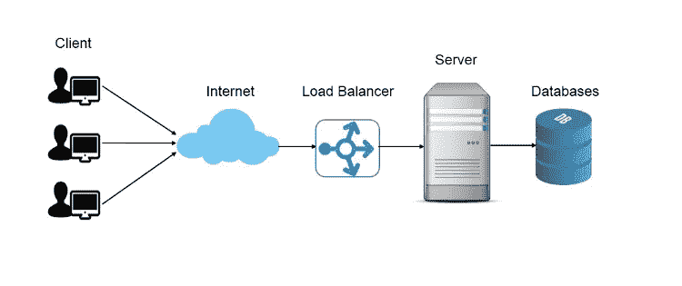
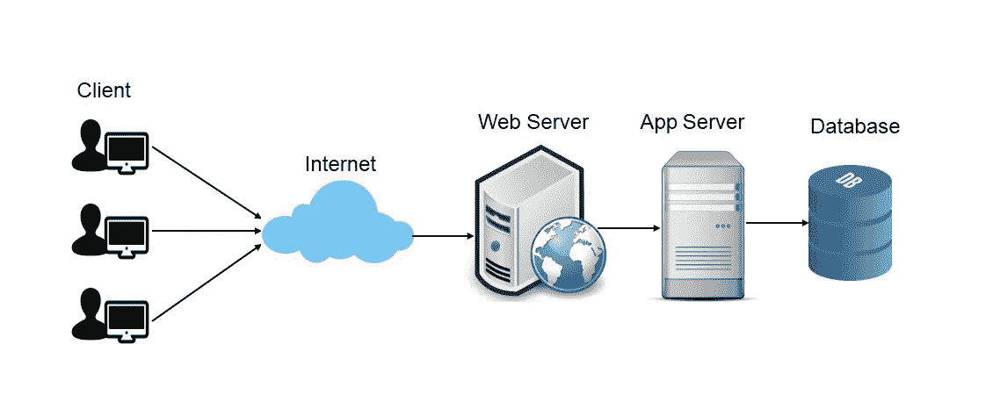
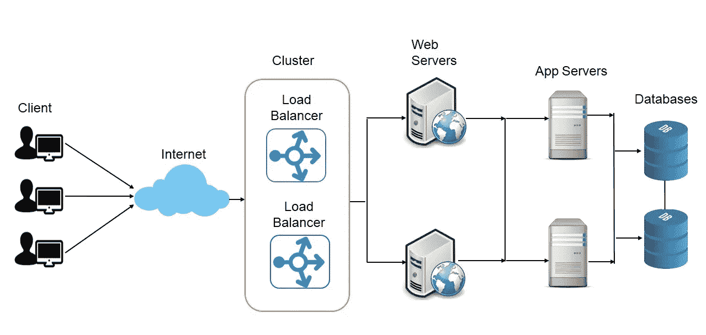
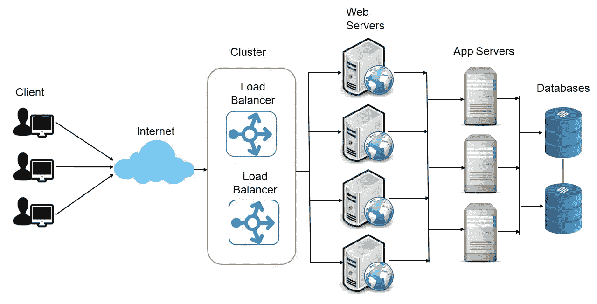

# 系统设计入门

> 原文：<https://medium.com/globant/getting-started-with-system-design-d185bfedf576?source=collection_archive---------1----------------------->


**系统设计**是为系统设计架构、组件和接口，以满足最终用户的需求。**系统设计**是不可忽视的东西！作为一名软件开发人员，应该理解系统设计概念，如可伸缩性、负载平衡、缓存等。，以及如何应用它们。这个博客将帮助你从基础到高级水平最有效地**学习和掌握系统设计**概念。

# **分布式系统及其 3 个原则**

任何具有驻留在多台机器上的多个组件的系统都是分布式系统，这些组件通过某种机制进行协调，比如发送消息以实现一个共同的目标。分布式系统是健壮的和可伸缩的。稳健的系统能够应对错误。可伸缩的系统可以通过增加资源来处理越来越多的工作。

让我们来理解设计这类系统的三个原则。

1.  **单一责任原则** —系统设计中的每个组件都应该有一个单一的工作要执行。总是分解你的组件，这样你的组件应该只执行一个职责。
2.  **无单点故障原则** —系统不应有任何组件的故障会导致整个系统的故障。确定故障点，并添加此类组件的冗余副本，以便在一个组件出现故障时，其他组件可以接管。这将使你的系统健壮。
3.  **无瓶颈原则** —因为我们设计的是可伸缩性，所以我们的系统不应该有性能瓶颈。识别速度慢的组件，并纵向或横向提高它们的性能。我们称这个过程为缩放。

**垂直扩展**升级现有的硬件或软件。**水平扩展**增加多个系统以提高性能。

我们应该首先尝试纵向扩展系统，但请记住，纵向扩展总会有一些限制，因此一旦达到阈值，我们就可以考虑横向扩展。



Distributed System Design

上图显示了分布式系统的一般数据流。客户端连接到服务器，服务器处理一些数据，将数据保存在数据库中，并返回一些响应。现在让我们将上述系统设计原则逐一应用到本次设计中。

负载平衡器的唯一职责是将传入的请求转发给服务器。该服务器可以执行两项任务。

1.  提供网页服务。
2.  执行一些处理并将数据保存在数据库中。

因此，让我们将此服务器分成两个组件来执行单一职责。



Single responsibility principle

我们将应用程序和 web 服务器分开。应用服务器将处理数据并更新数据库。网络服务器将提供网页服务。

现在让我们检查第二个原则。假设客户端正在发送一些数据。这些数据将通过负载平衡器流向 web 服务器、应用服务器，最后流向数据库。如果任何一个组件出现故障，都会导致整个系统的故障。让我们为每个组件添加另一个副本，以避免单点故障。



No single point of failure

再来看第三个原则，“无瓶颈”。

如果许多客户端访问系统，web 服务器可能会成为瓶颈。假设每个 web 服务器可以同时处理 100 个客户端。根据上面的图表，我们可以处理 200 个客户。如果我们增长到 201 个客户，web 服务器就是一个瓶颈。在这种情况下，我们将不得不添加 web 服务器和应用服务器的多个副本，以便系统性能不会受到影响，并且客户端将立即得到响应。我们可以进行一些计算，以确定所需的额外服务器数量，并添加这些应用程序和 web 服务器。



No Bottleneck Principle

在上图中，我们确定了速度较慢的组件，并对它们进行了水平扩展，也就是说，我们添加了一个应用程序和 web 服务器的多个副本。

有两种类型的负载平衡器:外部和内部。外部平衡器用于网络的外部场所，以处理传入流量。内部平衡器可以处理 web 服务器和应用服务器之间的内部流量。在下图中，我们可以在应用服务器点添加一个额外的负载平衡器。

负载平衡器可以划分外部和内部流量。通常，我们将同一个负载平衡器作为外部和内部负载平衡器重用，因为购买不同的平衡器会很昂贵。所以在上面的图中，客户端将发送一个数据包到负载均衡器，负载均衡器将它转发到 web 服务器；然后，web 服务器将数据包转发到负载平衡器，负载平衡器将数据包转发到应用服务器，因此 web 服务器和应用服务器之间没有直接通信。

# **系统设计的 5 步指南**

让我们考虑一下脸书的使用案例，并试着理解系统设计的 5 步指南。请注意，我们的范围仅限于脸书类应用的一些基本要求，发送好友请求，阅读时间表，以及与朋友聊天。

1.  **需求分析**

它包括功能性和非功能性需求。

**功能需求是我们的系统所能做到的。**在我们的案例中，功能需求是:

```
1\. Sending friend request
2\. Reading timeline 
3\. Chatting with friends
```

**非功能性需求是系统应该如何表现的**

在我们的例子中，非功能性需求是:

```
1\. System should be highly available there should not be any downtime.
2\. It should be secure in term of saving user data, should be tough for hackers to hack data
3\. There should be no data loss
```

**2。API 设计**

这里我们定义了暴露于外部世界的接口，它们通过这些接口与外部世界进行通信。它们包括 API 名称、有效负载和返回值

对于我们的脸书同类，功能需求是发送朋友请求，所以我们现在将有一个发送朋友请求的 API:

```
name: friendRequest
payload: userId of logged in person and person to whom we are sending request
response: Boolean to indicate if API is successful or not
```

另一个功能需求是与朋友聊天，所以我们的 API 应该是:

```
name: sendMessage
payload: sender and receiver user id and message
response: If message was delivered or person is offline
```

我们将类似地定义所有其他需要的 API。

**3。定义数据模型**

它表示对象数据、它与不同对象的关联以及它应该遵循的规则。它定义了我们的系统需要哪些数据字段。

在我们的脸书式系统中，我们的对象就是我们的用户。用户之间的关联意味着一个用户可以和另一个用户成为朋友。

当我们上传图片时，我们的图片是我们的对象，应该存储在某个存储中，关于图片的元数据信息可以保存在某个表中。它收到的评论可以存储在一个单独的表中，该表可以在 SQL 或 NoSQL 数据库中。

还有，我们需要维护用户和好友聊天记录的信息；我们可以使用 JSON 结构并将其保存在 NoSQL 数据库中。对于社交媒体应用，我们通常拥有庞大且不断增长的数据；因此，我们在这里选择 NoSQL 数据库。

**4。高层设计**

一旦定义了数据模型，我们必须创建一个高层次的系统设计。这种高层次的设计用显示数据流的箭头来表示所需的组件块。在概要设计中，我们必须确保我们所有的功能需求都得到满足。

这些组件可以是负载平衡器、web 服务器、应用程序服务器、数据库、消息队列、缓存或执行过滤、读取、处理等操作的自定义组件。高级设计显示了数据如何从入口点流向数据库，反之亦然。

高层设计负责所有的功能组件；它还负责一些非功能性的需求。例如，如果我们希望我们的应用程序是安全的，那么所有的安全组件都应该添加到高级设计中。

**5。缩放设计**

这涵盖了非功能性需求，如高可用性、可伸缩性和无数据丢失。

这是必要的，因为今天的系统通常是大规模分布式系统，就像我们在脸书的例子。脸书必须处理分布在全球的数十亿用户。我们需要增加多台机器，因为一台机器不可能处理所有的事情。这些多台机器还确保了高可用性，因此如果一台机器出现故障，另一台机器可以接管它。我们需要保留数据的多个副本，以确保数据不会丢失。数据可以跨数据中心复制，因此用户的响应时间是最短的。

在本节中，我们看到了系统设计中使用的 5 步用户指南。使用这五个步骤，你可以很容易地设计任何系统。即使客户在开发过程中改变了，我们也可以重复这五个步骤来修改我们的系统并适应变化的需求。

参考资料:

[https://completedesigninterviewcourse.com/](https://completedesigninterviewcourse.com/)

[https://www.geeksforgeeks.org/system-design-tutorial/](https://www.geeksforgeeks.org/system-design-tutorial/)