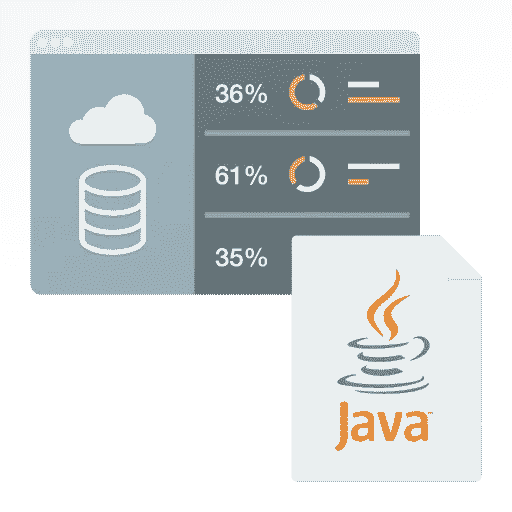

# 用于反应流接收(RSI)的 Java 库入门

> 原文：<https://medium.com/oracledevs/getting-started-with-the-java-library-for-reactive-streams-ingestion-rsi-afbc808e6e24?source=collection_archive---------0----------------------->

[High-performance data access with Java](https://www.oracle.com/database/technologies/appdev/jdbc.html)

华雷斯少年

## **挑战:将数据流入数据库**

当从成千上万的数据源传输数据时，许多解决方案都面临着挑战。使用温度、压力和流量计等传感器运行物联网网络的智能城市是以下应用的绝佳示例…