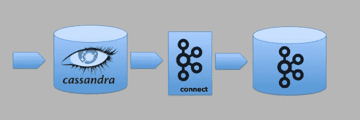
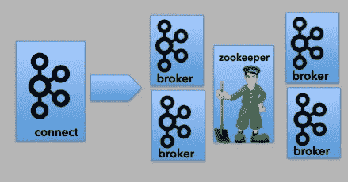
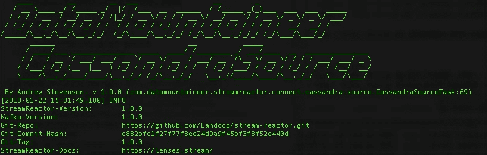

# Kafka Connect Cassandra 源代码入门

> 原文：<https://medium.com/walmartglobaltech/getting-started-with-the-kafka-connect-cassandra-source-e6e06ec72e97?source=collection_archive---------0----------------------->

这篇文章将着眼于如何设置和调整[卡珊德拉源连接器](http://lenses.stream/connectors/source/cassandra.html)，可从 [Landoop](http://www.landoop.com/) 获得。Cassandra Source 连接器用于从 Cassandra 表中读取数据，仅使用一个配置文件将内容写入 Kafka 主题。这使得已经保存的数据可以很容易地转换成事件流。



all logos are trademark of Apache Foundation

在我们的示例中，我们将捕获代表一包(即一个大箱子)正在运输的物品的数据。每个包都以 JSON 格式推送给消费者，主题是 Kafka。

# Cassandra 数据模型和 Cassandra 源连接器

Cassandra 中的数据建模必须围绕访问数据所需的查询来完成(详见本文)。通常，这意味着每个查询都有一个表，数据(在我们的例子中是关于包的)将跨多个表重复。

不考虑产品使用的其他表，Cassandra Source 连接器需要一个允许我们使用时间范围查询数据的表。连接器是围绕其基于配置生成 CQL 查询的能力而设计的。它使用该查询从表中检索在可配置的时间范围内可用的数据。所有这些数据发布后，Kafka Connect 会将时间范围的上限标记为偏移量。然后，连接器将使用从偏移量中存储的日期/时间开始的下一个时间范围来查询表中的更多数据。我们将在后面研究如何配置它。现在，我们想把重点放在表的约束上。因为 Cassandra 不支持连接，所以我们从中提取数据的表必须包含我们想要放入 Kafka 主题的所有数据。Kafka Connect 将无法使用其他表中的数据。

最简单的形式是，Cassandra 源连接器使用的表格可能如下所示:

```
CREATE TABLE IF NOT EXISTS “pack_events” (
    event_id TEXT, 
    event_ts TIMESTAMP, 
    event_data TEXT, 
PRIMARY KEY ((event_id),event_ts));
```

`event_id`是分区键。Cassandra 使用它来确定集群中的哪些节点将存储数据。`event_ts`是集群密钥的一部分。它决定了分区内数据的顺序(详见本文)。Cassandra 源连接器也使用该列来管理时间范围。在这个例子中，`event_data`列存储了包的 JSON 表示。

这不是唯一可行的表结构。Cassandra 源连接器查询的表可以使用许多列来表示分区键和数据。然而，**为了正确工作，连接器需要一个基于时间的列**(或者`TIMESTAMP`或者`TIMEUUID`)。

对于 Cassandra 源连接器，这将是一个同样有效的表。

```
CREATE TABLE IF NOT EXISTS “kc_events” (
    event_id1 TEXT, 
    event_id2 TEXT, 
    event_ts TIMEUUID, 
    event_data1 TEXT, 
    event_data2 TEXT, 
PRIMARY KEY ((event_id1, event_id2)));
```

访问该表中数据的最有效方法是使用分区键查询数据。这将允许 Cassandra 快速识别包含我们感兴趣的数据的节点。

```
SELECT * FROM pack_events WHERE event_id = “1234”;
```

然而，Cassandra Source 连接器无法知道它将需要发布到 Kafka 主题的数据的 id。这就是它使用时间范围的原因。

我们不能使用`event_ts`作为分区键的原因是因为 Cassandra 在查询时不支持分区键上的这些运算符(>、> =、< =、<)。如果没有这些，我们将无法跨日期/时间范围进行查询(详见本文的)。

还有一件事。如果我们尝试运行以下查询，它将会失败。

```
SELECT * FROM pack_events 
WHERE event_ts > ‘2018–01–22T20:28:20.869Z’ 
AND event_ts <= '2018-01-22T20:28:50.869Z';
```

连接器必须在查询结束时提供`ALLOW FILTERING`选项，这样它才能工作。这一增加允许 Cassandra 在集群中的所有节点上搜索指定时间范围内的数据(参见本文的[了解详细信息](https://www.datastax.com/dev/blog/allow-filtering-explained-2))。

# 配置连接器:KCQL 基础知识

Landoop 连接器是使用 Kafka 连接查询语言(KCQL)配置的。这提供了一种简洁和一致的方式来配置连接器(至少是 Landoop 的连接器)。KCQL 和其他基本属性是通过 JSON 格式的属性文件提供的。

为了这篇文章，让我们创建一个名为`connect-cassandra-source.json`的文件。

```
{ 
  “name”: “packs”, 
  “config”: { 
   “tasks.max”: “1”, 
   “connector.class”: … 
```

连接器的`name`需要在 Kafka Connect 中安装的所有连接器中是唯一的。

`connector.class`用于指定正在使用的连接器。​​

*   `com.datamountaineer.streamreactor.connect.cassandra.source.CassandraSourceConnector`

下一组配置(如下所示)用于指定连接到 Cassandra 集群所需的信息以及要使用的键空间。

*   `​connect.cassandra.contact.points`
*   `connect.cassandra.port`
*   `connect.cassandra.username`
*   `connect.cassandra.password`
*   `connect.cassandra.consistency.level`
*   `connect.cassandra.key.space`

```
{ 
  “name”: “packs”, 
  “config”: { 
    “tasks.max”: “1”, 
    “connector.class”: “com.datamountaineer.streamreactor.connect.cassandra.source.CassandraSourceConnector”, 
    “connect.cassandra.contact.points”: “localhost”,    
    “connect.cassandra.port”: 9042, 
    “connect.cassandra.username”: “cassandra”,   
    “connect.cassandra.password”: “cassandra”,
    “connect.cassandra.consistency.level”: “LOCAL_ONE”,
    “connect.cassandra.key.space”: “blog”, 

    “connect.cassandra.import.mode”: “incremental”, 
    “connect.cassandra.kcql”: “INSERT INTO test_topic SELECT event_data, event_ts FROM pack_events IGNORE event_ts PK event_ts WITHUNWRAP INCREMENTALMODE=TIMESTAMP”, 

     … 
  } 
}
```

`connect.cassandra.import.mode`有两个值。那些是`bulk`和`incremental`。每次 Kafka Connect 轮询发生时，`bulk`选项将查询表*中的所有内容。我们将把它设置为`incremental`。*

配置中有趣的部分是`connect.cassandra.kcql`属性(如上所示)。KCQL 语句告诉连接器使用 Cassandra 集群中的哪个表，如何使用表上的列，以及在哪里发布数据。

KCQL 语句的第一部分告诉连接器将发布数据的 Kafka 主题的名称。在我们的例子中，这就是名为`test_topic`的主题。

```
INSERT INTO test_topic
```

KCQL 语句的下一部分告诉连接器如何处理这个表。`SELECT/FROM`指定用查询轮询的表。它还指定应该检索其值的列。跟踪日期/时间的列必须是`SELECT`语句的一部分。然而，如果我们不希望这些数据成为我们发布到 Kafka 主题的一部分，我们可以使用`IGNORE.`

```
SELECT event_data, event_ts FROM pack_events IGNORE event_ts
```

语句的下一部分`PK`告诉连接器哪个列用于管理日期/时间。这被认为是连接器的主键。

```
PK event_ts WITHUNWRAP INCREMENTALMODE=”TIMESTAMP”
```

`INCREMENTALMODE`告诉连接器`PK`列的数据类型。那将是`TIMESTAMP`或者`TIMEUUID`。

最后，`WITHUNWRAP`选项告诉连接器将数据作为字符串而不是 JSON 对象发布到主题。

例如，如果我们在`event_data`列中有以下值:

```
{ “foo”:”bar” }
```

我们希望发布如上图所示的内容。

关闭`WITHUNWRAP`选项将导致以下值发布到主题。

```
{ 
  “schema”: {
    “type”: “struct”, 
    “fields”: [{ 
      “type”: “string”,
      “optional”: true,
      “field”: “event_data” 
    }],
    “optional”: false, 
    “name”: “blog.pack_events” 
  }, 
  “payload”: { 
    “event_data”: “{\”foo\”:\”bar\”}” 
  } 
}
```

如果我们让`WITHUNWRAP`关闭，当使用`StringConverter`(稍后会详细介绍)时，我们会得到以下结果:

```
Struct:{event_data={“foo”:”bar"}}
```

我们需要使用`WITHUNWRAP`和`StringConverter`的组合来得到我们想要的结果。

# 配置连接器:调整参数

我们将在另一篇文章中探讨这些问题。但是现在，让我们开始在表中查找今天开始日期/时间的数据。我们还会每秒进行一次投票。

```
{ 
  “name”: “packs”, 
  “config”: { 
    “tasks.max”: “1”,
    … 
    “connect.cassandra.initial.offset”: “2018–01–22 00:00:00.0000000Z”, 
    “connect.cassandra.import.poll.interval”: 1000 
  } 
}
```

# 建立基础设施

我们将使用以下产品:

*   Apache Cassandra 3.11.1
*   阿帕奇卡夫卡和卡夫卡连接 1.0
*   Landoop Cassandra Source 1.0

# 安装 Cassandra

Apache Cassandra 的安装说明可以在网上找到([链接](https://cassandra.apache.org/doc/latest/getting_started/installing.html))。安装并启动后，可以使用以下命令验证群集:

```
nodetool -h [IP] status
```

这将生成如下响应:

```
Datacenter: dc1
===============
Status=Up/Down
|/ State=Normal/Leaving/Joining/Moving
--  Address   Load       Tokens       Owns (effective)  Host ID   Rack
UN  10.x.x.x  96.13 GiB   64           39.6%            [UUID]    r6
UN  10.x.x.x  148.98 GiB  64           33.6%            [UUID]    r5
UN  10.x.x.x  88.08 GiB   64           36.4%            [UUID]    r5
UN  10.x.x.x  97.96 GiB   64           30.4%            [UUID]    r6
UN  10.x.x.x  146.89 GiB  64           33.2%            [UUID]    r7
UN  10.x.x.x  205.24 GiB  64           36.8%            [UUID]    r7
```

# 安装 Kafka 和 Kafka Connect

Kafka Connect 是作为 Apache Kafka 的一部分发货和安装的。这些说明也可以在网上找到([链接](https://kafka.apache.org/quickstart))。

1.  下载 tar 文件([链接](https://kafka.apache.org/downloads))。
2.  安装 tar 文件

```
tar -xzf kafka_2.11–1.0.0.tgz 
cd kafka_2.11–1.0.0
```

# 开始卡夫卡

这篇文章不会试图解释 Kafka 集群背后的架构。然而，一个典型的安装将有几个 Kafka 代理和 Apache Zookeeper。



all logos are trademark of Apache Foundation

要运行 Kafka，首先启动 Zookeeper，然后启动 Kafka brokers。以下命令假设本地安装只有一个节点。

```
bin/zookeeper-server-start.sh config/zookeeper.properties
```

和

```
bin/kafka-server-start.sh config/server.properties
```

一旦我们安装并运行了 Kafka，我们需要创建四个主题。一个由我们的应用程序用来发布我们的包 JSON。另外三个是 Kafka Connect 要求的。我们将继续假设大多数人最初在笔记本电脑上运行，因此我们将复制因子设置为 1。

```
bin/kafka-topics.sh — create — topic test_topic -zookeeper localhost:2181 — replication-factor 1 — partitions 3
```

和

```
bin/kafka-topics.sh — create — zookeeper localhost:2181 — topic connect-configs — replication-factor 1 — partitions 1 — config cleanup.policy=compact bin/kafka-topics.sh — create — zookeeper localhost:2181 — topic connect-offsets — replication-factor 1 — partitions 50 — config cleanup.policy=compact bin/kafka-topics.sh — create — zookeeper localhost:2181 — topic connect-status — replication-factor 1 — partitions 10 — config cleanup.policy=compact
```

为了验证已经创建了四个主题，请运行以下命令:

```
bin/kafka-topics.sh — list — zookeeper localhost:2181
```

# 安装 Cassandra 信号源连接器

Landoop 为 Kafka Connect 提供了众多连接器。这些都是开源的。我们需要做的第一件事是下载 Cassandra 源连接器 jar 文件([链接](https://github.com/Landoop/stream-reactor/releases))。

*   kafka-connect-cassandra-1.0.0–1.0.0-all.tar.gz

解压缩 tar 文件，并将 jar 文件复制到 Kafka 安装目录下的`libs`文件夹中。

# 配置 Kafka Connect

我们需要告诉 Kafka Connect Kafka 集群在哪里。在安装卡夫卡的`config`文件夹中，我们会找到文件:`connect-distributed.properties.`寻找`bootstrap.servers`键。更新它以指向集群。

```
bootstrap.servers=localhost:9092
```

# 启动 Kafka Connect

我们现在可以启动分布式 Kafka Connect 服务了。有关独立模式与分布式模式的更多信息，请参见文档([链接](https://docs.confluent.io/current/connect/userguide.html))。

```
bin/connect-distributed.sh config/connect-distributed.properties
```

如果一切顺利，您应该会在控制台上看到以下内容:



如果你想知道，“数据登山家”，是该公司更名为 Landoop 之前的名字。

# 添加 Cassandra 源连接器

Kafka Connect 有一个与连接器交互的 REST API([查看 API 上的细节](https://docs.confluent.io/current/connect/restapi.html))。我们需要将 Cassandra Source 连接器添加到 Kafka Connect。这是通过 REST API 向 Kafka Connect 发送属性文件(`connect-cassandra-source.json`)来完成的。

```
curl -X POST -H “Content-Type: application/json” -d @connect-cassandra-source.json localhost:8083/connectors
```

一旦我们成功地加载了连接器，我们就可以使用这个 API 来查看已安装的连接器:

```
curl localhost:8083/connectors
```

这应该会返回一个按配置名称排列的连接器列表。

```
[“packs”]
```

# 测试 Cassandra 源连接器

为了测试所有东西，我们需要在表中插入一些数据。

```
INSERT INTO pack_events (event_id, event_ts, event_data) 
VALUES (‘500’, ‘2018–01–22T20:28:50.869Z’, ‘{“foo”:”bar”}’);
```

我们可以通过运行以下命令来检查向 Kafka 主题写入了什么:

```
bin/kafka-console-consumer.sh — bootstrap-server localhost:9092 — topic test_topic
```

此时，我们可能会惊讶地看到这样的内容:

```
{ 
  “schema”:{ 
    “type”:”string”, 
    “optional”:false 
  }, 
  “payload”:”{\”foo\”:\”bar\”}” 
}
```

这比我们在没有`WITHUNWRAP`的情况下得到的要好，但并不完全是我们所希望的。为了获得写入表列的 JSON 值，我们需要更新`connect-distributed.properties`文件。打开这个找`JsonConverter`。用以下内容替换这些行:

```
key.converter=org.apache.kafka.connect.storage.StringConverter value.converter=org.apache.kafka.connect.storage.StringConverter
```

重启 Kafka Connect。
在表格中插入另一行。现在我们应该得到我们想要的了。

```
{ “foo”:”bar” }
```

编码快乐！

这最初出现在 TheAgileJedi 的博客上