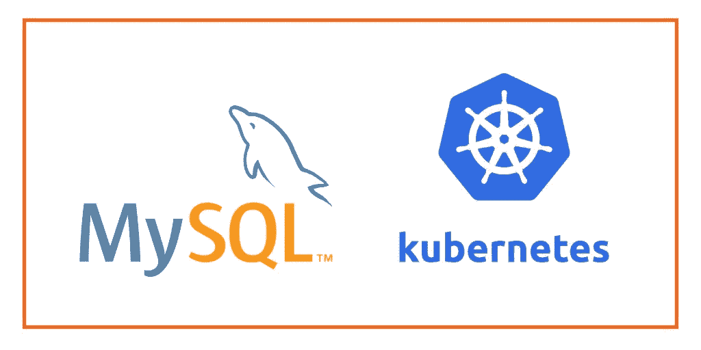

# Kubernetes 的 MySQL 操作器入门

> 原文：<https://medium.com/oracledevs/getting-started-with-the-mysql-operator-for-kubernetes-8df48591f592?source=collection_archive---------0----------------------->

Kubernetes 的操作员非常出色，他们已经在管理大规模应用程序的人员中扮演了重要的角色。我个人认为我们会用运营商来管理所有的应用。



在本教程中，我将向你展示如何在 Kubernetes 上使用 MySQL 操作符来设置一个 MySQL 集群。

先决条件:

1.  安装[库贝克特尔](https://kubernetes.io/docs/tasks/tools/install-kubectl/)
2.  安装[舵](https://helm.sh/docs/using_helm/)
3.  Kubernetes 集群:在本地使用 [minikube](https://kubernetes.io/docs/setup/minikube/) 或者查看 [Luca 的帖子](/devopslinks/kubernetes-deploying-a-cluster-with-a-few-clicks-using-a-web-console-5dbf75abc853)关于如何设置 OKE。

让我们从克隆包含操作符的 MySQL 存储库开始。

```
$ git clone [git@github.com](mailto:git@github.com):oracle/mysql-operator.git
```

现在输入目录。

```
$ cd mysql-operator
```

确保您的 helm repo 是最新的。

```
$ helm repo update
```

让我们创建一个将要安装操作符的名称空间。

```
$ kubectl create ns mysql-operator
```

安装 mysql 操作程序。

```
$ helm install --name mysql-operator mysql-operator
```

您应该会看到类似如下的输出:

```
NAME:   mysql-operator
LAST DEPLOYED: Tue Apr 23 15:48:53 2019
NAMESPACE: default
STATUS: DEPLOYEDRESOURCES:
==> v1beta1/CustomResourceDefinition
NAME                                   AGE
mysqlbackupschedules.mysql.oracle.com  4s
mysqlclusters.mysql.oracle.com         4s
mysqlbackups.mysql.oracle.com          4s
mysqlrestores.mysql.oracle.com         4s==> v1beta1/ClusterRole
mysql-operator  4s
mysql-agent     4s==> v1beta1/ClusterRoleBinding
NAME            AGE
mysql-operator  3s
mysql-agent     3s==> v1beta1/Deployment
NAME            DESIRED  CURRENT  UP-TO-DATE  AVAILABLE  AGE
mysql-operator  1        1        1           0          3s==> v1/Pod(related)
NAME                           READY  STATUS             RESTARTS  AGE
mysql-operator-d99c84c9-sldb7  0/1    ContainerCreating  0         3s==> v1/ServiceAccount
NAME            SECRETS  AGE
mysql-agent     1        5s
mysql-operator  1        4sNOTES:
Thanks for installing the MySQL Operator.Check if the operator is running withkubectl -n mysql-operator get po
```

正如文档所述，我们可以检查集群的状态。请注意，因为我们将它安装在名为 mysql-operator 的名称空间中，所以我们使用了-n 标志。

```
$ kubectl -n mysql-operator get poNAME                            READY     STATUS    RESTARTS   AGE
mysql-operator-d99c84c9-sldb7   1/1       Running   0          2m
```

我们的操作员已经开始工作了。

让我们创建一个新的命名空间，我们将在其中安装 MySQL 集群:

```
$ kubectl create ns mysql-cluster
```

因为我们在一个新的名称空间中创建 MySQL 集群，我们将其命名为“mysql-cluster”，所以我们需要在该名称空间中创建`mysql-agent` ServiceAccount 和 RoleBinding。

如果你决定把你的名字空间命名为其他名字，请确保在下面也进行更改。

让我们创建`mysql-agent` ServiceAccount 和 RoleBinding:

```
$ cat <<EOF | kubectl create -f -
apiVersion: v1
kind: ServiceAccount
metadata:
  name: mysql-agent
  namespace: mysql-cluster
---
kind: RoleBinding
apiVersion: rbac.authorization.k8s.io/v1beta1
metadata:
  name: mysql-agent
  namespace: mysql-cluster
roleRef:
  apiGroup: rbac.authorization.k8s.io
  kind: ClusterRole
  name: mysql-agent
subjects:
- kind: ServiceAccount
  name: mysql-agent
  namespace: mysql-cluster
EOF
```

您应该会看到类似如下的输出:

```
serviceaccount "mysql-agent" created
rolebinding "mysql-agent" created
```

用数据库名和名称空间创建一个`cluster.yaml`文件。我将我的数据库命名为“my-first-db ”,我使用的名称空间是“mysql-cluster”。

```
apiVersion: mysql.oracle.com/v1alpha1
kind: Cluster
metadata:
  name: my-first-db
  namespace: mysql-cluster
```

现在让我们创建 MySQL 集群。

```
$ kubectl apply -f cluster.yaml
mysqlcluster "my-first-db" created
```

注意下面，因为我们已经安装了 mysql-operator，kubernetes 现在有了一个名为“mysqlclusters”的新资源。类似于我们如何编写 *kubectl get pods* 我们现在可以编写*kubectl get MySQL clusters*。

我们仍然使用-n 标志，因为我们在名为“mysql-cluster”的名称空间中安装了 mysql 集群。我也许应该选择一个不同的名称，以避免与资源名称混淆。

让我们检查一下我们的 mysql 集群:

```
$ kubectl -n mysql-cluster get mysqlclusters
NAME          AGE
my-first-db   32s
```

我们可以看到，我们有一个 mysql-cluster 正在运行。

让我们检查有多少个单元正在运行:

```
$ kubectl -n mysql-cluster get pods 
NAME            READY     STATUS    RESTARTS   AGE
my-first-db-0   2/2       Running   0          5m
my-first-db-1   2/2       Running   0          5m
my-first-db-2   2/2       Running   0          5m
```

如您所见，我们的集群由三个单元组成。默认情况下，集群有三个成员。您可以通过将 *spec: members: 3* 添加到 cluster.yaml 文件来指定其他内容。还有其他的选择，但我会在另一篇博文中介绍。

让我们获取新数据库的 root 密码。注意，由操作员自动创建的秘密和配置以我们在上面的 cluster.yaml 文件中输入的数据库名称为前缀。

```
$ kubectl -n mysql-cluster get secret my-first-db-root-password -o jsonpath="{.data.password}" | base64 --decode#output
FDlQQxPCVdMZ6lAt
```

让我们创建一个包含 MySQL 客户端的临时容器来测试我们是否可以连接到新创建的数据库。

注意，我们在同一个名称空间中创建容器。如果我们不这样做，我们将无法使用主机名来访问创建的数据库。

```
$ kubectl -n mysql-cluster run mysql-client --image=mysql:5.7 -it --rm --restart=Never -- /bin/bashIf you don't see a command prompt, try pressing enter.
root@mysql-client:/#
```

用上面生成的密码替换下面的密码。

```
$ mysql -h my-first-db -uroot -pFDlQQxPCVdMZ6lAt -e 'SELECT 1'mysql: [Warning] Using a password on the command line interface can be insecure.
+---+
| 1 |
+---+
| 1 |
+---+
```

恭喜你。您已经安装了 MySQL 操作器，创建了一个 MySQL 集群并连接到它。

如果您想在 Oracle Cloud 上尝试一下，请注册一个[免费试用版](http://bit.ly/OKEMySQL)并在几分钟内启动 Kubernetes。

如果你在建立生产级别系统时遇到问题或需要建议，请随时通过 [twitter](https://twitter.com/hassanajan) 或 [linkedin](https://www.linkedin.com/in/hassanajan) 联系我。