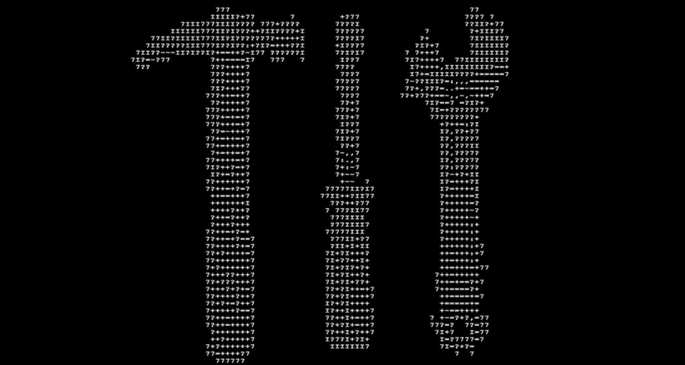

# 终端、Git 和节点入门

> 原文：<https://medium.com/javascript-scene/getting-started-with-the-terminal-git-and-node-6cb8999b9922?source=collection_archive---------6----------------------->

大多数 JavaScript 开发人员大量使用 bash 终端、git 和 Node。没有它们，您的 JavaScript 之旅可能不会走得太远。

Node 将用于 JavaScript 中的服务器端和客户端编程，Node 附带的 npm 是 JavaScript 的标准包管理器，这意味着您将通过它来访问项目中可用的所有开源库。

Git 跟踪源代码随时间的变化，并帮助您共享这些变化并与其他开发人员协作。GitHub 是大多数 JavaScript 开发人员用来协调 Git 库工作的网站，它使用集成的问题跟踪器，并通过 pull 请求进行同行代码评审。

bash 终端是一个基于文本的命令行界面。你可以输入命令来完成任务，而不是指向和点击。这是与节点和命令行 Git 工具交互的标准方式。在您开始学习这些工具时，以下是一些可能对您有用的资源。

# 学习 Git 和终端

如果您需要帮助学习 Git 和终端，请查看这些免费资源:

# 末端的

*   [Linux 终端简介](https://www.digitalocean.com/community/tutorials/an-introduction-to-the-linux-terminal)
*   [巴什指南](http://guide.bash.academy/)作者[马腾·比利蒙特](http://lhunath.com/)。#教程

# 饭桶

*   [试试 Git](https://try.github.io/levels/1/challenges/1)
*   [Git:简单指南](http://rogerdudler.github.io/git-guide/)
*   [学习 Git 分支](https://pcottle.github.io/learnGitBranching/)
*   [学会足够的 Git 才危险](https://www.learnenough.com/git-tutorial)

# 安装节点

如果你想安装 Node，我推荐两种方式:

*   对于 OS X 和 Linux，[使用 nvm](https://github.com/creationix/nvm)
*   对于 Windows，使用[官方安装程序](https://nodejs.org/)

对于 OS X 和 Linux，nvm 解决了您通常会在默认安装程序中遇到的权限问题，它还允许您轻松管理多个版本的节点，因此您可以使用不同版本的节点引擎测试您的代码。非常得心应手！

准备好迈出下一步了吗？

# [学习 JavaScript](/javascript-scene/learn-javascript-b631a4af11f2)

***Eric Elliott*** *著有《编程 JavaScript 应用程序》* *(O'Reilly)，以及* [*《学习通用 JavaScript 应用程序开发与节点&*](https://leanpub.com/learn-javascript-react-nodejs-es6/)*。他为 Adobe Systems******尊巴健身*******华尔街日报*******【ESPN*******BBC****等顶级录音师贡献了软件经验******

**他大部分时间都在旧金山湾区和世界上最美丽的女人在一起。**