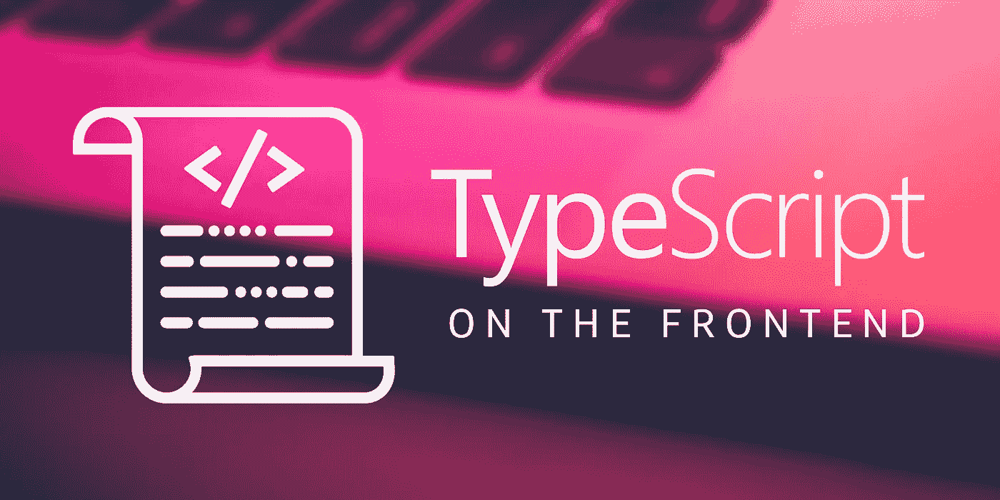

# 在您的前端开始使用 TypeScript

> 原文：<https://medium.com/capital-one-tech/getting-started-with-typescript-on-your-frontend-a1ead73df81a?source=collection_archive---------0----------------------->

## **因为静态打字很牛逼！**

# 什么是 TypeScript，它与标准 JavaScript 有什么不同？

[TypeScript](https://www.typescriptlang.org/) 由微软于 2012 年创建，作为 JavaScript 的真正多功能*超集*，这意味着 JavaScript 在技术上已经是 TypeScript 了。TypeScript 实际上是作为标准 JavaScript 编译的，这对于将代码库从 JavaScript 迁移到 TypeScript 来说是一个很大的好处(后面会详细介绍)。然而，使 TypeScript 不同于 JavaScript 的是它具有标准 JavaScript 所没有的附加功能，例如:

*   可选静态类型
*   接口
*   班级
*   名称空间
*   无商标消费品

简而言之，TypeScript 为 JavaScript 添加了一些功能，有助于捕捉错误并提高代码库的一致性，同时保留了 JavaScript 作为编程语言的强大功能。

# TypeScript 有可选的静态类型—这有什么关系？

*   **错误代码=坏代码**。静态类型允许在编译时检测错误，在开发过程中尽可能早地捕捉错误是更可取的，并且可以帮助减少运行时的错误。
*   **您可以更好地利用您的集成开发环境(IDE)。有了静态类型，ide 可以更好地检测自动完成，并在你编译之前警告你潜在的错误。当利用诸如自动完成之类的 IDE 特性时，开发进行得更快，同时最小化诸如拼写错误之类的简单错误。**
*   **知识就是力量！**静态类型使团队更容易合作，因为它增加了代码库的可读性和一致性。这样，您就不必猜测函数接受什么类型的参数，也不必为了进行函数调用而翻遍文档。

# **我在 Capital One 的团队如何使用 TypeScript？**

我是我们的经常性商户功能的软件工程师，该功能显示信用卡客户的经常性商户列表——如有线电视账单、健身房会员等。—这样他们就可以更好地跟踪自己的支出。2017 年，我的团队完成了一次 TypeScript 迁移，因此我们的代码库将与 Angular(V2+)兼容。Capital One 的团队在不断创新，因此我们重视尽可能与开源技术保持同步。

我有机会为我团队的项目进行 TypeScript 迁移。因为 TypeScript 是作为 JavaScript 编译的，所以我主要不得不修改一些代码来利用 TypeScript 的附加特性。静态类型对我的团队来说是最有价值的 TypeScript 功能，因为现在我们是在移植代码的基础上开发的，所以捕捉错误要容易得多。迁移也让我的团队更容易理解我写的东西的逻辑，因为添加静态类型使我们的代码库更容易阅读和理解。

过渡的学习曲线相当小，因为有很多清晰的[文档](https://www.typescriptlang.org/docs/handbook/migrating-from-javascript.html)帮助我们开始。一旦我熟悉了 JavaScript 和 TypeScript 之间的区别，我的团队的代码库在很短的时间内就被移植了。

一路走来，我学到了一些东西:

*   如何将一个函数从 JavaScript 翻译成 TypeScript 这让我可以选择何时为函数参数和返回值实现静态类型
*   重构我们的控制器以利用 TypeScript 类是聪明的设计
*   在新迁移的 TypeScript 代码上构建很容易——我已经开始这么做了！
*   TypeScript 迁移不必一次完成——我们可以先迁移控制器，然后再迁移相应的单元测试

# 将企业规模的代码库转移到 TypeScript 很困难吗？

这并不像听起来那么难！TypeScript 与标准 JavaScript 极其相似，因此很容易快速填补任何知识空白。您也不必一次迁移代码库的每个部分。因为 TypeScript 与 JavaScript 向后兼容，所以您可以轻松地按照自己的节奏进行迁移。虽然把所有的文件都整理好可能会花费一些时间，但是从长远来看，这样做的回报是值得的。

# 如何入门使用 TypeScript？

打字稿[文档](https://www.typescriptlang.org/docs/home.html)相当全面，并且有这个 [5 分钟的教程](https://www.typescriptlang.org/docs/handbook/typescript-in-5-minutes.html)作为良好的起点。以下是我发现的一些对 TypeScript 入门有用的其他资源:

*   [**从 JavaScript 迁移**](https://www.typescriptlang.org/docs/handbook/migrating-from-javascript.html)
*   [**打字稿迁移提示**](https://spin.atomicobject.com/2017/09/05/migrate-javascript-typescript/)
*   [**用 JavaScript 静态打字**](http://2ality.com/2014/10/typed-javascript.html)
*   [**从 JavaScript 到 TypeScript 的增量迁移**](/@clayallsopp/incrementally-migrating-javascript-to-typescript-565020e49c88)
*   [**AngularJS vs Angular**](https://gorrion.io/blog/angularjs-vs-angular/)
*   [**将遗留代码库迁移到 TypeScript**](http://www.pgbovine.net/migrating-legacy-codebase-to-typescript.htm)

> 编码快乐！

*披露声明:这些观点仅代表作者个人观点。除非本帖中另有说明，否则 Capital One 不属于所提及的任何公司，也不被其认可。使用或展示的所有商标和其他知识产权都是其各自所有者的所有权。本文为 2018 首都一。*